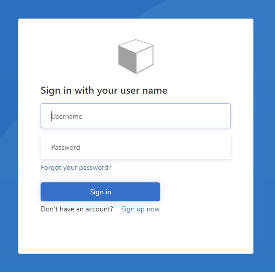

# About user interface customization in Azure Active Directory B2C

The ability for you to brand and customize the user interface (UI) that Azure Active Directory (Azure AD) B2C serves to your applications is important for providing a seamless experience to your customer. These experiences include sign-up, sign-in, profile editing, and password resetting. This article provides information to help you customize the UI of your applications.

Depending on your needs when it comes to these experiences, you customize the UI of your application in different ways. For example:

- If you're using [user flows](active-directory-b2c-reference-policies.md) to provide sign-up or sign-in, password reset, or profile-editing experiences in your application, you use the [Azure portal to customize the UI](tutorial-customize-ui.md).
- If you’re using a v2 user flow, you can use a [page layout template](#page-layout-templates) to change the look of your user flow pages without further customization. For example, you can apply an Ocean Blue or Slate Gray theme to all pages in your user flow.
- If you're providing sign-in only, its accompanying password reset page, and verification emails, you use the same customization steps that are used for an [Azure AD sign-in page](../active-directory/fundamentals/customize-branding.md).
- If customers try to edit their profile before they sign in, they are redirected to a page that you customize using the same steps that are used for customizing the Azure AD sign-in page.
- If you're using [custom policies](active-directory-b2c-overview-custom.md) to provide sign-up or sign-in, password reset, or profile-editing in your application, you use [policy files to customize the UI](active-directory-b2c-ui-customization-custom.md).
- If you need to provide dynamic content based on a customer’s decision, you use [custom policies that can change page content](active-directory-b2c-ui-customization-custom-dynamic.md) depending on a parameter that's sent in a query string. For example, the background image on the Azure AD B2C sign-up or sign-in page changes, based on a parameter that you pass from your web or mobile application.
- You can enable JavaScript client-side code in your Azure AD B2C [user flows](user-flow-javascript-overview.md) or [custom policies](page-contract.md).

Azure AD B2C runs code in your customer's browser and uses a modern approach called [Cross-Origin Resource Sharing (CORS)](https://www.w3.org/TR/cors/). At run-time, content is loaded from a URL that you specify in a user flow or policy. You specify different URLs for different pages. After content is loaded from your URL, it's merged with an HTML fragment inserted from Azure AD B2C, and then displayed to your customer.

When using your own HTML and CSS files to customize the UI, review the following guidance before you start:

- Azure AD B2C merges HTML content into your pages. Don't copy and try to change the default content that Azure AD B2C provides. It's best to build your HTML content from scratch and use the default content as reference.
- JavaScript can now be included in your custom content.
- Supported browser versions are:
    - Internet Explorer 11, 10 and Microsoft Edge
    - Limited support for Internet Explorer 9 and 8
    - Google Chrome 42.0 and above
    - Mozilla Firefox 38.0 and above
- Make sure that you don't include form tags in your HTML because it interferes with the POST operations generated by the injected HTML from Azure AD B2C.

## Page layout templates

For v2 user flows, you can choose a pre-designed template that gives your default pages a better look and serves as a good basis for your own customization.

In the left menu, under **Customize**, select **Page layouts**. Then select **Template (Preview)**.


Select a template from the list. For example, the **Ocean Blue** template applies the following layout to your user flow pages:



When you choose a template, the selected layout is applied to all pages in your user flow, and the URI for each page is visible in the **Custom page URI** field.

## Where do I store UI content?

When using your own HTML and CSS files to customize the UI, you can host your UI content anywhere, such as on [Azure Blob storage](../storage/blobs/storage-blobs-introduction.md), web servers, CDNs, AWS S3, or file sharing systems. The important point is that you host the content on a publicly available HTTPS endpoint with CORS enabled. You must use an absolute URL when you specify it in your content.

## How do I get started?

You do the following to customize the UI:

- Create well-formed HTML content with an empty `<div id="api"></div>` element located somewhere in the `<body>`. This element marks where the Azure AD B2C content is inserted. The following example shows a minimal page:

    ```html
    <!DOCTYPE html>
    <html>
      <head>
        <title>!Add your title here!</title>
        <link rel="stylesheet" href="https://mystore1.blob.core.windows.net/b2c/style.css">
      </head>
      <body>
        <h1>My B2C Application</h1>
        <div id="api"></div>   <!-- Leave this element empty because Azure AD B2C will insert content here. -->
      </body>
    </html>
    ```

- Host your content on an HTTPS endpoint (with CORS allowed). Both GET and OPTIONS request methods must be enabled when configuring CORS.
- Use CSS to style the UI elements that Azure AD B2C inserts into your page. The following example shows a simple CSS file that also includes settings for the sign-up injected HTML elements:

    ```css
    h1 {
      color: blue;
      text-align: center;
    }
    .intro h2 {
      text-align: center;
    }
    .entry {
      width: 400px ;
      margin-left: auto ;
      margin-right: auto ;
    }
    .divider h2 {
      text-align: center;
    }
    .create {
      width: 400px ;
      margin-left: auto ;
      margin-right: auto ;
    }
    ```

- Create or edit a policy to use the content that you created.

The following table lists the HTML fragments that Azure AD B2C merges into the `<div id="api"></div>` element located in your content.

| Inserted page | Description of HTML |
| ------------- | ------------------- |
| Identity provider selection | Contains a list of buttons for identity providers that the customer can choose from during sign-up or sign-in. These buttons include social identity providers such as Facebook, Google, or local accounts (based on email address or user name). |
| Local account sign-up | Contains a form for local account sign-up based on an email address or a user name. The form can contain different input controls such as text input box, password entry box, radio button, single-select drop-down boxes, and multi-select check boxes. |
| Social account sign-up | May appear when signing up using an existing account from a social identity provider such as Facebook or Google. It’s used when additional information must be collected from the customer using a sign-up form. |
| Unified sign-up or sign-in | Handles both sign-up and sign-in of customers who can use social identity providers such as Facebook, Google, or local accounts. |
| Multi-factor authentication | Customers can verify their phone numbers (using text or voice) during sign-up or sign-in. |
| Error | Provides error information to the customer. |


## How do I localize content?

You localize your HTML content by enabling [language customization](active-directory-b2c-reference-language-customization.md) in your Azure AD B2C tenant. Enabling this feature allows Azure AD B2C to forward the Open ID Connect parameter `ui-locales` to your endpoint. Your content server can use this parameter to provide language-specific HTML pages.

Content can be pulled from different places based on the locale that's used. In your CORS-enabled endpoint, you set up a folder structure to host content for specific languages. You'll call the right one if you use the wildcard value {Culture:RFC5646}. For example, your custom page URI might look like `https://contoso.blob.core.windows.net/{Culture:RFC5646}/myHTML/unified.html`. You can load the page in French by pulling content from `https://contoso.blob.core.windows.net/fr/myHTML/unified.html`

## Examples

For customization examples, download and review these [sample template files](https://github.com/azureadquickstarts/b2c-azureblobstorage-client/archive/master.zip).

## Next steps

- If you're using user flows, you can start customizing your UI with the tutorial: [Customize the user interface of your applications in Azure Active Directory B2C](tutorial-customize-ui.md).
- If you're using custom policies, you can start customizing the UI with the article: [Customize the user interface of your application using a custom policy in Azure Active Directory B2C](active-directory-b2c-ui-customization-custom.md).

