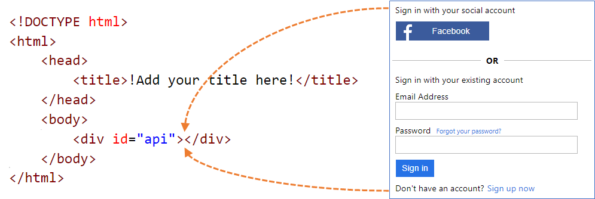

# Customize the user interface with HTML templates in Azure Active Directory B2C

[!INCLUDE [active-directory-b2c-choose-user-flow-or-custom-policy](../../includes/active-directory-b2c-choose-user-flow-or-custom-policy.md)]

Branding and customizing the user interface that Azure Active Directory B2C (Azure AD B2C) displays to your customers helps provide a seamless user experience in your application. These experiences include signing up, signing in, profile editing, and password resetting. This article introduces the methods of user interface (UI) customization. 

> [!TIP]
> If you want to modify only the banner logo, background image, and background color of your user flow pages, you can try the [Company branding](customize-ui.md) feature.

## Custom HTML and CSS overview

Azure AD B2C runs code in your customer's browser by using [Cross-Origin Resource Sharing (CORS)](https://www.w3.org/TR/cors/). At runtime, content is loaded from a URL you specify in your user flow or custom policy. Each page in the user experience loads its content from the URL you specify for that page. After content is loaded from your URL, it's merged with an HTML fragment inserted by Azure AD B2C, and then the page is displayed to your customer.



### Custom HTML page content

Create an HTML page with your own branding to serve your custom page content. This page can be a static `*.html` page, or a dynamic page like .NET, Node.js, or PHP,however, Azure B2C does not support any view engines. Any server-side rendering of the dynamic page must be performed by a dedicated web application.

Your custom page content can contain any HTML elements, including CSS and JavaScript, but can't include insecure elements like iframes. The only required element is a div element with `id` set to `api`, such as this one `<div id="api"></div>` within your HTML page.

```html
<!DOCTYPE html>
<html>
<head>
    <title>My Product Brand Name</title>
</head>
<body>
    <div id="api"></div>
</body>
</html>
```

#### Customize the default Azure AD B2C pages

Instead of creating your custom page content from scratch, you can customize Azure AD B2C's default page content.

The following table lists the default page content provided by Azure AD B2C. Download the files and use them as a starting point for creating your own custom pages.

| Page | Description | Templates |
|:-----------------------|:--------|-------------|
| Unified sign-up or sign-in | This page handles the user sign-up and sign-in process. Users can use enterprise identity providers, social identity providers such as Facebook, Microsoft account, or local accounts. | [Classic](https://login.microsoftonline.com/static/tenant/default/unified.cshtml), [Ocean Blue](https://login.microsoftonline.com/static/tenant/templates/AzureBlue/unified.cshtml), and [Slate Gray](https://login.microsoftonline.com/static/tenant/templates/MSA/unified.cshtml). |
| Sign-in (only)| The sign-in page is also known as the *Identity provider selection*. It handles the user sign-in with local account, or federated identity providers. Use this page to allow sign-in without the ability to sign up. For example before user can edit their profile. | [Classic](https://login.microsoftonline.com/static/tenant/default/idpSelector.cshtml), [Ocean Blue](https://login.microsoftonline.com/static/tenant/templates/AzureBlue/idpSelector.cshtml), and [Slate Gray](https://login.microsoftonline.com/static/tenant/templates/MSA/idpSelector.cshtml).
| Self-Asserted | Most interactions in Azure AD B2C where the user is expected to provide input are self-asserted. For example, a sign-up page, sign-in page, or password reset page. Use this template as a custom page content for a social account sign-up page, a local account sign-up page, a local account sign-in page, password reset, edit profile, block page and more. The self-asserted page can contain various input controls, such as: a text input box, a password entry box, a radio button, single-select drop-down boxes, and multi-select check boxes. | [Classic](https://login.microsoftonline.com/static/tenant/default/selfAsserted.cshtml), [Ocean Blue](https://login.microsoftonline.com/static/tenant/templates/AzureBlue/selfAsserted.cshtml), and [Slate Gray](https://login.microsoftonline.com/static/tenant/templates/MSA/selfAsserted.cshtml).  |
|  Multi-factor authentication |  On this page, users can verify their phone numbers (by using text or voice) during sign-up or sign-in. | [Classic](https://login.microsoftonline.com/static/tenant/default/multifactor-1.0.0.cshtml), [Ocean Blue](https://login.microsoftonline.com/static/tenant/templates/AzureBlue/multifactor-1.0.0.cshtml), and [Slate Gray](https://login.microsoftonline.com/static/tenant/templates/MSA/multifactor-1.0.0.cshtml). |
| Error | This page is displayed when an exception or an error is encountered. | [Classic](https://login.microsoftonline.com/static/tenant/default/exception.cshtml), [Ocean Blue](https://login.microsoftonline.com/static/tenant/templates/AzureBlue/exception.cshtml), and [Slate Gray](https://login.microsoftonline.com/static/tenant/templates/MSA/exception.cshtml). |


## Hosting the page content

When using your own HTML and CSS files to customize the UI, host your UI content on any publicly available HTTPS endpoint that supports CORS. For example, [Azure Blob storage](../storage/blobs/storage-blobs-introduction.md), [Azure App Services](../app-service/index.yml), web servers, CDNs, AWS S3, or file sharing systems.

## Guidelines for using custom page content

- Use an absolute URL when you include external resources like media, CSS, and JavaScript files in your HTML file.
- Using [page layout version](page-layout.md) 1.2.0 and above, you can add the `data-preload="true"` attribute in your HTML tags to control the load order for CSS and JavaScript. With `data-preload="true"`, the page is constructed before being shown to the user. This attribute helps prevent the page from "flickering" by preloading the CSS file, without the un-styled HTML being shown to the user. The following HTML code snippet shows the use of the `data-preload` tag.

  ```html
  <link href="https://path-to-your-file/sample.css" rel="stylesheet" type="text/css" data-preload="true"/>
  ```
- We recommend that you start with the default page content and build on top of it.
- You can [include JavaScript](javascript-and-page-layout.md) in your custom content.
- Supported browser versions are:
  - Internet Explorer 11, 10, and Microsoft Edge
  - Limited support for Internet Explorer 9 and 8
  - Google Chrome 42.0 and above
  - Mozilla Firefox 38.0 and above
  - Safari for iOS and macOS, version 12 and above
- Due to security restrictions, Azure AD B2C doesn't support `frame`, `iframe`, or `form` HTML elements.

## Localize content

You localize your HTML content by enabling [language customization](language-customization.md) in your Azure AD B2C tenant. Enabling this feature allows Azure AD B2C to set the HTML page language attribute and pass the OpenID Connect parameter `ui_locales` to your endpoint.

### Single-template approach

During page load, Azure AD B2C sets the HTML page language attribute with the current language. For example, `<html lang="en">`. To render different styles per the current language, use the CSS `:lang` selector along with your CSS definition.

The following example defines the following classes:

* `imprint-en` - Used when the current language is English.
* `imprint-de` - Used when the current language is German.
* `imprint` - Default class that is used when the current language is not English or German.

```css
.imprint-en:lang(en),
.imprint-de:lang(de) {
    display: inherit !important;
}
.imprint {
    display: none;
}
```

The following HTML elements will be shown or hidden according to the page language:

```html
<a class="imprint imprint-en" href="Link EN">Imprint</a>
<a class="imprint imprint-de" href="Link DE">Impressum</a>
```

#### Multi-template approach

The language customization feature allows Azure AD B2C to pass the OpenID Connect parameter `ui_locales` to your endpoint. Your content server can use this parameter to provide language-specific HTML pages.

> [!NOTE]
> Azure AD B2C doesn't pass OpenID Connect parameters, such as `ui_locales`, to the [exception pages](page-layout.md#exception-page-globalexception).

Content can be pulled from different places based on the locale that's used. In your CORS-enabled endpoint, you set up a folder structure to host content for specific languages. You call the right one if you use the wildcard value `{Culture:RFC5646}`.

For example, your custom page URI might look like:

```http
https://contoso.blob.core.windows.net/{Culture:RFC5646}/myHTML/unified.html
```

You can load the page in French by pulling content from:

```http
https://contoso.blob.core.windows.net/fr/myHTML/unified.html
```

## Custom page content walkthrough

Here's an overview of the process:

1. Prepare a location to host your custom page content (a publicly accessible, CORS-enabled HTTPS endpoint).
1. Download and customize a default page content file, for example `unified.html`.
1. Publish your custom page content your publicly available HTTPS endpoint.
1. Set cross-origin resource sharing (CORS) for your web app.
1. Point your policy to your custom policy content URI.

## Prerequisites

[!INCLUDE [active-directory-b2c-customization-prerequisites](../../includes/active-directory-b2c-customization-prerequisites.md)]

### 1. Create your HTML content

Create a custom page content with your product's brand name in the title.

1. Copy the following HTML snippet. It's well-formed HTML5 with an empty element called *\<div id="api"\>\</div\>* located within the *\<body\>* tags. This element indicates where Azure AD B2C content is to be inserted.

   ```html
   <!DOCTYPE html>
   <html>
   <head>
       <title>My Product Brand Name</title>
   </head>
   <body>
       <div id="api"></div>
   </body>
   </html>
   ```

1. Paste the copied snippet in a text editor
1. Use CSS to style the UI elements that Azure AD B2C inserts into your page. The following example shows a simple CSS file that also includes settings for the sign-up injected HTML elements:

    ```css
    h1 {
      color: blue;
      text-align: center;
    }
    .intro h2 {
      text-align: center;
    }
    .entry {
      width: 400px ;
      margin-left: auto ;
      margin-right: auto ;
    }
    .divider h2 {
      text-align: center;
    }
    .create {
      width: 400px ;
      margin-left: auto ;
      margin-right: auto ;
    }
    ```

1.  Save the file as *customize-ui.html*.

> [!NOTE]
> HTML form elements will be removed due to security restrictions if you use login.microsoftonline.com. If you want to use HTML form elements in your custom HTML content, [use b2clogin.com](b2clogin.md).

### 2. Create an Azure Blob storage account

In this article, we use Azure Blob storage to host our content. You can choose to host your content on a web server, but you must [enable CORS on your web server](https://enable-cors.org/server.html).

> [!NOTE]
> In an Azure AD B2C tenant, you can't provision Blob storage. You must create this resource in your Microsoft Entra tenant.

To host your HTML content in Blob storage, use the following steps:

1. Sign in to the [Azure portal](https://portal.azure.com).
1. Make sure you're using the directory that contains your Microsoft Entra tenant, and which has a subscription: 
    1. Select the **Directories + subscriptions** icon in the portal toolbar.
    1. On the **Portal settings | Directories + subscriptions** page, find your Microsoft Entra directory in the Directory name list, and then select **Switch**.
1. In the Azure portal, search for and select **Storage accounts**
1. Select **+ Create**.
1. Select a **Subscription** for your storage account.
1. Create a **Resource group** or select an existing one.
1. Enter a unique **Storage account name** for your storage account.
1. Select the geographical **Region** for your storage account.
1. **Performance** can remain **Standard**.
1. **Redundancy** can remain **Geo-redundant storage (GRS)**
1. Select **Review + create** and wait a few seconds for Microsoft Entra ID to run a validation. 
1. Select **Create** to create the storage account. After the deployment is completed, the storage account page opens automatically or you need to select **Go to resource**.

#### 2.1 Create a container

To create a public container in Blob storage, perform the following steps:

1. Under **Data storage** in the left-hand menu, select **Containers**.
1. Select **+ Container**.
1. For **Name**, enter *root*. The name can be a name of your choosing, for example *contoso*, but we use *root* in this example for simplicity.
1. For **Public access level**, select **Blob**. By selecting the **Blob** option, you allow an anonymous public read-only access for this container.
1. Select **Create** to create the container.
1. Select **root** to open the new container.

#### 2.2 Upload your custom page content files

1. Select **Upload**.
1. Select the folder icon next to **Select a file**.
1. Navigate to and select **customize-ui.html**, which you created earlier in the Page UI customization section.
1. If you want to upload to a subfolder, expand **Advanced** and enter a folder name in **Upload to folder**.
1. Select **Upload**.
1. Select the **customize-ui.html** blob that you uploaded.
1. To the right of the **URL** text box, select the **Copy to clipboard** icon to copy the URL to your clipboard.
1. In web browser, navigate to the URL you copied to verify the blob you uploaded is accessible. If it's inaccessible, for example if you encounter a `ResourceNotFound` error, make sure the container access type is set to **blob**.

### 3. Configure CORS

Configure Blob storage for Cross-Origin Resource Sharing by performing the following steps:

1. Navigate to your storage account. 
1. In the left-hand menu, under **Settings**, select **Resource sharing (CORS)**.
1. For **Allowed origins**, enter `https://your-tenant-name.b2clogin.com`. Replace `your-tenant-name` with the name of your Azure AD B2C tenant. For example, `https://fabrikam.b2clogin.com`. Use all lowercase letters when entering your tenant name.
1. For **Allowed Methods**, select both `GET` and `OPTIONS`.
1. For **Allowed Headers**, enter an asterisk (*).
1. For **Exposed Headers**, enter an asterisk (*).
1. For **Max age**, enter 200.
1. At the top of the page, select **Save**.

#### 3.1 Test CORS

Validate that you're ready by performing the following steps:

1. Repeat the configure CORS step. For **Allowed origins**, enter `https://www.test-cors.org`
1. Navigate to [www.test-cors.org](https://www.test-cors.org/) 
1. For the **Remote URL** box, paste the URL of your HTML file. For example, `https://your-account.blob.core.windows.net/root/azure-ad-b2c/unified.html`
1. Select **Send Request**.
    The result should be `XHR status: 200`. 
    If you receive an error, make sure that your CORS settings are correct. You might also need to clear your browser cache or open an in-private browsing session by pressing Ctrl+Shift+P.

Learn more about [how to create and manage Azure storage accounts](../storage/common/storage-account-create.md).

::: zone pivot="b2c-user-flow"

### 4. Update the user flow

1. Make sure you're using the directory that contains your Azure AD B2C tenant: 
    1. Select the **Directories + subscriptions** icon in the portal toolbar.
    1. On the **Portal settings | Directories + subscriptions** page, find your Azure AD B2C directory in the directory name list, and then select **Switch**.
1. In the Azure portal, search for and select **Azure AD B2C**.
1. In the left-hand menu, select **User flows**, and then select the *B2C_1_signupsignin1* user flow.
1. Select **Page layouts**, and then under **Unified sign-up or sign-in page**, select **Yes** for **Use custom page content**.
1. In **Custom page URI**, enter the URI for the *custom-ui.html* file that you recorded earlier.
1. At the top of the page, select **Save**.

### 5. Test the user flow

1. In your Azure AD B2C tenant, select **User flows** and select the *B2C_1_signupsignin1* user flow.
1. At the top of the page, select **Run user flow**.
1. At the pane on right side, select the **Run user flow** button.

You should see a page similar to the following example with the elements centered based on the CSS file that you created:


::: zone-end

::: zone pivot="b2c-custom-policy"

### 4. Modify the extensions file

To configure UI customization, copy the **ContentDefinition** and its child elements from the base file to the extensions file:

1. Open the base file of your policy. For example, <em>`SocialAndLocalAccounts/`**`TrustFrameworkBase.xml`**</em>. This base file is one of the policy files included in the custom policy starter pack, which you should have obtained in the prerequisite, [Get started with custom policies](./tutorial-create-user-flows.md?pivots=b2c-custom-policy).
1. Search for and copy the entire contents of the **ContentDefinitions** element.
1. Open the extension file. For example, *TrustFrameworkExtensions.xml*. Search for the **BuildingBlocks** element. If the element doesn't exist, add it.
1. Paste the entire contents of the **ContentDefinitions** element that you copied as a child of the **BuildingBlocks** element.
1. Search for the **ContentDefinition** element that contains `Id="api.signuporsignin"` in the XML that you copied.
1. Change the value of **LoadUri** to the URL of the HTML file that you uploaded to storage. For example, `https://your-storage-account.blob.core.windows.net/your-container/customize-ui.html`.

    Your custom policy should look like the following code snippet:

    ```xml
    <BuildingBlocks>
      <ContentDefinitions>
        <ContentDefinition Id="api.signuporsignin">
          <LoadUri>https://your-storage-account.blob.core.windows.net/your-container/customize-ui.html</LoadUri>
          <RecoveryUri>~/common/default_page_error.html</RecoveryUri>
          <DataUri>urn:com:microsoft:aad:b2c:elements:unifiedssp:1.0.0</DataUri>
          <Metadata>
            <Item Key="DisplayName">Signin and Signup</Item>
          </Metadata>
        </ContentDefinition>
      </ContentDefinitions>
    </BuildingBlocks>
    ```

1. Save the extensions file.

### 5. Upload and test your updated custom policy

#### 5.1 Upload the custom policy

1. Make sure you're using the directory that contains your Azure AD B2C tenant:
    1. Select the **Directories + subscriptions** icon in the portal toolbar.
    2. On the **Portal settings | Directories + subscriptions** page, find your Azure AD B2C directory in the **Directory name** list, and then select **Switch**.
1. Search for and select **Azure AD B2C**.
1. Under **Policies**, select **Identity Experience Framework**.
1. Select **Upload custom policy**.
1. Upload the extensions file that you previously changed.

#### 5.2 Test the custom policy by using **Run now**

1. Select the policy that you uploaded, and then select **Run now**.
1. You should be able to sign up by using an email address.

## Configure dynamic custom page content URI

By using Azure AD B2C custom policies, you can send a parameter in the URL path, or a query string. By passing the parameter to your HTML endpoint, you can dynamically change the page content. For example, you can change the background image on the Azure AD B2C sign-up or sign-in page, based on a parameter that you pass from your web or mobile application. The parameter can be any [claim resolver](claim-resolver-overview.md), such as the application ID, language ID, or custom query string parameter, such as `campaignId`.

### Sending query string parameters

To send query string parameters, in the [relying party policy](relyingparty.md), add a `ContentDefinitionParameters` element as shown below.

```xml
<RelyingParty>
    <DefaultUserJourney ReferenceId="SignUpOrSignIn" />
    <UserJourneyBehaviors>
    <ContentDefinitionParameters>
        <Parameter Name="campaignId">{OAUTH-KV:campaignId}</Parameter>
        <Parameter Name="lang">{Culture:LanguageName}</Parameter>
        <Parameter Name="appId">{OIDC:ClientId}</Parameter>
    </ContentDefinitionParameters>
    </UserJourneyBehaviors>
    ...
</RelyingParty>
```

In your content definition, change the value of `LoadUri` to `https://<app_name>.azurewebsites.net/home/unified`. Your custom policy `ContentDefinition` should look like the following code snippet:

```xml
<ContentDefinition Id="api.signuporsignin">
  <LoadUri>https://<app_name>.azurewebsites.net/home/unified</LoadUri>
  ...
</ContentDefinition>
```

When Azure AD B2C loads the page, it makes a call to your web server endpoint:

```http
https://<app_name>.azurewebsites.net/home/unified?campaignId=123&lang=fr&appId=f893d6d3-3b6d-480d-a330-1707bf80ebea
```

### Dynamic page content URI

Content can be pulled from different places based on the parameters used. In your CORS-enabled endpoint, set up a folder structure to host content. For example, you can organize the content in following structure. Root *folder/folder per language/your html files*. For example, your custom page URI might look like:

```xml
<ContentDefinition Id="api.signuporsignin">
  <LoadUri>https://contoso.blob.core.windows.net/{Culture:LanguageName}/myHTML/unified.html</LoadUri>
  ...
</ContentDefinition>
```

Azure AD B2C sends the  two letter ISO code for the language, `fr` for French:

```http
https://contoso.blob.core.windows.net/fr/myHTML/unified.html
```

::: zone-end

## Sample templates

You can find sample templates for UI customization here:

```bash
git clone https://github.com/azure-ad-b2c/html-templates
```

This project contains the following templates:
- [Ocean Blue](https://github.com/azure-ad-b2c/html-templates/tree/main/templates/AzureBlue)
- [Slate Gray](https://github.com/azure-ad-b2c/html-templates/tree/main/templates/MSA)
- [Classic](https://github.com/azure-ad-b2c/html-templates/tree/main/templates/classic)
- [Template resources](https://github.com/azure-ad-b2c/html-templates/tree/main/templates/src)

To use the sample:

1. Clone the repo on your local machine. Choose a template folder `/AzureBlue`, `/MSA`, or `/classic`.
1. Upload all the files under the template folder and the `/src` folder, to Blob storage as described in the previous sections.
1. Next, open each `\*.html` file in the template folder. Then replace all instances of `https://login.microsoftonline.com` URLs, with the URL you uploaded in step 2. For example:
    
    From:
    ```html
    https://login.microsoftonline.com/templates/src/fonts/segoeui.WOFF
    ```

    To:
    ```html
    https://your-storage-account.blob.core.windows.net/your-container/templates/src/fonts/segoeui.WOFF
    ```
    
1. Save the `\*.html` files and upload them to the Blob storage.
1. Now modify the policy, pointing to your HTML file, as mentioned previously.
1. If you see missing fonts, images, or CSS, check your references in the extensions policy and the `\*.html` files.

## Use company branding assets in custom HTML

To use [company branding](customize-ui.md#configure-company-branding) assets in a custom HTML, add the following tags outside the `<div id="api">` tag. The image source is replaced with that of the background image and banner logo.

```HTML


```

## Next steps

Learn how to enable [client-side JavaScript code](javascript-and-page-layout.md).
