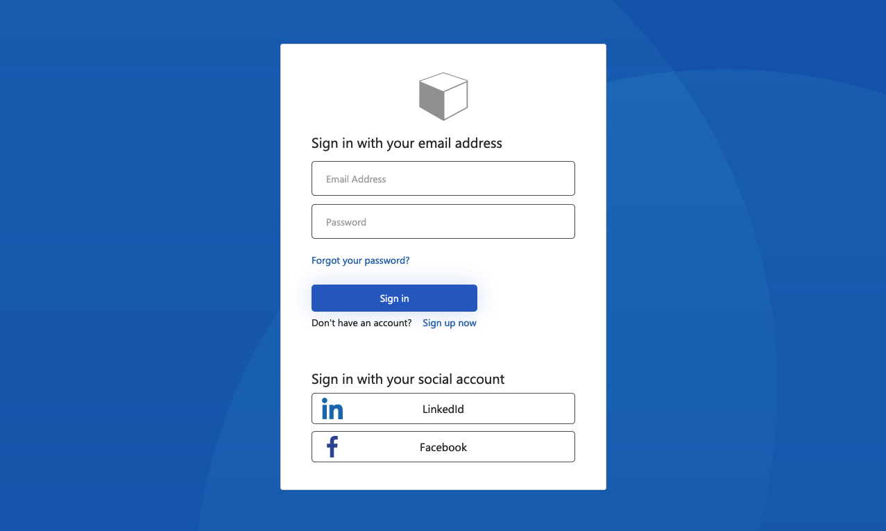
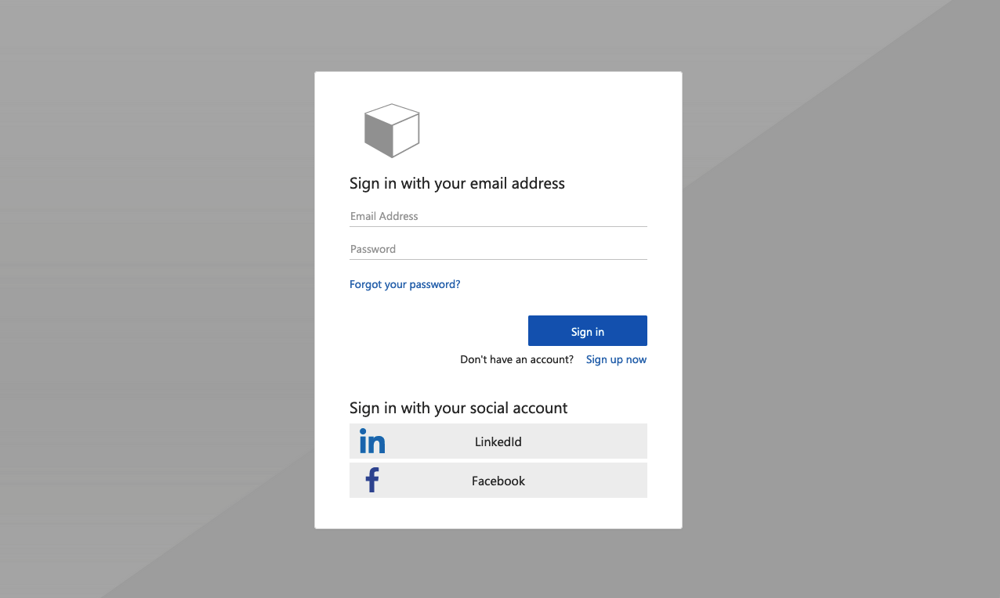
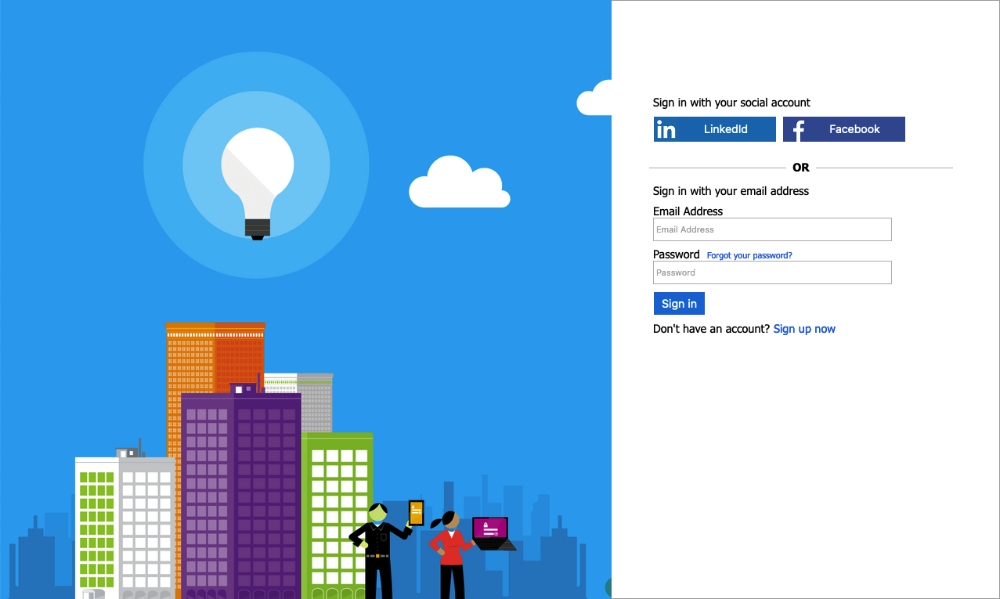
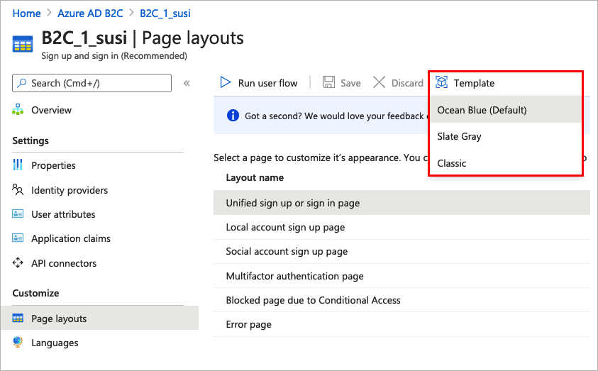

# Customize the user interface in Azure Active Directory B2C

[!INCLUDE [active-directory-b2c-choose-user-flow-or-custom-policy](../../includes/active-directory-b2c-choose-user-flow-or-custom-policy.md)]

Branding and customizing the user interface that Azure Active Directory B2C (Azure AD B2C) displays to your customers, helps provide a seamless user experience in your application. These experiences include signing up, signing in, profile editing, and password resetting. In this article, you customize your Azure AD B2C pages using page template, and company branding. 

> [!TIP]
> To customize other aspects of your user flow pages beyond the page template, banner logo, background image, or background color, see how to [customize the UI with HTML template](customize-ui-with-html.md).

## Prerequisites

[!INCLUDE [active-directory-b2c-customization-prerequisites](../../includes/active-directory-b2c-customization-prerequisites.md)]

## Overview

Azure AD B2C provide several built-in templates you can choose from to give your user experience pages a professional look. These page templates can also and serve as starting point for your own customization, using the [company branding](#company-branding) feature.

> [!NOTE]
> Supported browsers for the Classic template include current and previous versions of Internet Explorer, Microsoft Edge, Google Chrome, Mozilla Firefox, and Safari. The Ocean Blue and Slate Gray templates may have limited support with older browser versions, such as Internet Explorer 11 and 10; we recommend that you test your application with the browsers you intend to support.

### Ocean Blue

Example of the Ocean Blue template rendered on sign up and sign in page:



### Slate Gray

Example of the Slate Gray template rendered on sign up sign in page:



### Classic

Example of the Classic template rendered on sign up sign in page:



### Company branding

You can customize your Azure AD B2C pages with a banner logo, background image, and background color by using Microsoft Entra ID [Company branding](../active-directory/fundamentals/how-to-customize-branding.md). The company branding includes signing up, signing in, profile editing, and password resetting. 

The following example shows a *Sign up and sign in* page with a custom logo, background image, using Ocean Blue template:


## Select a page template

::: zone pivot="b2c-user-flow"

1. Sign in to the [Azure portal](https://portal.azure.com).
1. If you have access to multiple tenants, select the **Settings** icon in the top menu to switch to your Azure AD B2C tenant from the **Directories + subscriptions** menu.
1. In the Azure portal, search for and select **Azure AD B2C**.
1. Select **User flows**.
1. Select a user flow you want to customize.
1. Under **Customize** in the left menu, select **Page layouts** and then select a **Template**.
    

When you choose a template, the selected template is applied to all pages in your user flow. The URI for each page is visible in the **Custom page URI** field.

::: zone-end

::: zone pivot="b2c-custom-policy"

To select a page template, set the `LoadUri` element of the [content definitions](contentdefinitions.md). The following example shows the content definition identifiers and the corresponding `LoadUri`. 

Ocean Blue:

```xml
<ContentDefinitions>
  <ContentDefinition Id="api.error">
    <LoadUri>~/tenant/templates/AzureBlue/exception.cshtml</LoadUri>
  </ContentDefinition>
  <ContentDefinition Id="api.idpselections">
    <LoadUri>~/tenant/templates/AzureBlue/idpSelector.cshtml</LoadUri>
  </ContentDefinition>
  <ContentDefinition Id="api.idpselections.signup">
    <LoadUri>~/tenant/templates/AzureBlue/idpSelector.cshtml</LoadUri>
  </ContentDefinition>
  <ContentDefinition Id="api.signuporsignin">
    <LoadUri>~/tenant/templates/AzureBlue/unified.cshtml</LoadUri>
  </ContentDefinition>
  <ContentDefinition Id="api.selfasserted">
    <LoadUri>~/tenant/templates/AzureBlue/selfAsserted.cshtml</LoadUri>
  </ContentDefinition>
  <ContentDefinition Id="api.selfasserted.profileupdate">
    <LoadUri>~/tenant/templates/AzureBlue/selfAsserted.cshtml</LoadUri>
  </ContentDefinition>
  <ContentDefinition Id="api.localaccountsignup">
    <LoadUri>~/tenant/templates/AzureBlue/selfAsserted.cshtml</LoadUri>
  </ContentDefinition>
  <ContentDefinition Id="api.localaccountpasswordreset">
    <LoadUri>~/tenant/templates/AzureBlue/selfAsserted.cshtml</LoadUri>
  </ContentDefinition>
  <ContentDefinition Id="api.phonefactor">
    <LoadUri>~/tenant/templates/AzureBlue/multifactor-1.0.0.cshtml</LoadUri>
  </ContentDefinition>
</ContentDefinitions>
```

Slate Gray:

```xml
<ContentDefinitions>
  <ContentDefinition Id="api.error">
    <LoadUri>~/tenant/templates/MSA/exception.cshtml</LoadUri>
  </ContentDefinition>
  <ContentDefinition Id="api.idpselections">
    <LoadUri>~/tenant/templates/MSA/idpSelector.cshtml</LoadUri>
  </ContentDefinition>
  <ContentDefinition Id="api.idpselections.signup">
    <LoadUri>~/tenant/templates/MSA/idpSelector.cshtml</LoadUri>
  </ContentDefinition>
  <ContentDefinition Id="api.signuporsignin">
    <LoadUri>~/tenant/templates/MSA/unified.cshtml</LoadUri>
  </ContentDefinition>
  <ContentDefinition Id="api.selfasserted">
    <LoadUri>~/tenant/templates/MSA/selfAsserted.cshtml</LoadUri>
  </ContentDefinition>
  <ContentDefinition Id="api.selfasserted.profileupdate">
    <LoadUri>~/tenant/templates/MSA/selfAsserted.cshtml</LoadUri>
  </ContentDefinition>
  <ContentDefinition Id="api.localaccountsignup">
    <LoadUri>~/tenant/templates/MSA/selfAsserted.cshtml</LoadUri>
  </ContentDefinition>
  <ContentDefinition Id="api.localaccountpasswordreset">
    <LoadUri>~/tenant/templates/MSA/selfAsserted.cshtml</LoadUri>
  </ContentDefinition>
  <ContentDefinition Id="api.phonefactor">
    <LoadUri>~/tenant/templates/MSA/multifactor-1.0.0.cshtml</LoadUri>
  </ContentDefinition>
</ContentDefinitions>
```

Classic: 

```xml
<ContentDefinitions>
  <ContentDefinition Id="api.error">
    <LoadUri>~/tenant/default/exception.cshtml</LoadUri>
  </ContentDefinition>
  <ContentDefinition Id="api.idpselections">
    <LoadUri>~/tenant/default/idpSelector.cshtml</LoadUri>
  </ContentDefinition>
  <ContentDefinition Id="api.idpselections.signup">
    <LoadUri>~/tenant/default/idpSelector.cshtml</LoadUri>
  </ContentDefinition>
  <ContentDefinition Id="api.signuporsignin">
    <LoadUri>~/tenant/default/unified.cshtml</LoadUri>
  </ContentDefinition>
  <ContentDefinition Id="api.selfasserted">
    <LoadUri>~/tenant/default/selfAsserted.cshtml</LoadUri>
  </ContentDefinition>
  <ContentDefinition Id="api.selfasserted.profileupdate">
    <LoadUri>~/tenant/default/selfAsserted.cshtml</LoadUri>
  </ContentDefinition>
  <ContentDefinition Id="api.localaccountsignup">
    <LoadUri>~/tenant/default/selfAsserted.cshtml</LoadUri>
  </ContentDefinition>
  <ContentDefinition Id="api.localaccountpasswordreset">
    <LoadUri>~/tenant/default/selfAsserted.cshtml</LoadUri>
  </ContentDefinition>
  <ContentDefinition Id="api.phonefactor">
    <LoadUri>~/tenant/default/multifactor-1.0.0.cshtml</LoadUri>
  </ContentDefinition>
</ContentDefinitions>
```
::: zone-end


## Configure company branding

To customize your user flow pages, you first configure company branding in Microsoft Entra ID, then you enable it in your user flows in Azure AD B2C.

Start by setting the banner logo, background image, and background color within **Company branding**.

1. Sign in to the [Azure portal](https://portal.azure.com).
1. If you have access to multiple tenants, select the **Settings** icon in the top menu to switch to your Azure AD B2C tenant from the **Directories + subscriptions** menu.
1. In the Azure portal, search for and select **Azure AD B2C**.
1. Under **Manage**, select **Company branding**.
1. Follow the steps in [Add branding to your organization's Microsoft Entra sign-in page](../active-directory/fundamentals/how-to-customize-branding.md).

Keep these things in mind when you configure company branding in Azure AD B2C:

* Company branding in Azure AD B2C is currently limited to **background image**, **banner logo**, and **background color** customization. The other properties in the company branding pane, for example, **Advanced settings**, aren't supported.
* In your user flow pages, the background color is shown before the background image is loaded. We recommended you choose a background color that closely matches the colors in your background image for a smoother loading experience.
* The banner logo appears in the verification emails sent to your users when they initiate a sign-up user flow.


::: zone pivot="b2c-user-flow"

## Enable company branding in user flow pages

Once you've configured company branding, enable it in your user flows.

1. In the left menu of the Azure portal, select **Azure AD B2C**.
1. Under **Policies**, select **User flows (policies)**.
1. Select the user flow for which you'd like to enable company branding. Company branding is **not supported** for the standard *Sign in* and standard *Profile editing* user flow types.
1. Under **Customize**, select **Page layouts**, and then select the page you'd like to brand. For example, select **Unified sign up or sign in page**.
1. For the **Page Layout Version (Preview)**, choose version **1.2.0** or above.
1. Select **Save**.

If you'd like to brand all pages in the user flow, set the page layout version for each page layout in the user flow.

:::image type="content" source="media/customize-ui/portal-02-page-layout-select.png" alt-text="Page layout selection in Azure AD B2C in the Azure portal.":::

::: zone-end

::: zone pivot="b2c-custom-policy"

## Enable company branding in custom policy pages

Once you've configured company branding, enable it in your custom policy. Configure the [page layout version](contentdefinitions.md#migrating-to-page-layout) with page `contract` version for *all* of the content definitions in your custom policy. The format of the value must contain the word `contract`: *urn:com:microsoft:aad:b2c:elements:**contract**:page-name:version*. To specify a page layout in your custom policies that use an old **DataUri** value. For more information, learn how to [migrate to page layout](contentdefinitions.md#migrating-to-page-layout) with page version.

The following example shows the content definitions with their corresponding the page contract, and *Ocean Blue* page template: 

```xml
<ContentDefinitions>
  <ContentDefinition Id="api.error">
    <LoadUri>~/tenant/templates/AzureBlue/exception.cshtml</LoadUri>
    <DataUri>urn:com:microsoft:aad:b2c:elements:contract:globalexception:1.2.0</DataUri>
  </ContentDefinition>
  <ContentDefinition Id="api.idpselections">
    <LoadUri>~/tenant/templates/AzureBlue/idpSelector.cshtml</LoadUri>
    <DataUri>urn:com:microsoft:aad:b2c:elements:contract:providerselection:1.2.0</DataUri>
  </ContentDefinition>
  <ContentDefinition Id="api.idpselections.signup">
    <LoadUri>~/tenant/templates/AzureBlue/idpSelector.cshtml</LoadUri>
    <DataUri>urn:com:microsoft:aad:b2c:elements:contract:providerselection:1.2.0</DataUri>
  </ContentDefinition>
  <ContentDefinition Id="api.signuporsignin">
    <LoadUri>~/tenant/templates/AzureBlue/unified.cshtml</LoadUri>
    <DataUri>urn:com:microsoft:aad:b2c:elements:contract:unifiedssp:1.2.0</DataUri>
  </ContentDefinition>
  <ContentDefinition Id="api.selfasserted">
    <LoadUri>~/tenant/templates/AzureBlue/selfAsserted.cshtml</LoadUri>
    <DataUri>urn:com:microsoft:aad:b2c:elements:contract:selfasserted:1.2.0</DataUri>
  </ContentDefinition>
  <ContentDefinition Id="api.selfasserted.profileupdate">
     <LoadUri>~/tenant/templates/AzureBlue/selfAsserted.cshtml</LoadUri>
    <DataUri>urn:com:microsoft:aad:b2c:elements:contract:selfasserted:1.2.0</DataUri>
  </ContentDefinition>
  <ContentDefinition Id="api.localaccountsignup">
     <LoadUri>~/tenant/templates/AzureBlue/selfAsserted.cshtml</LoadUri>
    <DataUri>urn:com:microsoft:aad:b2c:elements:contract:selfasserted:1.2.0</DataUri>
  </ContentDefinition>
  <ContentDefinition Id="api.localaccountpasswordreset">
     <LoadUri>~/tenant/templates/AzureBlue/selfAsserted.cshtml</LoadUri>
    <DataUri>urn:com:microsoft:aad:b2c:elements:contract:selfasserted:1.2.0</DataUri>
  </ContentDefinition>
  <ContentDefinition Id="api.phonefactor">
    <LoadUri>~/tenant/templates/AzureBlue/multifactor-1.0.0.cshtml</LoadUri>
    <DataUri>urn:com:microsoft:aad:b2c:elements:contract:multifactor:1.2.0</DataUri>
  </ContentDefinition>
</ContentDefinitions>
```

::: zone-end

::: zone pivot="b2c-user-flow"

## Rearrange input fields in the sign-up form
To rearrange the input fields on the sign-up page for local accounts form, follow these steps:
1. Sign in to the [Azure portal](https://portal.azure.com).
1. If you have access to multiple tenants, select the **Settings** icon in the top menu to switch to your Azure AD B2C tenant from the **Directories + subscriptions** menu.
1. In the Azure portal, search for and select **Azure AD B2C**.
1. In the left menu, select **User flows**.
1. Select a user flow (for local accounts only) that you want to rearrange its input fields.
1. In the left menu, select **Page layouts**
1. In the table, select the row **Local account sign up page**.
1. Under **User attributes**, select the input field you want to rearrange, and drag (up or down) and drop or use the **Move Up** or **Move down** controls to achieve the desired order. 
1. At the top of the page, select **Save**.

  :::image type="content" source="media/customize-ui/portal-02-page-layout-fields.png" alt-text="Template selection drop-down in user flow page of Azure portal.":::

::: zone-end

## Next steps

Find more information about how you can customize the user interface of your applications in [Customize the user interface of your application in Azure Active Directory B2C](customize-ui-with-html.md).
