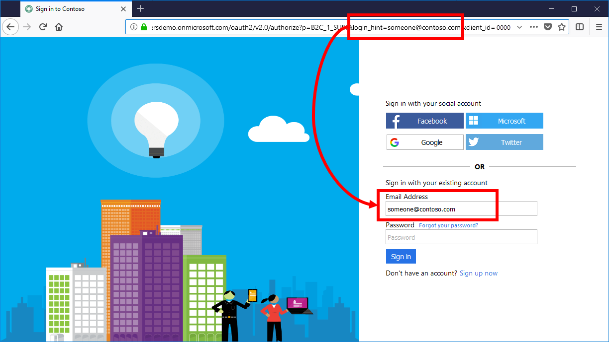
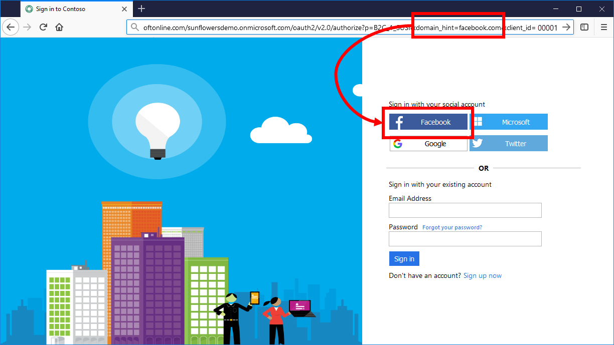

# Set up direct sign-in using Azure Active Directory B2C

[!INCLUDE [active-directory-b2c-choose-user-flow-or-custom-policy](../../includes/active-directory-b2c-choose-user-flow-or-custom-policy.md)]

When you set up sign-in for your application using Azure Active Directory B2C (Azure AD B2C), you can prepopulate the sign-in name or directly sign in to a specific social identity provider, such as Facebook, LinkedIn, or a Microsoft account.

## Prepopulate the sign in name

During a sign-in user journey, a relying party application may target a specific user or domain name. When targeting a user, an application can specify, in the authorization request, the `login_hint` query parameter with the user sign-in name. Azure AD B2C automatically populates the sign-in name, while the user only needs to provide the password.



The user is able to change the value in the sign-in textbox.

::: zone pivot="b2c-custom-policy"

To support sign in hint parameter, override the `SelfAsserted-LocalAccountSignin-Email` technical profile. In the `<InputClaims>` section, set the DefaultValue of the signInName claim to `{OIDC:LoginHint}`. The `{OIDC:LoginHint}` variable contains the value of the `login_hint` parameter. Azure AD B2C reads the value of the signInName claim and pre-populates the signInName textbox.

```xml
<ClaimsProvider>
  <DisplayName>Local Account</DisplayName>
  <TechnicalProfiles>
    <TechnicalProfile Id="SelfAsserted-LocalAccountSignin-Email">
      <InputClaims>
        <!-- Add the login hint value to the sign-in names claim type -->
        <InputClaim ClaimTypeReferenceId="signInName" DefaultValue="{OIDC:LoginHint}" />
      </InputClaims>
    </TechnicalProfile>
  </TechnicalProfiles>
</ClaimsProvider>
```

::: zone-end

## Redirect sign in to a social provider

If you configured the sign-in journey for your application to include social accounts, such as Facebook, LinkedIn, or Google, you can specify the `domain_hint` parameter. This query parameter provides a hint to Azure AD B2C about the social identity provider that should be used for sign-in. For example, if the application specifies `domain_hint=facebook.com`, sign in goes directly to the Facebook sign in page.



::: zone pivot="b2c-user-flow"

The domain hint query string parameter can set to one of the following domains:

- amazon.com
- facebook.com
- github.com
- google.com
- linkedin.com
- microsoft.com
- qq.com
- twitter.com
- wechat.com
- weibo.com 
- For [Generic OpenID Connect](identity-provider-generic-openid-connect.md), see [Domain hint](identity-provider-generic-openid-connect.md#response-mode).

::: zone-end

::: zone pivot="b2c-custom-policy"

To support domain hint parameter, you can configure the domain name using the `<Domain>domain name</Domain>` XML element of any `<ClaimsProvider>`.

```xml
<ClaimsProvider>
    <!-- Add the domain hint value to the claims provider -->
    <Domain>facebook.com</Domain>
    <DisplayName>Facebook</DisplayName>
    <TechnicalProfiles>
    ...
```

::: zone-end