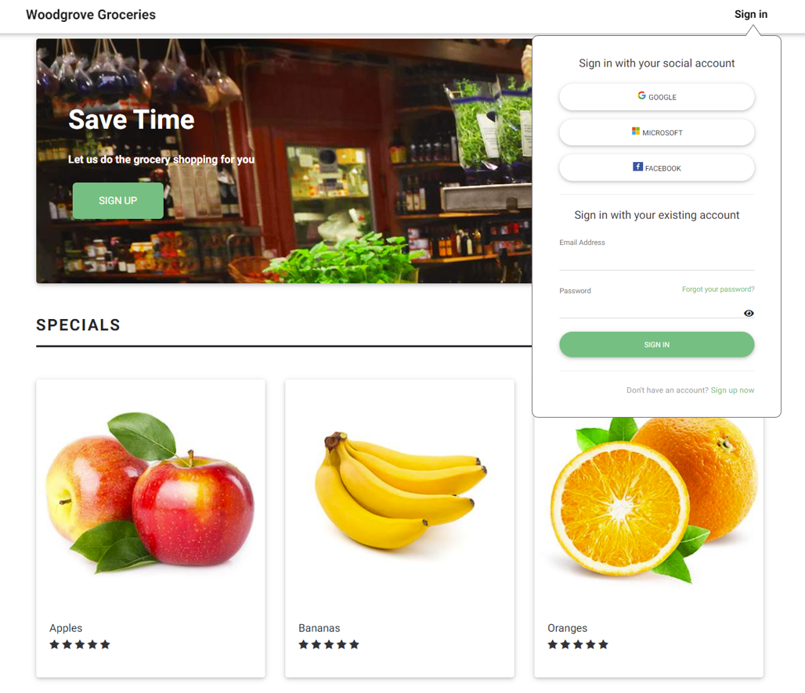

# Embedded sign-up or sign-in experience

[!INCLUDE [active-directory-b2c-choose-user-flow-or-custom-policy](../../includes/active-directory-b2c-choose-user-flow-or-custom-policy.md)]

::: zone pivot="b2c-user-flow"

[!INCLUDE [active-directory-b2c-limited-to-custom-policy](../../includes/active-directory-b2c-limited-to-custom-policy.md)]

::: zone-end

::: zone pivot="b2c-custom-policy"

For a simpler sign-up or sign-in experience, you can avoid redirecting users to a separate sign-up or sign-in page, or generating a pop-up window. By using the inline frame &lt;iframe&gt; HTML element, you can embed the Azure AD B2C sign-in user interface directly into your web application. 

> [!TIP]
> Use the &lt;iframe&gt; HTML element to embed the [sign-up or sign-in](add-sign-up-and-sign-in-policy.md), [edit profile](add-profile-editing-policy.md), or [change password](add-password-change-policy.md) custom policies into your web or single page app.

[!INCLUDE [b2c-public-preview-feature](../../includes/active-directory-b2c-public-preview.md)]

## Web application embedded sign-in

The inline frame element `<iframe>` is used to embed a document in an HTML5 web page. You can use the iframe element to embed the Azure AD B2C sign-in user interface directly into your web application, as show in the following example:



When using iframe, consider the following:

- Embedded sign-up or sign-in supports local accounts only. Most social identity providers (for example, Google and Facebook) block their sign-in pages from being rendered in inline frames.
- Certain browsers, such as Safari or Chrome in incognito mode, view Azure AD B2C session cookies within an iframe as third-party cookies. These browsers may block or clear these cookies, which can lead to a less than optimal user experience. To prevent this issue, make sure your application domain name and your Azure AD B2C domain have the *same origin*. To use the same origin, [enable custom domains](custom-domain.md) for Azure AD B2C tenant, then configure your web app with the same origin. For example, an application hosted on 'https://app.contoso.com' has the same origin as Azure AD B2C running on 'https://login.contoso.com'.

## Prerequisites

* Complete the steps in the [Get started with custom policies in Active Directory B2C](tutorial-create-user-flows.md?pivots=b2c-custom-policy).
* [Enable custom domains](custom-domain.md) for your policies.

## Configure your policy

To allow your Azure AD B2C user interface to be embedded in an iframe, a content security policy `Content-Security-Policy` and frame options `X-Frame-Options` must be included in the Azure AD B2C HTTP response headers. These headers allow the Azure AD B2C user interface to run under your application domain name.

Add a **JourneyFraming** element inside the [RelyingParty](relyingparty.md) element.  The **UserJourneyBehaviors** element must follow the **DefaultUserJourney**. Your **UserJourneyBehaviors** element should look like this example:

```xml
<!--
<RelyingParty>
  <DefaultUserJourney ReferenceId="SignUpOrSignIn" /> -->
  <UserJourneyBehaviors> 
    <JourneyFraming Enabled="true" Sources="https://somesite.com https://anothersite.com" /> 
  </UserJourneyBehaviors>
<!--
</RelyingParty> -->
```

The **Sources** attribute contains the URI of your web application. Add a space between URIs. Each URI must meet the following requirements:

- Your application must trust and own the URI.
- The URI must use the https scheme.  
- The full URI of the web app must be specified. Wildcards aren't supported.
- The **JourneyFraming** element only allows site URLs with a **two to seven-character** Top-level domain (TLD) to align with commonly recognized TLDs.

In addition, we recommend that you also block your own domain name from being embedded in an iframe by setting the `Content-Security-Policy` and `X-Frame-Options` headers respectively on your application pages. This technique mitigates security concerns around older browsers related to nested embedding of iframes.

## Adjust policy user interface

With Azure AD B2C [user interface customization](customize-ui.md), you have almost full control over the HTML and CSS content that you present your users. Follow the steps for customizing an HTML page using content definitions. To fit the Azure AD B2C user interface into the iframe size, provide clean HTML page without a background and extra spaces.  

The following CSS code hides the Azure AD B2C HTML elements and adjusts the size of the panel to fill the iframe.

```css
div.social, div.divider {
    display: none;
}

div.api_container{
    padding-top:0;
}

.panel {
    width: 100%!important
}
```

In some cases, you may want to notify your application about the Azure AD B2C page that's currently being presented. For example, when a user selects the sign-up option, you may want the application to respond by hiding the links for signing in with a social account or adjusting the iframe size.

To notify your application about the current Azure AD B2C page, [enable your policy for JavaScript](./javascript-and-page-layout.md), and then use HTML5 to post messages. The following JavaScript code sends a post message to the app with `signUp`:

```javascript
window.parent.postMessage("signUp", '*');
```

## Configure a web application

When a user selects the sign-in button, the [web app](integrate-with-app-code-samples.md#web-apps-and-apis) generates an authorization request that takes the user to Azure AD B2C sign-in experience. After sign-in is complete, Azure AD B2C returns an ID token, or authorization code, to the configured redirect URI within your application.

To support embedded login, the iframe `src` attribute points to the sign-in controller, such as `/account/SignUpSignIn`, which generates the authorization request and redirects the user to Azure AD B2C policy.

```html
<iframe id="loginframe" frameborder="0" src="/account/SignUpSignIn"></iframe>
``` 

After the application receives and validates the ID token, it completes the authorization flow and recognizes and trusts the user. Because the authorization flow happens inside the iframe, you need to reload the main page. After the page reloads, the sign-in button changes to "sign out" and the username is presented in the UI.  

The following example shows how the sign-in redirect URI can refresh the main page:

```javascript
window.top.location.reload();
```

### Add sign-in with social accounts to a web app

Social identity providers block their sign-in pages from rendering in inline frames. You can use a separate policy for social accounts, or you can use a single policy for both sign-in and sign-up with local and social accounts. Then you can use the `domain_hint` query string parameter. The domain hint parameter takes the user directly to the social identity provider's sign-in page.

In your application, add the sign-in with social account buttons. When a user clicks one of the social account buttons, the control needs to change the policy name or set the domain hint parameter.

<!-- TBD: add a diagram -->

The redirect URI can be the same redirect URI used by the iframe. You can skip the page reload.

## Configure a single-page application

For a single-page application, you also need a second "sign-in" HTML page that loads into the iframe. This sign-in page hosts the authentication library code that generates the authorization code and returns the token.

When the single-page application needs the access token, use JavaScript code to obtain the access token from the iframe and the object that contains it.

> [!NOTE]
> Running MSAL 2.0 in an iframe is not currently supported.

The following code is an example that runs on the main page and calls an iframe's JavaScript code:

```javascript
function getToken()
{
  var token = document.getElementById("loginframe").contentWindow.getToken("adB2CSignInSignUp");

  if (token === "LoginIsRequired")
    document.getElementById("tokenTextarea").value = "Please login!!!"
  else
    document.getElementById("tokenTextarea").value = token.access_token;
}

function logOut()
{
  document.getElementById("loginframe").contentWindow.policyLogout("adB2CSignInSignUp", "B2C_1A_SignUpOrSignIn");
}
```

## Next steps

See the following related articles:

- [User interface customization](customize-ui.md)
- [RelyingParty](relyingparty.md) element reference
- [Enable your policy for JavaScript](./javascript-and-page-layout.md)
- [Code samples](integrate-with-app-code-samples.md)

::: zone-end
