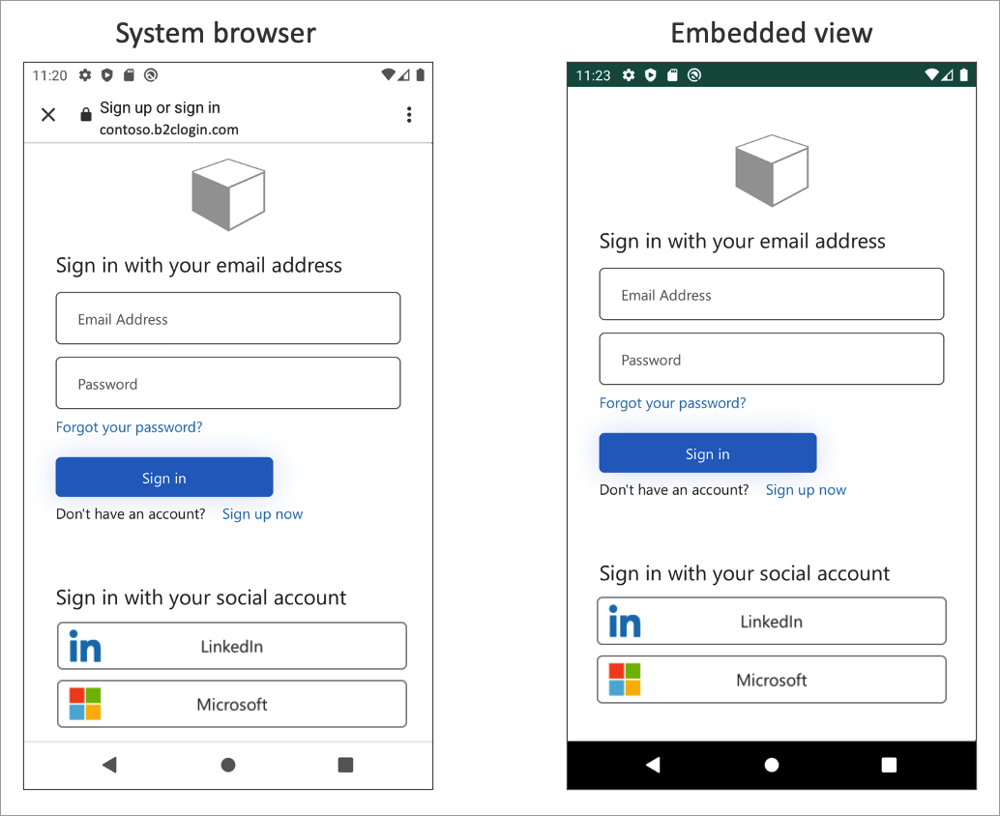

# Configure authentication options in an Android app by using Azure AD B2C 

This article describes how you can enable, customize, and enhance the Azure Active Directory B2C (Azure AD B2C) authentication experience for your Android application. 

Before you start, familiarize yourself with the following articles: 
* [Configure authentication in a sample Android app by using Azure AD B2C](configure-authentication-sample-android-app.md)
* [Enable authentication in your own Android app by using Azure AD B2C](enable-authentication-android-app.md)

[!INCLUDE [active-directory-b2c-app-integration-custom-domain](../../includes/active-directory-b2c-app-integration-custom-domain.md)]

To use a custom domain and your tenant ID in the authentication URL, follow the guidance in [Enable custom domains](custom-domain.md). Look for your Microsoft Authentication Library (MSAL configuration object, and then update the *authorities* with your custom domain name and tenant ID.


#### [Kotlin](#tab/kotlin)

The following Kotlin code shows the MSAL config object before the change:

```kotlin
val parameters = AcquireTokenParameters.Builder()
        .startAuthorizationFromActivity(activity)
        .fromAuthority("https://contoso.b2clogin.com/fabrikamb2c.contoso.com/B2C_1_susi")
        // More settings here
        .build()

b2cApp!!.acquireToken(parameters)
```

The following Kotlin code shows the MSAL config object after the change:

```kotlin
val parameters = AcquireTokenParameters.Builder()
        .startAuthorizationFromActivity(activity)
        .fromAuthority("https://custom.domain.com/00000000-0000-0000-0000-000000000000/B2C_1_susi")
        // More settings here
        .build()

b2cApp!!.acquireToken(parameters)
```


#### [Java](#tab/java)

The following Kotlin code shows the MSAL config object before the change:

```java
AcquireTokenParameters parameters = new AcquireTokenParameters.Builder()
    .startAuthorizationFromActivity(getActivity())
    .fromAuthority("https://contoso.b2clogin.com/fabrikamb2c.contoso.com/B2C_1_susi")
    // More settings here
    .build();

b2cApp.acquireToken(parameters);
```
The following Kotlin code shows the MSAL config object after the change:

```java
AcquireTokenParameters parameters = new AcquireTokenParameters.Builder()
    .startAuthorizationFromActivity(getActivity())
    .fromAuthority("https://custom.domain.com/00000000-0000-0000-0000-000000000000/B2C_1_susi")
    // More settings here
    .build();

b2cApp.acquireToken(parameters);
```

--- 

[!INCLUDE [active-directory-b2c-app-integration-login-hint](../../includes/active-directory-b2c-app-integration-login-hint.md)]

1. If you're using a custom policy, add the required input claim, as described in [Set up direct sign-in](direct-signin.md#prepopulate-the-sign-in-name). 
1. Look for your MSAL configuration object, and then add the `withLoginHint()` method with the login hint.

#### [Kotlin](#tab/kotlin)


```kotlin
val parameters = AcquireTokenParameters.Builder()
    .startAuthorizationFromActivity(activity)
    .withLoginHint("bob@contoso.com") 
    // More settings here
    .build()

b2cApp!!.acquireToken(parameters)
```

#### [Java](#tab/java)

```java
AcquireTokenParameters parameters = new AcquireTokenParameters.Builder()
    .startAuthorizationFromActivity(getActivity())
    .withLoginHint("bob@contoso.com")  
    // More settings here
    .build();

b2cApp.acquireToken(parameters);

```

--- 

[!INCLUDE [active-directory-b2c-app-integration-domain-hint](../../includes/active-directory-b2c-app-integration-domain-hint.md)]

1. Check the domain name of your external identity provider. For more information, see [Redirect sign-in to a social provider](direct-signin.md#redirect-sign-in-to-a-social-provider). 
1. Create or use an existing list object to store extra query parameters.
1. Add the `domain_hint` parameter with the corresponding domain name to the list (for example, `facebook.com`).
1. Pass the extra query parameters list into the MSAL configuration object's `withAuthorizationQueryStringParameters` method.

#### [Kotlin](#tab/kotlin)

```kotlin
val extraQueryParameters: MutableList<Pair<String, String>> = ArrayList()
extraQueryParameters.add(Pair("domain_hint", "facebook.com"))

val parameters = AcquireTokenParameters.Builder()
    .startAuthorizationFromActivity(activity)
    .withAuthorizationQueryStringParameters(extraQueryParameters) 
    // More settings here
    .build()

b2cApp!!.acquireToken(parameters)
```

#### [Java](#tab/java)

```java
List<Pair<String, String>> extraQueryParameters = new ArrayList<>();
extraQueryParameters.add( new Pair<String, String>("domain_hint", "facebook.com"));

AcquireTokenParameters parameters = new AcquireTokenParameters.Builder()
    .startAuthorizationFromActivity(getActivity())
    .withAuthorizationQueryStringParameters(extraQueryParameters) 
    // More settings here
    .build();

b2cApp.acquireToken(parameters);
```

--- 

[!INCLUDE [active-directory-b2c-app-integration-ui-locales](../../includes/active-directory-b2c-app-integration-ui-locales.md)]

1. [Configure language customization](language-customization.md).
1. Create or use an existing list object to store extra query parameters.
1. Add the `ui_locales` parameter with the corresponding language code to the list (for example, `en-us`).
1. Pass the extra query parameters list into the MSAL configuration object's `withAuthorizationQueryStringParameters` method.

#### [Kotlin](#tab/kotlin)

```kotlin
val extraQueryParameters: MutableList<Map.Entry<String, String>> = ArrayList()

val mapEntry   = object : Map.Entry<String, String> {
      override val key: String = "ui_locales"
      override val value: String = "en-us"
    }   
    
extraQueryParameters.add(mapEntry )

val parameters = AcquireTokenParameters.Builder()
    .startAuthorizationFromActivity(activity)
    .withAuthorizationQueryStringParameters(extraQueryParameters) 
    // More settings here
    .build()

b2cApp!!.acquireToken(parameters)
```
#### [Java](#tab/java)

```java
List<Pair<String, String>> extraQueryParameters = new ArrayList<>();
extraQueryParameters.add( new Pair<String, String>("ui_locales", "en-us"));

AcquireTokenParameters parameters = new AcquireTokenParameters.Builder()
    .startAuthorizationFromActivity(getActivity())
    .withAuthorizationQueryStringParameters(extraQueryParameters) 
    // More settings here
    .build();

b2cApp.acquireToken(parameters);
```

--- 

[!INCLUDE [active-directory-b2c-app-integration-custom-parameters](../../includes/active-directory-b2c-app-integration-custom-parameters.md)]

1. Configure the [ContentDefinitionParameters](customize-ui-with-html.md#configure-dynamic-custom-page-content-uri) element.
1. Create or use an existing list object to store extra query parameters.
1. Add the custom query string parameter, such as `campaignId`. Set the parameter value (for example, `germany-promotion`).
1. Pass the extra query parameters list into the MSAL configuration object's `withAuthorizationQueryStringParameters` method.

#### [Kotlin](#tab/kotlin)

```kotlin
val extraQueryParameters: MutableList<Pair<String, String>> = ArrayList()
extraQueryParameters.add(Pair("campaignId", "germany-promotion"))

val parameters = AcquireTokenParameters.Builder()
    .startAuthorizationFromActivity(activity)
    .withAuthorizationQueryStringParameters(extraQueryParameters) 
    // More settings here
    .build()

b2cApp!!.acquireToken(parameters)
```

#### [Java](#tab/java)

```java
List<Pair<String, String>> extraQueryParameters = new ArrayList<>();
extraQueryParameters.add( new Pair<String, String>("campaignId", "germany-promotion"));

AcquireTokenParameters parameters = new AcquireTokenParameters.Builder()
    .startAuthorizationFromActivity(getActivity())
    .withAuthorizationQueryStringParameters(extraQueryParameters) 
    // More settings here
    .build();

b2cApp.acquireToken(parameters);
```

--- 

[!INCLUDE [active-directory-b2c-app-integration-id-token-hint](../../includes/active-directory-b2c-app-integration-id-token-hint.md)]

1. In your custom policy, define an [ID token hint technical profile](id-token-hint.md).
1. In your code, generate or acquire an ID token, and then set the token to a variable (for example, `idToken`). 
1. Create or use an existing list object to store extra query parameters.
1. Add the `id_token_hint` parameter with the corresponding variable that stores the ID token.
1. Pass the extra query parameters list into the MSAL configuration object's `withAuthorizationQueryStringParameters` method.

#### [Kotlin](#tab/kotlin)

```kotlin
val extraQueryParameters: MutableList<Pair<String, String>> = ArrayList()
extraQueryParameters.add(Pair("id_token_hint", idToken))

val parameters = AcquireTokenParameters.Builder()
    .startAuthorizationFromActivity(activity)
    .withAuthorizationQueryStringParameters(extraQueryParameters) 
    // More settings here
    .build()

b2cApp!!.acquireToken(parameters)
```

#### [Java](#tab/java)

```java
List<Pair<String, String>> extraQueryParameters = new ArrayList<>();
extraQueryParameters.add( new Pair<String, String>("id_token_hint", idToken));

AcquireTokenParameters parameters = new AcquireTokenParameters.Builder()
    .startAuthorizationFromActivity(getActivity())
    .withAuthorizationQueryStringParameters(extraQueryParameters) 
    // More settings here
    .build();

b2cApp.acquireToken(parameters);
```

--- 

## Embedded web view experience

Web browsers are required for interactive authentication. By default, the MSAL library uses the system web view. During sign-in, the MSAL library pops up the Android system web view with the Azure AD B2C user interface.  

For more information, see the [Enable cross-app SSO on Android using MSAL](../active-directory/develop/msal-android-single-sign-on.md#sso-through-system-browser) article.

Depending on your requirements, you can use the embedded web view. There are visual and single sign-on behavior differences between the embedded web view and the system web view in MSAL.



> [!IMPORTANT]
> We recommend that you use the platform default, which is ordinarily the system browser. The system browser is better at remembering the users that have logged in before. Some identity providers, such as Google, don't support an embedded view experience.

To change this behavior, open the *app/src/main/res/raw/auth_config_b2c.json* file. Then add the `authorization_user_agent` attribute with the `WEBVIEW` value. The following example demonstrates how to change the web view type to embedded view:

```json
{
  "authorization_user_agent": "WEBVIEW" 
}
```

## Next steps

- To learn more about Android configuration, see [MSAL for Android configuration options](https://github.com/AzureAD/microsoft-authentication-library-for-android/wiki).
