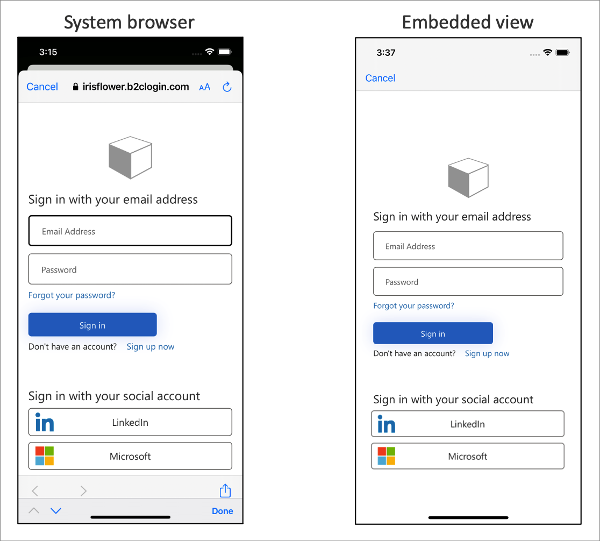

# Configure authentication options in an iOS Swift application using Azure Active Directory B2C 

This article describes ways you can customize and enhance the Azure Active Directory B2C (Azure AD B2C) authentication experience for your iOS Swift application. Before you start, familiarize yourself with the following articles: [Configure authentication in a sample iOS Swift application](configure-authentication-sample-ios-app.md) and [Enable authentication in your own iOS Swift app using Azure Active Directory B2C](enable-authentication-ios-app.md).

[!INCLUDE [active-directory-b2c-app-integration-custom-domain](../../includes/active-directory-b2c-app-integration-custom-domain.md)]

To use a custom domain and your tenant ID in the authentication URL: 

1. Follow the guidance in [Enable custom domains](custom-domain.md).
1. Update the `kAuthorityHostName` class member with your custom domain.
1. Update the `kTenantName` class member with your [tenant ID](tenant-management.md#get-your-tenant-id).

The following Swift code shows the app settings before the change:

```swift
let kTenantName = "contoso.onmicrosoft.com" 
let kAuthorityHostName = "contoso.b2clogin.com" 
```

The following JSON shows the app settings after the change:

```swift
let kTenantName = "00000000-0000-0000-0000-000000000000" 
let kAuthorityHostName = "login.contoso.com" 
```

[!INCLUDE [active-directory-b2c-app-integration-login-hint](../../includes/active-directory-b2c-app-integration-login-hint.md)]

1. If you're using a custom policy, add the required input claim as described in [Set up direct sign-in](direct-signin.md#prepopulate-the-sign-in-name). 
1. Find your MSAL configuration object and add the **withLoginHint()** method with the login hint.

```swift
let parameters = MSALInteractiveTokenParameters(scopes: kScopes, webviewParameters: self.webViewParamaters!)
parameters.promptType = .selectAccount
parameters.authority = authority
parameters.loginHint = "bob@contoso.com"
// More settings here

applicationContext.acquireToken(with: parameters) { (result, error) in
...
```

[!INCLUDE [active-directory-b2c-app-integration-domain-hint](../../includes/active-directory-b2c-app-integration-domain-hint.md)]

1. Check the domain name of your external identity provider. For more information, see [Redirect sign-in to a social provider](direct-signin.md#redirect-sign-in-to-a-social-provider). 
1. Create or use an existing list object to store extra query parameters.
1. Add the `domain_hint` parameter with the corresponding domain name to the list. For example, `facebook.com`.
1. Pass the extra query parameters list into the MSAL configuration object's `extraQueryParameters` attribute.

```swift
let extraQueryParameters: [String: String] = ["domain_hint": "facebook.com"]

let parameters = MSALInteractiveTokenParameters(scopes: kScopes, webviewParameters: self.webViewParamaters!)
parameters.promptType = .selectAccount
parameters.authority = authority
parameters.extraQueryParameters = extraQueryParameters
// More settings here

applicationContext.acquireToken(with: parameters) { (result, error) in
...
```

[!INCLUDE [active-directory-b2c-app-integration-ui-locales](../../includes/active-directory-b2c-app-integration-ui-locales.md)]

1. [Configure Language customization](language-customization.md).
1. Create or use an existing list object to store extra query parameters.
1. Add the `ui_locales` parameter with the corresponding language code to the list. For example, `en-us`.
1. Pass the extra query parameters list into the MSAL configuration object's `extraQueryParameters` attribute.

```swift
let extraQueryParameters: [String: String] = ["ui_locales": "en-us"]

let parameters = MSALInteractiveTokenParameters(scopes: kScopes, webviewParameters: self.webViewParamaters!)
parameters.promptType = .selectAccount
parameters.authority = authority
parameters.extraQueryParameters = extraQueryParameters
// More settings here

applicationContext.acquireToken(with: parameters) { (result, error) in
...
```

[!INCLUDE [active-directory-b2c-app-integration-custom-parameters](../../includes/active-directory-b2c-app-integration-custom-parameters.md)]

1. Configure the [ContentDefinitionParameters](customize-ui-with-html.md#configure-dynamic-custom-page-content-uri) element.
1. Create or use an existing list object to store extra query parameters.
1. Add the custom query string parameter, such as `campaignId`. Set the parameter value. For example, `germany-promotion`.
1. Pass the extra query parameters list into the MSAL configuration object's `extraQueryParameters` attribute.

```swift
let extraQueryParameters: [String: String] = ["campaignId": "germany-promotion"]

let parameters = MSALInteractiveTokenParameters(scopes: kScopes, webviewParameters: self.webViewParamaters!)
parameters.promptType = .selectAccount
parameters.authority = authority
parameters.extraQueryParameters = extraQueryParameters
// More settings here

applicationContext.acquireToken(with: parameters) { (result, error) in
...
```


[!INCLUDE [active-directory-b2c-app-integration-id-token-hint](../../includes/active-directory-b2c-app-integration-id-token-hint.md)]

1. In your custom policy, define an [ID token hint technical profile](id-token-hint.md).
1. In your code, generate or acquire an ID token, and set the token to a variable. For example, `idToken`. 
1. Create or use an existing list object to store extra query parameters.
1. Add the `id_token_hint` parameter with the corresponding variable that stores the ID token.
1. Pass the extra query parameters list into the MSAL configuration object's `extraQueryParameters` attribute.

```swift
let extraQueryParameters: [String: String] = ["id_token_hint": idToken]

let parameters = MSALInteractiveTokenParameters(scopes: kScopes, webviewParameters: self.webViewParamaters!)
parameters.promptType = .selectAccount
parameters.authority = authority
parameters.extraQueryParameters = extraQueryParameters
// More settings here

applicationContext.acquireToken(with: parameters) { (result, error) in
...
```

[!INCLUDE [active-directory-b2c-app-integration-logging](../../includes/active-directory-b2c-app-integration-logging.md)]


The MSAL Logger should be set as early as possible in the app launch sequence, before any MSAL requests are made. Configure MSAL [logging](../active-directory/develop/msal-logging-ios.md) in the *AppDelegate.swift* `application` method.

The following code snippet demonstrates how to configure MSAL logging:

```swift
func application(_ application: UIApplication, didFinishLaunchingWithOptions launchOptions: [UIApplication.LaunchOptionsKey: Any]?) -> Bool {
        
        MSALGlobalConfig.loggerConfig.logLevel = .verbose
        MSALGlobalConfig.loggerConfig.setLogCallback { (logLevel, message, containsPII) in
            
            // If PiiLoggingEnabled is set YES, this block will potentially contain sensitive information (Personally Identifiable Information), but not all messages will contain it.
            // containsPII == YES indicates if a particular message contains PII.
            // You might want to capture PII only in debug builds, or only if you take necessary actions to handle PII properly according to legal requirements of the region
            if let displayableMessage = message {
                if (!containsPII) {
                    #if DEBUG
                    // NB! This sample uses print just for testing purposes
                    // You should only ever log to NSLog in debug mode to prevent leaking potentially sensitive information
                    print(displayableMessage)
                    #endif
                }
            }
        }
        return true
    }
```

## Embedded webview experience

Web browsers are required for interactive authentication. By default, the MSAL library uses the system webview. During sign-in, the MSAL library pops up the iOS system webview with the Azure AD B2C user interface.  

For more information, see the [Customize browsers and WebViews for iOS/macOS](../active-directory/develop/customize-webviews.md) article.

Depending on your requirements, you can use the embedded webview. There are visual and single sign-on behavior differences between the embedded webview and the system webview in MSAL.



> [!IMPORTANT]
> It's recommended that you use the platform default, which is typically the system browser. The system browser is better at remembering the users that have logged in before. Some identity providers, such as Google, don't support an embedded view experience.

To change this behavior, change the `webviewType` attribute of the `MSALWebviewParameters` to `wkWebView`. The following example demonstrates how to change the webview type to embedded view. 

```swift
func initWebViewParams() {
    self.webViewParamaters = MSALWebviewParameters(authPresentationViewController: self)
    
    // Use embedded view experience
    self.webViewParamaters?.webviewType = .wkWebView
}
```

## Next steps

- Learn more: [MSAL for iOS Swift configuration options](https://github.com/AzureAD/microsoft-authentication-library-for-objc/wiki)
