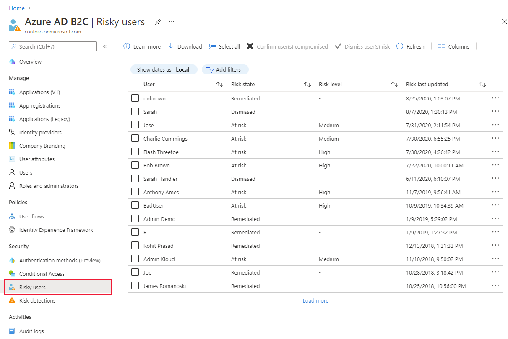
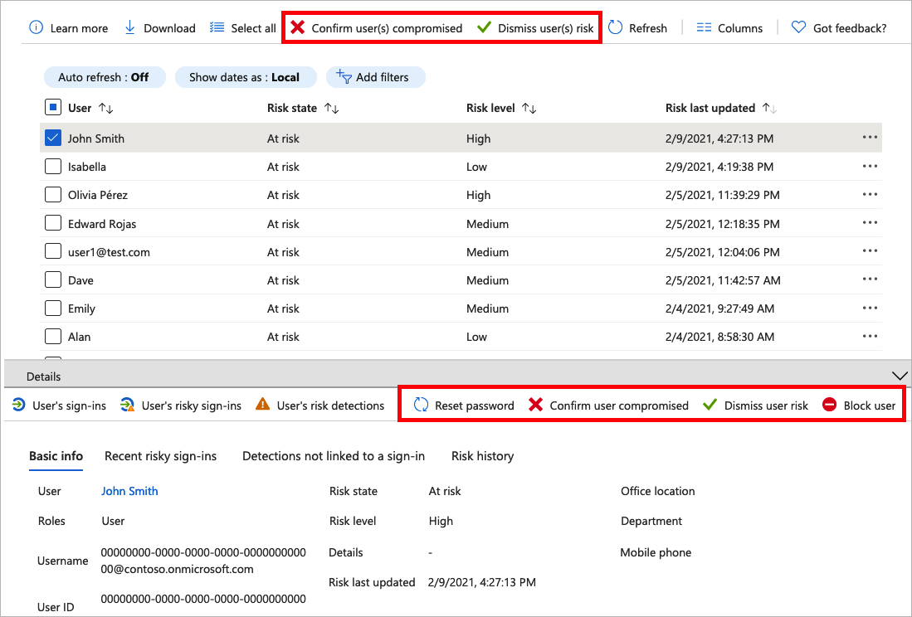
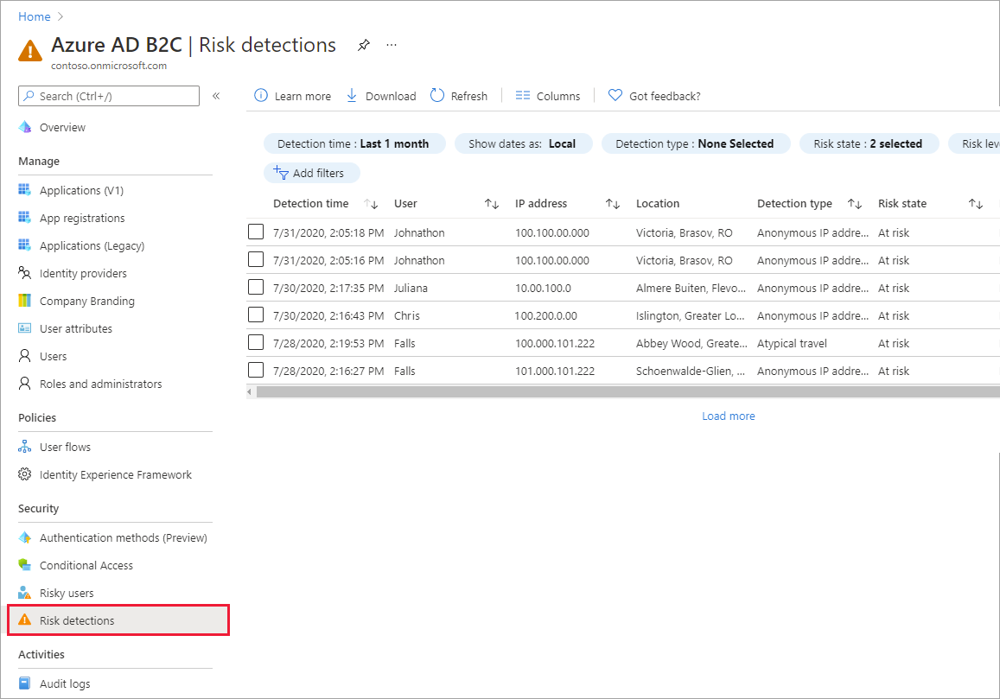

# Investigate risk with Identity Protection in Azure AD B2C

Identity Protection provides ongoing risk detection for your Azure AD B2C tenant. It allows organizations to discover, investigate, and remediate identity-based risks. Identity Protection comes with risk reports that can be used to investigate identity risks in Azure AD B2C tenants. In this article, you learn how to investigate and mitigate risks.

## Overview

Azure AD B2C Identity Protection provides two reports. The *Risky users* report is where administrators can find which users are at risk and details about detections. The *risk detections* report provides information about each risk detection, including type, other risks triggered at the same time, sign-in attempt location, and more.

Each report launches with a list of all detections for the period shown at the top of the report. Reports can be filtered using the filters across the top of the report. Administrators can choose to download the data, or use [MS Graph API and Microsoft Graph PowerShell SDK](../active-directory/identity-protection/howto-identity-protection-graph-api.md) to continuously export the data.

## Service limitations and considerations

When using Identity Protection, consider the following:

- Identity Protection is on by default.
- Identity Protection is available for both local and social identities, such as Google or Facebook. For social identities, Conditional Access must be activated. Detection is limited because the social account credentials are managed by the external identity provider.
- In Azure AD B2C tenants, only a subset of the [Microsoft Entra ID Protection risk detections](../active-directory/identity-protection/overview-identity-protection.md) is available. The following risk detections are supported by Azure AD B2C:  

|Risk detection type  |Description  |
|---------|---------|
| Atypical travel     | Sign-in from an atypical location based on the user's recent sign-ins.        |
|Anonymous IP address     | Sign-in from an anonymous IP address (for example: Tor browser, anonymizer VPNs).        |
|Malware linked IP address     | Sign-in from a malware linked IP address.         |
|Unfamiliar sign-in properties     | Sign-in with properties we've not seen recently for the given user.        |
|Admin confirmed user compromised    | An admin has indicated that a user was compromised.             |
|Password spray     | Sign-in through a password spray attack.      |
|Microsoft Entra threat intelligence     | Microsoft's internal and external threat intelligence sources have identified a known attack pattern.        |

## Pricing tier

Azure AD B2C Premium P2 is required for some Identity Protection features. If necessary, [change your Azure AD B2C pricing tier to Premium P2](./billing.md). The following table summarizes Identity Protection features and the required pricing tier.  

|Feature   |P1   |P2|
|----------|:-----------:|:------------:|
|Risky users report     |&#x2713; |&#x2713; |
|Risky users report details  | |&#x2713; |
|Risky users report remediation    | &#x2713; |&#x2713; |
|Risk detections report   |&#x2713;|&#x2713;|
|Risk detections report details  ||&#x2713;|
|Report download |  &#x2713;| &#x2713;|
|MS Graph API access |  &#x2713;| &#x2713;|

## Prerequisites

[!INCLUDE [active-directory-b2c-customization-prerequisites](../../includes/active-directory-b2c-customization-prerequisites.md)]

## Investigate risky users

With the information provided by the risky users report, administrators can find:

- The **Risk state**, showing which users are **At risk**, have had risk **Remediated**, or have had risk **Dismissed**
- Details about detections
- History of all risky sign-ins
- Risk history
 
Administrators can then choose to take action on these events. Administrators can choose to:

- Reset the user password
- Confirm user compromise
- Dismiss user risk
- Block user from signing in
- Investigate further using Azure ATP

An administrator can choose to dismiss a user's risk in the Azure portal or programmatically through the Microsoft Graph API [Dismiss User Risk](/graph/api/riskyusers-dismiss?preserve-view=true&view=graph-rest-beta). Administrator privileges are required to dismiss a user's risk. Remediating a risk can be performed by the risky user or by an administrator on the user's behalf, for example through a password reset.

### Navigating the risky users report

1. Sign in to the [Azure portal](https://portal.azure.com/).
1. Make sure you're using the directory that contains your Azure AD B2C tenant. Select the **Directories + subscriptions** icon in the portal toolbar.
1. On the **Portal settings | Directories + subscriptions** page, find your Azure AD B2C directory in the **Directory name** list, and then select **Switch**.
1. Under **Azure services**, select **Azure AD B2C**. Or use the search box to find and select **Azure AD B2C**.
1. Under **Security**, select **Risky users**.

   

    Selecting individual entries expands a details window below the detections. The details view allows administrators to investigate and perform actions on each detection.

    

## Risk detections report

The risk detections report contains filterable data for up to the past 90 days (three months).

With the information provided by the risk detections report, administrators can find:

- Information about each risk detection including type.
- Other risks triggered at the same time.
- Sign-in attempt location.

Administrators can then choose to return to the user's risk or sign-ins report to take actions based on information gathered.

### Navigating the risk detections report

1. In the Azure portal, search for and select **Azure AD B2C**.
1. Under **Security**, select **Risk detections**.

   

## Next steps

- [Add Conditional Access to a user flow](conditional-access-user-flow.md).
