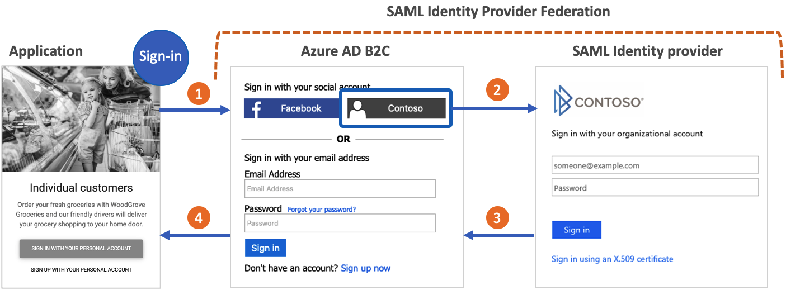

# Set up sign-up and sign-in with SAML identity provider using Azure Active Directory B2C

Azure Active Directory B2C (Azure AD B2C) supports federation with SAML 2.0 identity providers. This article shows you how to enable sign-in with a SAML identity provider user account, allowing users to sign in with their existing social or enterprise identities, such as [ADFS](./identity-provider-adfs.md) and [Salesforce](identity-provider-salesforce-saml.md).

[!INCLUDE [active-directory-b2c-choose-user-flow-or-custom-policy](../../includes/active-directory-b2c-choose-user-flow-or-custom-policy.md)]

::: zone pivot="b2c-user-flow"

[!INCLUDE [active-directory-b2c-limited-to-custom-policy](../../includes/active-directory-b2c-limited-to-custom-policy.md)]

::: zone-end

::: zone pivot="b2c-custom-policy"

## Scenario overview

You can configure Azure AD B2C to allow users to sign in to your application with credentials from external social or enterprise SAML identity providers (IdP). When Azure AD B2C federates with a SAML identity provider, it acts as a **service provider** initiating a SAML request to the SAML **identity provider**, and waiting for a SAML response. In the following diagram:

1. The application initiates an authorization request to Azure AD B2C. The application can be an [OAuth 2.0](protocols-overview.md) or [OpenId Connect](openid-connect.md) application, or a [SAML service provider](saml-service-provider.md). 
1. In the Azure AD B2C sign-in page, the user chooses to sign-in with a SAML identity provider account (for example, *Contoso*). Azure AD B2C initiates a SAML authorization request and takes the user to the SAML identity provider to complete the sign-in.
1. The SAML identity provider returns a SAML response.
1. Azure AD B2C validates the SAML token, extracts claims, issues its own token, and  takes the user back to the application.  



## Prerequisites

[!INCLUDE [active-directory-b2c-customization-prerequisites-custom-policy](../../includes/active-directory-b2c-customization-prerequisites-custom-policy.md)]

## Components of the solution

The following components required are for this scenario:

* A SAML **identity provider** with the ability to receive, decode, and respond to SAML requests from Azure AD B2C.
* A publicly available SAML **metadata endpoint** for your identity provider.
* An [Azure AD B2C tenant](tutorial-create-tenant.md).

[!INCLUDE [active-directory-b2c-https-cipher-tls-requirements](../../includes/active-directory-b2c-https-cipher-tls-requirements.md)]

## Create a policy key

To establish trust between Azure AD B2C and your SAML identity provider, you need to provide a valid X509 certificate with the private key. Azure AD B2C signs the SAML requests, using the private key of the certificate. The identity provider validates the request using the public key of the certificate. The public key is accessible through technical profile metadata. Alternatively, you can manually upload the .cer file to your SAML identity provider.

A self-signed certificate is acceptable for most scenarios. For production environments, it is recommended to use an X509 certificate that is issued by a certificate authority. Also, as described later in this document, for a non-production environment you can disable the SAML signing on both sides.

### Obtain a certificate

[!INCLUDE [active-directory-b2c-create-self-signed-certificate](../../includes/active-directory-b2c-create-self-signed-certificate.md)]

### Upload the certificate

You need to store your certificate in your Azure AD B2C tenant.

1. Sign in to the [Azure portal](https://portal.azure.com/).
1. Make sure you're using the directory that contains your Azure AD B2C tenant. Select the **Directories + subscriptions** icon in the portal toolbar.
1. On the **Portal settings | Directories + subscriptions** page, find your Azure AD B2C directory in the **Directory name** list, and then select **Switch**.
1. Choose **All services** in the top-left corner of the Azure portal, and then search for and select **Azure AD B2C**.
1. On the Overview page, select **Identity Experience Framework**.
1. Select **Policy Keys** and then select **Add**.
1. For **Options**, choose `Upload`.
1. Enter a **Name** for the policy key. For example, `SAMLSigningCert`. The prefix `B2C_1A_` is added automatically to the name of your key.
1. Browse to and select your certificate .pfx file with the private key.
1. Click **Create**.

## Configure the SAML technical profile

Define the SAML identity provider by adding it to the **ClaimsProviders** element in the extension file of your policy. The claims providers contains a SAML technical profile that determines the endpoints and the protocols needed to communicate with the SAML identity provider. To add a claims provider with a SAML technical profile:

1. Open the *TrustFrameworkExtensions.xml*.
1. Find the **ClaimsProviders** element. If it does not exist, add it under the root element.
1. Add a new **ClaimsProvider** as follows:

    ```xml
    <ClaimsProvider>
      <Domain>Contoso.com</Domain>
      <DisplayName>Contoso</DisplayName>
      <TechnicalProfiles>
        <TechnicalProfile Id="Contoso-SAML2">
          <DisplayName>Contoso</DisplayName>
          <Description>Login with your SAML identity provider account</Description>
          <Protocol Name="SAML2"/>
          <Metadata>
            <Item Key="PartnerEntity">https://your-AD-FS-domain/federationmetadata/2007-06/federationmetadata.xml</Item>
          </Metadata>
          <CryptographicKeys>
            <Key Id="SamlMessageSigning" StorageReferenceId="B2C_1A_SAMLSigningCert"/>
          </CryptographicKeys>
          <OutputClaims>
            <OutputClaim ClaimTypeReferenceId="issuerUserId" PartnerClaimType="assertionSubjectName" />
            <OutputClaim ClaimTypeReferenceId="givenName" PartnerClaimType="first_name" />
            <OutputClaim ClaimTypeReferenceId="surname" PartnerClaimType="last_name" />
            <OutputClaim ClaimTypeReferenceId="displayName" PartnerClaimType="http://schemas.microsoft.com/identity/claims/displayname" />
            <OutputClaim ClaimTypeReferenceId="email"  />
            <OutputClaim ClaimTypeReferenceId="identityProvider" DefaultValue="contoso.com" />
            <OutputClaim ClaimTypeReferenceId="authenticationSource" DefaultValue="socialIdpAuthentication" />
          </OutputClaims>
          <OutputClaimsTransformations>
            <OutputClaimsTransformation ReferenceId="CreateRandomUPNUserName"/>
            <OutputClaimsTransformation ReferenceId="CreateUserPrincipalName"/>
            <OutputClaimsTransformation ReferenceId="CreateAlternativeSecurityId"/>
            <OutputClaimsTransformation ReferenceId="CreateSubjectClaimFromAlternativeSecurityId"/>
          </OutputClaimsTransformations>
          <UseTechnicalProfileForSessionManagement ReferenceId="SM-Saml-idp"/>
        </TechnicalProfile>
      </TechnicalProfiles>
    </ClaimsProvider>
    ```

Update the following XML elements with the relevant value:

|XML element  |Value  |
|---------|---------|
|ClaimsProvider\Domain  | The domain name that is used for [direct sign-in](direct-signin.md?pivots=b2c-custom-policy#redirect-sign-in-to-a-social-provider). Enter the domain name you want to use in the direct sign-in. For example, *Contoso.com*. |
|TechnicalProfile\DisplayName|This value will be displayed on the sign-in button on your sign-in screen. For example, *Contoso*. |
|Metadata\PartnerEntity|URL of the metadata of the SAML identity provider. Or you can copy the identity provider metadata and add it inside the CDATA element `<![CDATA[Your IDP metadata]]>`.|

## Map the claims

The **OutputClaims** element contains a list of claims returned by the SAML identity provider. Map the name of the claim defined in your policy to the assertion name defined in the identity provider. Check your identity provider for the list of claims (assertions). For more information, see [claims-mapping](identity-provider-generic-saml-options.md#claims-mapping).

In the example above, *Contoso-SAML2* includes the claims returned by a SAML identity provider:

* The **assertionSubjectName** claim is mapped to the **issuerUserId** claim.
* The **first_name** claim is mapped to the **givenName** claim.
* The **last_name** claim is mapped to the **surname** claim.
* The `http://schemas.microsoft.com/identity/claims/displayname` claim is mapped to the **displayName** claim.
* The **email** claim without name mapping.

The technical profile also returns claims that aren't returned by the identity provider:

* The **identityProvider** claim that contains the name of the identity provider.
* The **authenticationSource** claim with a default value of **socialIdpAuthentication**.
 
### Add the SAML session technical profile

If you don't already have the `SM-Saml-idp` SAML session technical profile, add one to your extension policy. Locate the `<ClaimsProviders>` section and add the following XML snippet. If your policy already contains the `SM-Saml-idp` technical profile, skip to the next step. For more information, see [single sign-on session management](custom-policy-reference-sso.md).

```xml
<ClaimsProvider>
  <DisplayName>Session Management</DisplayName>
  <TechnicalProfiles>
    <TechnicalProfile Id="SM-Saml-idp">
      <DisplayName>Session Management Provider</DisplayName>
      <Protocol Name="Proprietary" Handler="Web.TPEngine.SSO.SamlSSOSessionProvider, Web.TPEngine, Version=1.0.0.0, Culture=neutral, PublicKeyToken=null" />
      <Metadata>
        <Item Key="IncludeSessionIndex">false</Item>
        <Item Key="RegisterServiceProviders">false</Item>
      </Metadata>
    </TechnicalProfile>
  </TechnicalProfiles>
</ClaimsProvider>
```

[!INCLUDE [active-directory-b2c-add-identity-provider-to-user-journey](../../includes/active-directory-b2c-add-identity-provider-to-user-journey.md)]


```xml
<OrchestrationStep Order="1" Type="CombinedSignInAndSignUp" ContentDefinitionReferenceId="api.signuporsignin">
  <ClaimsProviderSelections>
    ...
    <ClaimsProviderSelection TargetClaimsExchangeId="ContosoExchange" />
  </ClaimsProviderSelections>
  ...
</OrchestrationStep>

<OrchestrationStep Order="2" Type="ClaimsExchange">
  ...
  <ClaimsExchanges>
    <ClaimsExchange Id="ContosoExchange" TechnicalProfileReferenceId="Contoso-SAML2" />
  </ClaimsExchanges>
</OrchestrationStep>
```

[!INCLUDE [active-directory-b2c-create-relying-party-policy](../../includes/active-directory-b2c-configure-relying-party-policy-user-journey.md)]

## Configure your SAML identity provider

After your policy is configured, you need to configure your SAML identity provider with the Azure AD B2C SAML metadata. The SAML metadata is information used in the SAML protocol to expose the configuration of your policy, the **service provider**. It defines the location of the services, such as sign-in and sign-out, certificates, sign-in method, and more.

Each SAML identity provider has different steps for setting a service provider. Some SAML identity providers ask for the Azure AD B2C metadata, while others require you to go through the metadata file manually and provide the information. Refer to your identity provider’s documentation for guidance.

The following example shows a URL address for the SAML metadata of an Azure AD B2C technical profile:

```
https://<your-tenant-name>.b2clogin.com/<your-tenant-name>.onmicrosoft.com/<your-policy>/samlp/metadata?idptp=<your-technical-profile>
```

When using a [custom domain](custom-domain.md), use the following format:

```
https://your-domain-name/<your-tenant-name>.onmicrosoft.com/<your-policy>/samlp/metadata?idptp=<your-technical-profile>
```

Replace the following values:

- **your-tenant-name** with your tenant name, such as your-tenant.onmicrosoft.com.
- **your-domain-name** with your custom domain name, such as login.contoso.com.
- **your-policy** with your policy name. For example, B2C_1A_signup_signin_adfs.
- **your-technical-profile** with the name of your SAML identity provider technical profile. For example, Contoso-SAML2.

Open a browser and navigate to the URL. Make sure you type the correct URL and that you have access to the XML metadata file.

## Test your custom policy

1. Sign in to the [Azure portal](https://portal.azure.com).
1. Make sure you're using the directory that contains your Azure AD B2C tenant. Select the **Directories + subscriptions** icon in the portal toolbar.
1. On the **Portal settings | Directories + subscriptions** page, find your Azure AD B2C directory in the **Directory name** list, and then select **Switch**.
1. In the Azure portal, search for and select **Azure AD B2C**.
1. Under **Policies**, select **Identity Experience Framework**
1. Select your relying party policy, for example `B2C_1A_signup_signin`.
1. For **Application**, select a web application that you [previously registered](tutorial-register-applications.md). The **Reply URL** should show `https://jwt.ms`.
1. Select the **Run now** button.
1. From the sign-up or sign-in page, select **Contoso** to sign in with Contoso account.

If the sign-in process is successful, your browser is redirected to `https://jwt.ms`, which displays the contents of the token returned by Azure AD B2C.

## Next steps

- [Configure SAML identity provider options with Azure Active Directory B2C](identity-provider-generic-saml-options.md)

::: zone-end
