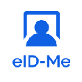

# Identity verification and proofing partners

With Azure Active Directory B2C (Azure AD B2C) and solutions from software-vendor partners, customers can enable end-user identity verification and proofing for account registration. Identity verification and proofing can check documents, knowledge-based information, and liveness.

## Architecture diagram

The following architecture diagram illustrates the verification and proofing flow.

   

1. User begins registration with a device.
2. User enters information.
3. Digital-risk score is assessed, then third-party identity proofing and identity validation occurs.
4. Identity is validated or rejected.
5. User attributes are passed to Azure Active Directory B2C.
6. If user verification is successful, a user account is created in Azure AD B2C during sign-in.
7. Based on the verification result, the user receives an access-approved or -denied message.

## Software vendors and integration documentation

Microsoft partners with independent software vendors (ISVs). Use the following table to locate an ISV and related integration documentation. 

| ISV logo | ISV link and description| Integration documentation|
|---|---|---|
|  | [Deduce](https://www.deduce.com/): Identity verification and proofing provider that helps stop account takeover and registration fraud. Use it to combat identity fraud and create a trusted user experience. |[Configure Azure AD B2C with Deduce to combat identity fraud and create a trusted user experience](partner-deduce.md)|
|  |  [Bluink, Ltd.](https://bluink.ca/): eID-Me is an identity verification and decentralized digital identity solution for Canadian citizens. Use it to meet Identity Assurance Level (IAL) 2 and Know Your Customer (KYC) requirements. |[Configure eID-Me with Azure AD B2C for identity verification](partner-eid-me.md)|
| | [Experian Information Solutions, Inc.](https://www.experian.com/business/products/crosscore): Identity verification and proofing provider with solutions that perform risk assessments based on user attributes. |[Tutorial: Configure Experian with Azure AD B2C](partner-experian.md)|
| | [IDology, a GBG company](https://www.idology.com/solutions/): Identity verification and proofing provider with ID verification, fraud prevention, and compliance solutions.|[Tutorial for configuring IDology with Azure AD B2C](partner-idology.md)|
| | [Jumio](https://www.jumio.com/): Identify verification service with products for real-time, automated ID verification. |[Tutorial for configuring Jumio with Azure AD B2C](partner-jumio.md)|
|  | [LexisNexis Risk Solutions Group](https://risk.lexisnexis.com/products/threatmetrix): Profiling and identity validation provider that verifies user identification and provides risk assessment based on user devices. See, ThreatMetrix. |[Tutorial for configuring LexisNexis with Azure AD B2C](partner-lexisnexis.md)|
|  | [Onfido](https://onfido.com/): Document ID and facial biometrics verification solutions to meet Know Your Customer (KYC) and identity requirements.  |[Tutorial for configuring Onfido with Azure AD B2C](partner-onfido.md)|

## Resources

- [Azure AD B2C custom policy overview](custom-policy-overview.md)
- [Tutorial: Create user flows and custom policies in Azure Active Directory B2C](tutorial-create-user-flows.md?pivots=b2c-custom-policy&tabs=applications)

## Next steps

Select and contact a partner from the previous table to get started on solution integration with Azure AD B2C. The partners have similar processes to contact them for a product demo.
