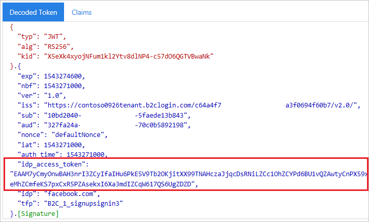

# Pass an access token through a user flow to your application in Azure Active Directory B2C

A [user flow](user-flow-overview.md) in Azure Active Directory B2C (Azure AD B2C) provides users of your application an opportunity to sign up or sign in with an identity provider. When the journey starts, Azure AD B2C receives an [access token](tokens-overview.md) from the identity provider. Azure AD B2C uses that token to retrieve information about the user. You enable a claim in your user flow to pass the token through to the applications that you register in Azure AD B2C.

Azure AD B2C currently only supports passing the access token of [OAuth 2.0](authorization-code-flow.md) identity providers, which include [Facebook](identity-provider-facebook.md) and [Google](identity-provider-google.md). For all other identity providers, the claim is returned blank.

## Prerequisites

* Your application must be using a [v2 user flow](user-flow-versions.md).
* Your user flow is configured with an OAuth 2.0 identity provider.

## Enable the claim

1. Sign in to the [Azure portal](https://portal.azure.com/) as the global administrator of your Azure AD B2C tenant.
2. Make sure you're using the directory that contains your Azure AD B2C tenant. Select the **Directory + subscription** filter in the top menu and choose the directory that contains your tenant.
3. Choose **All services** in the top-left corner of the Azure portal, search for and select **Azure AD B2C**.
4. Select **User flows (policies)**, and then select your user flow. For example, **B2C_1_signupsignin1**.
5. Select **Application claims**.
6. Enable the **Identity Provider Access Token** claim.

    

7. Click **Save** to save the user flow.

## Test the user flow

When testing your applications in Azure AD B2C, it can be useful to have the Azure AD B2C token returned to `https://jwt.ms` to review the claims in it.

1. On the Overview page of the user flow, select **Run user flow**.
2. For **Application**, select your application that you previously registered. To see the token in the example below, the **Reply URL** should show `https://jwt.ms`.
3. Click **Run user flow**, and then sign in with your account credentials. You should see the access token of the identity provider in the **idp_access_token** claim.

    You should see something similar to the following example:

    

## Next steps

Learn more in the [overview of Azure AD B2C tokens](tokens-overview.md).
