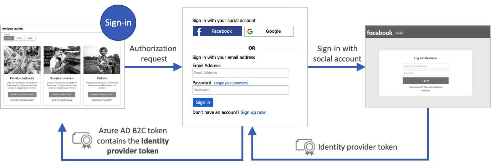
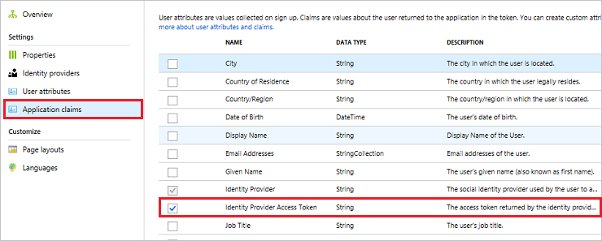
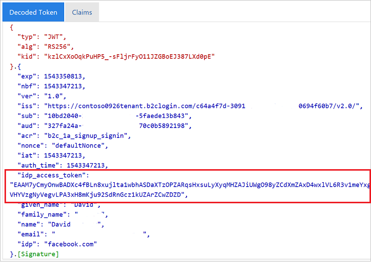

# Pass an identity provider access token to your application in Azure Active Directory B2C

[!INCLUDE [active-directory-b2c-choose-user-flow-or-custom-policy](../../includes/active-directory-b2c-choose-user-flow-or-custom-policy.md)]

A [user flow](user-flow-overview.md) in Azure Active Directory B2C (Azure AD B2C) provides users of your application an opportunity to sign up or sign in with an identity provider. When the journey starts, Azure AD B2C receives an [access token](tokens-overview.md) from the identity provider. Azure AD B2C uses that token to retrieve information about the user. You enable a claim in your user flow to pass the token through to the applications that you register in Azure AD B2C.

::: zone pivot="b2c-user-flow"

Azure AD B2C supports passing the access token of [OAuth 2.0](add-identity-provider.md) identity providers, which include [Facebook](identity-provider-facebook.md) and [Google](identity-provider-google.md). For all other identity providers, the claim is returned blank.

::: zone-end

::: zone pivot="b2c-custom-policy"

Azure AD B2C supports passing the access token of [OAuth 2.0](authorization-code-flow.md) and [OpenID Connect](openid-connect.md) identity providers. For all other identity providers, the claim is returned blank. For more details, check out the identity providers federation [Live demo](https://github.com/azure-ad-b2c/unit-tests/tree/main/Identity-providers).

::: zone-end

The following diagram shows how an identity provider token returns to your app: 



## Prerequisites

[!INCLUDE [active-directory-b2c-customization-prerequisites](../../includes/active-directory-b2c-customization-prerequisites.md)]

::: zone pivot="b2c-user-flow"

## Enable the claim

1. Sign in to the [Azure portal](https://portal.azure.com/) as the global administrator of your Azure AD B2C tenant.
1. Make sure you're using the directory that contains your Azure AD B2C tenant. Select the **Directories + subscriptions** icon in the portal toolbar.
1. On the **Portal settings | Directories + subscriptions** page, find your Azure AD B2C directory in the **Directory name** list, and then select **Switch**.
1. Choose **All services** in the top-left corner of the Azure portal, search for and select **Azure AD B2C**.
1. Select **User flows (policies)**, and then select your user flow. For example, **B2C_1_signupsignin1**.
1. Select **Application claims**.
1. Enable the **Identity Provider Access Token** claim.

    

1. Click **Save** to save the user flow.

## Test the user flow

When testing your applications in Azure AD B2C, it can be useful to have the Azure AD B2C token returned to `https://jwt.ms` to review the claims in it.

1. On the Overview page of the user flow, select **Run user flow**.
1. For **Application**, select your application that you previously registered. To see the token in the example below, the **Reply URL** should show `https://jwt.ms`.
1. Click **Run user flow**, and then sign in with your account credentials. You should see the access token of the identity provider in the **idp_access_token** claim.

    You should see something similar to the following example:

    

::: zone-end

::: zone pivot="b2c-custom-policy"

## Add the claim elements

1. Open your *TrustframeworkExtensions.xml* file and add the following **ClaimType** element with an identifier of `identityProviderAccessToken` to the **ClaimsSchema** element:

    ```xml
    <BuildingBlocks>
      <ClaimsSchema>
        <ClaimType Id="identityProviderAccessToken">
          <DisplayName>Identity Provider Access Token</DisplayName>
          <DataType>string</DataType>
          <AdminHelpText>Stores the access token of the identity provider.</AdminHelpText>
        </ClaimType>
        ...
      </ClaimsSchema>
    </BuildingBlocks>
    ```

1. Add the **OutputClaim** element to the **TechnicalProfile** element for each OAuth 2.0 identity provider that you would like the access token for. The following example shows the element added to the Facebook technical profile:

    ```xml
    <ClaimsProvider>
      <DisplayName>Facebook</DisplayName>
      <TechnicalProfiles>
        <TechnicalProfile Id="Facebook-OAUTH">
          <OutputClaims>
            <OutputClaim ClaimTypeReferenceId="identityProviderAccessToken" PartnerClaimType="{oauth2:access_token}" />
          </OutputClaims>
          ...
        </TechnicalProfile>
      </TechnicalProfiles>
    </ClaimsProvider>
    ```

1. Save the *TrustframeworkExtensions.xml* file.
1. Open your relying party policy file, such as *SignUpOrSignIn.xml*, and add the **OutputClaim** element to the **TechnicalProfile**:

    ```xml
    <RelyingParty>
      <DefaultUserJourney ReferenceId="SignUpOrSignIn" />
      <TechnicalProfile Id="PolicyProfile">
        <OutputClaims>
          <OutputClaim ClaimTypeReferenceId="identityProviderAccessToken" PartnerClaimType="idp_access_token"/>
        </OutputClaims>
        ...
      </TechnicalProfile>
    </RelyingParty>
    ```

1. Save the policy file.

## Test your policy

When testing your applications in Azure AD B2C, it can be useful to have the Azure AD B2C token returned to `https://jwt.ms` to be able to review the claims in it.

### Upload the files

1. Sign in to the [Azure portal](https://portal.azure.com/).
1. Make sure you're using the directory that contains your Azure AD B2C tenant. Select the **Directories + subscriptions** icon in the portal toolbar.
1. On the **Portal settings | Directories + subscriptions** page, find your Azure AD B2C directory in the **Directory name** list, and then select **Switch**.
1. Choose **All services** in the top-left corner of the Azure portal, and then search for and select **Azure AD B2C**.
1. Select **Identity Experience Framework**.
1. On the Custom Policies page, click **Upload Policy**.
1. Select **Overwrite the policy if it exists**, and then search for and select the *TrustframeworkExtensions.xml* file.
1. Select **Upload**.
1. Repeat steps 5 through 7 for the relying party file, such as *SignUpOrSignIn.xml*.

### Run the policy

1. Open the policy that you changed. For example, *B2C_1A_signup_signin*.
1. For **Application**, select your application that you previously registered. To see the token in the example below, the **Reply URL** should show `https://jwt.ms`.
1. Select **Run now**.

    You should see something similar to the following example:

    

## Pass the IDP refresh token (optional)

The access token the identity provider returns is valid for a short period of time. Some identity providers also issue a refresh token along with the access token. Your client application can then exchange the identity provider's refresh token for a new access token when needed. 

Azure AD B2C custom policy supports passing the refresh token of OAuth 2.0 identity providers, which includes [Facebook](https://github.com/azure-ad-b2c/unit-tests/tree/main/Identity-providers#facebook-with-access-token), [Google](https://github.com/azure-ad-b2c/unit-tests/tree/main/Identity-providers#facebook-with-access-token) and [GitHub](https://github.com/azure-ad-b2c/unit-tests/tree/main/Identity-providers#github-with-access-token).

To pass the identity provider's refresh token, follow these steps:

1. Open your *TrustframeworkExtensions.xml* file and add the following **ClaimType** element with an identifier of `identityProviderRefreshToken` to the **ClaimsSchema** element.
    
    ```xml
    <ClaimType Id="identityProviderRefreshToken">
        <DisplayName>Identity provider refresh token</DisplayName>
        <DataType>string</DataType>
    </ClaimType>
    ```
    
1. Add the **OutputClaim** element to the **TechnicalProfile** element for each OAuth 2.0 identity provider that you would like the refresh token for. The following example shows the element added to the Facebook technical profile:
    
    ```xml
    <ClaimsProvider>
      <DisplayName>Facebook</DisplayName>
      <TechnicalProfiles>
        <TechnicalProfile Id="Facebook-OAUTH">
          <OutputClaims>
            <OutputClaim ClaimTypeReferenceId="identityProviderRefreshToken" PartnerClaimType="{oauth2:refresh_token}" />
          </OutputClaims>
          ...
        </TechnicalProfile>
      </TechnicalProfiles>
    </ClaimsProvider>
    ```

1. Some identity providers require you to include metadata or scopes to the identity provider's technical profile.

    - For Google identity provider, add two claim types `access_type` and `prompt`. Then add the following input claims to the identity provider's technical profile:

        ```xml
        <InputClaims>
            <InputClaim ClaimTypeReferenceId="access_type" PartnerClaimType="access_type" DefaultValue="offline" AlwaysUseDefaultValue="true" />
    
            <!-- The refresh_token is return only on the first authorization for a given user. Subsequent authorization request doesn't return the refresh_token.
                To fix this issue we add the prompt=consent query string parameter to the authorization request-->
            <InputClaim ClaimTypeReferenceId="prompt" PartnerClaimType="prompt" DefaultValue="consent" AlwaysUseDefaultValue="true" />
        </InputClaims>
        ```
    
    - Other identity providers may have different methods to issue a refresh token. Follow the identity provider's audience and add the necessary elements to your identity provider's technical profile. 

1. Save the changes you made in your *TrustframeworkExtensions.xml* file.
1. Open your relying party policy file, such as *SignUpOrSignIn.xml*, and add the **OutputClaim** element to the **TechnicalProfile**:

    ```xml
    <RelyingParty>
      <DefaultUserJourney ReferenceId="SignUpOrSignIn" />
      <TechnicalProfile Id="PolicyProfile">
        <OutputClaims>
          <OutputClaim ClaimTypeReferenceId="identityProviderRefreshToken" PartnerClaimType="idp_refresh_token"/>
        </OutputClaims>
        ...
      </TechnicalProfile>
    </RelyingParty>
    ```

1. Save the changes you made in your policy's relying party policy file.
1. Upload the *TrustframeworkExtensions.xml* file, and then the relying party policy file.
1. [Test your policy](#test-your-policy)
 

 

::: zone-end

## Next steps

Learn more in the [overview of Azure AD B2C tokens](tokens-overview.md).
