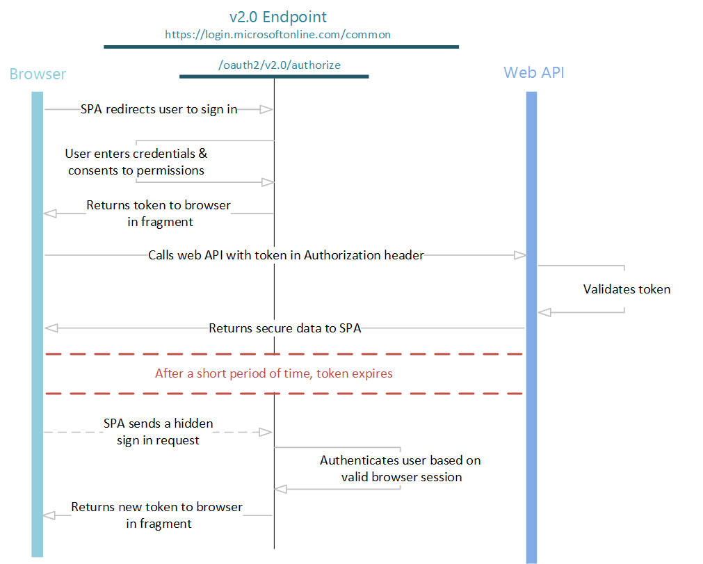

# Single-page application sign-in using the OAuth 2.0 implicit flow in Azure Active Directory B2C

Many modern applications have a single-page app (SPA) front end that is written primarily in JavaScript. Often, the app is written by using a framework like React, Angular, or Vue.js. SPAs and other JavaScript apps that run primarily in a browser have some additional challenges for authentication:

- The security characteristics of these apps are different from traditional server-based web applications.

- Many authorization servers and identity providers don't support cross-origin resource sharing (CORS) requests.

- Full-page browser redirects away from the app can be invasive to the user experience.

The recommended way of supporting SPAs is [OAuth 2.0 Authorization code flow (with PKCE)](./authorization-code-flow.md).

Some frameworks, like [MSAL.js 1.x](https://github.com/AzureAD/microsoft-authentication-library-for-js/tree/dev/lib), only support the implicit grant flow. In these cases, Azure Active Directory B2C (Azure AD B2C) supports the OAuth 2.0 authorization implicit grant flow. The flow is described in [section 4.2 of the OAuth 2.0 specification](https://tools.ietf.org/html/rfc6749). In implicit flow, the app receives tokens directly from the Azure AD B2C authorize endpoint, without any server-to-server exchange. All authentication logic and session handling are done entirely in the JavaScript client with either a page redirect or a pop-up box.

Azure AD B2C extends the standard OAuth 2.0 implicit flow to more than simple authentication and authorization. Azure AD B2C introduces the [policy parameter](user-flow-overview.md). With the policy parameter, you can use OAuth 2.0 to add policies to your app, such as sign-up, sign-in, and profile management user flows. In the example HTTP requests in this article, we use **{tenant}.onmicrosoft.com** for illustration. Replace `{tenant}` with [the name of your tenant]( tenant-management-read-tenant-name.md#get-your-tenant-name) if you've one. Also, you need to have [created a user flow](tutorial-create-user-flows.md?pivots=b2c-user-flow).

We use the following figure to illustrate implicit sign-in flow. Each step is described in detail later in the article.



## Send authentication requests

When your web application needs to authenticate the user and run a user flow, it directs the user to the Azure AD B2C's `/authorize` endpoint. The user takes action depending on the user flow.

In this request, the client indicates the permissions that it needs to acquire from the user in the `scope` parameter and the user flow to run. To get a feel for how the request works, try pasting the request into a browser and running it. Replace:

- `{tenant}` with the name of your Azure AD B2C tenant.

- `90c0fe63-bcf2-44d5-8fb7-b8bbc0b29dc6` with the app ID of the application you've registered in your tenant. 

- `{policy}` with the name of a policy you've created in your tenant, for example `b2c_1_sign_in`.

```http
GET https://{tenant}.b2clogin.com/{tenant}.onmicrosoft.com/{policy}/oauth2/v2.0/authorize?
client_id=90c0fe63-bcf2-44d5-8fb7-b8bbc0b29dc6
&response_type=id_token+token
&redirect_uri=https%3A%2F%2Faadb2cplayground.azurewebsites.net%2F
&response_mode=fragment
&scope=openid%20offline_access
&state=arbitrary_data_you_can_receive_in_the_response
&nonce=12345
```
The parameters in the HTTP GET request are explained in the table below.

| Parameter | Required | Description |
| --------- | -------- | ----------- |
|{tenant}| Yes | Name of your Azure AD B2C tenant|
|{policy}| Yes| The name of user flow you want to run. Specify the name of a user flow you've created in your Azure AD B2C tenant. For example: `b2c_1_sign_in`, `b2c_1_sign_up`, or `b2c_1_edit_profile`. |
| client_id | Yes | The application ID that the [Azure portal](https://portal.azure.com/) assigned to your application. |
| response_type | Yes | Must include `id_token` for OpenID Connect sign in. It can also include the response type `token`. If you use `token`, your app can immediately receive an access token from the authorize endpoint, without making a second request to the authorize endpoint.  If you use the `token` response type, the `scope` parameter must contain a scope that indicates which resource to issue the token for. |
| redirect_uri | No | The redirect URI of your app, where authentication responses can be sent and received by your app. It must exactly match one of the redirect URIs that you added to a registered application in the portal, except that it must be URL-encoded. |
| response_mode | No | Specifies the method to use to send the resulting token back to your app.  For implicit flows, use `fragment`. |
| scope | Yes | A space-separated list of scopes. A single scope value indicates to Microsoft Entra ID both of the permissions that are being requested. The `openid` scope indicates a permission to sign in the user and get data about the user in the form of ID tokens. The `offline_access` scope is optional for web apps. It indicates that your app needs a refresh token for long-lived access to resources. |
| state | No | A value included in the request that also is returned in the token response. It can be a string of any content that you want to use. Usually, a randomly generated, unique value is used, to prevent cross-site request forgery attacks. The state is also used to encode information about the user's state in the app before the authentication request occurred, for example, the page the user was on, or the user flow that was being executed. |
| nonce | Yes | A value included in the request (generated by the app) that is included in the resulting ID token as a claim. The app can then verify this value to mitigate token replay attacks. Usually, the value is a randomized, unique string that can be used to identify the origin of the request. |
| prompt | No | The type of user interaction that's required. Currently, the only valid value is `login`. This parameter forces the user to enter their credentials on that request. Single Sign-On doesn't take effect. |

This is the interactive part of the flow. The user is asked to complete the policy's workflow. The user might have to enter their username and password, sign in with a social identity, sign up for a local account, or any other number of steps. User actions depend on how the user flow is defined.

After the user completes the user flow, Azure AD B2C returns a response to your app via the `redirect_uri`. It uses the method specified in the `response_mode` parameter. The response is exactly the same for each of the user action scenarios, independent of the user flow that was executed.

### Successful response
A successful response that uses `response_mode=fragment` and `response_type=id_token+token` looks like the following, with line breaks for legibility:

```http
GET https://aadb2cplayground.azurewebsites.net/#
access_token=eyJ0eXAiOiJKV1QiLCJhbGciOiJSUzI1NiIsIng1dCI6Ik5HVEZ2ZEstZnl0aEV1Q...
&token_type=Bearer
&expires_in=3599
&scope="90c0fe63-bcf2-44d5-8fb7-b8bbc0b29dc6 offline_access",
&id_token=eyJ0eXAiOiJKV1QiLCJhbGciOiJSUzI1NiIsIng1dCI6Ik5HVEZ2ZEstZnl0aEV1Q...
&state=arbitrary_data_you_sent_earlier
```

| Parameter | Description |
| --------- | ----------- |
| access_token | The access token that the app requested from Azure AD B2C.|
| token_type | The token type value. The only type that Azure AD B2C supports is Bearer. |
| expires_in | The length of time that the access token is valid (in seconds). |
| scope | The scopes that the token is valid for. You also can use scopes to cache tokens for later use. |
| id_token | The ID token that the app requested. You can use the ID token to verify the user's identity and begin a session with the user. For more information about ID tokens and their contents, see the [Azure AD B2C token reference](tokens-overview.md). |
| state | If a `state` parameter is included in the request, the same value should appear in the response. The app should verify that the `state` values in the request and response are identical. |

### Error response
Error responses also can be sent to the redirect URI so that the app can handle them appropriately:

```http
GET https://aadb2cplayground.azurewebsites.net/#
error=access_denied
&error_description=the+user+canceled+the+authentication
&state=arbitrary_data_you_can_receive_in_the_response
```

| Parameter | Description |
| --------- | ----------- |
| error | A code used to classify types of errors that occur. |
| error_description | A specific error message that can help you identify the root cause of an authentication error. |
| state | If a `state` parameter is included in the request, the same value should appear in the response. The app should verify that the `state` values in the request and response are identical.|

## Validate the ID token

Receiving an ID token is not enough to authenticate the user. Validate the ID token's signature, and verify the claims in the token per your app's requirements. Azure AD B2C uses [JSON Web Tokens (JWTs)](https://self-issued.info/docs/draft-ietf-oauth-json-web-token.html) and public key cryptography to sign tokens and verify that they're valid.

Many open-source libraries are available for validating JWTs, depending on the language you prefer to use. Consider exploring available open-source libraries rather than implementing your own validation logic. You can use the information in this article to help you learn how to properly use those libraries.

Azure AD B2C has an OpenID Connect metadata endpoint. An app can use the endpoint to fetch information about Azure AD B2C at runtime. This information includes endpoints, token contents, and token signing keys. There is a JSON metadata document for each user flow in your Azure AD B2C tenant. For example, the metadata document for a user flow named `b2c_1_sign_in` in a `fabrikamb2c.onmicrosoft.com` tenant is located at:

```http
https://fabrikamb2c.b2clogin.com/fabrikamb2c.onmicrosoft.com/b2c_1_sign_in/v2.0/.well-known/openid-configuration
```

One of the properties of this configuration document is the `jwks_uri`. The value for the same user flow would be:

```http
https://fabrikamb2c.b2clogin.com/fabrikamb2c.onmicrosoft.com/b2c_1_sign_in/discovery/v2.0/keys
```

To determine which user flow was used to sign an ID token (and where to fetch the metadata from), you can use any of following options:

-  The user flow name is included in the `acr` claim in `id_token`. For information about how to parse the claims from an ID token, see the [Azure AD B2C token reference](tokens-overview.md). 

- Encode the user flow in the value of the `state` parameter when you issue the request. Then, decode the `state` parameter to determine which user flow was used.

After you've acquired the metadata document from the OpenID Connect metadata endpoint, you can use the RSA-256 public keys (located at this endpoint) to validate the signature of the ID token. There might be multiple keys listed at this endpoint at any given time, each identified by a `kid`. The header of `id_token` also contains a `kid` claim. It indicates which of these keys was used to sign the ID token. For more information, including learning about [validating tokens](tokens-overview.md), see the [Azure AD B2C token reference](tokens-overview.md).
<!--TODO: Improve the information on this-->

After you validate the signature of the ID token, several claims require verification. For example:

* Validate the `nonce` claim to prevent token replay attacks. Its value should be what you specified in the sign-in request.

* Validate the `aud` claim to ensure that the ID token was issued for your app. Its value should be the application ID of your app.

* Validate the `iat` and `exp` claims to ensure that the ID token has not expired.

Several more validations that you should perform are described in detail in the [OpenID Connect Core Spec](https://openid.net/specs/openid-connect-core-1_0.html). You might also want to validate additional claims, depending on your scenario. Some common validations include:

* Ensuring that the user or organization has signed up for the app.

* Ensuring that the user has proper authorization and privileges.

* Ensuring that a certain strength of authentication has occurred, such as by using Microsoft Entra multifactor authentication.

For more information about the claims in an ID token, see the [Azure AD B2C token reference](tokens-overview.md).

After you've validated the ID token, you can begin a session with the user. In your app, use the claims in the ID token to obtain information about the user. This information can be used for display, records, authorization, and so on.

## Get access tokens

If the only thing your web apps needs to do is execute user flows, you can skip the next few sections. The information in the following sections is applicable only to web apps that need to make authenticated calls to a web API that is protected by Azure AD B2C itself.

Now that you've signed the user into your SPA, you can get access tokens for calling web APIs that are secured by Microsoft Entra ID. Even if you've already received a token by using the `token` response type, you can use this method to acquire tokens for additional resources without redirecting the user to sign in again.

In a typical web app flow, you would make a request to the `/token` endpoint. However, the endpoint doesn't support CORS requests, so making AJAX calls to get a refresh token isn't an option. Instead, you can use the implicit flow in a hidden HTML iframe element to get new tokens for other web APIs. Here's an example, with line breaks for legibility:

```http
https://{tenant}.b2clogin.com/{tenant}.onmicrosoft.com/{policy}/oauth2/v2.0/authorize?
client_id=90c0fe63-bcf2-44d5-8fb7-b8bbc0b29dc6
&response_type=token
&redirect_uri=https%3A%2F%2Faadb2cplayground.azurewebsites.net%2F
&scope=https%3A%2F%2Fapi.contoso.com%2Ftasks.read
&response_mode=fragment
&state=arbitrary_data_you_can_receive_in_the_response
&nonce=12345
&prompt=none
```

| Parameter | Required? | Description |
| --- | --- | --- |
|{tenant}| Required | Name of your Azure AD B2C tenant|
{policy}| Required| The user flow to be run. Specify the name of a user flow you've created in your Azure AD B2C tenant. For example: `b2c_1_sign_in`, `b2c_1_sign_up`, or `b2c_1_edit_profile`. |
| client_id |Required |The application ID assigned to your app in the [Azure portal](https://portal.azure.com). |
| response_type |Required |Must include `id_token` for OpenID Connect sign-in.  It might also include the response type `token`. If you use `token` here, your app can immediately receive an access token from the authorize endpoint, without making a second request to the authorize endpoint. If you use the `token` response type, the `scope` parameter must contain a scope that indicates which resource to issue the token for. |
| redirect_uri |Recommended |The redirect URI of your app, where authentication responses can be sent and received by your app. It must exactly match one of the redirect URIs you registered in the portal, except that it must be URL-encoded. |
| scope |Required |A space-separated list of scopes.  For getting tokens, include all scopes that you require for the intended resource. |
| response_mode |Recommended |Specifies the method that is used to send the resulting token back to your app. For implicit flow, use `fragment`. Two other modes can be specified, `query` and `form_post`,  but don't work in the implicit flow. |
| state |Recommended |A value included in the request that is returned in the token response.  It can be a string of any content that you want to use.  Usually, a randomly generated, unique value is used, to prevent cross-site request forgery attacks.  The state also is used to encode information about the user's state in the app before the authentication request occurred. For example, the page or view the user was on. |
| nonce |Required |A value included in the request, generated by the app that's included in the resulting ID token as a claim.  The app can then verify this value to mitigate token replay attacks. Usually, the value is a randomized, unique string that identifies the origin of the request. |
| prompt |Required |To refresh and get tokens in a hidden iframe, use `prompt=none` to ensure that the iframe doesn't get stuck on the sign-in page, and returns immediately. |
| login_hint |Required |To refresh and get tokens in a hidden iframe, include the username of the user in this hint to distinguish between multiple sessions the user might have at a given  time. You can extract the username from an earlier sign-in by using the `preferred_username` claim (the `profile` scope is required in order to receive the `preferred_username` claim). |
| domain_hint |Required |Can be `consumers` or `organizations`.  For refreshing and getting tokens in a hidden iframe, include the `domain_hint` value in the request.  Extract the `tid` claim from the ID token of an earlier sign-in to determine which value to use (the `profile` scope is required in order to receive the `tid` claim). If the `tid` claim value is `9188040d-6c67-4c5b-b112-36a304b66dad`,  use `domain_hint=consumers`.  Otherwise, use `domain_hint=organizations`. |

By setting the `prompt=none` parameter, this request either succeeds or fails immediately, and returns to your application.  A successful response is sent to your app via the redirect URI, by using the method specified in the `response_mode` parameter.

### Successful response
A successful response by using `response_mode=fragment` looks like this example:

```http
GET https://aadb2cplayground.azurewebsites.net/#
access_token=eyJ0eXAiOiJKV1QiLCJhbGciOiJSUzI1NiIsIng1dCI6Ik5HVEZ2ZEstZnl0aEV1Q...
&state=arbitrary_data_you_sent_earlier
&token_type=Bearer
&expires_in=3599
&scope=https%3A%2F%2Fapi.contoso.com%2Ftasks.read
```

| Parameter | Description |
| --- | --- |
| access_token |The token that the app requested. |
| token_type |The token type will always be Bearer. |
| state |If a `state` parameter is included in the request, the same value should appear in the response. The app should verify that the `state` values in the request and response are identical. |
| expires_in |How long the access token is valid (in seconds). |
| scope |The scopes that the access token is valid for. |

### Error response
Error responses also can be sent to the redirect URI so that the app can handle them appropriately.  For `prompt=none`, an expected error looks like this example:

```http
GET https://aadb2cplayground.azurewebsites.net/#
error=user_authentication_required
&error_description=the+request+could+not+be+completed+silently
```

| Parameter | Description |
| --- | --- |
| error |An error code string that can be used to classify types of errors that occur. You also can use the string to react to errors. |
| error_description |A specific error message that can help you identify the root cause of an authentication error. |

If you receive this error in the iframe request, the user must interactively sign in again to retrieve a new token.

## Refresh tokens
ID tokens and access tokens both expire after a short period of time. Your app must be prepared to refresh these tokens periodically. Implicit flows don't allow you to obtain a refresh token due to security reasons. To refresh either type of token, use the implicit flow in a hidden HTML iframe element. In the authorization request include the  `prompt=none` parameter. To receive a new id_token value, be sure to use `response_type=id_token` and `scope=openid`, and a `nonce` parameter.

## Send a sign-out request

When you want to sign the user out of the app, redirect the user to Azure AD B2C's sign-out endpoint. You can then clear the user's session in the app. If you don't redirect the user, they might be able to reauthenticate to your app without entering their credentials again because they have a valid Single Sign-On session with Azure AD B2C.

You can simply redirect the user to the `end_session_endpoint` that is listed in the same OpenID Connect metadata document described in [Validate the ID token](#validate-the-id-token). For example:

```http
GET https://{tenant}.b2clogin.com/{tenant}.onmicrosoft.com/{policy}/oauth2/v2.0/logout?post_logout_redirect_uri=https%3A%2F%2Faadb2cplayground.azurewebsites.net%2F
```

| Parameter | Required | Description |
| --------- | -------- | ----------- |
| {tenant} | Yes | Name of your Azure AD B2C tenant. |
| {policy} | Yes | The user flow that you want to use to sign the user out of your application. This needs to be the same user flow that the app used to sign the user in. |
| post_logout_redirect_uri | No | The URL that the user should be redirected to after successful sign out. If it isn't included, Azure AD B2C shows the user a generic message. |
| state | No | If a `state` parameter is included in the request, the same value should appear in the response. The application should verify that the `state` values in the request and response are identical. |


> [!NOTE]
> Directing the user to the `end_session_endpoint` clears some of the user's Single Sign-On state with Azure AD B2C. However, it doesn't sign the user out of the user's social identity provider session. If the user selects the same identity provider during a subsequent sign in, the user is re-authenticated, without entering their credentials. If a user wants to sign out of your Azure AD B2C application, it doesn't necessarily mean they want to completely sign out of their Facebook account, for example. However, for local accounts, the user's session will be ended properly.


## Next steps

See the code sample: [Sign-in with Azure AD B2C in a JavaScript SPA](https://github.com/AzureAD/microsoft-authentication-library-for-js/tree/dev/samples/msal-browser-samples/VanillaJSTestApp2.0/app/b2c).
