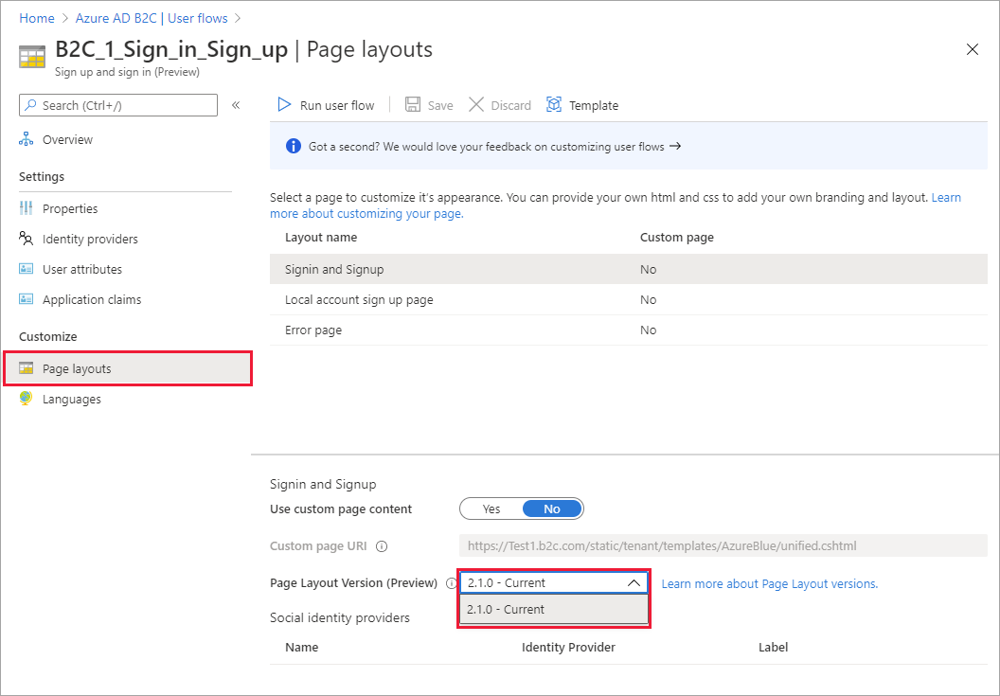
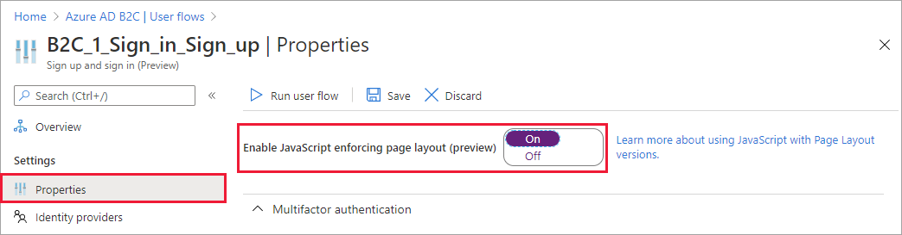

# Enable JavaScript and page layout versions in Azure Active Directory B2C

[!INCLUDE [active-directory-b2c-choose-user-flow-or-custom-policy](../../includes/active-directory-b2c-choose-user-flow-or-custom-policy.md)]

With Azure Active Directory B2C (Azure AD B2C) [HTML templates](customize-ui-with-html.md), you can craft your users' identity experiences. Your HTML templates can contain only certain HTML tags and attributes. Basic HTML tags, such as &lt;b&gt;, &lt;i&gt;, &lt;u&gt;, &lt;h1&gt;, and &lt;hr&gt; are allowed. More advanced tags such as &lt;script&gt;, and &lt;iframe&gt; are removed for security reasons but the `<script>` tag should be added in the `<head>` tag.

The `<script>` tag should be added in the `<head>` tag in two ways:  

1. Adding the `defer` attribute, which specifies that the script is downloaded in parallel to parsing the page, then the script is executed after the page has finished parsing:

	 ```javascript
	<script src="my-script.js" defer></script>
	```


2. Adding `async` attribute that specifies that the script is downloaded in parallel to parsing the page, then the script is executed as soon as it is available (before parsing completes):

	 ```javascript
	<script src="my-script.js" async></script>	
	```

To enable JavaScript and advance HTML tags and attributes:

::: zone pivot="b2c-user-flow"

* Select a [page layout](page-layout.md)
* Enable it on the user flow by using the Azure portal
* Use [b2clogin.com](b2clogin.md) in your requests

::: zone-end

::: zone pivot="b2c-custom-policy"

* Select a [page layout](page-layout.md)
* Add an element to your [custom policy](custom-policy-overview.md)
* Use [b2clogin.com](b2clogin.md) in your requests

::: zone-end

## Prerequisites

[!INCLUDE [active-directory-b2c-customization-prerequisites](../../includes/active-directory-b2c-customization-prerequisites.md)]


## Begin setting up a page layout version

If you intend to enable JavaScript client-side code, the elements you base your JavaScript on must be immutable. If they're not immutable, any changes could cause unexpected behavior on your user pages. To prevent these issues, enforce the use of a page layout and specify a page layout version to ensure the content definitions you’ve based your JavaScript on are immutable. Even if you don’t intend to enable JavaScript, you can specify a page layout version for your pages.

::: zone pivot="b2c-user-flow"

To specify a page layout version for your user flow pages: 

1. In your Azure AD B2C tenant, select **User flows**.
1. Select your policy (for example, "B2C_1_SignupSignin") to open it.
1. Select **Page layouts**. Choose a **Layout name**, and then choose the **Page Layout Version**.

For information about the different page layout versions, see the [Page layout version change log](page-layout.md).



::: zone-end

::: zone pivot="b2c-custom-policy"

To specify a page layout version for your custom policy pages:

1. Select a [page layout](contentdefinitions.md#select-a-page-layout) for the user interface elements of your application.
1. Define a [page layout version](contentdefinitions.md#migrating-to-page-layout) with page `contract` version for *all* of the content definitions in your custom policy. The format of the value must contain the word `contract`: *urn:com:microsoft:aad:b2c:elements:**contract**:page-name:version*.

The following example shows the content definition identifiers and the corresponding **DataUri** with page contract: 

```xml
<ContentDefinitions>
  <ContentDefinition Id="api.error">
    <DataUri>urn:com:microsoft:aad:b2c:elements:contract:globalexception:1.2.0</DataUri>
  </ContentDefinition>
  <ContentDefinition Id="api.idpselections">
    <DataUri>urn:com:microsoft:aad:b2c:elements:contract:providerselection:1.2.0</DataUri>
  </ContentDefinition>
  <ContentDefinition Id="api.idpselections.signup">
    <DataUri>urn:com:microsoft:aad:b2c:elements:contract:providerselection:1.2.0</DataUri>
  </ContentDefinition>
  <ContentDefinition Id="api.signuporsignin">
    <DataUri>urn:com:microsoft:aad:b2c:elements:contract:unifiedssp:1.2.0</DataUri>
  </ContentDefinition>
  <ContentDefinition Id="api.selfasserted">
    <DataUri>urn:com:microsoft:aad:b2c:elements:contract:selfasserted:1.2.0</DataUri>
  </ContentDefinition>
  <ContentDefinition Id="api.selfasserted.profileupdate">
    <DataUri>urn:com:microsoft:aad:b2c:elements:contract:selfasserted:1.2.0</DataUri>
  </ContentDefinition>
  <ContentDefinition Id="api.localaccountsignup">
    <DataUri>urn:com:microsoft:aad:b2c:elements:contract:selfasserted:1.2.0</DataUri>
  </ContentDefinition>
  <ContentDefinition Id="api.localaccountpasswordreset">
    <DataUri>urn:com:microsoft:aad:b2c:elements:contract:selfasserted:1.2.0</DataUri>
  </ContentDefinition>
  <ContentDefinition Id="api.phonefactor">
    <DataUri>urn:com:microsoft:aad:b2c:elements:contract:multifactor:1.2.0</DataUri>
  </ContentDefinition>
</ContentDefinitions>
```
::: zone-end

## Enable JavaScript

::: zone pivot="b2c-user-flow"

In the user flow **Properties**, you can enable JavaScript. Enabling JavaScript also enforces the use of a page layout. You can then set the page layout version for the user flow as described in the next section.



::: zone-end

::: zone pivot="b2c-custom-policy"

You enable script execution by adding the **ScriptExecution** element to the [RelyingParty](relyingparty.md) element.

1. Open your custom policy file. For example, *SignUpOrSignin.xml*.
1. Add the **ScriptExecution** element to the **RelyingParty** element:

    ```xml
    <RelyingParty>
      <DefaultUserJourney ReferenceId="SignUpOrSignIn" />
      <UserJourneyBehaviors>
        <ScriptExecution>Allow</ScriptExecution>
      </UserJourneyBehaviors>
      ...
    </RelyingParty>
    ```
1. Save and upload the file.

::: zone-end

## Guidelines for using JavaScript

Follow these guidelines when you customize the interface of your application using JavaScript:

- Don't:
    - bind a click event on `<a>` HTML elements.
    - take a dependency on Azure AD B2C code or comments.
    - change the order or hierarchy of Azure AD B2C HTML elements. Use an Azure AD B2C policy to control the order of the UI elements.
- You can call any RESTful service with these considerations:
    - You may need to set your RESTful service CORS to allow client-side HTTP calls.
    - Make sure your RESTful service is secure and uses only the HTTPS protocol.
    - Don't use JavaScript directly to call Azure AD B2C endpoints.
- You can embed your JavaScript or you can link to external JavaScript files. When using an external JavaScript file, make sure to use the absolute URL and not a relative URL.
- JavaScript frameworks:
    - Azure AD B2C uses a [specific version of jQuery](page-layout.md#jquery-and-handlebars-versions). Don’t include another version of jQuery. Using more than one version on the same page causes issues.
    - Using RequireJS isn't supported.
    - Most JavaScript frameworks are not supported by Azure AD B2C.
- Azure AD B2C settings can be read by calling `window.SETTINGS`, `window.CONTENT` objects, such as the current UI language. Don’t change the value of these objects.
- To customize the Azure AD B2C error message, use localization in a policy.
- If anything can be achieved by using a policy, generally it's the recommended way.
- We recommend that you use our existing UI controls, such as buttons, rather than hiding them and implementing click bindings on your own UI controls. This approach ensures that your user experience continues to function properly even when we release new page contract upgrades.

## JavaScript samples

### Show or hide a password

A common way to help your customers with their sign-up success is to allow them to see what they’ve entered as their password. This option helps users sign up by enabling them to easily see and make corrections to their password if needed. Any field of type password has a checkbox with a **Show password** label.  This enables the user to see the password in plain text. Include this code snippet into your sign-up or sign-in template for a self-asserted page:

```javascript
function makePwdToggler(pwd){
  // Create show-password checkbox
  var checkbox = document.createElement('input');
  checkbox.setAttribute('type', 'checkbox');
  var id = pwd.id + 'toggler';
  checkbox.setAttribute('id', id);

  var label = document.createElement('label');
  label.setAttribute('for', id);
  label.appendChild(document.createTextNode('show password'));

  var div = document.createElement('div');
  div.appendChild(checkbox);
  div.appendChild(label);

  // Add show-password checkbox under password input
  pwd.insertAdjacentElement('afterend', div);

  // Add toggle password callback
  function toggle(){
    if(pwd.type === 'password'){
      pwd.type = 'text';
    } else {
      pwd.type = 'password';
    }
  }
  checkbox.onclick = toggle;
  // For non-mouse usage
  checkbox.onkeydown = toggle;
}

function setupPwdTogglers(){
  var pwdInputs = document.querySelectorAll('input[type=password]');
  for (var i = 0; i < pwdInputs.length; i++) {
    makePwdToggler(pwdInputs[i]);
  }
}

setupPwdTogglers();
```

### Add terms of use

Include the following code into your page where you want to include a **Terms of Use** checkbox. This checkbox is typically needed in your local account sign-up and social account sign-up pages.

```javascript
function addTermsOfUseLink() {
    // find the terms of use label element
    var termsOfUseLabel = document.querySelector('#api label[for="termsOfUse"]');
    if (!termsOfUseLabel) {
        return;
    }

    // get the label text
    var termsLabelText = termsOfUseLabel.innerHTML;

    // create a new <a> element with the same inner text
    var termsOfUseUrl = 'https://learn.microsoft.com/legal/termsofuse';
    var termsOfUseLink = document.createElement('a');
    termsOfUseLink.setAttribute('href', termsOfUseUrl);
    termsOfUseLink.setAttribute('target', '_blank');
    termsOfUseLink.appendChild(document.createTextNode(termsLabelText));

    // replace the label text with the new element
    termsOfUseLabel.replaceChild(termsOfUseLink, termsOfUseLabel.firstChild);
}
```

In the code, replace `termsOfUseUrl` with the link to your terms of use agreement. For your directory, create a new user attribute called **termsOfUse** and then include **termsOfUse** as a user attribute.

Alternatively, you can add a link at the bottom of self-asserted pages, without using of JavaScript. Use the following localization:

```xml
<LocalizedResources Id="api.localaccountsignup.en">
  <LocalizedStrings>
    <!-- The following elements will display a link at the bottom of the page. -->
    <LocalizedString ElementType="UxElement" StringId="disclaimer_link_1_text">Terms of use</LocalizedString>
    <LocalizedString ElementType="UxElement" StringId="disclaimer_link_1_url">termsOfUseUrl</LocalizedString>
    </LocalizedStrings>
</LocalizedResources>
```

Replace `termsOfUseUrl` with the link to your organization's privacy policy and terms of use. 


## Next steps

Find more information about how to [Customize the user interface of your application in Azure Active Directory B2C](customize-ui-with-html.md).
