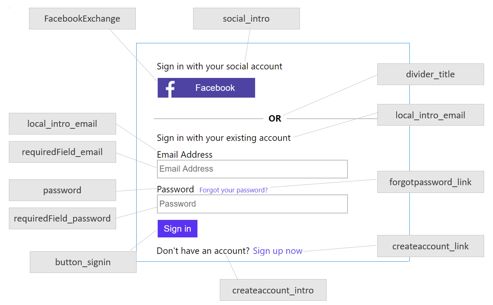
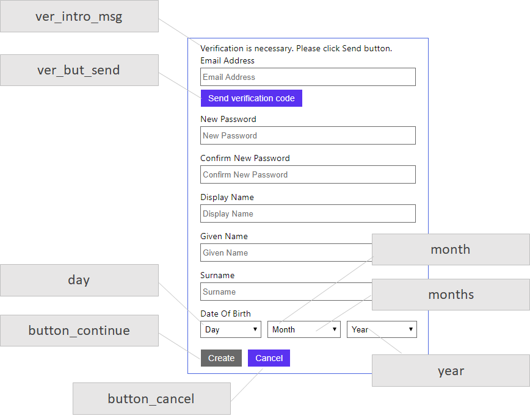
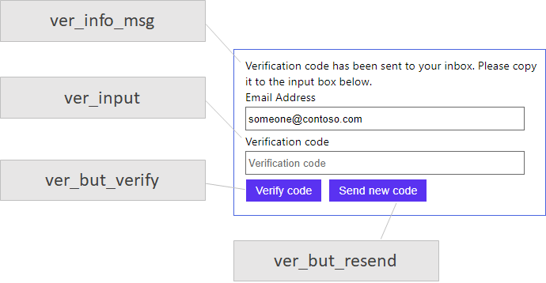
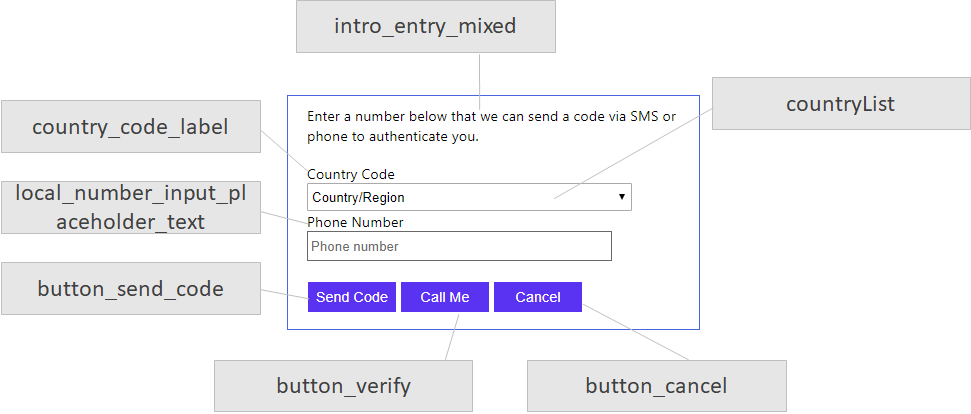
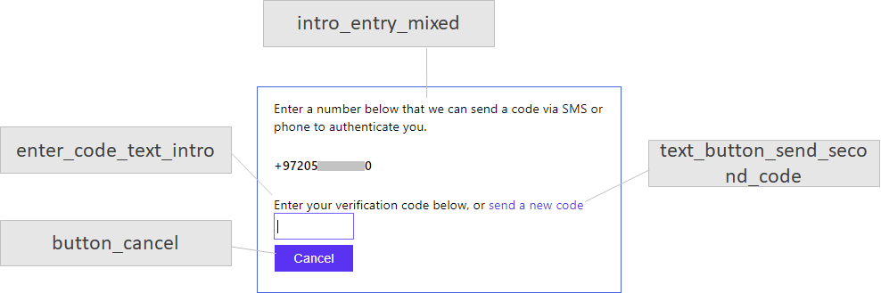

# Localization string IDs

[!INCLUDE [active-directory-b2c-advanced-audience-warning](../../includes/active-directory-b2c-advanced-audience-warning.md)]

The **Localization** element enables you to support multiple locales or languages in the policy for the user journeys. This article provides the list of localization IDs that you can use in your policy. To get familiar with UI localization, see [Localization](localization.md).

## Sign-up or sign-in page elements

The following IDs are used for a content definition with an ID of `api.signuporsignin`.

| ID | Default value |
| -- | ------------- |
| **local_intro_email** | Sign in with your existing account |
| **logonIdentifier_email** | Email Address |
| **requiredField_email** | Please enter your email |
| **invalid_email** | Please enter a valid email address |
| **email_pattern** | ^[a-zA-Z0-9.!#$%&''*+/=?^_\`{\|}~-]+@[a-zA-Z0-9-]+(?:\\.[a-zA-Z0-9-]+)*$ |
| **local_intro_username** | Sign in with your user name |
| **logonIdentifier_username** | Username |
| **requiredField_username** | Please enter your user name |
| **password** | Password |
| **requiredField_password** | Please enter your password |
| **invalid_password** | The password you entered is not in the expected format. |
| **forgotpassword_link** | Forgot your password? |
| **createaccount_intro** | Don't have an account? |
| **createaccount_link** | Sign up now |
| **divider_title** | OR |
| **cancel_message** | The user has forgotten their password |
| **button_signin** | Sign in |
| **social_intro** | Sign in with your social account |
  **remember_me** |Keep me signed in|
| **unknown_error** | We are having trouble signing you in. Please try again later. |

The following example shows the use of some of the user interface elements in the sign-up or sign-in page:



The ID of the identity providers is configured in the user journey  **ClaimsExchange** element. To localize the title of the identity provider, the **ElementType** is set to `ClaimsProvider`, while the **StringId** is set to the ID of the `ClaimsExchange`.

```XML
<OrchestrationStep Order="2" Type="ClaimsExchange">
  <Preconditions>
    <Precondition Type="ClaimsExist" ExecuteActionsIf="true">
      <Value>objectId</Value>
      <Action>SkipThisOrchestrationStep</Action>
    </Precondition>
  </Preconditions>
  <ClaimsExchanges>
    <ClaimsExchange Id="FacebookExchange" TechnicalProfileReferenceId="Facebook-OAUTH" />
    <ClaimsExchange Id="MicrosoftExchange" TechnicalProfileReferenceId="MSA-OIDC" />
    <ClaimsExchange Id="GoogleExchange" TechnicalProfileReferenceId="Google-OAUTH" />
    <ClaimsExchange Id="SignUpWithLogonEmailExchange" TechnicalProfileReferenceId="LocalAccount" />
  </ClaimsExchanges>
</OrchestrationStep>
```

The following example localizes the Facebook identity provider to Arabic:

```XML
<LocalizedString ElementType="ClaimsProvider" StringId="FacebookExchange">فيس بوك</LocalizedString>
```

### Sign-up or sign-in error messages

| ID | Default value |
| -- | ------------- |
| **UserMessageIfInvalidPassword** | Your password is incorrect. |
| **UserMessageIfClaimsPrincipalDoesNotExist** | We can't seem to find your account. |
| **UserMessageIfOldPasswordUsed** | Looks like you used an old password. |
| **DefaultMessage** | Invalid username or password. |
| **UserMessageIfUserAccountDisabled** | Your account has been locked. Contact your support person to unlock it, then try again. |
| **UserMessageIfUserAccountLocked** | Your account is temporarily locked to prevent unauthorized use. Try again later. |
| **AADRequestsThrottled** | There are too many requests at this moment. Please wait for some time and try again. |

## Sign-up and self-asserted pages user interface elements

The following are the IDs for a content definition with an ID of `api.localaccountsignup` or any content definition that starts with `api.selfasserted`, such as `api.selfasserted.profileupdate` and `api.localaccountpasswordreset`.

| ID | Default value |
| -- | ------------- |
| **ver_sent** | Verification code has been sent to: |
| **ver_but_default** | Default |
| **cancel_message** | The user has canceled entering self-asserted information |
| **preloader_alt** | Please wait |
| **ver_but_send** | Send verification code |
| **alert_yes** | Yes |
| **error_fieldIncorrect** | One or more fields are filled out incorrectly. Please check your entries and try again. |
| **year** | Year |
| **verifying_blurb** | Please wait while we process your information. |
| **button_cancel** | Cancel |
| **ver_fail_no_retry** | You've made too many incorrect attempts. Please try again later. |
| **month** | Month |
| **ver_success_msg** | E-mail address verified. You can now continue. |
| **months** | January, February, March, April, May, June, July, August, September, October, November, December |
| **ver_fail_server** | We are having trouble verifying your email address. Please enter a valid email address and try again. |
| **error_requiredFieldMissing** | A required field is missing. Please fill out all required fields and try again. |
| **initial_intro** | Please provide the following details. |
| **ver_but_resend** | Send new code |
| **button_continue** | Create |
| **error_passwordEntryMismatch** | The password entry fields do not match. Please enter the same password in both fields and try again. |
| **ver_incorrect_format** | Incorrect format. |
| **ver_but_edit** | Change e-mail |
| **ver_but_verify** | Verify code |
| **alert_no** | No |
| **ver_info_msg** | Verification code has been sent to your inbox. Please copy it to the input box below. |
| **day** | Day |
| **ver_fail_throttled** | There have been too many requests to verify this email address. Please wait a while, then try again. |
| **helplink_text** | What is this? |
| **ver_fail_retry** | That code is incorrect. Please try again. |
| **alert_title** | Cancel Entering Your Details |
| **required_field** | This information is required. |
| **alert_message** | Are you sure that you want to cancel entering your details? |
| **ver_intro_msg** | Verification is necessary. Please click Send button. |
| **ver_input** | Verification code |

### Sign-up and self-asserted pages error messages

| ID | Default value |
| -- | ------------- |
| **UserMessageIfClaimsPrincipalAlreadyExists** | A user with the specified ID already exists. Please choose a different one. |
| **UserMessageIfClaimNotVerified** | Claim not verified: {0} |
| **UserMessageIfIncorrectPattern** | Incorrect pattern for: {0} |
| **UserMessageIfMissingRequiredElement** | Missing required element: {0} |
| **UserMessageIfValidationError** | Error in validation by: {0} |
| **UserMessageIfInvalidInput** | {0} has invalid input. |
| **ServiceThrottled** | There are too many requests at this moment. Please wait for some time and try again. |

The following example shows the use of some of the user interface elements in the sign-up page:



The following example shows the use of some of the user interface elements in the sign-up page, after user clicks on send verification code button:




## Phone factor authentication page user interface elements

The Following are the IDs for a content definition with an ID of `api.phonefactor`.

| ID | Default value |
| -- | ------------- |
| **button_verify** | Call Me |
| **country_code_label** | Country Code |
| **cancel_message** | The user has canceled multi-factor authentication |
| **text_button_send_second_code** | send a new code |
| **code_pattern** | \\d{6} |
| **intro_mixed** | We have the following number on record for you. We can send a code via SMS or phone to authenticate you. |
| **intro_mixed_p** | We have the following numbers on record for you. Choose a number that we can phone or send a code via SMS to authenticate you. |
| **button_verify_code** | Verify Code |
| **requiredField_code** | Please enter the verification code you received |
| **invalid_code** | Please enter the 6-digit code you received |
| **button_cancel** | Cancel |
| **local_number_input_placeholder_text** | Phone number |
| **button_retry** | Retry |
| **alternative_text** | I don't have my phone |
| **intro_phone_p** | We have the following numbers on record for you. Choose a number that we can phone to authenticate you. |
| **intro_phone** | We have the following number on record for you. We will phone to authenticate you. |
| **enter_code_text_intro** | Enter your verification code below, or  |
| **intro_entry_phone** | Enter a number below that we can phone to authenticate you. |
| **intro_entry_sms** | Enter a number below that we can send a code via SMS to authenticate you. |
| **button_send_code** | Send Code |
| **invalid_number** | Please enter a valid phone number |
| **intro_sms** | We have the following number on record for you. We will send a code via SMS to authenticate you. |
| **intro_entry_mixed** | Enter a number below that we can send a code via SMS or phone to authenticate you. |
| **number_pattern** | ^\\+(?:[0-9][\\x20-]?){6,14}[0-9]$ |
| **intro_sms_p** |We have the following numbers on record for you. Choose a number that we can send a code via SMS to authenticate you. |
| **requiredField_countryCode** | Please select your country code |
| **requiredField_number** | Please enter your phone number |
| **country_code_input_placeholder_text** |Country or region |
| **number_label** | Phone Number |
| **error_tryagain** | The phone number you provided is busy or unavailable. Please check the number and try again. |
| **error_incorrect_code** | The verification code you have entered does not match our records. Please try again, or request a new code. |
| **countryList** | {\"DEFAULT\":\"Country/Region\",\"AF\":\"Afghanistan\",\"AX\":\"Åland Islands\",\"AL\":\"Albania\",\"DZ\":\"Algeria\",\"AS\":\"American Samoa\",\"AD\":\"Andorra\",\"AO\":\"Angola\",\"AI\":\"Anguilla\",\"AQ\":\"Antarctica\",\"AG\":\"Antigua and Barbuda\",\"AR\":\"Argentina\",\"AM\":\"Armenia\",\"AW\":\"Aruba\",\"AU\":\"Australia\",\"AT\":\"Austria\",\"AZ\":\"Azerbaijan\",\"BS\":\"Bahamas\",\"BH\":\"Bahrain\",\"BD\":\"Bangladesh\",\"BB\":\"Barbados\",\"BY\":\"Belarus\",\"BE\":\"Belgium\",\"BZ\":\"Belize\",\"BJ\":\"Benin\",\"BM\":\"Bermuda\",\"BT\":\"Bhutan\",\"BO\":\"Bolivia\",\"BQ\":\"Bonaire\",\"BA\":\"Bosnia and Herzegovina\",\"BW\":\"Botswana\",\"BV\":\"Bouvet Island\",\"BR\":\"Brazil\",\"IO\":\"British Indian Ocean Territory\",\"VG\":\"British Virgin Islands\",\"BN\":\"Brunei\",\"BG\":\"Bulgaria\",\"BF\":\"Burkina Faso\",\"BI\":\"Burundi\",\"CV\":\"Cabo Verde\",\"KH\":\"Cambodia\",\"CM\":\"Cameroon\",\"CA\":\"Canada\",\"KY\":\"Cayman Islands\",\"CF\":\"Central African Republic\",\"TD\":\"Chad\",\"CL\":\"Chile\",\"CN\":\"China\",\"CX\":\"Christmas Island\",\"CC\":\"Cocos (Keeling) Islands\",\"CO\":\"Colombia\",\"KM\":\"Comoros\",\"CG\":\"Congo\",\"CD\":\"Congo (DRC)\",\"CK\":\"Cook Islands\",\"CR\":\"Costa Rica\",\"CI\":\"Côte d'Ivoire\",\"HR\":\"Croatia\",\"CU\":\"Cuba\",\"CW\":\"Curaçao\",\"CY\":\"Cyprus\",\"CZ\":\"Czech Republic\",\"DK\":\"Denmark\",\"DJ\":\"Djibouti\",\"DM\":\"Dominica\",\"DO\":\"Dominican Republic\",\"EC\":\"Ecuador\",\"EG\":\"Egypt\",\"SV\":\"El Salvador\",\"GQ\":\"Equatorial Guinea\",\"ER\":\"Eritrea\",\"EE\":\"Estonia\",\"ET\":\"Ethiopia\",\"FK\":\"Falkland Islands\",\"FO\":\"Faroe Islands\",\"FJ\":\"Fiji\",\"FI\":\"Finland\",\"FR\":\"France\",\"GF\":\"French Guiana\",\"PF\":\"French Polynesia\",\"TF\":\"French Southern Territories\",\"GA\":\"Gabon\",\"GM\":\"Gambia\",\"GE\":\"Georgia\",\"DE\":\"Germany\",\"GH\":\"Ghana\",\"GI\":\"Gibraltar\",\"GR\":\"Greece\",\"GL\":\"Greenland\",\"GD\":\"Grenada\",\"GP\":\"Guadeloupe\",\"GU\":\"Guam\",\"GT\":\"Guatemala\",\"GG\":\"Guernsey\",\"GN\":\"Guinea\",\"GW\":\"Guinea-Bissau\",\"GY\":\"Guyana\",\"HT\":\"Haiti\",\"HM\":\"Heard Island and McDonald Islands\",\"HN\":\"Honduras\",\"HK\":\"Hong Kong SAR\",\"HU\":\"Hungary\",\"IS\":\"Iceland\",\"IN\":\"India\",\"ID\":\"Indonesia\",\"IR\":\"Iran\",\"IQ\":\"Iraq\",\"IE\":\"Ireland\",\"IM\":\"Isle of Man\",\"IL\":\"Israel\",\"IT\":\"Italy\",\"JM\":\"Jamaica\",\"JP\":\"Japan\",\"JE\":\"Jersey\",\"JO\":\"Jordan\",\"KZ\":\"Kazakhstan\",\"KE\":\"Kenya\",\"KI\":\"Kiribati\",\"KR\":\"Korea\",\"KW\":\"Kuwait\",\"KG\":\"Kyrgyzstan\",\"LA\":\"Laos\",\"LV\":\"Latvia\",\"LB\":\"Lebanon\",\"LS\":\"Lesotho\",\"LR\":\"Liberia\",\"LY\":\"Libya\",\"LI\":\"Liechtenstein\",\"LT\":\"Lithuania\",\"LU\":\"Luxembourg\",\"MO\":\"Macao SAR\",\"MK\":\"North Macedonia\",\"MG\":\"Madagascar\",\"MW\":\"Malawi\",\"MY\":\"Malaysia\",\"MV\":\"Maldives\",\"ML\":\"Mali\",\"MT\":\"Malta\",\"MH\":\"Marshall Islands\",\"MQ\":\"Martinique\",\"MR\":\"Mauritania\",\"MU\":\"Mauritius\",\"YT\":\"Mayotte\",\"MX\":\"Mexico\",\"FM\":\"Micronesia\",\"MD\":\"Moldova\",\"MC\":\"Monaco\",\"MN\":\"Mongolia\",\"ME\":\"Montenegro\",\"MS\":\"Montserrat\",\"MA\":\"Morocco\",\"MZ\":\"Mozambique\",\"MM\":\"Myanmar\",\"NA\":\"Namibia\",\"NR\":\"Nauru\",\"NP\":\"Nepal\",\"NL\":\"Netherlands\",\"NC\":\"New Caledonia\",\"NZ\":\"New Zealand\",\"NI\":\"Nicaragua\",\"NE\":\"Niger\",\"NG\":\"Nigeria\",\"NU\":\"Niue\",\"NF\":\"Norfolk Island\",\"KP\":\"North Korea\",\"MP\":\"Northern Mariana Islands\",\"NO\":\"Norway\",\"OM\":\"Oman\",\"PK\":\"Pakistan\",\"PW\":\"Palau\",\"PS\":\"Palestinian Authority\",\"PA\":\"Panama\",\"PG\":\"Papua New Guinea\",\"PY\":\"Paraguay\",\"PE\":\"Peru\",\"PH\":\"Philippines\",\"PN\":\"Pitcairn Islands\",\"PL\":\"Poland\",\"PT\":\"Portugal\",\"PR\":\"Puerto Rico\",\"QA\":\"Qatar\",\"RE\":\"Réunion\",\"RO\":\"Romania\",\"RU\":\"Russia\",\"RW\":\"Rwanda\",\"BL\":\"Saint Barthélemy\",\"KN\":\"Saint Kitts and Nevis\",\"LC\":\"Saint Lucia\",\"MF\":\"Saint Martin\",\"PM\":\"Saint Pierre and Miquelon\",\"VC\":\"Saint Vincent and the Grenadines\",\"WS\":\"Samoa\",\"SM\":\"San Marino\",\"ST\":\"São Tomé and Príncipe\",\"SA\":\"Saudi Arabia\",\"SN\":\"Senegal\",\"RS\":\"Serbia\",\"SC\":\"Seychelles\",\"SL\":\"Sierra Leone\",\"SG\":\"Singapore\",\"SX\":\"Sint Maarten\",\"SK\":\"Slovakia\",\"SI\":\"Slovenia\",\"SB\":\"Solomon Islands\",\"SO\":\"Somalia\",\"ZA\":\"South Africa\",\"GS\":\"South Georgia and South Sandwich Islands\",\"SS\":\"South Sudan\",\"ES\":\"Spain\",\"LK\":\"Sri Lanka\",\"SH\":\"St Helena, Ascension, Tristan da Cunha\",\"SD\":\"Sudan\",\"SR\":\"Suriname\",\"SJ\":\"Svalbard\",\"SZ\":\"Swaziland\",\"SE\":\"Sweden\",\"CH\":\"Switzerland\",\"SY\":\"Syria\",\"TW\":\"Taiwan\",\"TJ\":\"Tajikistan\",\"TZ\":\"Tanzania\",\"TH\":\"Thailand\",\"TL\":\"Timor-Leste\",\"TG\":\"Togo\",\"TK\":\"Tokelau\",\"TO\":\"Tonga\",\"TT\":\"Trinidad and Tobago\",\"TN\":\"Tunisia\",\"TR\":\"Turkey\",\"TM\":\"Turkmenistan\",\"TC\":\"Turks and Caicos Islands\",\"TV\":\"Tuvalu\",\"UM\":\"U.S. Outlying Islands\",\"VI\":\"U.S. Virgin Islands\",\"UG\":\"Uganda\",\"UA\":\"Ukraine\",\"AE\":\"United Arab Emirates\",\"GB\":\"United Kingdom\",\"US\":\"United States\",\"UY\":\"Uruguay\",\"UZ\":\"Uzbekistan\",\"VU\":\"Vanuatu\",\"VA\":\"Vatican City\",\"VE\":\"Venezuela\",\"VN\":\"Vietnam\",\"WF\":\"Wallis and Futuna\",\"YE\":\"Yemen\",\"ZM\":\"Zambia\",\"ZW\":\"Zimbabwe\"} |
| **error_448** | The phone number you provided is unreachable. |
| **error_449** | User has exceeded the number of retry attempts. |
| **verification_code_input_placeholder_text** | Verification code |

The following example shows the use of some of the user interface elements in the MFA enrollment page:



The following example shows the use of some of the user interface elements in the MFA validation page:



## Verification display control user interface elements

The following are the IDs for a [Verification display control](display-control-verification.md)

| ID | Default value |
| -- | ------------- |
|verification_control_but_change_claims |Change |
|verification_control_fail_send_code |Failed to send the code, please try again later. |
|verification_control_fail_verify_code |Failed to verify the code, please try again later. |
|verification_control_but_send_code |Send Code |
|verification_control_but_send_new_code |Send New Code |
|verification_control_but_verify_code |Verify Code |
|verification_control_code_sent| Verification code has been sent. Please copy it to the input box below. |

### Example

```XML
<LocalizedResources Id="api.localaccountsignup.en">
  <LocalizedStrings>
    <LocalizedString ElementType="UxElement" StringId="verification_control_but_change_claims">Change</LocalizedString>
    <LocalizedString ElementType="UxElement" StringId="verification_control_fail_send_code">Failed to send the code, please try again later.</LocalizedString>
    <LocalizedString ElementType="UxElement" StringId="verification_control_fail_verify_code">Failed to verify the code, please try again later.</LocalizedString>
    <LocalizedString ElementType="UxElement" StringId="verification_control_but_send_code">Send Code</LocalizedString>
    <LocalizedString ElementType="UxElement" StringId="verification_control_but_send_new_code">Send New Code</LocalizedString>
    <LocalizedString ElementType="UxElement" StringId="verification_control_but_verify_code">Verify Code</LocalizedString>
    <LocalizedString ElementType="UxElement" StringId="verification_control_code_sent">Verification code has been sent. Please copy it to the input box below.</LocalizedString>
  </LocalizedStrings>
</LocalizedResources>
```

## Restful service error messages

The following are the IDs for [Restful service technical profile](restful-technical-profile.md) error messages:

| ID | Default value |
| -- | ------------- |
|DefaultUserMessageIfRequestFailed | Failed to establish connection to restful service end point. Restful service URL: {0} |
|UserMessageIfCircuitOpen | {0} Restful Service URL: {1} |
|UserMessageIfDnsResolutionFailed | Failed to resolve the hostname of the restful service endpoint. Restful service URL: {0} |
|UserMessageIfRequestTimeout | Failed to establish connection to restful service end point within timeout limit {0} seconds. Restful service URL: {1} |


### Example

```XML
<LocalizedResources Id="api.localaccountsignup.en">
  <LocalizedStrings>
    <LocalizedString ElementType="ErrorMessage" StringId="DefaultUserMessageIfRequestFailed">Failed to establish connection to restful service end point.</LocalizedString>
    <LocalizedString ElementType="ErrorMessage" StringId="UserMessageIfCircuitOpen">Unable to connect to the restful service end point.</LocalizedString>
    <LocalizedString ElementType="ErrorMessage" StringId="UserMessageIfDnsResolutionFailed">Failed to resolve the hostname of the restful service endpoint.</LocalizedString>
    <LocalizedString ElementType="ErrorMessage" StringId="UserMessageIfRequestTimeout">Failed to establish connection to restful service end point within timeout limit.</LocalizedString>
  </LocalizedStrings>
</LocalizedResources>
```

## Azure MFA error messages

The following are the IDs for an [Azure MFA technical profile](multi-factor-auth-technical-profile.md) error messages:

| ID | Default value |
| -- | ------------- |
|UserMessageIfCouldntSendSms | Cannot Send SMS to the phone, please try another phone number. |
|UserMessageIfInvalidFormat | Your phone number is not in a valid format, please correct it and try again.|
|UserMessageIfMaxAllowedCodeRetryReached | Wrong code entered too many times, please try again later.|
|UserMessageIfServerError | Cannot use MFA service, please try again later.|
|UserMessageIfThrottled | Your request has been throttled, please try again later.|
|UserMessageIfWrongCodeEntered|Wrong code entered, please try again.|

### Example

```XML
<LocalizedResources Id="api.localaccountsignup.en">
  <LocalizedStrings>
    <LocalizedString ElementType="ErrorMessage" StringId="UserMessageIfCouldntSendSms">Cannot Send SMS to the phone, please try another phone number.</LocalizedString>
    <LocalizedString ElementType="ErrorMessage" StringId="UserMessageIfInvalidFormat">Your phone number is not in a valid format, please correct it and try again.</LocalizedString>
    <LocalizedString ElementType="ErrorMessage" StringId="UserMessageIfMaxAllowedCodeRetryReached">Wrong code entered too many times, please try again later.</LocalizedString>
    <LocalizedString ElementType="ErrorMessage" StringId="UserMessageIfServerError">Cannot use MFA service, please try again later.</LocalizedString>
    <LocalizedString ElementType="ErrorMessage" StringId="UserMessageIfThrottled">Your request has been throttled, please try again later.</LocalizedString>
    <LocalizedString ElementType="ErrorMessage" StringId="UserMessageIfWrongCodeEntered">Wrong code entered, please try again.</LocalizedString>
  </LocalizedStrings>
</LocalizedResources>
```

## One time password error messages

The following are the IDs for a [one-time password technical profile](one-time-password-technical-profile.md) error messages

| ID | Default value |
| -- | ------------- |
|UserMessageIfMaxRetryAttempted |One time password provided verification has exceeded maximum number of attempts |
|UserMessageIfSessionDoesNotExist |One time password verification session has expired |
|UserMessageIfSessionConflict |One time password verification session has conflict |
|UserMessageIfInvalidCode |One time password provided for verification is incorrect |
|UserMessageIfVerificationFailedRetryAllowed |That code is incorrect. Please try again. | 

### Example

```XML
<LocalizedResources Id="api.localaccountsignup.en">
  <LocalizedStrings>
    <LocalizedString ElementType="ErrorMessage" StringId="UserMessageIfSessionDoesNotExist">You have exceed the maximum time allowed.</LocalizedString>
    <LocalizedString ElementType="ErrorMessage" StringId="UserMessageIfMaxRetryAttempted">You have exceed the number of retries allowed.</LocalizedString>
    <LocalizedString ElementType="ErrorMessage" StringId="UserMessageIfInvalidCode">You have entered the wrong code.</LocalizedString>
    <LocalizedString ElementType="ErrorMessage" StringId="UserMessageIfSessionConflict">Cannot verify the code, please try again later.</LocalizedString>
   <LocalizedString ElementType="ErrorMessage" StringId="UserMessageIfVerificationFailedRetryAllowed">That code is incorrect. Please try again.</LocalizedString>
  </LocalizedStrings>
</LocalizedResources>
```

## Claims transformations error messages

The following are the IDs for claims transformations error messages:

| ID | Claims transformation | Default value |
| -- | ------------- |------------- |
|UserMessageIfClaimsTransformationBooleanValueIsNotEqual |[AssertBooleanClaimIsEqualToValue](boolean-transformations.md#assertbooleanclaimisequaltovalue) | Boolean claim value comparison failed for claim type "inputClaim".| 
|DateTimeGreaterThan |[AssertDateTimeIsGreaterThan](date-transformations.md#assertdatetimeisgreaterthan) | Claim value comparison failed: The provided left operand is greater than the right operand.|
|UserMessageIfClaimsTransformationStringsAreNotEqual |[AssertStringClaimsAreEqual](string-transformations.md#assertstringclaimsareequal) | Claim value comparison failed using StringComparison "OrdinalIgnoreCase".|

### Example

```XML
<LocalizedResources Id="api.localaccountsignup.en">
  <LocalizedStrings>
    <LocalizedString ElementType="ErrorMessage" StringId="UserMessageIfClaimsTransformationBooleanValueIsNotEqual">Your email address hasn't been verified.</LocalizedString>
    <LocalizedString ElementType="ErrorMessage" StringId="DateTimeGreaterThan">Expiration date must be greater that the current date.</LocalizedString>
    <LocalizedString ElementType="ErrorMessage" StringId="UserMessageIfClaimsTransformationStringsAreNotEqual">The email entry fields do not match. Please enter the same email address in both fields and try again.</LocalizedString>
  </LocalizedStrings>
</LocalizedResources>
```


