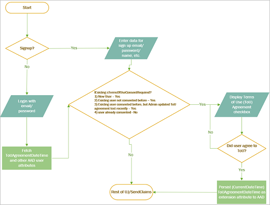

# Manage user access in Azure Active Directory B2C

This article discusses how to manage user access to your applications by using Azure Active Directory B2C (Azure AD B2C). Access management in your application includes:

- Identifying minors and controlling user access to your application.
- Requiring parental consent for minors to use your applications.
- Gathering birth and country/region data from users.
- Capturing a terms-of-use agreement and gating access.

[!INCLUDE [active-directory-b2c-advanced-audience-warning](../../includes/active-directory-b2c-advanced-audience-warning.md)]

## Control minor access

Applications and organizations may decide to block minors from using applications and services that are not targeted to this audience. Alternatively, applications and organizations may decide to accept minors and subsequently manage the parental consent, and deliver permissible experiences for minors as dictated by business rules and allowed by regulation.

If a user is identified as a minor, you can set the user flow in Azure AD B2C to one of three options:

- **Send a signed JWT id_token back to the application**: The user is registered in the directory, and a token is returned to the application. The application then proceeds by applying business rules. For example, the application may proceed with a parental consent process. To use this method, choose to receive the **ageGroup** and **consentProvidedForMinor** claims from the application.

- **Send an unsigned JSON token to the application**: Azure AD B2C notifies the application that the user is a minor and provides the status of the user's parental consent. The application then proceeds by applying business rules. A JSON token does not complete a successful authentication with the application. The application must process the unauthenticated user according to the claims included in the JSON token, which may include **name**, **email**, **ageGroup**, and **consentProvidedForMinor**.

- **Block the user**: If a user is a minor, and parental consent has not been provided, Azure AD B2C can notify the user that they are blocked. No token is issued, access is blocked, and the user account is not created during a registration journey. To implement this notification, you provide a suitable HTML/CSS content page to inform the user and present appropriate options. No further action is needed by the application for new registrations.

## Get parental consent

Depending on application regulation, parental consent might need to be granted by a user who is verified as an adult. Azure AD B2C does not provide an experience to verify an individual's age and then allow a verified adult to grant parental consent to a minor. This experience must be provided by the application or another service provider.

The following is an example of a user flow for gathering parental consent:

1. A [Microsoft Graph API](https://docs.microsoft.com/graph/use-the-api) operation identifies the user as a minor and returns the user data to the application in the form of an unsigned JSON token.

2. The application processes the JSON token and shows a screen to the minor, notifying them that parental consent is required and requesting the consent of a parent online.

3. Azure AD B2C shows a sign-in journey that the user can sign in to normally and issues a token to the application that is set to include **legalAgeGroupClassification = "minorWithParentalConsent"**. The application collects the email address of the parent and verifies that the parent is an adult. To do so, it uses a trusted source, such as a national ID office, license verification, or credit card proof. If verification is successful, the application prompts the minor to sign in by using the Azure AD B2C user flow. If consent is denied (for example, if **legalAgeGroupClassification = "minorWithoutParentalConsent"**), Azure AD B2C returns a JSON token (not a login) to the application to restart the consent process. It is optionally possible to customize the user flow so that a minor or an adult can regain access to a minor's account by sending a registration code to the minor's email address or the adult's email address on record.

4. The application offers an option to the minor to revoke consent.

5. When either the minor or the adult revokes consent, the Microsoft Graph API can be used to change **consentProvidedForMinor** to **denied**. Alternatively, the application may choose to delete a minor whose consent has been revoked. It is optionally possible to customize the user flow so that the authenticated minor (or parent that is using the minor's account) can revoke consent. Azure AD B2C records **consentProvidedForMinor** as **denied**.

For more information about **legalAgeGroupClassification**, **consentProvidedForMinor**, and **ageGroup**, see [User resource type](https://developer.microsoft.com/graph/docs/api-reference/beta/resources/user). For more information about custom attributes, see [Use custom attributes to collect information about your consumers](user-flow-custom-attributes.md). When you address extended attributes by using the Microsoft Graph API, you must use the long version of the attribute, such as *extension_18b70cf9bb834edd8f38521c2583cd86_dateOfBirth*: *2011-01-01T00:00:00Z*.

## Gather date of birth and country/region data

Applications may rely on Azure AD B2C to gather the date of birth (DOB) and country/region information from all users during registration. If this information does not already exist, the application can request it from the user during the next authentication (sign-in) journey. Users cannot proceed without providing their DOB and country/region information. Azure AD B2C uses the information to determine whether the individual is considered a minor according to the regulatory standards of that country/region.

A customized user flow can gather DOB and country/region information and use Azure AD B2C claims transformation to determine the **ageGroup** and persist the result (or persist the DOB and country/region information directly) in the directory.

The following steps show the logic that is used to calculate **ageGroup** from the user's date of birth:

1. Try to find the country/region by the country/region code in the list. If the country/region is not found, fall back to **Default**.

2. If the **MinorConsent** node is present in the country/region element:

    a. Calculate the date that the user must have been born on to be considered an adult. For example, if the current date is March 14, 2015, and **MinorConsent** is 18, the birth date must be no later than March 14, 2000.

    b. Compare the minimum birth date with the actual birth date. If the minimum birth date is before the user's birth date, the calculation returns **Minor** as the age group calculation.

3. If the **MinorNoConsentRequired** node is present in the country/region element, repeat steps 2a and 2b using the value from **MinorNoConsentRequired**. The output of 2b returns **MinorNoConsentRequired** if the minimum birth date is before the user's birth date.

4. If neither calculation returns true, the calculation returns **Adult**.

If an application has reliably gathered DOB or country/region data by other methods, the application may use the Graph API to update the user record with this information. For example:

- If a user is known to be an adult, update the directory attribute **ageGroup** with a value of **Adult**.
- If a user is known to be a minor, update the directory attribute **ageGroup** with a  value of **Minor** and set **consentProvidedForMinor**, as appropriate.

For more information about gathering DOB data, see [Use age gating in Azure AD B2C](basic-age-gating.md).

## Capture terms of use agreement

When you develop your application, you ordinarily capture users' acceptance of terms of use within their applications with no, or only minor, participation from the user directory. It is possible, however, to use an Azure AD B2C user flow to gather a user's acceptance of terms of use, restrict access if acceptance is not granted, and enforce acceptance of future changes to the terms of use, based on the date of the latest acceptance and the date of the latest version of the terms of use.

**Terms of Use** may also include "Consent to share data with third parties." Depending on local regulations and business rules, you can gather a user's acceptance of both conditions combined, or you can allow the user to accept one condition and not the other.

The following steps describe how you can manage terms of use:

1. Record the acceptance of the terms of use and the date of acceptance by using the Graph API and extended attributes. You can do so by using both built-in and custom user flows. We recommend that you create and use the **extension_termsOfUseConsentDateTime** and **extension_termsOfUseConsentVersion** attributes.

2. Create a required check box labeled "Accept Terms of Use," and record the result during signup. You can do so by using both built-in and custom user flows.

3. Azure AD B2C stores the terms of use agreement and the user's acceptance. You can use the Graph API to query for the status of any user by reading the extension attribute that's used to record the response (for example, read **termsOfUseTestUpdateDateTime**). You can do so by using both built-in and custom user flows.

4. Require acceptance of updated terms of use by comparing the date of acceptance to the date of the latest version of the terms of use. You can compare the dates only by using a custom user flow. Use the extended attribute **extension_termsOfUseConsentDateTime**, and compare the value to the claim of **termsOfUseTextUpdateDateTime**. If the acceptance is old, force a new acceptance by displaying a self-asserted screen. Otherwise, block access by using policy logic.

5. Require acceptance of updated terms of use by comparing the version number of the acceptance to the most recent accepted version number. You can compare version numbers only by using a custom user flow. Use the extended attribute **extension_termsOfUseConsentDateTime**, and compare the value to the claim of **extension_termsOfUseConsentVersion**. If the acceptance is old, force a new acceptance by displaying a self-asserted screen. Otherwise, block access by using policy logic.

You can capture terms of use acceptance under the following scenarios:

- A new user is signing up. The terms of use are displayed, and the acceptance result is stored.
- A user is signing in who has previously accepted the latest or active terms of use. The terms of use are not displayed.
- A user is signing in who has not already accepted the latest or active terms of use. The terms of use are displayed, and the acceptance result is stored.
- A user is signing in who has already accepted an older version of the terms of use, which are now updated to the latest version. The terms of use are displayed, and the acceptance result is stored.

The following image shows the recommended user flow:



The following is an example of a DateTime based terms of use consent in a claim:

```xml
<ClaimsTransformations>
  <ClaimsTransformation Id="GetNewUserAgreeToTermsOfUseConsentDateTime" TransformationMethod="GetCurrentDateTime">
    <OutputClaims>
      <OutputClaim ClaimTypeReferenceId="extension_termsOfUseConsentDateTime" TransformationClaimType="currentDateTime" />
    </OutputClaims>
  </ClaimsTransformation>
  <ClaimsTransformation Id="IsTermsOfUseConsentRequired" TransformationMethod="IsTermsOfUseConsentRequired">
    <InputClaims>
      <InputClaim ClaimTypeReferenceId="extension_termsOfUseConsentDateTime" TransformationClaimType="termsOfUseConsentDateTime" />
    </InputClaims>
    <InputParameters>
      <InputParameter Id="termsOfUseTextUpdateDateTime" DataType="dateTime" Value="2098-01-30T23:03:45" />
    </InputParameters>
    <OutputClaims>
      <OutputClaim ClaimTypeReferenceId="termsOfUseConsentRequired" TransformationClaimType="result" />
    </OutputClaims>
  </ClaimsTransformation>
</ClaimsTransformations>
```

The following is an example of a Version based terms of use consent in a claim:

```xml
<ClaimsTransformations>
  <ClaimsTransformation Id="GetEmptyTermsOfUseConsentVersionForNewUser" TransformationMethod="CreateStringClaim">
    <InputParameters>
      <InputParameter Id="value" DataType="string" Value=""/>
    </InputParameters>
    <OutputClaims>
      <OutputClaim ClaimTypeReferenceId="extension_termsOfUseConsentVersion" TransformationClaimType="createdClaim" />
    </OutputClaims>
  </ClaimsTransformation>
  <ClaimsTransformation Id="GetNewUserAgreeToTermsOfUseConsentVersion" TransformationMethod="CreateStringClaim">
    <InputParameters>
      <InputParameter Id="value" DataType="string" Value="V1"/>
    </InputParameters>
    <OutputClaims>
      <OutputClaim ClaimTypeReferenceId="extension_termsOfUseConsentVersion" TransformationClaimType="createdClaim" />
    </OutputClaims>
  </ClaimsTransformation>
  <ClaimsTransformation Id="IsTermsOfUseConsentRequiredForVersion" TransformationMethod="CompareClaimToValue">
    <InputClaims>
      <InputClaim ClaimTypeReferenceId="extension_termsOfUseConsentVersion" TransformationClaimType="inputClaim1" />
    </InputClaims>
    <InputParameters>
      <InputParameter Id="compareTo" DataType="string" Value="V1" />
      <InputParameter Id="operator" DataType="string" Value="not equal" />
      <InputParameter Id="ignoreCase" DataType="string" Value="true" />
    </InputParameters>
    <OutputClaims>
      <OutputClaim ClaimTypeReferenceId="termsOfUseConsentRequired" TransformationClaimType="outputClaim" />
    </OutputClaims>
  </ClaimsTransformation>
</ClaimsTransformations>
```

## Next steps

- To learn how to delete and export user data, see [Manage user data](manage-user-data.md).
- For an example custom policy that implements a terms of use prompt, see [A B2C IEF Custom Policy - Sign Up and Sign In with 'Terms of Use' prompt](https://github.com/azure-ad-b2c/samples/tree/master/policies/sign-in-sign-up-versioned-tou).
