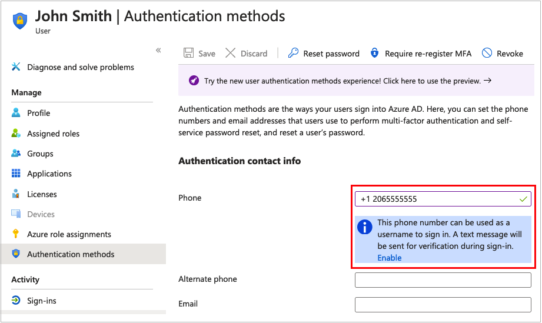

# Manage Azure AD B2C with Microsoft Graph

Microsoft Graph allows you to manage resources in your Azure AD B2C directory. The following Microsoft Graph API operations are supported for the management of Azure AD B2C resources, including users, identity providers, user flows, custom policies, and policy keys. Each link in the following sections targets the corresponding page within the Microsoft Graph API reference for that operation. 

> [!NOTE]
> You can also programmatically create an Azure AD B2C directory itself, along with the corresponding Azure resource linked to an Azure subscription. This functionality isn't exposed through the Microsoft Graph API, but through the Azure REST API. For more information, see [B2C Tenants - Create](/rest/api/activedirectory/b2c-tenants/create).

Watch this video to learn about Azure AD B2C user migration using Microsoft Graph API.

>[!Video https://www.youtube.com/embed/9BRXBtkBzL4]

## Prerequisites

- To use MS Graph API, and interact with resources in your Azure AD B2C tenant, you need an application registration that grants the permissions to do so. Follow the steps in the [Register a Microsoft Graph application](microsoft-graph-get-started.md) article to create an application registration that your management application can use. 

## User management
> [!NOTE]
> Azure AD B2C currently does not support advanced query capabilities on directory objects. This means that there is no support for `$count`, `$search` query parameters and Not (`not`), Not equals (`ne`), and Ends with (`endsWith`) operators in `$filter` query parameter. For more information, see [query parameters in Microsoft Graph](/graph/query-parameters) and [advanced query capabilities in Microsoft Graph](/graph/aad-advanced-queries).


- [List users](/graph/api/user-list)
- [Create a consumer user](/graph/api/user-post-users)
- [Get a user](/graph/api/user-get)
- [Update a user](/graph/api/user-update)
- [Delete a user](/graph/api/user-delete)

## User phone number management

A phone number that can be used by a user to sign-in using [SMS or voice calls](sign-in-options.md#phone-sign-in), or [multifactor authentication](multi-factor-authentication.md). For more information, see [Microsoft Entra authentication methods API](/graph/api/resources/phoneauthenticationmethod).

- [Add](/graph/api/authentication-post-phonemethods)
- [List](/graph/api/authentication-list-phonemethods)
- [Get](/graph/api/phoneauthenticationmethod-get)
- [Update](/graph/api/phoneauthenticationmethod-update)
- [Delete](/graph/api/phoneauthenticationmethod-delete)

Note, the [list](/graph/api/authentication-list-phonemethods) operation returns  only enabled phone numbers. The following phone number should be enabled to use with the list operations. 



> [!NOTE]
> A correctly represented phone number is stored with a space between the country code and the phone number. The Azure AD B2C service doesn't currently add this space by default.

## Self-service password reset email address

An email address that can be used by a [username sign-in account](sign-in-options.md#username-sign-in) to reset the password. For more information, see [Microsoft Entra authentication methods API](/graph/api/resources/emailauthenticationmethod).

- [Add](/graph/api/authentication-post-emailmethods)
- [List](/graph/api/authentication-list-emailmethods)
- [Get](/graph/api/emailauthenticationmethod-get)
- [Update](/graph/api/emailauthenticationmethod-update)
- [Delete](/graph/api/emailauthenticationmethod-delete)

## Software OATH token authentication method

 A software OATH token is a software-based number generator that uses the OATH time-based one-time password (TOTP) standard for multifactor authentication via an authenticator app. Use the Microsoft Graph API to manage a software OATH token registered to a user:

- [List](/graph/api/authentication-list-softwareoathmethods)
- [Get](/graph/api/softwareoathauthenticationmethod-get)
- [Delete](/graph/api/softwareoathauthenticationmethod-delete)

## Identity providers

Manage the [identity providers](add-identity-provider.md) available to your user flows in your Azure AD B2C tenant.

- [List identity providers available in the Azure AD B2C tenant](/graph/api/identityproviderbase-availableprovidertypes)
- [List identity providers configured in the Azure AD B2C tenant](/graph/api/identitycontainer-list-identityproviders)
- [Create an identity provider](/graph/api/identitycontainer-post-identityproviders)
- [Get an identity provider](/graph/api/identityproviderbase-get)
- [Update identity provider](/graph/api/identityproviderbase-update)
- [Delete an identity provider](/graph/api/identityproviderbase-delete)

## User flow (beta)

Configure pre-built policies for sign-up, sign-in, combined sign-up and sign-in, password reset, and profile update.

- [List user flows](/graph/api/identitycontainer-list-b2cuserflows)
- [Create a user flow](/graph/api/identitycontainer-post-b2cuserflows)
- [Get a user flow](/graph/api/b2cidentityuserflow-get)
- [Delete a user flow](/graph/api/b2cidentityuserflow-delete)

## User flow authentication methods (beta)

Choose a mechanism for letting users register via local accounts. Local accounts are the accounts where Azure AD B2C does the identity assertion. For more information, see [b2cAuthenticationMethodsPolicy resource type](/graph/api/resources/b2cauthenticationmethodspolicy).

- [Get](/graph/api/b2cauthenticationmethodspolicy-get)
- [Update](/graph/api/b2cauthenticationmethodspolicy-update)

## Custom policies (beta)

The following operations allow you to manage your Azure AD B2C Trust Framework policies, known as [custom policies](custom-policy-overview.md).

- [List all trust framework policies configured in a tenant](/graph/api/trustframework-list-trustframeworkpolicies)
- [Create trust framework policy](/graph/api/trustframework-post-trustframeworkpolicy)
- [Read properties of an existing trust framework policy](/graph/api/trustframeworkpolicy-get)
- [Update or create trust framework policy.](/graph/api/trustframework-put-trustframeworkpolicy)
- [Delete an existing trust framework policy](/graph/api/trustframeworkpolicy-delete)

## Policy keys (beta)

The Identity Experience Framework stores the secrets referenced in a custom policy to establish trust between components. These secrets can be symmetric or asymmetric keys/values. In the Azure portal, these entities are shown as **Policy keys**.

The top-level resource for policy keys in the Microsoft Graph API is the [Trusted Framework Keyset](/graph/api/resources/trustframeworkkeyset). Each **Keyset** contains at least one **Key**. To create a key, first create an empty keyset, and then generate a key in the keyset. You can create a manual secret, upload a certificate, or a PKCS12 key. The key can be a generated secret, a string (such as the Facebook application secret), or a certificate you upload. If a keyset has multiple keys, only one of the keys is active.

### Trust Framework policy keyset

- [List the trust framework keysets](/graph/api/trustframework-list-keysets)
- [Create a trust framework keysets](/graph/api/trustframework-post-keysets)
- [Get a keyset](/graph/api/trustframeworkkeyset-get)
- [Update a trust framework keysets](/graph/api/trustframeworkkeyset-update)
- [Delete a trust framework keysets](/graph/api/trustframeworkkeyset-delete)

### Trust Framework policy key

- [Get currently active key in the keyset](/graph/api/trustframeworkkeyset-getactivekey)
- [Generate a key in keyset](/graph/api/trustframeworkkeyset-generatekey)
- [Upload a string based secret](/graph/api/trustframeworkkeyset-uploadsecret)
- [Upload a X.509 certificate](/graph/api/trustframeworkkeyset-uploadcertificate)
- [Upload a PKCS12 format certificate](/graph/api/trustframeworkkeyset-uploadpkcs12)

## Applications

- [List applications](/graph/api/application-list)
- [Create an application](/graph/api/resources/application)
- [Update application](/graph/api/application-update)
- [Create servicePrincipal](/graph/api/resources/serviceprincipal)
- [Create oauth2Permission Grant](/graph/api/resources/oauth2permissiongrant)
- [Delete application](/graph/api/application-delete)

## Application extension (directory extension) properties

Application extension properties are also known as directory or Microsoft Entra extensions. To manage them in Azure AD B2C, use the [identityUserFlowAttribute resource type](/graph/api/resources/identityuserflowattribute) and its associated methods.

- [Create user flow attribute](/graph/api/identityuserflowattribute-post)
- [List user flow attributes](/graph/api/identityuserflowattribute-list)
- [Get a user flow attribute](/graph/api/identityuserflowattribute-get)
- [Update a user flow attribute](/graph/api/identityuserflowattribute-update)
- [Delete a user flow attribute](/graph/api/identityuserflowattribute-delete)

You can store up to 100 directory extension values per user. To manage the directory extension properties for a user, use the following [User APIs](/graph/api/resources/user) in Microsoft Graph.

- [Update user](/graph/api/user-update): To write or remove the value of the directory extension property from the user object.
- [Get a user](/graph/api/user-get): To retrieve the value of the directory extension for the user. The property will be returned by default through the `beta` endpoint, but only on `$select` through the `v1.0` endpoint.

For user flows, these extension properties are [managed by using the Azure portal](user-flow-custom-attributes.md). For custom policies, Azure AD B2C creates the property for you, the first time the policy writes a value to the extension property.

> [!NOTE]
> In Microsoft Entra ID, directory extensions are managed through the [extensionProperty resource type](/graph/api/resources/extensionproperty) and its associated methods. However, because they are used in B2C through the `b2c-extensions-app` app which should not be updated, they are managed in Azure AD B2C using the [identityUserFlowAttribute resource type](/graph/api/resources/identityuserflowattribute) and its associated methods.

## Tenant usage 

Use the [Get organization details](/graph/api/organization-get) API to get your directory size quota. You need to add the `$select` query parameter as shown in the following HTTP request:

```http
GET https://graph.microsoft.com/v1.0/organization/organization-id?$select=directorySizeQuota
``` 
Replace `organization-id` with your organization or tenant ID. 

The response to the above request looks similar to the following JSON snippet:

```json
{
    "directorySizeQuota": {
        "used": 156,
        "total": 1250000
    }
}
``` 
## Audit logs

- [List audit logs](/graph/api/directoryaudit-list)

For more information about accessing Azure AD B2C audit logs, see [Accessing Azure AD B2C audit logs](view-audit-logs.md).

## Conditional Access

- [List the built-in templates for Conditional Access policy scenarios](/graph/api/conditionalaccessroot-list-templates)
- [List all of the Conditional Access policies](/graph/api/conditionalaccessroot-list-policies)
- [Read properties and relationships of a Conditional Access policy](/graph/api/conditionalaccesspolicy-get)
- [Create a new Conditional Access policy](/graph/api/resources/application)
- [Update a Conditional Access policy](/graph/api/conditionalaccesspolicy-update)
- [Delete a Conditional Access policy](/graph/api/conditionalaccesspolicy-delete)

## Retrieve or restore deleted users and applications

Deleted users and apps can only be restored if they were deleted within the last 30 days.

- [List deleted items](/graph/api/directory-deleteditems-list)
- [Get a deleted item](/graph/api/directory-deleteditems-get)
- [Restore a deleted item](/graph/api/directory-deleteditems-restore)
- [Permanently delete a deleted item](/graph/api/directory-deleteditems-delete)

## How to programmatically manage Microsoft Graph

When you want to manage Microsoft Graph, you can either do it as the application using the application permissions, or you can use delegated permissions. For delegated permissions, either the user or an administrator consents to the permissions that the app requests. The app is delegated with the permission to act as a signed-in user when it makes calls to the target resource. Application permissions are used by apps that do not require a signed in user present and thus require application permissions. Because of this, only administrators can consent to application permissions.

> [!NOTE]
> Delegated permissions for users signing in through user flows or custom policies cannot be used against delegated permissions for Microsoft Graph API.
## Code sample: How to programmatically manage user accounts

This code sample is a .NET Core console application that uses the [Microsoft Graph SDK](/graph/sdks/sdks-overview) to interact with Microsoft Graph API. Its code demonstrates how to call the API to programmatically manage users in an Azure AD B2C tenant.
You can [download the sample archive](https://github.com/Azure-Samples/ms-identity-dotnetcore-b2c-account-management/archive/master.zip) (*.zip), [browse the repository](https://github.com/Azure-Samples/ms-identity-dotnetcore-b2c-account-management) on GitHub, or clone the repository:

```cmd
git clone https://github.com/Azure-Samples/ms-identity-dotnetcore-b2c-account-management.git
```

After you've obtained the code sample, configure it for your environment and then build the project:

1. Open the project in [Visual Studio](https://visualstudio.microsoft.com) or [Visual Studio Code](https://code.visualstudio.com).
1. Open `src/appsettings.json`.
1. In the `appSettings` section, replace `your-b2c-tenant` with the name of your tenant, and `Application (client) ID` and `Client secret` with the values for your management application registration. For more information, see [Register a Microsoft Graph Application](microsoft-graph-get-started.md).
1. Open a console window within your local clone of the repo, switch into the `src` directory, then build the project:

    ```console
    cd src
    dotnet build
    ```
    
1. Run the application with the `dotnet` command:

    ```console
    dotnet bin/Debug/netcoreapp3.1/b2c-ms-graph.dll
    ```

The application displays a list of commands you can execute. For example, get all users, get a single user, delete a user, update a user's password, and bulk import.

> [!NOTE]
> For the application to update user account passwords, you'll need to [grant the user administrator role](microsoft-graph-get-started.md#optional-grant-user-administrator-role) to the application.
 
### Code discussion

The sample code uses the [Microsoft Graph SDK](/graph/sdks/sdks-overview), which is designed to simplify building high-quality, efficient, and resilient applications that access Microsoft Graph.

Any request to the Microsoft Graph API requires an access token for authentication. The solution makes use of the [Microsoft.Graph.Auth](https://www.nuget.org/packages/Microsoft.Graph.Auth/) NuGet package that provides an authentication scenario-based wrapper of the Microsoft Authentication Library (MSAL) for use with the Microsoft Graph SDK.

The `RunAsync` method in the _Program.cs_ file:

1. Reads application settings from the _appsettings.json_ file
1. Initializes the auth provider using [OAuth 2.0 client credentials grant](../active-directory/develop/v2-oauth2-client-creds-grant-flow.md) flow. With the client credentials grant flow, the app is able to get an access token to call the Microsoft Graph API.
1. Sets up the Microsoft Graph service client with the auth provider:

:::code language="csharp" source="~/ms-identity-dotnetcore-b2c-account-management/src/Program.cs" id="ms_docref_set_auth_provider":::

The initialized *GraphServiceClient* is then used in _UserService.cs_ to perform the user management operations. For example, getting a list of the user accounts in the tenant:

:::code language="csharp" source="~/ms-identity-dotnetcore-b2c-account-management/src/Services/UserService.cs" id="ms_docref_get_list_of_user_accounts":::

[Make API calls using the Microsoft Graph SDKs](/graph/sdks/create-requests) includes information on how to read and write information from Microsoft Graph, use `$select` to control the properties returned, provide custom query parameters, and use the `$filter` and `$orderBy` query parameters.

## Next steps

For code samples in JavaScript and Node.js, please see: [Manage B2C user accounts with MSAL.js and Microsoft Graph SDK](https://github.com/Azure-Samples/ms-identity-b2c-javascript-nodejs-management) 

<!-- LINK -->

[graph-objectIdentity]: /graph/api/resources/objectidentity
[graph-user]: /graph/api/resources/user
