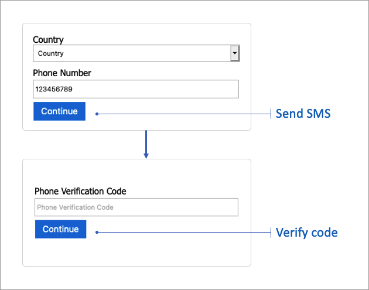
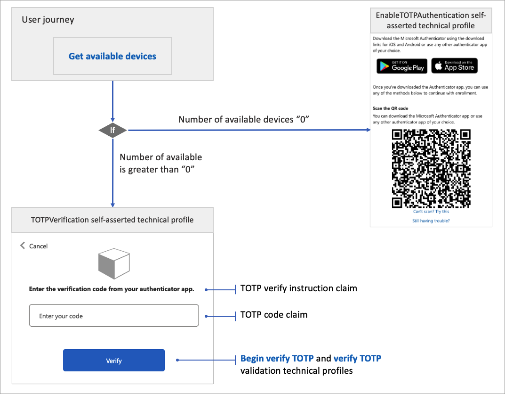

# Define a Microsoft Entra ID multifactor authentication technical profile in an Azure AD B2C custom policy

Azure Active Directory B2C (Azure AD B2C) provides support for verifying a phone number by using a verification code, or verifying a Time-based One-time Password (TOTP) code.


## Protocol

The **Name** attribute of the **Protocol** element needs to be set to `Proprietary`. The **handler** attribute must contain the fully qualified name of the protocol handler assembly that is used by Azure AD B2C:

```
Web.TPEngine.Providers.AzureMfaProtocolProvider, Web.TPEngine, Version=1.0.0.0, Culture=neutral, PublicKeyToken=null
```

The following example shows a Microsoft Entra ID multifactor authentication technical profile:

```xml
<TechnicalProfile Id="AzureMfa-SendSms">
    <DisplayName>Send Sms</DisplayName>
    <Protocol Name="Proprietary" Handler="Web.TPEngine.Providers.AzureMfaProtocolProvider, Web.TPEngine, Version=1.0.0.0, Culture=neutral, PublicKeyToken=null" />
    ...
```

## Verify phone mode

In the verify phone mode, the technical profile generates and sends a code to a phone number, and then verifies the code. The Microsoft Entra ID multifactor authentication technical profile may also return an error message.  The validation technical profile validates the user-provided data before the user journey continues. With the validation technical profile, an error message displays on a self-asserted page. The technical profile:

- Doesn't provide an interface to interact with the user. Instead, the user interface is called from a [self-asserted](self-asserted-technical-profile.md) technical profile, or a [display control](display-controls.md) as a [validation technical profile](validation-technical-profile.md).
- Uses the Microsoft Entra multifactor authentication service to generate and send a code to a phone number, and then verifies the code.  
- Validates a phone number via text messages.

The technical profile provides methods to [send the verification code](#send-sms) via SMS text message, and [verify the code](#verify-code). The following screenshot shows the phone verifier flow.



### Send SMS

To verify a phone, the first step generates a code and sends it to the phone number. The following options can be configured for this step.

#### Input claims

The **InputClaims** element contains a list of claims to send to Microsoft Entra multifactor authentication. You can also map the name of your claim to the name defined in the MFA technical profile.


| ClaimReferenceId | Required | Description |
| --------- | -------- | ----------- |
| `userPrincipalName` | Yes | The identifier for the user who owns the phone number. |
| `phoneNumber` | Yes | The phone number to send an SMS code to. |
| `companyName` | No |The company name in the SMS. If not provided, the name of your application is used. |
| `locale` | No | The locale of the SMS. If not provided, the browser locale of the user is used. |

#### Output claims

The Microsoft Entra multifactor authentication protocol provider doesn't return any output claims, so there's no need to specify output claims.

#### Metadata

The Metadata element contains the following attribute.

| Attribute | Required | Description |
| --------- | -------- | ----------- |
| `Operation` | Yes | Must be `OneWaySMS`.  |

##### UI elements

The following metadata can be used to configure the error messages displayed upon sending SMS failure. The metadata should be configured in the [self-asserted](self-asserted-technical-profile.md) technical profile. The error messages can be [localized](localization-string-ids.md#azure-ad-mfa-error-messages).

| Attribute | Required | Description |
| --------- | -------- | ----------- |
| `UserMessageIfCouldntSendSms` | No | User error message if the phone number provided does not accept SMS. |
| `UserMessageIfInvalidFormat` | No | User error message if the phone number provided is not a valid phone number. |
| `UserMessageIfServerError` | No | User error message if the server has encountered an internal error. |
| `UserMessageIfThrottled`| No | User error message if a request has been throttled.|

#### Example: send an SMS

The following example shows a Microsoft Entra ID multifactor authentication technical profile that is used to send a code via SMS.

```xml
<TechnicalProfile Id="AzureMfa-SendSms">
  <DisplayName>Send Sms</DisplayName>
  <Protocol Name="Proprietary" Handler="Web.TPEngine.Providers.AzureMfaProtocolProvider, Web.TPEngine, Version=1.0.0.0, Culture=neutral, PublicKeyToken=null" />
  <Metadata>
    <Item Key="Operation">OneWaySMS</Item>
  </Metadata>
  <InputClaimsTransformations>
    <InputClaimsTransformation ReferenceId="CombinePhoneAndCountryCode" />
    <InputClaimsTransformation ReferenceId="ConvertStringToPhoneNumber" />
  </InputClaimsTransformations>
  <InputClaims>
    <InputClaim ClaimTypeReferenceId="userPrincipalName" />
    <InputClaim ClaimTypeReferenceId="fullPhoneNumber" PartnerClaimType="phoneNumber" />
  </InputClaims>
</TechnicalProfile>
```

### Verify code

The verify code step verifies a code sent to the user. The following options can be configured for this step.

#### Input claims

The **InputClaims** element contains a list of claims to send to Microsoft Entra multifactor authentication. You can also map the name of your claim to the name defined in the MFA technical profile.

| ClaimReferenceId | Required | Description |
| --------- | -------- | ----------- | 
| `phoneNumber`| Yes | Same phone number as previously used to send a code. It is also used to locate a phone verification session. |
| `verificationCode`  | Yes | The verification code provided by the user to be verified |

#### Output claims

The Microsoft Entra multifactor authentication protocol provider doesn't return any output claims, so there's no need to specify output claims. 

#### Metadata

The Metadata element contains the following attribute.

| Attribute | Required | Description |
| --------- | -------- | ----------- |
| `Operation` | Yes | Must be `Verify`. |

##### UI elements

The following metadata can be used to configure the error messages displayed upon code verification failure. The metadata should be configured in the [self-asserted](self-asserted-technical-profile.md) technical profile. The error messages can be [localized](localization-string-ids.md#azure-ad-mfa-error-messages).

| Attribute | Required | Description |
| --------- | -------- | ----------- |
| `UserMessageIfMaxAllowedCodeRetryReached`| No | User error message if the user has attempted a verification code too many times. |
| `UserMessageIfServerError` | No | User error message if the server has encountered an internal error. |
| `UserMessageIfThrottled`| No | User error message if the request is throttled.|
| `UserMessageIfWrongCodeEntered`| No| User error message if the code entered for verification is wrong.|

#### Example: verify a code

The following example shows a Microsoft Entra ID multifactor authentication technical profile used to verify the code.

```xml
<TechnicalProfile Id="AzureMfa-VerifySms">
    <DisplayName>Verify Sms</DisplayName>
    <Protocol Name="Proprietary" Handler="Web.TPEngine.Providers.AzureMfaProtocolProvider, Web.TPEngine, Version=1.0.0.0, Culture=neutral, PublicKeyToken=null" />
    <Metadata>
        <Item Key="Operation">Verify</Item>
    </Metadata>
    <InputClaims>
        <InputClaim ClaimTypeReferenceId="phoneNumber" PartnerClaimType="phoneNumber" />
        <InputClaim ClaimTypeReferenceId="verificationCode" />
    </InputClaims>
</TechnicalProfile>
```

## TOTP mode

In this mode, the user is required to install any authenticator app that supports time-based one-time password (TOTP) verification, such as the [Microsoft Authenticator app](https://www.microsoft.com/security/mobile-authenticator-app), on a device that they own. 

During the first sign-up or sign-in, the user scans a QR code, opens a deep link, or enters the code manually using the authenticator app. To verify the TOTP code, use the [Begin verify OTP](#begin-verify-totp) followed by [Verify TOTP](#verify-totp) validation technical profiles.

For subsequent sign-ins, use the [Get available devices](#get-available-devices) method to check if the user has already enrolled their device. If the number of available devices is greater than zero, this indicates the user has enrolled before. In this case, the user needs to type the TOTP code that appears in the authenticator app.

The technical profile:

- Doesn't provide an interface to interact with the user. Instead, the user interface is called from a [self-asserted](self-asserted-technical-profile.md) technical profile, with the [TOTP display controls](display-control-time-based-one-time-password.md).
- Uses the Microsoft Entra multifactor authentication service to validate the TOTP code.  
- Checks if a user has already enrolled their device.

The following screenshot shows a TOTP enrollment and verification flow. It starts by checking the number of available devices. If the number of available devices is zero, the user goes through the enrollment orchestration step. Otherwise, the user goes through the verification orchestration step.  




### Get available devices

The get available device mode checks the number of devices available for the user. If the number of available devices is zero, this indicates the user hasn't enrolled yet.

#### Input claims

The **InputClaims** element contains a list of claims to send to Microsoft Entra multifactor authentication. You can also map the name of your claim to the name defined in the MFA technical profile.

| ClaimReferenceId | Required | Description |
| --------- | -------- | ----------- | 
| `userPrincipalName`| Yes | The user principal name.|


#### Output claims

The output claims element contains a list of claims to return from Microsoft Entra multifactor authentication. You can also map the name of your claim to the name defined in the MFA technical profile.

| ClaimReferenceId | Required | Description |
| --------- | -------- | ----------- |
| `numberOfAvailableDevices`| Yes | The number of available devices for the user.|

#### Metadata

The Metadata element contains the following attribute.

| Attribute | Required | Description |
| --------- | -------- | ----------- |
| `Operation` | Yes | Must be `GetAvailableDevices`. |

#### Example: Get available devices

The following example shows a Microsoft Entra ID multifactor authentication technical profile used to get the number of available devices.

```xml
<TechnicalProfile Id="AzureMfa-GetAvailableDevices">
  <DisplayName>Get Available Devices</DisplayName>
  <Protocol Name="Proprietary" Handler="Web.TPEngine.Providers.AzureMfaProtocolProvider, Web.TPEngine, Version=1.0.0.0, Culture=neutral, PublicKeyToken=null" />
  <Metadata>
    <Item Key="Operation">GetAvailableDevices</Item>
  </Metadata>
  <InputClaims>
    <InputClaim ClaimTypeReferenceId="userPrincipalName" />
  </InputClaims>
  <OutputClaims>
    <OutputClaim ClaimTypeReferenceId="numberOfAvailableDevices" />
  </OutputClaims>
</TechnicalProfile>
```

### Begin verify TOTP

The begin verify TOTP starts the verification process. This validation technical profile is called from the self-asserted technical profile that presents and verifies TOTP codes. This validation technical profile must be followed by a call to [Verify TOTP](#verify-totp) validation technical profiles. 

#### Input claims

The **InputClaims** element contains a list of claims to send to Microsoft Entra multifactor authentication. You can also map the name of your claim to the name defined in the MFA technical profile.

| ClaimReferenceId | Required | Description |
| --------- | -------- | ----------- | 
| `userPrincipalName`| Yes | The user principal name.|
| `objectId`| Yes | The user object ID.|
| `secretKey`| Yes | The user's secret key. This key is stored in the user's profile in the Azure AD B2C directory and is shared with the authenticator app. The authenticator app uses the secret to generate the TOTP code. This technical profile uses the secret to verify the TOTP code.|

#### Output claims

The Microsoft Entra multifactor authentication protocol provider doesn't return any output claims, so there's no need to specify output claims.

#### Metadata

The Metadata element contains the following attribute.

| Attribute | Required | Description |
| --------- | -------- | ----------- |
| `Operation` | Yes | Must be `BeginVerifyOTP`. |

#### Example: Begin verify TOTP

The following example shows a Microsoft Entra ID multifactor authentication technical profile used to begin the TOTP verification process.

```xml
<TechnicalProfile Id="AzureMfa-BeginVerifyOTP">
  <DisplayName>Begin verify TOTP"</DisplayName>
  <Protocol Name="Proprietary" Handler="Web.TPEngine.Providers.AzureMfaProtocolProvider, Web.TPEngine, Version=1.0.0.0, Culture=neutral, PublicKeyToken=null" />
  <Metadata>
    <Item Key="Operation">BeginVerifyOTP</Item>
  </Metadata>
  <InputClaims>
    <InputClaim ClaimTypeReferenceId="secretKey" />
    <InputClaim ClaimTypeReferenceId="objectId" />
    <InputClaim ClaimTypeReferenceId="userPrincipalName" />
  </InputClaims>
</TechnicalProfile>
```

### Verify TOTP

The verify TOTP method verifies a TOTP code. This validation technical profile is called from the self-asserted technical profile that presents and verifies TOTP codes. This validation technical profile must be preceded by a call to the [Begin verify TOTP](#begin-verify-totp) validation technical profiles.

#### Input claims

The **InputClaims** element contains a list of claims to send to Microsoft Entra multifactor authentication. You can also map the name of your claim to the name defined in the MFA technical profile.

| ClaimReferenceId | Required | Description |
| --------- | -------- | ----------- | 
| `otpCode`| Yes | The TOTP code provided by the user.|

#### Output claims

The Microsoft Entra multifactor authentication protocol provider doesn't return any output claims, so there's no need to specify output claims.

#### Metadata

The Metadata element contains the following attribute.

| Attribute | Required | Description |
| --------- | -------- | ----------- |
| `Operation` | Yes | Must be `VerifyOTP`. |

#### Example: Verify TOTP

The following example shows a Microsoft Entra ID multifactor authentication technical profile used to verify a TOTP code.

```xml
<TechnicalProfile Id="AzureMfa-VerifyOTP">
  <DisplayName>Verify OTP</DisplayName>
  <Protocol Name="Proprietary" Handler="Web.TPEngine.Providers.AzureMfaProtocolProvider, Web.TPEngine, Version=1.0.0.0, Culture=neutral, PublicKeyToken=null" />
  <Metadata>
    <Item Key="Operation">VerifyOTP</Item>
  </Metadata>
  <InputClaims>
    <InputClaim ClaimTypeReferenceId="otpCode" />
  </InputClaims>
</TechnicalProfile>
```

## Next steps

- [Enable multifactor authentication in Azure Active Directory B2C](multi-factor-authentication.md)
