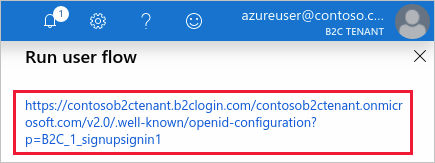

# Migrate an OWIN-based web API to b2clogin.com

This article describes a technique for enabling support for multiple token issuers in web APIs that implement the [Open Web Interface for .NET (OWIN)](http://owin.org/). Supporting multiple token endpoints is useful when you're migrating Azure Active Directory B2C (Azure AD B2C) APIs and their applications from *login.microsoftonline.com* to *b2clogin.com*.

By adding support in your API for accepting tokens issued by both b2clogin.com and login.microsoftonline.com, you can migrate your web applications in a staged manner before removing support for login.microsoftonline.com-issued tokens from the API.

The following sections present an example of how to enable multiple issuers in a web API that uses the [Microsoft OWIN][katana] middleware components (Katana). Although the code examples are specific to the Microsoft OWIN middleware, the general technique should be applicable to other OWIN libraries.

> [!NOTE]
> This article is intended for Azure AD B2C customers with currently deployed APIs and applications that reference `login.microsoftonline.com` and who want to migrate to the recommended `b2clogin.com` endpoint. If you're setting up a new application, use [b2clogin.com](b2clogin.md) as directed.

## Prerequisites

You need the following Azure AD B2C resources in place before continuing with the steps in this article:

* [User flows](tutorial-create-user-flows.md) or [custom policies](custom-policy-get-started.md) created in your tenant

## Get token issuer endpoints

You first need to get the token issuer endpoint URIs for each issuer you want to support in your API. To get the *b2clogin.com* and *login.microsoftonline.com* endpoints supported by your Azure AD B2C tenant, use the following procedure in the Azure portal.

Start by selecting one of your existing user flows:

1. Navigate to your Azure AD B2C tenant in the [Azure portal](https://portal.azure.com)
1. Under **Policies**, select **User flows (policies)**
1. Select an existing policy, for example *B2C_1_signupsignin1*, then select **Run user flow**
1. Under the **Run user flow** heading near the top of the page, select the hyperlink to navigate to the OpenID Connect discovery endpoint for that user flow.

    

1. In the page that opens in your browser, record the `issuer` value, for example:

    `https://your-b2c-tenant.b2clogin.com/xxxxxxxx-xxxx-xxxx-xxxx-xxxxxxxxxxxx/v2.0/`

1. Use the **Select domain** drop-down to select the other domain, then perform the previous two steps once again and record its `issuer` value.

You should now have two URIs recorded that are similar to:

```
https://login.microsoftonline.com/xxxxxxxx-xxxx-xxxx-xxxx-xxxxxxxxxxxx/v2.0/
https://your-b2c-tenant.b2clogin.com/xxxxxxxx-xxxx-xxxx-xxxx-xxxxxxxxxxxx/v2.0/
```

### Custom policies

If you have custom policies instead of user flows, you can use a similar process to get the issuer URIs.

1. Navigate to your Azure AD B2C tenant
1. Select **Identity Experience Framework**
1. Select one of your relying party policies, for example, *B2C_1A_signup_signin*
1. Use the **Select domain** drop-down to select a domain, for example *yourtenant.b2clogin.com*
1. Select the hyperlink displayed under **OpenID Connect discovery endpoint**
1. Record the `issuer` value
1. Perform the steps 4-6 for the other domain, for example *login.microsoftonline.com*

## Get the sample code

Now that you have both token endpoint URIs, you need to update your code to specify that both endpoints are valid issuers. To walk through an example, download or clone the sample application, then update the sample to support both endpoints as valid issuers.

Download the archive: [active-directory-b2c-dotnet-webapp-and-webapi-master.zip][sample-archive]

```
git clone https://github.com/Azure-Samples/active-directory-b2c-dotnet-webapp-and-webapi.git
```

## Enable multiple issuers in web API

In this section, you update the code to specify that both token issuer endpoints are valid.

1. Open the **B2C-WebAPI-DotNet.sln** solution in Visual Studio
1. In the **TaskService** project, open the *TaskService\\App_Start\\**Startup.Auth.cs*** file in your editor
1. Add the following `using` directive to the top of the file:

    `using System.Collections.Generic;`
1. Add the [`ValidIssuers`][validissuers] property to the [`TokenValidationParameters`][tokenvalidationparameters] definition and specify both URIs you recorded in the previous section:

    ```csharp
    TokenValidationParameters tvps = new TokenValidationParameters
    {
        // Accept only those tokens where the audience of the token is equal to the client ID of this app
        ValidAudience = ClientId,
        AuthenticationType = Startup.DefaultPolicy,
        ValidIssuers = new List<string> {
            "https://login.microsoftonline.com/xxxxxxxx-xxxx-xxxx-xxxx-xxxxxxxxxxxx/v2.0/",
            "https://{your-b2c-tenant}.b2clogin.com/xxxxxxxx-xxxx-xxxx-xxxx-xxxxxxxxxxxx/v2.0/"
        }
    };
    ```

`TokenValidationParameters` is provided by MSAL.NET and is consumed by the OWIN middleware in the next section of code in *Startup.Auth.cs*. With multiple valid issuers specified, the OWIN application pipeline is made aware that both token endpoints are valid issuers.

```csharp
app.UseOAuthBearerAuthentication(new OAuthBearerAuthenticationOptions
{
    // This SecurityTokenProvider fetches the Azure AD B2C metadata &  from the OpenID Connect metadata endpoint
    AccessTokenFormat = new JwtFormat(tvps, new tCachingSecurityTokenProvider(String.Format(AadInstance, ultPolicy)))
});
```

As mentioned previously, other OWIN libraries typically provide a similar facility for supporting multiple issuers. Although providing examples for every library is outside the scope of this article, you can use a similar technique for most libraries.

## Switch endpoints in web app

With both URIs now supported by your web API, you now need update your web application so that it retrieves tokens from the b2clogin.com endpoint.

For example, you can configure the sample web application to use the new endpoint by modifying the `ida:AadInstance` value in the *TaskWebApp\\**Web.config*** file of the **TaskWebApp** project.

Change the `ida:AadInstance` value in the *Web.config* of TaskWebApp so that it references `{your-b2c-tenant-name}.b2clogin.com` instead of `login.microsoftonline.com`.

Before:

```xml
<!-- Old value -->
<add key="ida:AadInstance" value="https://login.microsoftonline.com/tfp/{0}/{1}" />
```

After (replace `{your-b2c-tenant}` with the name of your B2C tenant):

```xml
<!-- New value -->
<add key="ida:AadInstance" value="https://{your-b2c-tenant}.b2clogin.com/tfp/{0}/{1}" />
```

When the endpoint strings are constructed during execution of the web app, the b2clogin.com-based endpoints are used when it requests tokens.

## Next steps

This article presented a method of configuring a web API implementing the Microsoft OWIN middleware (Katana) to accept tokens from multiple issuer endpoints. As you might notice, there are several other strings in the *Web.Config* files of both the TaskService and TaskWebApp projects that would need to be changed if you want to build and run these projects against your own tenant. You're welcome to modify the projects appropriately if you want to see them in action, however, a full walk-through of doing so is outside the scope of this article.

For more information about the different types of security tokens emitted by Azure AD B2C, see [Overview of tokens in Azure Active Directory B2C](tokens-overview.md).

<!-- LINKS - External -->
[sample-archive]: https://github.com/Azure-Samples/active-directory-b2c-dotnet-webapp-and-webapi/archive/master.zip
[sample-repo]: https://github.com/Azure-Samples/active-directory-b2c-dotnet-webapp-and-webapi

<!-- LINKS - Internal -->
[katana]: https://docs.microsoft.com/aspnet/aspnet/overview/owin-and-katana/
[validissuers]: https://docs.microsoft.com/dotnet/api/microsoft.identitymodel.tokens.tokenvalidationparameters.validissuers
[tokenvalidationparameters]: https://docs.microsoft.com/dotnet/api/microsoft.identitymodel.tokens.tokenvalidationparameters
