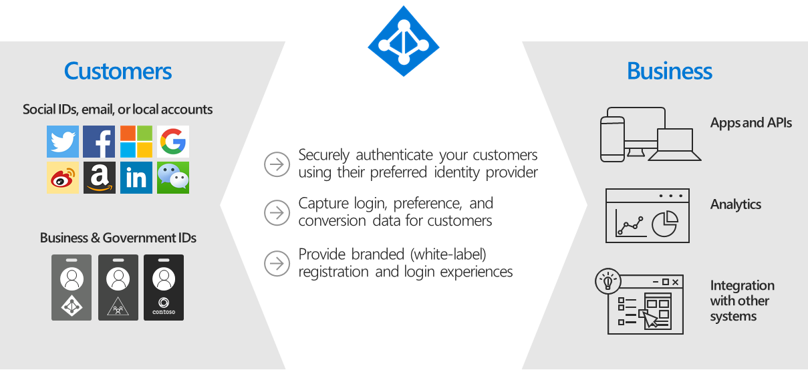

# What is Azure Active Directory B2C?

Azure Active Directory B2C provides business-to-customer identity as a service. Your customers can use their preferred social, enterprise, or local account identities to get single sign-on access to your applications and APIs.

Azure AD B2C is a customer identity access management (CIAM) solution capable of supporting millions of users and billions of authentications per day. It takes care of the scaling and safety of the authentication platform, monitoring, and automatically handling threats like denial-of-service, password spray, or brute force attacks.

Azure AD B2C is built on the same technology as [Microsoft Entra ID](../active-directory/fundamentals/whatis.md) but for a different purpose and is a separate service. It allows businesses to build customer facing applications, and then allow anyone to sign up and sign in to those applications with no restrictions on user account.
   
## Who uses Azure AD B2C?
Any business or individual who wishes to authenticate end users to their web or mobile applications using a white-label authentication solution. Apart from authentication, Azure AD B2C service is used for authorization such as access to API resources by authenticated users. Azure AD B2C is designed to be used by **IT administrators** and **developers**.

## Custom-branded identity solution

Azure AD B2C is a white-label authentication solution which means you can customize the entire user experience with your brand so that it blends seamlessly with your web and mobile applications.

Customize every page displayed by Azure AD B2C when your users sign up, sign in, and modify their profile information. Customize the HTML, CSS, and JavaScript in your user journeys so that the Azure AD B2C experience looks and feels like it's a native part of your application.

:::image type="content" source="./media/overview/sign-in-small.png" alt-text="Customized sign-up and sign-in pages and background image":::

## Single sign-on access with a user-provided identity

Azure AD B2C uses standards-based authentication protocols including OpenID Connect, OAuth 2.0, and Security Assertion Markup Language (SAML). It integrates with most modern applications and commercial off-the-shelf software.

:::image type="content" source="./media/overview/scenario-singlesignon.png" alt-text="Diagram of third-party identities federating to Azure AD B2C.":::

By serving as the central authentication authority for your web applications, mobile apps, and APIs, Azure AD B2C enables you to build a single sign-on (SSO) solution for them all. Centralize the collection of user profile and preference information, and capture detailed analytics about sign-in behavior and sign-up conversion.

## Integrate with external user stores

Azure AD B2C provides a directory that can hold 100 custom attributes per user. However, you can also integrate with external systems. For example, use Azure AD B2C for authentication, but delegate to an external customer relationship management (CRM) or customer loyalty database as the source of truth for customer data.

Another external user store scenario is to have Azure AD B2C handle the authentication for your application, but integrate with an external system that stores user profile or personal data. For example, to satisfy data residency requirements like regional or on-premises data storage policies. However, Azure AD B2C service itself is worldwide via the Azure public cloud. 

:::image type="content" source="./media/overview/scenario-remoteprofile.png" alt-text="A logical diagram of Azure AD B2C communicating with an external user store.":::

Azure AD B2C can facilitate collecting information from a user during registration or profile editing, then hand that data off to an external system via API. Then, during future authentications, Azure AD B2C can retrieve that data from the external system and, if needed, include it as a part of the authentication token response it sends to your application.

## Progressive profiling

Another user journey option includes progressive profiling. Progressive profiling allows your customers to quickly complete their first transaction by collecting a minimal amount of information. Then, gradually collect more profile data from the customer on future sign-ins.

:::image type="content" source="./media/overview/scenario-progressive.png" alt-text="A visual depiction of progressive profiling.":::

## Third-party identity verification and proofing

Use Azure AD B2C to facilitate identity verification and proofing by collecting user data, then passing it to a third-party system to perform validation, trust scoring, and approval for user account creation.

:::image type="content" source="./media/overview/scenario-idproofing.png" alt-text="A diagram showing the user flow for third-party identity proofing.":::

## Next steps

Now that you have an idea of what Azure AD B2C is and some of the scenarios it can help with, dig a little deeper into its features and technical aspects.

> [!div class="nextstepaction"]
> [Azure AD B2C technical overview >](technical-overview.md)
