# Configure Azure Active Directory B2C with Akamai Enterprise Application Access for SSO and secure hybrid access

In this sample tutorial, learn to integrate Azure Active Directory B2C (Azure AD B2C) authentication with [Akamai Enterprise Application Access](https://www.akamai.com/products/enterprise-application-access). Akamai Enterprise Application Access is a Zero Trust Network Access (ZTNA) solution that enables secure remote access to modern and legacy applications that reside in private datacenters. Akamai Enterprise Application Access federates with Identity Provider (IdP) Azure AD B2C to authenticate users and then uses its authorization policies to perform continuous evaluation of the identity, device, application, and request context before allowing access to private applications.  

::: zone pivot="b2c-user-flow"

This feature is available only for custom policies. For setup steps, select **Custom policy** in the preceding selector.

::: zone-end

::: zone pivot="b2c-custom-policy"

## Prerequisites

To get started, you'll need:

- An Akamai Enterprise Access contract. If you don’t have one, get a [free trial](https://www.akamai.com/products/enterprise-application-access).

- An Azure subscription. If you don't have a subscription, you can get a [free account](https://azure.microsoft.com/free/).

- An [Azure AD B2C tenant](./tutorial-create-tenant.md) that's linked to your Azure subscription.

- A virtual appliance deployed behind the firewall in your datacenter or in hybrid cloud environments to deploy the Akamai Enterprise Application Access [connector](https://techdocs.akamai.com/eaa/docs/conn)

- An application that uses headers for authentication. In this sample, we'll use an application that displays headers [docker header-demo-app](https://hub.docker.com/r/mistermik/header-demo-app).

- **OR** an OpenID Connect (OIDC) application. In this sample, we'll use an [ASP.NET MVC web app](../active-directory/develop/web-app-tutorial-01-register-application.md) that signs in users by using the Open Web Interface for .NET (OWIN) middleware and the Microsoft identity platform.

## Scenario description

In this scenario, you'll enable Azure AD B2C authentication for end users while they try to access private applications secured by Akamai Enterprise Application Access.

The components involved in this integration are:

- **Azure AD B2C**: The SAML identity provider that is responsible for authenticating end users.

- **Akamai Enterprise Application Access**: The ZTNA cloud service that is responsible for securing access to private applications with continuous ZTNA policy enforcement.

- **Akamai Enterprise Application Access Connector**: A virtual appliance deployed in the private datacenter. It enables secure connectivity to private apps without opening any datacenter inbound firewall ports.

- **Application**: A service or application deployed in your private datacenter which end users need access to.

The user authenticates to Azure AD B2C (as SAML IdP) that will respond to Akamai Enterprise Application Access (the Service Provider) with a SAML assertion. Akamai Enterprise Application Access maps information from the SAML assertion and it constructs OpenID Claims or injects HTTP Headers containing information about the user. Akamai Enterprise Application Access will then pass this to the Application accessible through the Akamai Enterprise Application Access connector. In our sample, the application will display the content of these headers. In the use case of OIDC Application it will display the user's claims.

The following diagram shows how Akamai Enterprise Application Access (EAA) integrates with Azure AD B2C.

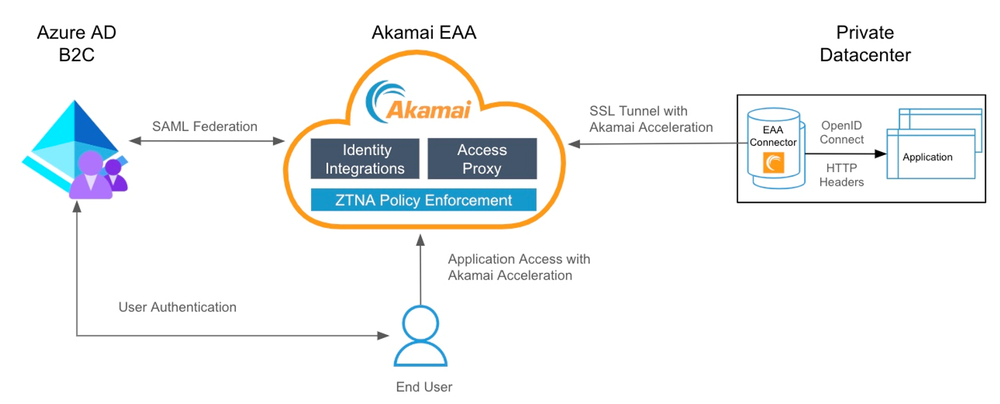

1. An end user tries to access an application hosted in the private datacenter using the application’s external URL that is registered in Akamai Enterprise Application Access.

1. Akamai Enterprise Application Access redirects the unauthenticated end user to Azure AD B2C for authentication.

1. After successful authentication Azure AD B2C redirects the user back to Akamai Enterprise Application Access with a SAML assertion.

1. Akamai Enterprise Application Access uses the identity information from the SAML assertion to identify the user and determine if the user is allowed to access the requested application.

1. Akamai Enterprise Application Access constructs OIDC Claims or injects HTTP Headers, which are sent to the application.

1. The application uses this information to identify the authenticated user and creates an application session for the end user.

## Onboard with Akamai Enterprise Application Access

To get started with Akamai Enterprise Application Access, refer to the [Akamai Enterprise Application Access getting started guide](https://techdocs.akamai.com/eaa/docs/welcome-guide).

### Step 1 - Add Azure AD B2C as a SAML IdP in Akamai Enterprise Application Access

Akamai Enterprise Application Access supports SAML federation with cloud IdPs like Azure AD B2C. Add Azure AD B2C as a [Third party SAML IdP](https://techdocs.akamai.com/eaa/docs/add-new-idp#add-a-new-identity-provider) in Akamai Enterprise Application Access.

1. Sign in to Enterprise Center https://control.akamai.com/

2. In the Enterprise Center navigation menu, select **Application Access > Identity & Users > Identity Providers**.

3. Select **Add Identity provider (+)**.

4. Enter a name, description, and select the provider type as **Third Party SAML**.

5. Select **Continue**. The Identity Provider configuration page appears.

6. In **Settings** > **General** enter a URL for the **Identity Server**. You can select **Use Akamai domain** or Use your domain. If you use your own domain use a self-signed certificate, or use the uploaded custom certificate.

7. In **Authentication** enter the same URL as defined in the previous step in General and Select **Save**.

   [ ](./media/partner-akamai-secure-hybrid-access/akamai-settings.png#lightbox)

### Step 2 - Register a SAML application in Azure AD B2C

1. Get the custom policy starter packs from GitHub, then update the XML files in the LocalAccounts starter pack with your Azure AD B2C tenant name:

   - [Download the .zip file](https://github.com/Azure-Samples/active-directory-b2c-custom-policy-starterpack/archive/master.zip) or clone the repository:

      ``` 
      git clone https://github.com/Azure-Samples/active-directory-b2c-custom-policy-starterpack
      ```
   - In all of the files in the **LocalAccounts** directory, replace the string `yourtenant` with the name of your Azure AD B2C tenant. For example, if the name of your B2C tenant is `fabrikam`, all instances of `yourtenant.onmicrosoft.com` become `fabrikam.onmicrosoft.com`.

2. Create a signing certificate for Azure AD B2C to sign the SAML response sent to Akamai Enterprise Application Access:

   a. [**Obtain a certificate**](saml-service-provider.md?tabs=windows&pivots=b2c-custom-policy#obtain-a-certificate). If you don't already have a certificate, you can use a self-signed certificate.

   b. [**Upload the certificate**](./saml-service-provider.md?tabs=windows&pivots=b2c-custom-policy#upload-the-certificate) in your Azure AD B2C tenant. Take note of the name as it will be needed in the `TechnicalProfile` mentioned in the next steps.

3. Enable your policy to connect with a SAML application.

   a. Open `LocalAccounts\TrustFrameworkExtensions.xml` in the custom policy starter pack. Find the **ClaimsProviders** element. If it doesn't exist, add it under the root element, `TrustFrameworkPolicy` and add the following XML snippet to implement your SAML response generator:

   ```XML
    <ClaimsProvider>
      <DisplayName>Akamai</DisplayName>
      <TechnicalProfiles>
        <!-- SAML Token Issuer technical profile -->
        <TechnicalProfile Id="AkamaiSaml2AssertionIssuer">
          <DisplayName>Token Issuer</DisplayName>
          <Protocol Name="SAML2" />
          <OutputTokenFormat>SAML2</OutputTokenFormat>
          <Metadata>
            <Item Key="IssuerUri">https://<REPLACE>.login.go.akamai-access.com/saml/sp/response</Item>
          </Metadata>
          <CryptographicKeys>
            <Key Id="SamlAssertionSigning" StorageReferenceId="B2C_1A_AkamaiSAMLSigningCert" />
            <Key Id="SamlMessageSigning" StorageReferenceId="B2C_1A_AkamaiSAMLSigningCert" />
          </CryptographicKeys>
          <InputClaims />
          <OutputClaims />
          <UseTechnicalProfileForSessionManagement ReferenceId="SM-Saml-issuerAkamai" />
        </TechnicalProfile>
        <!-- Session management technical profile for SAML-based tokens -->
        <TechnicalProfile Id="SM-Saml-issuerAkamai">
          <DisplayName>Session Management Provider</DisplayName>
          <Protocol Name="Proprietary" Handler="Web.TPEngine.SSO.SamlSSOSessionProvider, Web.TPEngine, Version=1.0.0.0, Culture=neutral, PublicKeyToken=null" />
          <Metadata>
            <Item Key="IncludeSessionIndex">false</Item>
            <Item Key="RegisterServiceProviders">false</Item>
          </Metadata>
        </TechnicalProfile>
      </TechnicalProfiles>
    </ClaimsProvider>
   ```
   b.  Replace the `issuerUri` with the Akamai URL defined in Akamai Enterprise Application Access **Setting > General** in [**Step 1**](#step-1---add-azure-ad-b2c-as-a-saml-idp-in-akamai-enterprise-application-access)
      - Example, `<Item Key="IssuerUri">https://fabrikam.login.go.akamai-access.com/saml/sp/response</Item>`

      - Replace **B2C_1A_AkamaiSAMLSigningCert** with the name of the policy key uploaded.

### Step 3 - Create a sign-up or sign-in policy configured for SAML

1. Create a copy of the `SignUpOrSignin.xml` file in your starter pack's working directory and save it with a new name. This article uses `SignUpOrSigninSAML.xml` as an example. This file is your policy file for the relying party. It's configured to issue a JWT response by default.

1. Open the `SignUpOrSigninSAML.xml` file in your preferred editor.

2. Update `tenant-name` with the name of your Azure AD B2C tenant, change the `PolicyId` and `PublicPolicyUri` values of the policy to `B2C_1A_signup_signin_saml` and `http://<tenant-name>.onmicrosoft.com/B2C_1A_signup_signin_saml`.

    ```xml
    <TrustFrameworkPolicy
    xmlns:xsi="http://www.w3.org/2001/XMLSchema-instance"
    xmlns:xsd="http://www.w3.org/2001/XMLSchema"
    xmlns="http://schemas.microsoft.com/online/cpim/schemas/2013/06"
    PolicySchemaVersion="0.3.0.0"
    TenantId="tenant-name.onmicrosoft.com"
    PolicyId="B2C_1A_signup_signin_saml"
    PublicPolicyUri="http://<tenant-name>.onmicrosoft.com/B2C_1A_signup_signin_saml">
    ```
3. At the end of the user journey, Azure AD B2C contains a `SendClaims` step. This step references the Token Issuer technical profile. To issue a SAML response rather than the default JWT response, modify the `SendClaims` step to reference the new SAML Token Issuer technical profile, `Saml2AssertionIssuer`.

   Add the following XML snippet just before the `<RelyingParty>` element. This XML overwrites orchestration step 4 in the `SignUpOrSignIn` user journey assuming you're using the `LocalAccount` Custom policy starter packs.

   If you started from a different folder in the starter pack or you customized the user journey by adding or removing orchestration steps, make sure the number in the `order` element corresponds to the number specified in the user journey for the token issuer step. For example, in the other starter pack folders, the corresponding step number is 7 for `SocialAndLocalAccounts`, 6 for `SocialAccounts`, and 9 for `SocialAndLocalAccountsWithMfa`.

   ```xml
   <UserJourneys>
   <UserJourney Id="SignUpOrSignIn">
     <OrchestrationSteps>
       <OrchestrationStep Order="4" Type="SendClaims" CpimIssuerTechnicalProfileReferenceId="AkamaiSaml2AssertionIssuer"/>
     </OrchestrationSteps>
   </UserJourney>
   </UserJourneys>
    ```

   The relying party element determines which protocol your application uses. The default is `OpenId`. The `Protocol` element must be changed to `SAML`. The output claims will create the claims mapping to the SAML assertion.

   Replace the entire `<TechnicalProfile>` element in the `<RelyingParty>` element with the following technical profile XML.

   ```xml
    <TechnicalProfile Id="PolicyProfile">
      <DisplayName>PolicyProfile</DisplayName>
      <Protocol Name="SAML2"/>
      <OutputClaims>
        <OutputClaim ClaimTypeReferenceId="displayName" />
        <OutputClaim ClaimTypeReferenceId="givenName" />
        <OutputClaim ClaimTypeReferenceId="surname" />
        <OutputClaim ClaimTypeReferenceId="email" DefaultValue="" />
        <OutputClaim ClaimTypeReferenceId="identityProvider" DefaultValue="" />
        <OutputClaim ClaimTypeReferenceId="objectId" PartnerClaimType="objectId"/>
      </OutputClaims>
      <SubjectNamingInfo ClaimType="objectId" ExcludeAsClaim="true"/>
    </TechnicalProfile>
   ```

   Your final policy file for the relying party should look like the following XML code:

   ```xml
   <?xml version="1.0" encoding="UTF-8" standalone="yes"?>
   <TrustFrameworkPolicy
    xmlns:xsi="http://www.w3.org/2001/XMLSchema-instance"
    xmlns:xsd="http://www.w3.org/2001/XMLSchema"
    xmlns="http://schemas.microsoft.com/online/cpim/schemas/2013/06"
    PolicySchemaVersion="0.3.0.0"
    TenantId="fabrikam.onmicrosoft.com"
    PolicyId="B2C_1A_signup_signin_saml"
    PublicPolicyUri="http://fabrikam.onmicrosoft.com/B2C_1A_signup_signin_saml">
    <BasePolicy>
      <TenantId>fabrikam.onmicrosoft.com</TenantId>
      <PolicyId>B2C_1A_TrustFrameworkExtensions</PolicyId>
    </BasePolicy>

    <UserJourneys>
      <UserJourney Id="SignUpOrSignIn">
        <OrchestrationSteps>
          <OrchestrationStep Order="7" Type="SendClaims" CpimIssuerTechnicalProfileReferenceId="AkamaiSaml2AssertionIssuer"/>
        </OrchestrationSteps>
      </UserJourney>
    </UserJourneys>
    <RelyingParty>
      <DefaultUserJourney ReferenceId="SignUpOrSignIn" />
      <TechnicalProfile Id="PolicyProfile">
        <DisplayName>PolicyProfile</DisplayName>
        <Protocol Name="SAML2"/>
        <OutputClaims>
          <OutputClaim ClaimTypeReferenceId="displayName" />
          <OutputClaim ClaimTypeReferenceId="givenName" />
          <OutputClaim ClaimTypeReferenceId="surname" />
          <OutputClaim ClaimTypeReferenceId="email" DefaultValue="" />
          <OutputClaim ClaimTypeReferenceId="identityProvider" DefaultValue="" />
          <OutputClaim ClaimTypeReferenceId="objectId" PartnerClaimType="objectId"/>
        </OutputClaims>
        <SubjectNamingInfo ClaimType="objectId" ExcludeAsClaim="true"/>
      </TechnicalProfile>
    </RelyingParty>
    </TrustFrameworkPolicy>
    ```
  >[!NOTE]
  >You can follow this same process to implement other types of flows, for example, sign-in, password reset, or profile editing flows.

### Step 4 - Upload your policy

Save your changes and upload the `TrustFrameworkBase.xml`, the new `TrustFrameworkExtensions.xml` and `SignUpOrSigninSAML.xml` policy files to the Azure portal.

1. Sign in to the [Azure portal](https://portal.azure.com/#home).

1. If you have access to multiple tenants, select the **Settings** icon in the top menu to switch to your Azure AD B2C tenant from the **Directories + subscriptions** menu.

1. In the [Azure portal](https://portal.azure.com/#home), search for and select **Azure AD B2C**.

1. Under Policies, select **Identity Experience Framework**.
Select **Upload Custom Policy**, and then upload the two policy files that you changed, in the following order:

   - The base file, for example `TrustFrameworkBase.xml`
   - The extension policy, for example `TrustFrameworkExtensions.xml`
   - Then the relying party policy, such as `SignUpOrSigninSAML.xml`.

### Step 5 - Download the Azure AD B2C IdP SAML metadata

After the policy files are uploaded, Azure AD B2C uses the configuration information to generate the identity provider's SAML metadata document that the application will use. The SAML metadata document contains the locations of services, such as sign-in methods, sign out methods, and certificates.

- The Azure AD B2C policy metadata is available at the following URL:
`https://<tenant-name>.b2clogin.com/<tenant-name>.onmicrosoft.com/<policy-name>/samlp/metadata`

- Replace `<tenant-name>` with the name of your Azure AD B2C tenant. Replace `<policy-name>` with the name (ID) of the policy. Here's an example:
`https://fabrikam.b2clogin.com/fabrikam.onmicrosoft.com/B2C_1A_signup_signin_saml/samlp/metadata`

Download the SAML metadata and save it locally on your device. This is needed with the following step to complete the configuration in Akamai Enterprise Application Access.

### Step 6 - Register Akamai Enterprise Application Access application in Azure AD B2C

For Azure AD B2C to trust Akamai Enterprise Application Access, create an Azure AD B2C application registration. The registration contains configuration information, such as the application's metadata endpoint.

1. Sign in to the [Azure portal](https://portal.azure.com).

1. If you have access to multiple tenants, select the **Settings** icon in the top menu to switch to your Azure AD B2C tenant from the **Directories + subscriptions** menu.

1. On the left menu, select **Azure AD B2C**. Or, select **All services** and then search for and select **Azure AD B2C**.

1. Select **App registrations**, and then select **New registration**.

1. Enter a **Name** for the application. For example, enter **Akamai B2C Enterprise Application Access**.

1. Under **Supported account types**, select **Accounts in this organizational directory only (B2C only - Single tenant)**.

1. Under **Redirect URI**, select **Web**, and then enter the Akamai URL defined in Akamai Enterprise Application Access **Setting\General** in [**Step 1**](#step-1---add-azure-ad-b2c-as-a-saml-idp-in-akamai-enterprise-application-access). For example, `https://fabrikam.login.go.akamai-access.com/saml/sp/response`.

1. Select **Register**.

### Step 7 - Configure your Akamai Enterprise Application Access application in Azure AD B2C

For SAML, you need to configure several properties in the application registration's manifest.

1. In the [Azure portal](https://portal.azure.com), go to the application registration that you created in [**Step 3**](#step-3---create-a-sign-up-or-sign-in-policy-configured-for-saml).

2. Under **Manage**, select **Manifest** to open the manifest editor. Then modify the properties described in the following section.

#### Add the identifier

When Akamai Enterprise Application Access SAML application makes a request to Azure AD B2C, the SAML authentication request includes an `Issuer` attribute. The value of this attribute is typically the same as the application's metadata `entityID` value. Azure AD B2C uses this value to look up the application registration in the directory and read the configuration. For this lookup to succeed, `identifierUri` in the application registration manifest must be populated with a value that matches the `Issuer` attribute.

  [ 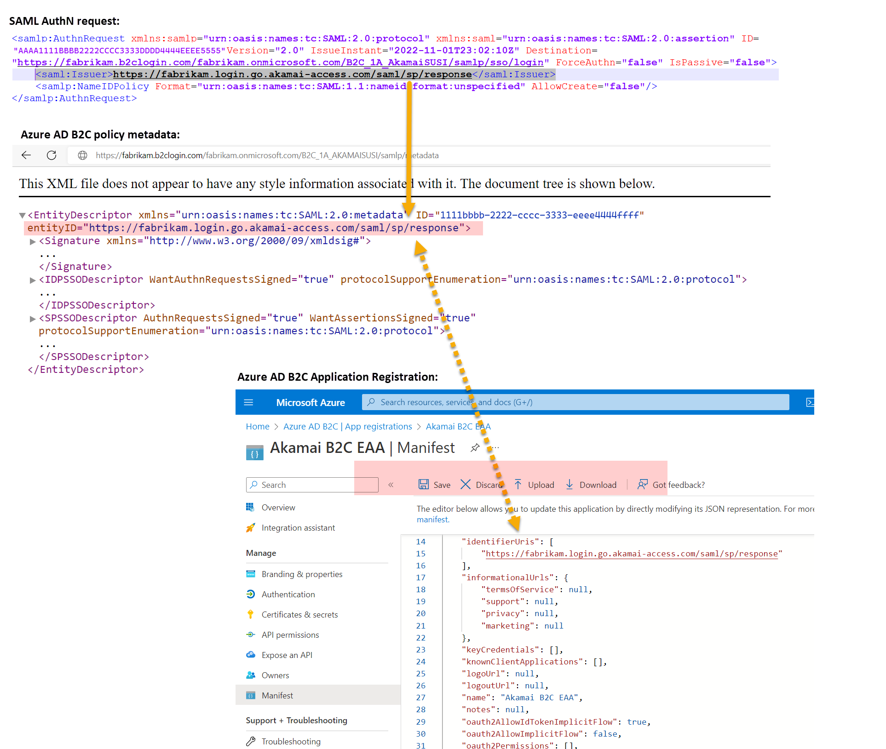](./media/partner-akamai-secure-hybrid-access/akamai-b2c-saml-configuration.png#lightbox)

In the registration manifest, find the `identifierURIs` parameter and add the **IssuerURI** value defined in [**Step 2**](#step-2---register-a-saml-application-in-azure-ad-b2c), Azure AD B2C ClaimsProvider.

Example:
```XML
"identifierUris": [
		"https://fabrikam.login.go.akamai-access.com/saml/sp/response"
	],
  ```

 This value will be the same value that's configured in the SAML AuthN requests for `EntityId` at the application, and the `entityID` value in the application's metadata. You'll also need to find the `accessTokenAcceptedVersion` parameter and set the value to `2`.

>[!IMPORTANT]
>If you do not update the `accessTokenAcceptedVersion` to `2` you will receive an error message requiring a verified domain.

### Step 8 - Configure authentication settings for the Azure AD B2C IdP in Akamai Enterprise Application Access

Update your Akamai Enterprise Application Access Azure AD B2C IdP with authentication information like relying party URLs.

1. Sign in to Enterprise Center https://control.akamai.com/

1. In the Enterprise Center navigation menu, select **Application Access > Identity & Users > Identity Providers**.

1. Select the Identity provider name created in [**Step 1**](#step-1---add-azure-ad-b2c-as-a-saml-idp-in-akamai-enterprise-application-access).

1. Upload the Azure AD B2C SAML metadata file you downloaded in  [**Step 5**](#step-5---download-the-azure-ad-b2c-idp-saml-metadata).

1. To upload the metadata.xml file, select **Choose file**.

   [ 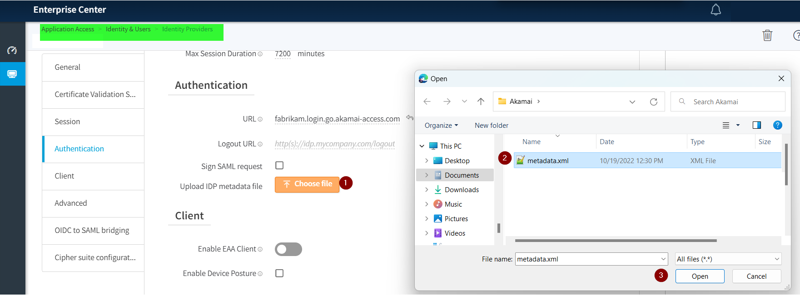](./media/partner-akamai-secure-hybrid-access/akamai-metadata.png#lightbox)

6. Select **Save and Deploy**.

### Step 9 - Deploy Akamai Enterprise Application Access Connectors in your private datacenter

To enable access to a private application, deploy one or more [Akamai Enterprise Application Access connectors](https://techdocs.akamai.com/eaa/docs/conn) in the private datacenter where your application resides. Ensure the connectors can reach your private application and have outbound access to the Akamai Cloud.

### Step 10 - Define an Access Application in Akamai Enterprise Application Access for the private application

1. [Define and Deploy an Access Application](https://techdocs.akamai.com/eaa/docs/add-app-eaa) in Akamai Enterprise Application Access.

1. When you define the Access Application 

   - Associate it to the **Enterprise Application Access Azure AD B2C IdP** definition that you created with the previous steps.

   - Configure Application Facing Authentication to enable SSO into the private application:
     - **Option 1**: [Configure Custom HTTP Headers for an Access Application](https://techdocs.akamai.com/eaa/docs/custom-http-headers)
     - **Option 2**: [Configure OpenID Connect for an Access Application](https://techdocs.akamai.com/eaa/docs/config-openid#configure-openid-connect-for-an-access-application)

#### Option 1: HTTP Headers

In this sample, we'll use an application that displays headers [docker header-demo-app](https://hub.docker.com/r/mistermik/header-demo-app).
Once the Application is deployed in a private environment and a connector is capable to access the application, create a Custom HTTP type application following Akamai documentation [Configure custom HTTP headers for an access application](https://techdocs.akamai.com/eaa/docs/custom-http-headers).

1. In Authentication select the Azure AD B2C SAML IdP created in the previous steps.

  [ 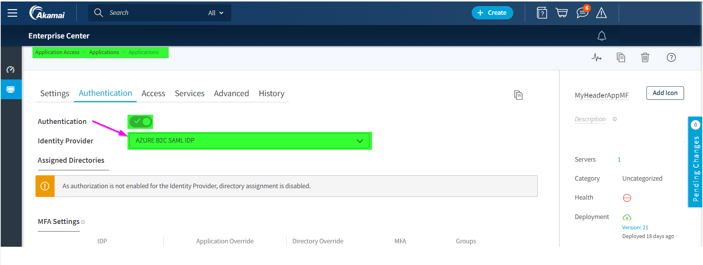](./media/partner-akamai-secure-hybrid-access/akamai-authn-app.png#lightbox)

2. In the **Advanced** section of the application, map the HTTP header to the SAML attributes issued by Azure AD B2C in the SAML response upon a successful authentication.

  Example:

  | Header Name  | Attribute |
  |--------------|-----------|
  | ps-sso-first | `http://schemas.xmlsoap.org/ws/2005/05/identity/claims/name` |
  | ps-sso-last  | `http://schemas.xmlsoap.org/ws/2005/05/identity/claims/surname` |
  | ps-sso-EmailAddress      | emailaddress |
  | ps-sso-uid   | objectId |

  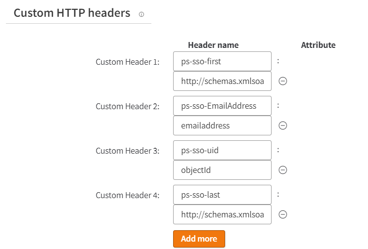

  Test the application by selecting the Akamai URL for the Custom HTTP type Web application you created.

  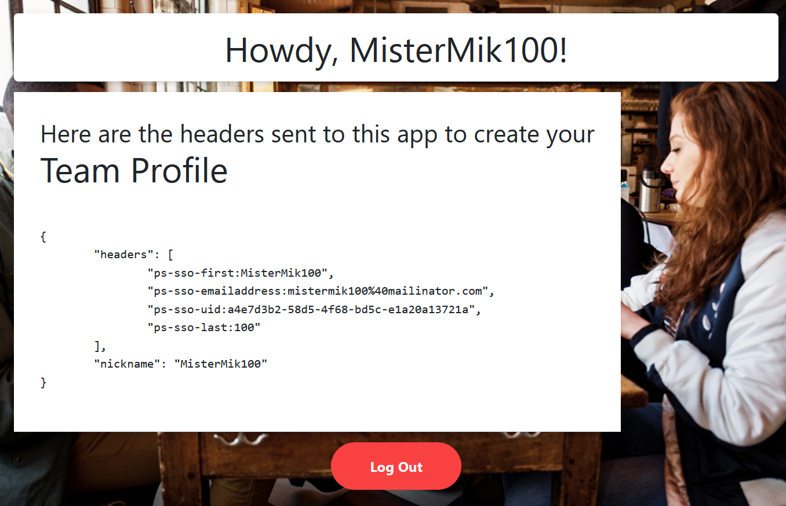

#### Option 2: OpenID Connect

In this sample, we'll use a [ASP.NET MVC web app](../active-directory/develop/web-app-tutorial-01-register-application.md) that signs in users by using the Open Web Interface for .NET (OWIN) middleware and the Microsoft identity platform.

1. Configure the OIDC to SAML bridging in the **Azure AD B2C SAML IdP** created with the previous steps.

   [ 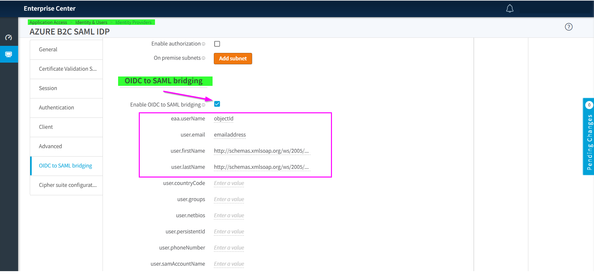](./media/partner-akamai-secure-hybrid-access/akamai-oidc-idp-settings.png#lightbox)

2. Create a Custom HTTP type application following [Configure OpenID Connect for an Access Application.](https://techdocs.akamai.com/eaa/docs/config-openid#configure-openid-connect-for-an-access-application)

3. In Authentication select the Azure AD B2C SAML IdP created in the previous steps as per the HTTP Header application.

   [ ](./media/partner-akamai-secure-hybrid-access/akamai-authn-app.png#lightbox)

4. In **Advanced** select **OpenID Connect 1.0** as authentication mechanism and then select **Save**.

   [ 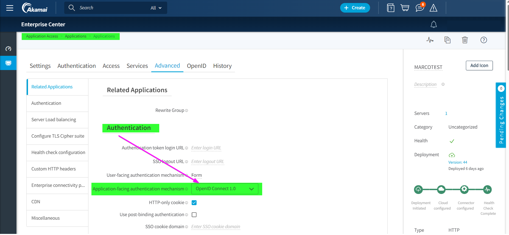](./media/partner-akamai-secure-hybrid-access/akamai-oidc-app-authentication.png#lightbox)

5. A new **OpenID** tab appears, copy the Discovery URL that is needed later in the steps when configuring the OWIN component for testing application.

   [ 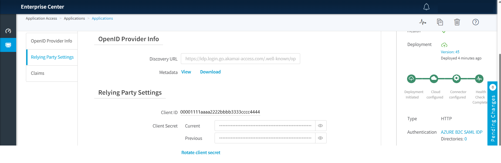](./media/partner-akamai-secure-hybrid-access/akamai-oidc-app-settings.png#lightbox)

6. In the **Claims** section, define the claims that Akamai will issue for the OIDC application, mapping their values to the SAML attributes provided by Azure AD B2C in the SAML response upon a successful authentication. These claims have to map what you defined in the previous step when [configuring the OIDC to SAML bridging in the Azure AD B2C SAML IdP](#option-2-openid-connect).

   [ 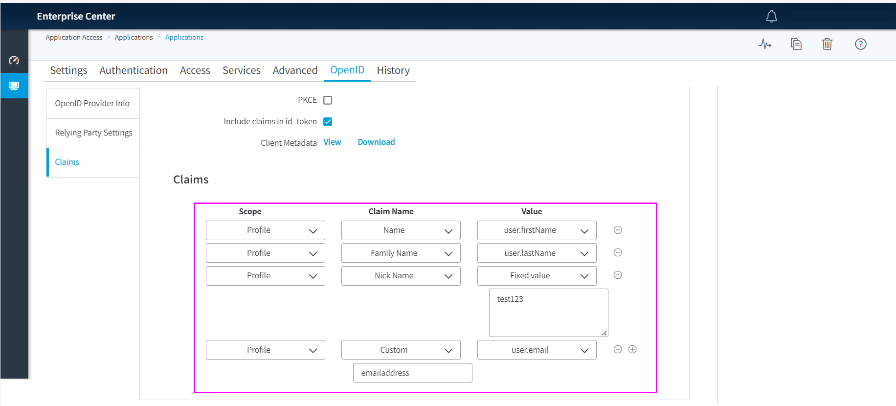](./media/partner-akamai-secure-hybrid-access/akamai-oidc-claims-settings.png#lightbox)

7. Replace startup class with the following code in the [ASP.NET MVC web app](../active-directory/develop/web-app-tutorial-01-register-application.md).

   These few changes configure the Authorization code flow grant, the authorization code will be redeemed for tokens at the token endpoint for the application, and it introduces the Metadata Address to set the discovery endpoint for obtaining metadata from Akamai.

   ```csharp
   public class Startup
   {
        // The Client ID is used by the application to uniquely identify itself to Azure AD.
        string clientId = System.Configuration.ConfigurationManager.AppSettings["ClientId"];

        //App Client Secret to redeem the code for an access token
        string ClientSecret = System.Configuration.ConfigurationManager.AppSettings["ClientSecret"];

        // RedirectUri is the URL where the user will be redirected to after they sign in.
        string redirectUri = System.Configuration.ConfigurationManager.AppSettings["RedirectUri"];

        // PostLogoutRedirectUri is the URL where the user will be redirected to after they sign out
        string PostLogoutRedirectUri = System.Configuration.ConfigurationManager.AppSettings["PostLogoutRedirectUri"];

        //Authority is the URL for authority
        string authority = System.Configuration.ConfigurationManager.AppSettings["Authority"];

        //discovery endpoint for obtaining metadata
        string MetadataAddress = System.Configuration.ConfigurationManager.AppSettings["MetadataAddress"];


        /// <summary>
        /// Configure OWIN to use OpenIdConnect
        /// </summary>
        /// <param name="app"></param>
        public void Configuration(IAppBuilder app)
      {
        app.SetDefaultSignInAsAuthenticationType(CookieAuthenticationDefaults.AuthenticationType);

        app.UseCookieAuthentication(new CookieAuthenticationOptions());
        app.UseOpenIdConnectAuthentication(
            new OpenIdConnectAuthenticationOptions
            {
                // Sets the ClientId, authority, RedirectUri as obtained from web.config
                ClientId = clientId,
                Authority = authority,
                RedirectUri = redirectUri,
                MetadataAddress = MetadataAddress,
                // PostLogoutRedirectUri is the page that users will be redirected to after sign-out. In this case, it is using the home page
                PostLogoutRedirectUri = redirectUri,
                RedeemCode = true,
                Scope = OpenIdConnectScope.OpenIdProfile,
                // ResponseType is set to request the code id_token - which contains basic information about the signed-in user
                ResponseType = OpenIdConnectResponseType.Code,
                 // OpenIdConnectAuthenticationNotifications configures OWIN to send notification of failed authentications to OnAuthenticationFailed method
                Notifications = new OpenIdConnectAuthenticationNotifications
                {
                    AuthenticationFailed = OnAuthenticationFailed
                }
            }
        );
    }

    /// <summary>
    /// Handle failed authentication requests by redirecting the user to the home page with an error in the query string
    /// </summary>
    /// <param name="context"></param>
    /// <returns></returns>
    private Task OnAuthenticationFailed(AuthenticationFailedNotification<OpenIdConnectMessage, OpenIdConnectAuthenticationOptions> context)
    {
        context.HandleResponse();
        context.Response.Redirect("/?errormessage=" + context.Exception.Message);
        return Task.FromResult(0);
       }
   }
   ```

8. In the `web.config` file add the Metadata address, replace clientId, clientsecret, authority, redirectUri and PostLogoutRedirectUri with the values from the Akamai application in `appSettings`.

   You can find these values in the previous step 5 in the  OpenID tab for the HTTP Akamai Application, where you created `Discovery URL=MetadataAddress`. `redirectUri` is the local address for the Akamai connector to resolve to the local OIDC application. `Authority` is the authorization_endpoint you can find from your `.well-known/openid-configuration` [document](../active-directory/develop/v2-protocols-oidc.md).

   Discovery URL: `https://fabrikam.login.go.akamai-access.com/.well-known/openid-configuration`

   ```xml
    <appSettings>
      <add key="ClientId" value="xxxxxxxxxxxxxxxxxx" />
      <add key="ClientSecret" value="xxxxxxxxxxxxxxxxxx" />
      <add key="Authority" value="https://fabrikam.login.go.akamai-access.com/oidc/oauth" />
      <add key="redirectUri" value="http://oidcapp.identity.mistermik.com/" />
      <add key="PostLogoutRedirectUri" value="https://oidc-test.go.akamai-access.com/" />
      <add key="MetadataAddress" value="https://fabrikam.login.go.akamai-access.com/.well-known/openid-configuration" />
    </appSettings>
   ```
   Test the application by selecting the Akamai URL for the custom http type web application created.

   [ 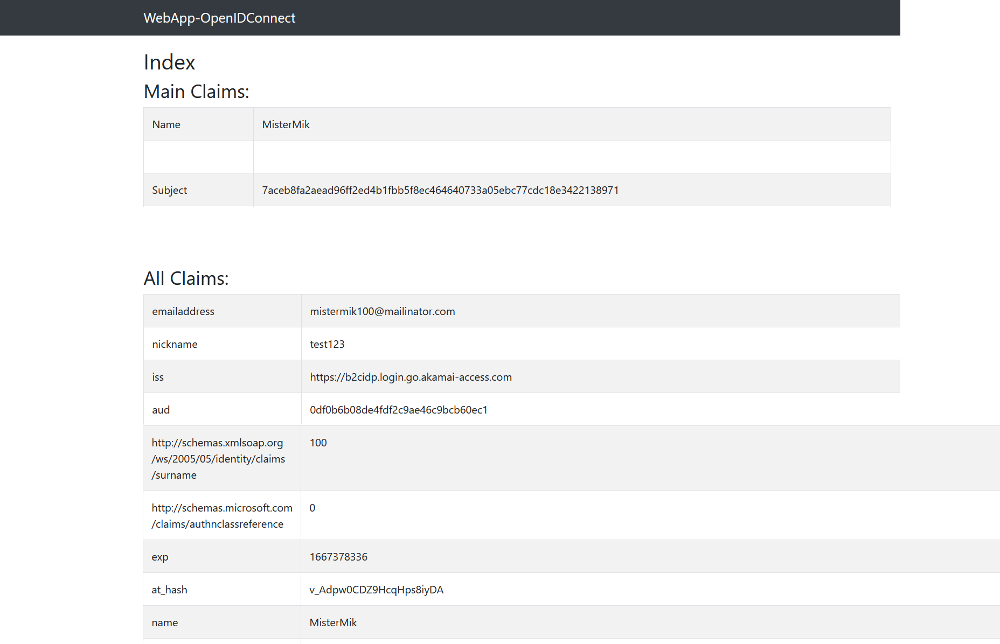](./media/partner-akamai-secure-hybrid-access/akamai-oidc-app-results.png#lightbox)

## Test the solution

1. Navigate to the application URL, using the external URL specified in the Akamai Enterprise Application Access.

2. Unauthenticated user is redirected to the Azure AD B2C sign-in page.

3. Select the IdP from the list on the page.

3. Sign-in as an end user using credentials linked to Azure AD B2C.

4. After successful authentication, the end user will be redirected back to the application and signed into the application as the end user.

::: zone-end

## Additional resources

- [Akamai Enterprise Application Access getting started documentation](https://techdocs.akamai.com/eaa/docs/welcome-guide)

- [Custom policies in Azure AD B2C](custom-policy-overview.md)

- [Get started with custom policies in Azure AD B2C](tutorial-create-user-flows.md?pivots=b2c-custom-policy)

- [Register a SAML application in Azure AD B2C](saml-service-provider.md?tabs=windows&pivots=b2c-custom-policy)
