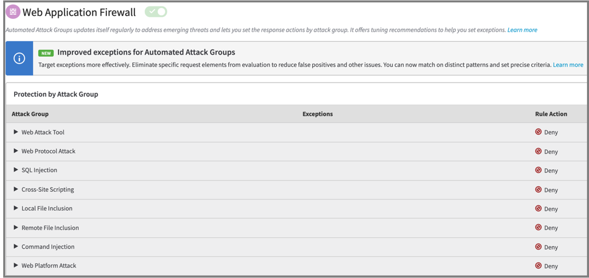

# Configure Azure Active Directory B2C with Akamai Web Application Protector

Learn to enable Akamai Web Application Protector (WAP) for Azure Active Directory B2C (Azure AD B2C) tenant using custom domains. Akamai WAP helps organization protect their web applications from malicious attacks that aim to exploit vulnerabilities such as SQL injection and Cross site scripting.

Learn more on akamai.com: [What Is a Web Application Firewall (WAF)?](https://www.akamai.com/glossary/what-is-a-waf)

Benefits of using WAF:

* Control traffic management to your services
* Configure in front of an Azure AD B2C tenant
* Manipulate traffic to protect and secure your identity infrastructure

This article applies to:

WAP: [Web Application Protector](https://www.akamai.com/products/web-application-protector)
KSD: [Kona Site Defender](https://www.akamai.com/us/en/products/security/kona-site-defender.jsp) 

## Prerequisites

* An Azure subscription
  * If you don't have one, get an [Azure free account](https://azure.microsoft.com/free/)
* An Azure AD B2C tenant linked to your Azure subscription
  * See, [Tutorial: Create an Azure Active Directory B2C tenant](tutorial-create-tenant.md) 
* An Akamai WAP account
  * Go to akamai.com for [Explore all Akamai products and trials](https://www.akamai.com/us/en/akamai-free-trials.jsp)

## Scenario description

Akamai WAP integration includes the following components:

* **Azure AD B2C** – the authorization server that verifies user credentials with custom policies in the tenant. Also known as the identity provider (IdP).
* **Azure Front Door** – enables custom domains for the Azure B2C tenant
  * Traffic from Akamai WAP routs to Azure Front Door then goes to the Azure AD B2C tenant
  * [What is Azure Front Door?](../frontdoor/front-door-overview.md) 
* **Akamai WAP** – The web application firewall that manages traffic sent to the authorization server
  * See, [Web Application Protector](https://www.akamai.com/us/en/resources/waf.jsp)

## Integrate with Azure AD B2C

For custom domains in Azure AD B2C, use the custom domain feature in Azure Front Door. 

See, [Enable custom domains for Azure AD B2C](./custom-domain.md?pivots=b2c-user-flow).  

When the custom domain for Azure AD B2C is configured using Azure Front Door, use the following instructions to test the custom domain.

See, [Test your custom domain](./custom-domain.md?pivots=b2c-custom-policy#test-your-custom-domain), then proceed to the next section.  

## Create an Akamai account

1. Go to [akamai.com](https://www.akamai.com).
2. Select **Learn more**.
3. On the **Cloud Computing Services** page, select **Create account**.

### Create and configure a property

A property is a configuration file that tells our edge servers how to handle and respond to incoming requests from your end users. Properties are created and maintained in Property Manager.

To learn more, go to techdocs.akamai.com for [What is a Property?](https://techdocs.akamai.com/start/docs/prop)

1. Go to control.akamai.com to sign in: [Akamai Control Center sign in page](https://control.akamai.com/wh/CUSTOMER/AKAMAI/en-US/WEBHELP/property-manager/property-manager-help/GUID-14BB87F2-282F-4C4A-8043-B422344884E6.html).
2. Go to Property Manager.
3. For **Property version**, select **Standard** or **Enhanced TLS** (recommended).
4. For **Property hostnames**, add a property hostname, your custom domain. For example, `login.domain.com`. 

  > [!IMPORTANT]
  > Create or modify certificates with correct custom domain name settings.   Go to techdocs.akamai.com for [Configure HTTPS hostnames](https://techdocs.akamai.com/property-mgr/docs/serve-content-over-https). 

#### Origin server property configuration settings

Use the following settings for origin server.

1. For **Origin type**, enter your type.
2. For **Origin server hostname** enter your hostname. For example, `yourafddomain.azurefd.net`
3. For **Forward host header**, use **Incoming Host Header**.
4. For **Cache key hostname** use **Incoming Host Header**.

### Configure DNS

Create a Canonical Name (CNAME) record in your DNS, such as `login.domain.com`, which points to the Edge hostname in the **Property hostname** field.

### Configure Akamai WAP

1. To get started with WAP configuration, go to techdocs.akamai.com for [App & API Protector](https://techdocs.akamai.com/cloud-security/docs/app-api-protector).
2. During configuration, for items in **Attack Group**, under **Rule Actions**, select **Deny**.

    

### Test the settings

To ensure traffic to Azure AD B2C goes through the custom domain:

* Confirm WAP routes incoming requests to the Azure AD B2C custom domain
  * Ensure a valid TLS connection
* Ensure Azure AD B2C sets cookies correctly for the custom domain
* The WAP dashboard in Defender for Cloud console has WAP traffic charts
  * Attack traffic also appears

## Next steps

* [Enable custom domains for Azure Active Directory B2C](./custom-domain.md?pivots=b2c-user-flow)
* [Tutorial: Create user flows and custom policies in Azure AD B2C](./tutorial-create-user-flows.md?pivots=b2c-custom-policy&tabs=applications)
