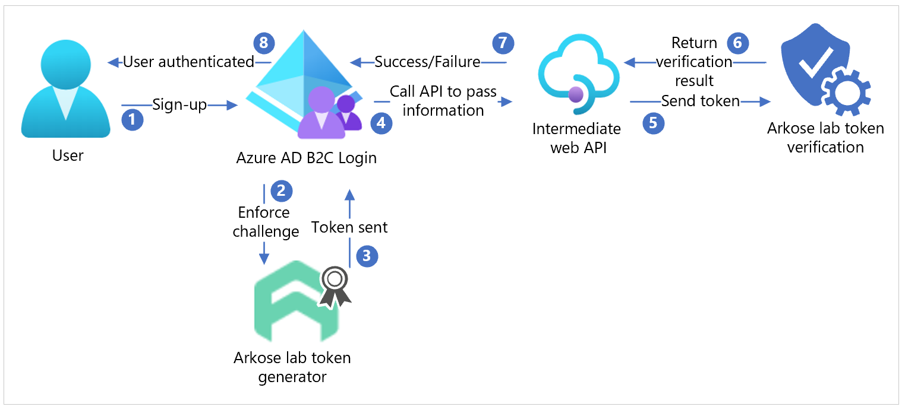
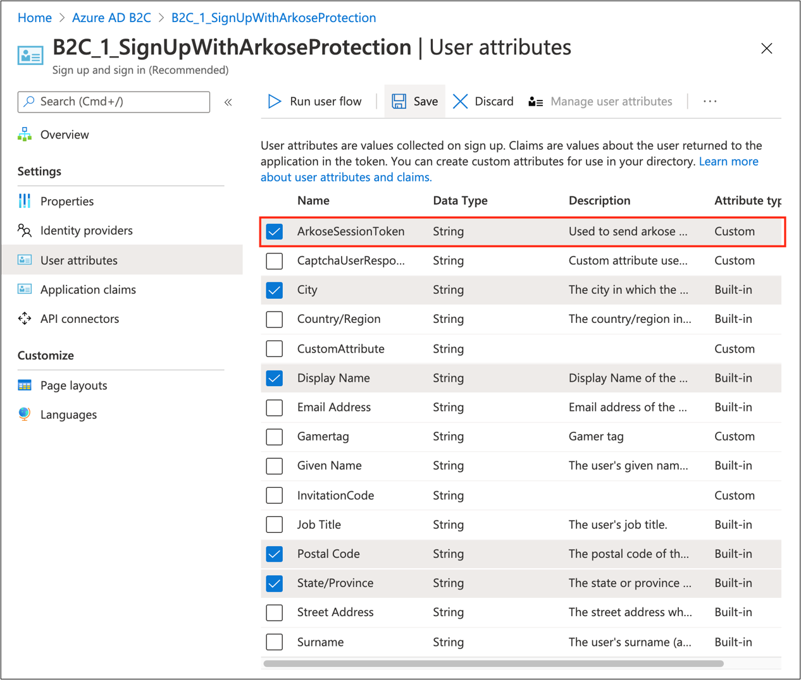
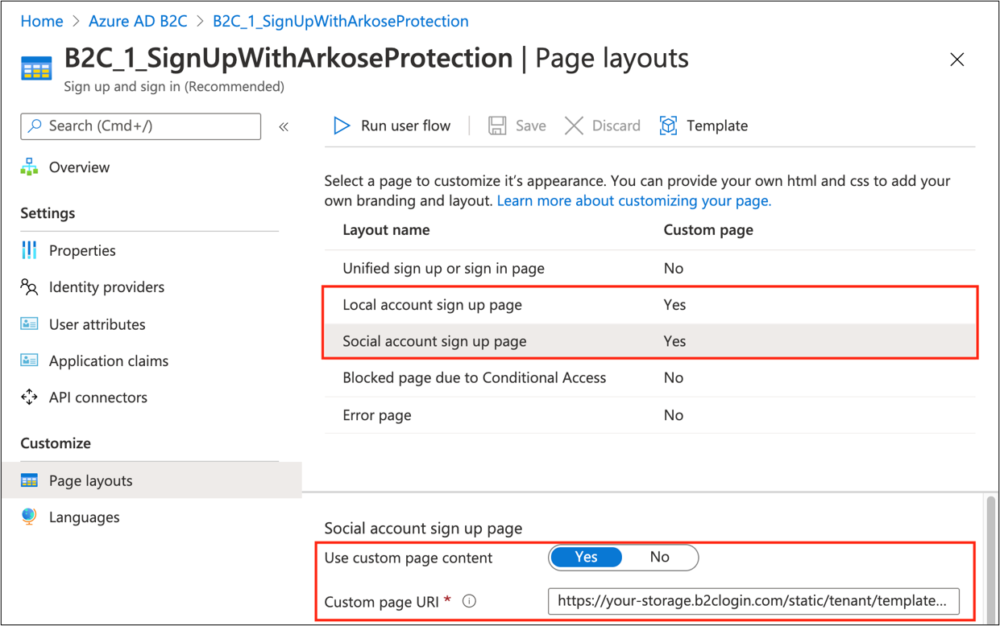
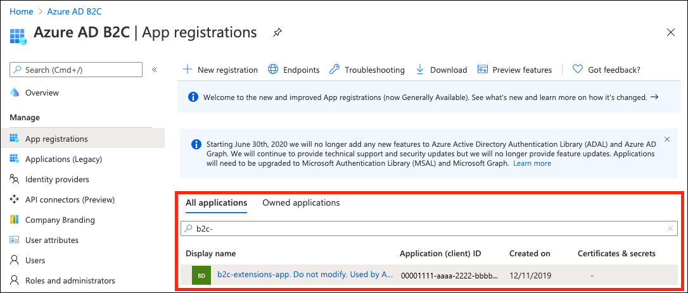
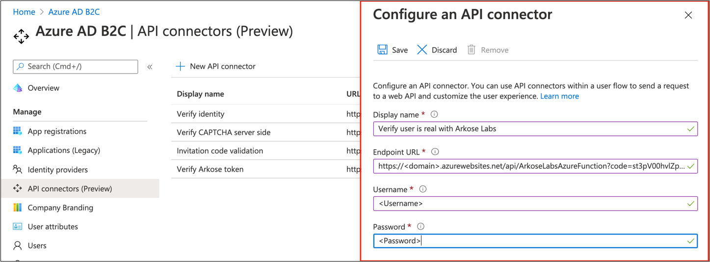
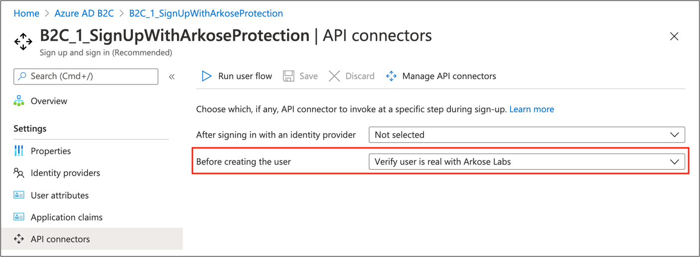

# Tutorial: Configure Arkose Labs with Azure Active Directory B2C

In this sample tutorial, learn how to integrate Azure Active Directory (AD) B2C authentication with [Arkose Labs](https://www.arkoselabs.com/). Arkose Labs help organizations against bot attacks, account takeover attacks, and fraudulent account openings.  

## Prerequisites

To get started, you'll need:

- An Azure subscription. If you don't have a subscription, you can get a [free account](https://azure.microsoft.com/free/).

- [An Azure AD B2C tenant](tutorial-create-tenant.md) that is linked to your Azure subscription.

- An [Arkose Labs](https://www.arkoselabs.com/book-a-demo/) account.

## Scenario description

Arkose Labs integration includes the following components:

- **Arkose Labs** - A fraud and abuse service for protecting against bots and other automated abuse.

- **Azure AD B2C sign-up user flow** - The sign-up experience that will be using the Arkose Labs service. Will use the custom HTML and JavaScript, and API connectors to integrate with the Arkose Labs service.

- **Azure functions** - API endpoint hosted by you that works with the API connectors feature. This API is responsible for doing the server-side validation of the Arkose Labs session token.

The following diagram describes how Arkose Labs integrates with Azure AD B2C.



| Step  | Description |
|---|---|
|1     | A user signs-up and creates an account. When the user selects submit, an Arkose Labs enforcement challenge appears.         |
|2     |  After the user completes the challenge, Azure AD B2C sends the status to Arkose Labs to generate a token. |
|3     |  Arkose Labs generates a token and sends it back to Azure AD B2C.   |
|4     |  Azure AD B2C calls an intermediate web API to pass the sign-up form.      |
|5     |  The intermediate web API sends the sign-up form to Arkose Lab for token verification.    |
|6     | Arkose Lab processes and sends the verification results back to the intermediate web API.|
|7     | The intermediate web API sends the success or failure result from the challenge to Azure AD B2C. |
|8     | If the challenge is successfully completed, a sign-up form is submitted to Azure AD B2C, and Azure AD B2C completes the authentication.|

## Onboard with Arkose Labs

1. Contact [Arkose](https://www.arkoselabs.com/book-a-demo/) and create an account.

2. Once the account is created, navigate to https://dashboard.arkoselabs.com/login  

3. Within the dashboard, navigate to site settings to find your public key and private key. This information will be needed later to configure Azure AD B2C. The values of public and private keys  are referred to as `ARKOSE_PUBLIC_KEY` and `ARKOSE_PRIVATE_KEY` in the [sample code](https://github.com/Azure-Samples/active-directory-b2c-node-sign-up-user-flow-arkose).

## Integrate with Azure AD B2C

### Part 1 – Create a ArkoseSessionToken custom attribute

To create a custom attribute, follow these steps:  

1. Go to **Azure portal** > **Azure AD B2C**

2. Select **User attributes**

3. Select **Add**

4. Enter **ArkoseSessionToken** as the attribute Name

5. Select **Create**

Learn more about [custom attributes](./user-flow-custom-attributes.md?pivots=b2c-user-flow).

### Part 2 - Create a user flow

The user flow can be either for **sign-up** and **sign in** or just **sign-up**. The Arkose Labs user flow will only be shown during sign-up.

1. See the [instructions](./tutorial-create-user-flows.md) to create a user flow. If using an existing user flow, it must be of the **Recommended** version type.

2. In the user flow settings, go to **User attributes** and select the **ArkoseSessionToken** claim.



### Part 3 - Configure custom HTML, JavaScript, and page layouts

Go to the provided [HTML script](https://github.com/Azure-Samples/active-directory-b2c-node-sign-up-user-flow-arkose/blob/main/Assets/selfAsserted.html). The file contains an HTML template with JavaScript `<script>` tags that will do three things:

1. Load the Arkose Labs script, which renders the Arkose Labs widget and does client-side Arkose Labs validation.

2. Hide the `extension_ArkoseSessionToken` input element and label, corresponding to the `ArkoseSessionToken` custom attribute, from the UI shown to the user.

3. When a user completes the Arkose Labs challenge, Arkose Labs verifies the user's response and generates a token. The callback `arkoseCallback` in the custom JavaScript sets the value of `extension_ArkoseSessionToken` to the generated token value. This value will be submitted to the API endpoint as described in the next section.

    See [this article](https://arkoselabs.atlassian.net/wiki/spaces/DG/pages/214176229/Standard+Setup) to learn about Arkose Labs client-side validation.

Follow the steps mentioned to use the custom HTML and JavaScript for your user flow.

1. Modify [selfAsserted.html](https://github.com/Azure-Samples/active-directory-b2c-node-sign-up-user-flow-arkose/blob/main/Assets/selfAsserted.html) file so that `<ARKOSE_PUBLIC_KEY>` matches the value you generated for the client-side validation, and used to load the Arkose Labs script for your account.

2. Host the HTML page on a Cross-origin Resource Sharing (CORS) enabled web endpoint. [Create an Azure blob storage account](../storage/common/storage-account-create.md?tabs=azure-portal&toc=%2fazure%2fstorage%2fblobs%2ftoc.json) and [configure CORS](/rest/api/storageservices/cross-origin-resource-sharing--cors--support-for-the-azure-storage-services).

  >[!NOTE]
  >If you have your own custom HTML, copy and paste the `<script>` elements onto your HTML page.

3. Follow these steps to configure the page layouts

   a. From the Azure portal, go to **Azure AD B2C**

   b. Navigate to **User flows** and select your user flow

   c. Select **Page layouts**

   d. Select **Local account sign up page layout**

   e. Toggle **Use custom page content** to **YES**

   f. Paste the URI where your custom HTML lives in **Use custom page content**

   g. If you're using social Identity providers, repeat **step e** and **f** for **Social account sign-up page** layout.

   

4. From your user flow, go to **Properties** and select **Enable JavaScript** enforcing page layout (preview). See this [article](./javascript-and-page-layout.md?pivots=b2c-user-flow) to learn more.

### Part 4 - Create and deploy your API

Install the [Azure Functions extension](https://marketplace.visualstudio.com/items?itemName=ms-azuretools.vscode-azurefunctions) for Visual Studio Code.

>[!Note]
>Steps mentioned in this section assumes you are using Visual Studio Code to deploy the Azure Function. You can also use Azure portal, terminal or command prompt, or any other code editor to deploy.

#### Run the API locally

1. Navigate to the Azure extension in Visual Studio code on the left navigation bar. Select **Local Project** folder representing your local Azure Function.

2. Press **F5** or use the **Debug** > **Start Debugging** menu to launch the debugger and attach to the Azure Functions host. This command automatically uses the single debug configuration that Azure Function created.

3. The Azure Function extension will automatically generate a few files for local development, install dependencies, and install the Function Core tools if not already present. These tools help with the debugging experience.

4. Output from the Function Core tool appears in the Visual Studio Code **Terminal** panel. Once the host has started, **Alt+click** the local URL shown in the output to open the browser and run the function. In the Azure Functions explorer, right-click on the function to see the url of the locally hosted function.

To redeploy the local instance during testing, repeat steps 1 to 4.

#### Add environment variables

This sample protects the web API endpoint using [HTTP Basic authentication](https://tools.ietf.org/html/rfc7617).

Username and password are stored as environment variables and  not as part of the repository. See [local.settings.json](../azure-functions/functions-run-local.md?tabs=macos%2ccsharp%2cbash#local-settings-file) file for more information.

1. Create a local.settings.json file in your root folder

2. Copy and paste the below code onto the file:

```
{
  "IsEncrypted": false,
  "Values": {
    "AzureWebJobsStorage": "",
    "FUNCTIONS_WORKER_RUNTIME": "node",
    "BASIC_AUTH_USERNAME": "<USERNAME>",
    "BASIC_AUTH_PASSWORD": "<PASSWORD>",
    "ARKOSE_PRIVATE_KEY": "<ARKOSE_PRIVATE_KEY>",
    "B2C_EXTENSIONS_APP_ID": "<B2C_EXTENSIONS_APP_ID>"
  }
}
```
The **BASIC_AUTH_USERNAME** and **BASIC_AUTH_PASSWORD** values are going to be the credentials used to authenticate the API call to your Azure Function. Choose your desired values.

The `<ARKOSE_PRIVATE_KEY>` is the server-side secret you generated in the Arkose Labs service. It's used to call the [Arkose Labs server-side validation API](https://arkoselabs.atlassian.net/wiki/spaces/DG/pages/266214758/Server-Side+Instructions) to validate the value of the `ArkoseSessionToken` generated by the front end.

The `<B2C_EXTENSIONS_APP_ID>` is the application ID of the app used by Azure AD B2C to store custom attributes in the directory. You can find this application ID by navigating to App registrations, searching for b2c-extensions-app, and copying the Application (client) ID from the **Overview** pane. Remove the `-` characters.



#### Deploy the application to the web

1. Follow the steps mentioned in [this](/azure/javascript/tutorial-vscode-serverless-node-04) guide to deploy your Azure Function to the cloud. Copy the endpoint web URL of your Azure Function.

2. Once deployed, select the **Upload settings** option. It will upload your environment variables onto the [Application settings](../azure-functions/functions-develop-vs-code.md?tabs=csharp#application-settings-in-azure) of the App service. These application settings can also be configured or [managed via the Azure portal.](../azure-functions/functions-how-to-use-azure-function-app-settings.md)

See [this article](../azure-functions/functions-develop-vs-code.md?tabs=csharp#republish-project-files) to learn more about Visual Studio Code development for Azure Functions.

#### Configure and enable the API connector

[Create an API connector](./add-api-connector.md) and enable it for your user flow. 
Your API connector configuration should look like:



- **Endpoint URL** - is the Function URL you copied earlier while you deployed Azure Function.

- **Username and Password** - are the Username and Password you defined as environment variables earlier.

To enable the API connector, in the **API connector** settings for your user flow, select the API connector to be invoked at the **Before creating the user** step. This will invoke the API when a user selects **Create** in the sign-up flow. The API will do a server-side validation of the `ArkoseSessionToken` value, which was set by the callback of the Arkose widget `arkoseCallback`.



## Test the user flow

1. Open the Azure AD B2C tenant and under Policies select **User flows**.

2. Select your previously created User Flow.

3. Select **Run user flow** and select the settings:

   a. Application: select the registered app (sample is JWT)

   b. Reply URL: select the redirect URL

   c. Select **Run user flow**.

4. Go through the sign-up flow and create an account

5. Sign out

6. Go through the sign-in flow  

7. An Arkose Labs puzzle will appear after you select **continue**.

## Additional resources

- [Sample codes](https://github.com/Azure-Samples/active-directory-b2c-node-sign-up-user-flow-arkose) for Azure AD B2C sign-up user flow

- [Custom policies in Azure AD B2C](./custom-policy-overview.md)

- [Get started with custom policies in Azure AD B2C](./tutorial-create-user-flows.md?pivots=b2c-custom-policy)