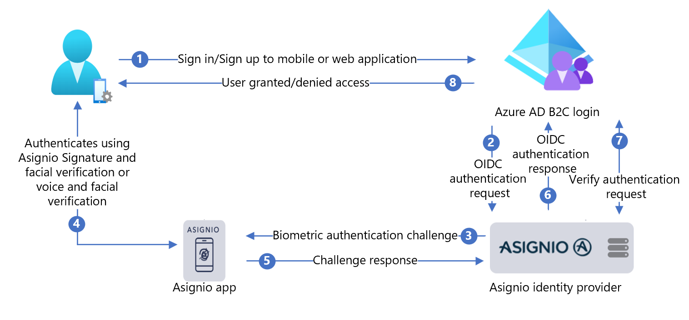

# Configure Asignio with Azure Active Directory B2C for multifactor authentication

Learn to integrate Microsoft Entra ID (Azure AD B2C) authentication with [Asignio](https://www.web.asignio.com/). With this integration, provide passwordless, soft biometric, and multifactor authentication experience to customers. Asignio uses patented Asignio Signature and live facial verification for user authentication. The changeable biometric signature helps to reduce passwords, fraud, phishing, and credential reuse through omni-channel authentication.

## Before you begin

Choose a policy type selector to indicate the policy type setup. Azure AD B2C has two methods to define how users interact with your applications: 

* Predefined user flows
* Configurable custom policies

The steps in this article differ for each method.

Learn more:

* [User flows and custom policies overview](user-flow-overview.md)
* [Azure AD B2C custom policy overview](custom-policy-overview.md)


## Prerequisites

* An Azure subscription. 

* If you don't have on, get an [Azure free account](https://azure.microsoft.com/free/)

- An Azure AD B2C tenant linked to the Azure subscription
- See, [Tutorial: Create an Azure Active Directory B2C tenant](./tutorial-create-tenant.md) 

- An Asignio Client ID and Client Secret issued by Asignio. 
- These tokens are obtained by registering your mobile or web applications with Asignio.

### For custom policies

Complete [Tutorial: Create user flows and custom policies in Azure AD B2C](./tutorial-create-user-flows.md?pivots=b2c-custom-policy)

## Scenario description

This integration includes the following components:

* **Azure AD B2C** - authorization server that verifies user credentials
* **Web or mobile applications** - to secure with Asignio MFA
* **Asignio web application** - signature biometric collection on the user touch device

The following diagram illustrates the implementation.

   


1. User opens Azure AD B2C sign in page on their mobile or web application, and then signs in or signs up.
2. Azure AD B2C redirects the user to Asignio using an OpenID Connect (OIDC) request.
3. The user is redirected to the Asignio web application for biometric sign in. If the user hasn't registered their Asignio Signature, they can use an SMS One-Time-Password (OTP) to authenticate. After authentication, user receives a registration link to create their Asignio Signature.
4. The user authenticates with Asignio Signature and facial verification, or voice and facial verification.
5. The challenge response goes to Asignio. 
6. Asignio returns the OIDC response to Azure AD B2C sign in.
7. Azure AD B2C sends an authentication verification request to Asignio to confirm receipt of the authentication data.
8. The user is granted or denied access to the application. 

## Configure an application with Asignio

Configurating an application with Asignio is with the Asignio Partner Administration site. 

1. Go to asignio.com [Asignio Partner Administration](https://partner.asignio.com) page to request access for your organization. 
2. With credentials, sign into Asignio Partner Administration.
3. Create a record for the Azure AD B2C application using your Azure AD B2C tenant. When you use Azure AD B2C with Asignio, Azure AD B2C manages connected applications. Asignio apps represent apps in the Azure portal.
4. In the Asignio Partner Administration site, generate a Client ID and Client Secret. 
5. Note and store Client ID and Client Secret. You'll use them later. Asignio doesn't store Client Secrets.
6. Enter the redirect URI in your site the user is returned to after authentication. Use the following URI pattern.

`[https://<your-b2c-domain>.b2clogin.com/<your-b2c-domain>.onmicrosoft.com/oauth2/authresp]`.

7. Upload a company logo. It appears on Asignio authentication when users sign in.

## Register a web application in Azure AD B2C

Register applications in a tenant you manage, then they can interact with Azure AD B2C.

Learn more: [Application types that can be used in Active Directory B2C](application-types.md)

For this tutorial, you're registering  `https://jwt.ms`, a Microsoft web application with decoded token contents that don't leave your browser.

### Register a web application and enable ID token implicit grant

Complete [Tutorial: Register a web application in Azure Active Directory B2C](tutorial-register-applications.md?tabs=app-reg-ga)

## Configure Asignio as an identity provider in Azure AD B2C

For the following instructions, use the Microsoft Entra tenant with the Azure subscription.

1. Sign in to the [Azure portal](https://portal.azure.com/#home) as the Global Administrator of the Azure AD B2C tenant.
2. In the Azure portal toolbar, select **Directories + subscriptions**.
3. On **Portal settings | Directories + subscriptions**, in the **Directory name** list, locate your Microsoft Entra directory.
4. Select **Switch**.
5. In the top-left corner of the Azure portal, select **All services**.
6. Search for and select **Azure AD B2C**.
7. In the Azure portal, search for and select **Azure AD B2C**.
8. In the left menu, select **Identity providers**.
9. Select **New OpenID Connect Provider**.
10. Select **Identity provider type** > **OpenID Connect**.
11. For **Name**, enter the Asignio sign in, or a name you choose.
12. For **Metadata URL**, enter `https://authorization.asignio.com/.well-known/openid-configuration`.
13. For **Client ID**, enter the Client ID you generated.
14. For **Client Secret**, enter the Client Secret you generated.
15. For **Scope**, use **openid email profile**.
16. For **Response type**, use **code**.
17. For **Response mode**, use **query**.
18. For Domain hint, use `https://asignio.com`.
19. Select **OK**.
20. Select **Map this identity provider's claims**.
21. For **User ID**, use **sub**.
22. For **Display Name**, use **name**.
23. For **Given Name**, use **given_name**.
24. For **Surname**, use **family_name**.
25. For **Emai**l, use **email**.
26. Select **Save**.

## SCreate a user flow policy

1. In your Azure AD B2C tenant, under **Policies**, select **User flows**.  
2. Select **New user flow**.
3. Select **Sign up and sign in** user flow type.
4. Select **Version Recommended**.
5. Select **Create**.
6. Enter a user flow **Name**, such as `AsignioSignupSignin`.
7. Under **Identity providers**, for **Local Accounts**, select **None**. This action disables email and password authentication.
8. For **Custom identity providers**, select the created Asignio Identity provider. 
9. Select **Create**.

## Test your user flow

1. In your Azure AD B2C tenant, select **User flows**.
2. Select the created user flow.
3. For **Application**, select the web application you registered. The **Reply URL** is `https://jwt.ms`.
4. Select **Run user flow**. 
5. The browser is redirected to the Asignio sign in page.
6. A sign in screen appears.
7. At the bottom, select **Asignio** authentication.

If you have an Asignio Signature, complete the prompt to authenticate. If not, supply the device phone number to authenticate via SMS OTP. Use the link to register your Asignio Signature.

8. The browser is redirected to `https://jwt.ms`. The token contents returned by Azure AD B2C appear.

## Create Asignio policy key

1. Store the generated Client Secret in the Azure AD B2C tenant.
2. Sign in to the [Azure portal](https://portal.azure.com/).
3. In the portal toolbar, select the **Directories + subscriptions**.
4. On **Portal settings | Directories + subscriptions**, in the **Directory name** list, locate your Azure AD B2C directory.
5. Select **Switch**.
6. In the top-left corner of the Azure portal, select **All services**.
7. Search for and select **Azure AD B2C**.
8. On the Overview page, select **Identity Experience Framework**.
9. Select **Policy Keys**.
10. Select **Add**.
11. For **Options**, select **Manual**.
12. Enter a policy key **Name** for the policy key. The prefix `B2C_1A_` is appended to the key name.
13. In **Secret**, enter the Client Secret that you noted.
14. For **Key usage**, select **Signature**.
15. Select **Create**.

## Configure Asignio as an Identity provider

>[!TIP]
>Before you begin, ensure the Azure AD B2C policy is configured. If not, follow the instructions in [Custom policy starter pack](tutorial-create-user-flows.md?pivots=b2c-custom-policy#custom-policy-starter-pack).

For users to sign in with Asignio, define Asignio as a claims provider that Azure AD B2C communicates with through an endpoint. The endpoint provides claims Azure AD B2C uses to verify user authentication with using digital ID on the device.

### Add Asignio as a claims provider

Get the custom policy starter packs from GitHub, then update the XML files in the LocalAccounts starter pack with your Azure AD B2C tenant name:

1. Download the zip [active-directory-b2c-custom-policy-starterpack](https://github.com/Azure-Samples/active-directory-b2c-custom-policy-starterpack/archive/master.zip) or clone the repository:

   ```
       git clone https://github.com/Azure-Samples/active-directory-b2c-custom-policy-starterpack
   ```
    
2. In the files in the **LocalAccounts** directory, replace the string `yourtenant` with the Azure AD B2C tenant name. 
3. Open the **LocalAccounts/ TrustFrameworkExtensions.xml**.
4. Find the **ClaimsProviders** element. If there isn't one, add it under the root element, `TrustFrameworkPolicy`.
5. Add a new **ClaimsProvider** similar to the following example:

   ```xml
    <ClaimsProvider>
      <Domain>contoso.com</Domain>
      <DisplayName>Asignio</DisplayName>
      <TechnicalProfiles>
        <TechnicalProfile Id="Asignio-Oauth2">
          <DisplayName>Asignio</DisplayName>
          <Description>Login with your Asignio account</Description>
          <Protocol Name="OAuth2" />
          <Metadata>
            <Item Key="ProviderName">authorization.asignio.com</Item>
            <Item Key="authorization_endpoint">https://authorization.asignio.com/authorize</Item>
            <Item Key="AccessTokenEndpoint">https://authorization.asignio.com/token</Item>
            <Item Key="ClaimsEndpoint">https://authorization.asignio.com/userinfo</Item>
            <Item Key="ClaimsEndpointAccessTokenName">access_token</Item>
            <Item Key="BearerTokenTransmissionMethod">AuthorizationHeader</Item>
            <Item Key="HttpBinding">POST</Item>
            <Item Key="scope">openid profile email</Item>
            <Item Key="UsePolicyInRedirectUri">0</Item>
            <!-- Update the Client ID below to the Asignio Application ID -->
            <Item Key="client_id">00000000-0000-0000-0000-000000000000</Item>
            <Item Key="IncludeClaimResolvingInClaimsHandling">true</Item>


            <!-- trying to add additional claim-->
            <!--Insert b2c-extensions-app application ID here, for example: 11111111-1111-1111-1111-111111111111-->
            <Item Key="11111111-1111-1111-1111-111111111111"></Item>
            <!--Insert b2c-extensions-app application ObjectId here, for example: 22222222-2222-2222-2222-222222222222-->
            <Item Key="22222222-2222-2222-2222-222222222222"></Item>
            <!-- The key below allows you to specify each of the Azure AD tenants that can be used to sign in. Update the GUIDs below for each tenant. -->
            <!--<Item Key="ValidTokenIssuerPrefixes">https://login.microsoftonline.com/11111111-1111-1111-1111-111111111111</Item>-->
            <!-- The commented key below specifies that users from any tenant can sign-in. Uncomment if you would like anyone with an Azure AD account to be able to     sign in. -->
            <Item Key="ValidTokenIssuerPrefixes">https://login.microsoftonline.com/</Item>
          </Metadata>
          <CryptographicKeys>
            <Key Id="client_secret" StorageReferenceId="B2C_1A_AsignioSecret" />
          </CryptographicKeys>
          <OutputClaims>
            <OutputClaim ClaimTypeReferenceId="issuerUserId" PartnerClaimType="sub" />
            <OutputClaim ClaimTypeReferenceId="tenantId" PartnerClaimType="tid" AlwaysUseDefaultValue="true" DefaultValue="{Policy:TenantObjectId}" />
            <OutputClaim ClaimTypeReferenceId="authenticationSource" DefaultValue="socialIdpAuthentication" AlwaysUseDefaultValue="true" />
            <OutputClaim ClaimTypeReferenceId="identityProvider" PartnerClaimType="iss" DefaultValue="https://authorization.asignio.com" />
            <OutputClaim ClaimTypeReferenceId="identityProviderAccessToken" PartnerClaimType="{oauth2:access_token}" />
            <OutputClaim ClaimTypeReferenceId="givenName" PartnerClaimType="given_name" />
            <OutputClaim ClaimTypeReferenceId="surName" PartnerClaimType="family_name" />
            <OutputClaim ClaimTypeReferenceId="displayName" PartnerClaimType="name" />
            <OutputClaim ClaimTypeReferenceId="email" PartnerClaimType="email" />
          </OutputClaims>
          <OutputClaimsTransformations>
            <OutputClaimsTransformation ReferenceId="CreateRandomUPNUserName" />
            <OutputClaimsTransformation ReferenceId="CreateUserPrincipalName" />
            <OutputClaimsTransformation ReferenceId="CreateAlternativeSecurityId" />
            <OutputClaimsTransformation ReferenceId="CreateSubjectClaimFromAlternativeSecurityId" />
          </OutputClaimsTransformations>
          <UseTechnicalProfileForSessionManagement ReferenceId="SM-SocialLogin" />
        </TechnicalProfile>
      </TechnicalProfiles>
    </ClaimsProvider>
   ```

6. Set **client_id** with the Asignio Application ID you noted.
7. Update **client_secret** section with the policy key you created. For example, `B2C_1A_AsignioSecret`:

   ```xml
   <Key Id="client_secret" StorageReferenceId="B2C_1A_AsignioSecret" />
   ```

8. Save the changes.

## Add a user journey

The identity provider isn't in the sign in pages. 

1. If you have a custom user journey continue to **Configure the relying party policy**, otherwise, copy a template user journey:
2. From the starter pack, open the **LocalAccounts/ TrustFrameworkBase.xml**.
3. Locate and copy the contents of the **UserJourney** element that include `Id=SignUpOrSignIn`.
4. Open the **LocalAccounts/ TrustFrameworkExtensions.xml**.
5. Locate the **UserJourneys** element. If there isn't one, add one.
6. Paste the UserJourney element contents as a child of the UserJourneys element.]
7. Rename the user journey **ID**. For example, `Id=AsignioSUSI`.

Learn more: [User journeys](custom-policy-overview.md#user-journeys)

## Add the identity provider to a user journey

Add the new identity provider to the user journey.

1. Find the orchestration step element that includes `Type=CombinedSignInAndSignUp`, or `Type=ClaimsProviderSelection` in the user journey. It's usually the first orchestration step. The **ClaimsProviderSelections** element has an identity provider list that users sign in with. The order of the elements controls the order of the sign in buttons. 
2. Add a **ClaimsProviderSelection** XML element. 
3. Set the value of **TargetClaimsExchangeId** to a friendly name.
4. Add a **ClaimsExchange** element. 
5. Set the **Id** to the value of the target claims exchange ID. 
6. Update the value of **TechnicalProfileReferenceId** to the ID of the technical profile you created.

The following XML demonstrates user journey orchestration with the identity provider.

```xml
    <UserJourney Id="AsignioSUSI">
      <OrchestrationSteps>
        <OrchestrationStep Order="1" Type="CombinedSignInAndSignUp" ContentDefinitionReferenceId="api.signuporsignin">
          <ClaimsProviderSelections>
            <ClaimsProviderSelection TargetClaimsExchangeId="AsignioExchange" />
            <ClaimsProviderSelection ValidationClaimsExchangeId="LocalAccountSigninEmailExchange" />
          </ClaimsProviderSelections>
          <ClaimsExchanges>
            <ClaimsExchange Id="LocalAccountSigninEmailExchange" TechnicalProfileReferenceId="SelfAsserted-LocalAccountSignin-Email" />
          </ClaimsExchanges>
        </OrchestrationStep>
        <!-- Check if the user has selected to sign in using one of the social providers -->
        <OrchestrationStep Order="2" Type="ClaimsExchange">
          <Preconditions>
            <Precondition Type="ClaimsExist" ExecuteActionsIf="true">
              <Value>objectId</Value>
              <Action>SkipThisOrchestrationStep</Action>
            </Precondition>
          </Preconditions>
          <ClaimsExchanges>
            <ClaimsExchange Id="AsignioExchange" TechnicalProfileReferenceId="Asignio-Oauth2" />
            <ClaimsExchange Id="SignUpWithLogonEmailExchange" TechnicalProfileReferenceId="LocalAccountSignUpWithLogonEmail" />
          </ClaimsExchanges>
        </OrchestrationStep>
        <OrchestrationStep Order="3" Type="ClaimsExchange">
          <Preconditions>
            <Precondition Type="ClaimEquals" ExecuteActionsIf="true">
              <Value>authenticationSource</Value>
              <Value>localAccountAuthentication</Value>
              <Action>SkipThisOrchestrationStep</Action>
            </Precondition>
          </Preconditions>
          <ClaimsExchanges>
            <ClaimsExchange Id="AADUserReadUsingAlternativeSecurityId" TechnicalProfileReferenceId="AAD-UserReadUsingAlternativeSecurityId-NoError" />
          </ClaimsExchanges>
        </OrchestrationStep>
        <!-- Show self-asserted page only if the directory does not have the user account already (i.e. we do not have an objectId). This can only happen when authentication happened using a social IDP. If local account was created or authentication done using ESTS in step 2, then an user account must exist in the directory by this time. -->
        <OrchestrationStep Order="4" Type="ClaimsExchange">
          <Preconditions>
            <Precondition Type="ClaimsExist" ExecuteActionsIf="true">
              <Value>objectId</Value>
              <Action>SkipThisOrchestrationStep</Action>
            </Precondition>
          </Preconditions>
          <ClaimsExchanges>
            <ClaimsExchange Id="SelfAsserted-Social" TechnicalProfileReferenceId="SelfAsserted-Social" />
          </ClaimsExchanges>
        </OrchestrationStep>
        <!-- This step reads any user attributes that we may not have received when authenticating using ESTS so they can be sent            in the token. -->
        <OrchestrationStep Order="5" Type="ClaimsExchange">
          <Preconditions>
            <Precondition Type="ClaimEquals" ExecuteActionsIf="true">
              <Value>authenticationSource</Value>
              <Value>socialIdpAuthentication</Value>
              <Action>SkipThisOrchestrationStep</Action>
            </Precondition>
          </Preconditions>
          <ClaimsExchanges>
            <ClaimsExchange Id="AADUserReadWithObjectId" TechnicalProfileReferenceId="AAD-UserReadUsingObjectId" />
          </ClaimsExchanges>
        </OrchestrationStep>
        <!-- The previous step (SelfAsserted-Social) could have been skipped if there were no attributes to collect from the user. So, in that case, create the user in the directory if one does not already exist (verified using objectId which would be set from the last step if account was created in the directory. -->
        <OrchestrationStep Order="6" Type="ClaimsExchange">
          <Preconditions>
            <Precondition Type="ClaimsExist" ExecuteActionsIf="true">
              <Value>objectId</Value>
              <Action>SkipThisOrchestrationStep</Action>
            </Precondition>
          </Preconditions>
          <ClaimsExchanges>
            <ClaimsExchange Id="AADUserWrite" TechnicalProfileReferenceId="AAD-UserWriteUsingAlternativeSecurityId" />
          </ClaimsExchanges>
        </OrchestrationStep>
        <OrchestrationStep Order="7" Type="SendClaims" CpimIssuerTechnicalProfileReferenceId="JwtIssuer" />
      </OrchestrationSteps>
      <ClientDefinition ReferenceId="DefaultWeb" />
    </UserJourney>
```

## Configure the relying party policy

The relying party policy, for example [SignUpSignIn.xml](https://github.com/Azure-Samples/active-directory-b2c-custom-policy-starterpack/blob/main/LocalAccounts/SignUpOrSignin.xml), specifies the user journey Azure AD B2C executes. 

1. In the relying party, locate the **DefaultUserJourney** element. 
2. Update the **ReferenceId** to match the user journey ID, in which you added the identity provider.

In the following example, for the `AsignioSUSI` user journey, the **ReferenceId** is set to `AsignioSUSI`:

```xml
   <RelyingParty>
        <DefaultUserJourney ReferenceId="AsignioSUSI" />
        <TechnicalProfile Id="PolicyProfile">
          <DisplayName>PolicyProfile</DisplayName>
          <Protocol Name="OpenIdConnect" />
          <OutputClaims>
            <OutputClaim ClaimTypeReferenceId="displayName" />
            <OutputClaim ClaimTypeReferenceId="givenName" />
            <OutputClaim ClaimTypeReferenceId="surname" />
            <OutputClaim ClaimTypeReferenceId="email" />
            <OutputClaim ClaimTypeReferenceId="objectId" PartnerClaimType="sub"/>
            <OutputClaim ClaimTypeReferenceId="identityProvider" />
            <OutputClaim ClaimTypeReferenceId="tenantId" AlwaysUseDefaultValue="true" DefaultValue="{Policy:TenantObjectId}" />
            <OutputClaim ClaimTypeReferenceId="correlationId" DefaultValue="{Context:CorrelationId}" />
          </OutputClaims>
          <SubjectNamingInfo ClaimType="sub" />
        </TechnicalProfile>
      </RelyingParty>

```

## Upload the custom policy

1. Sign in to the [Azure portal](https://portal.azure.com/#home).
2. In the portal toolbar, select the **Directories + subscriptions**.
3. On **Portal settings | Directories + subscriptions**, in the **Directory name** list, locate your Azure AD B2C directory.
4. Select **Switch**.
5. In the Azure portal, search for and select **Azure AD B2C**.
6. Under Policies, select **Identity Experience Framework**.
7. Select **Upload Custom Policy**.
8. Upload the two policy files you changed in the following order: 

  * Extension policy, for example `TrustFrameworkExtensions.xml`
  * Relying party policy, such as `SignUpOrSignin.xml`

## Test your custom policy

1. In your Azure AD B2C tenant, and under **Policies**, select **Identity Experience Framework**.
2. Under **Custom policies**, select **AsignioSUSI**.
3. For **Application**, select the web application that you registered. The **Reply URL** is `https://jwt.ms`.
4. Select **Run now**. 
5. The browser is redirected to the Asignio sign in page. 
6. A sign in screen appears.
7. At the bottom, select **Asignio** authentication.

If you have an Asignio Signature, you're prompted to authenticate with your Asignio Signature. If not, supply the device phone number to authenticate via SMS OTP. Use the link to register your Asignio Signature.

8. The browser is redirected to `https://jwt.ms`. The token contents returned by Azure AD B2C appear.

## Next steps

* [Solutions and Training for Azure Active Directory B2C](solution-articles.md)
* Ask questions on [Stackoverflow](https://stackoverflow.com/questions/tagged/azure-ad-b2c)
* [Azure AD B2C Samples](https://stackoverflow.com/questions/tagged/azure-ad-b2c)
* YouTube: [Identity Azure AD B2C Series](https://www.youtube.com/playlist?list=PL3ZTgFEc7LyuJ8YRSGXBUVItCPnQz3YX0)
* [Azure AD B2C custom policy overview](custom-policy-overview.md)
* [Tutorial: Create user flows and custom policies in Azure Active Directory B2C](tutorial-create-user-flows.md?pivots=b2c-custom-policy)
