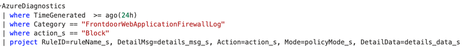
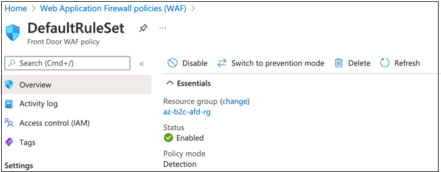
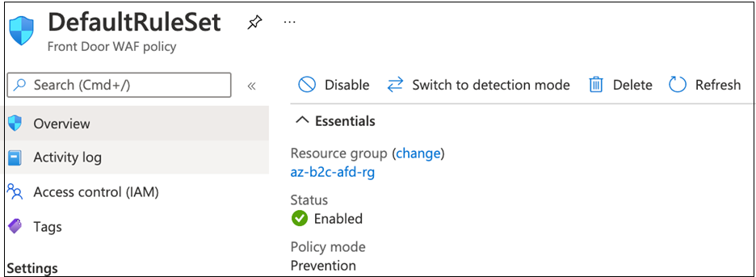

# Tutorial: Configure Azure Web Application Firewall with Azure Active Directory B2C

In this sample tutorial, learn how to enable [Azure Web Application Firewall (WAF)](https://azure.microsoft.com/services/web-application-firewall/#overview) solution for Azure Active Directory (AD) B2C tenant with custom domain. Azure WAF provides centralized protection of your web applications from common exploits and vulnerabilities.

>[!NOTE]
>This feature is in public preview.

## Prerequisites

To get started, you'll need:

- An Azure subscription – If you don't have a subscription, you can get a [free account](https://azure.microsoft.com/free/).

- [An Azure AD B2C tenant](tutorial-create-tenant.md) – The authorization server, responsible for verifying the user’s credentials using the custom policies defined in the tenant.  It's also known as the identity provider.

- [Azure Front Door (AFD)](../frontdoor/index.yml) – Responsible for enabling custom domains for Azure AD B2C tenant.  

- [Azure WAF](https://azure.microsoft.com/services/web-application-firewall/#overview) – Manages all traffic that is sent to the authorization server.

## Azure AD B2C setup

To use custom domains in Azure AD B2C, it's required to use custom domain feature provided by AFD. Learn how to [enable Azure AD B2C custom domains](./custom-domain.md?pivots=b2c-user-flow).  

After custom domain for Azure AD B2C is successfully configured using AFD, [test the custom domain](./custom-domain.md?pivots=b2c-custom-policy#test-your-custom-domain) before proceeding further.  

## Onboard with Azure WAF

To enable Azure WAF, configure a WAF policy and associate that policy to the AFD for protection.

### Create a WAF policy

Create a basic WAF policy with managed Default Rule Set (DRS) in the [Azure portal](https://portal.azure.com).

1. Go to the [Azure portal](https://portal.azure.com). Select **Create a resource** and then search for Azure WAF. Select **Azure Web Application Firewall (WAF)** > **Create**.

2. Go to the **Create a WAF policy** page, select the **Basics** tab. Enter the following information, accept the defaults for the remaining settings.

| Value | Description |
|:--------|:-------|
| Policy for | Global WAF (Front Door)|
| Front Door SKU | Select between Basic, Standard, or Premium SKU |
|Subscription | Select your Front Door subscription name |
| Resource group | Select your Front Door resource group name |
| Policy name | Enter a unique name for your WAF policy |
| Policy state | Set as Enabled |
| Policy mode | Set as Detection |

3. Select **Review + create**

4. Go to the **Association** tab of the Create a WAF policy page, select + **Associate a Front Door profile**, enter the following settings

| Value | Description |
|:----|:------|
| Front Door | Select your Front Door name associated with Azure AD B2C custom domain |
| Domains | Select the Azure AD B2C custom domains you want to associate the WAF policy to|

5. Select **Add**.

6. Select **Review + create**, then select **Create**.

### Change policy mode from detection to prevention

When a WAF policy is created, by default the policy is in Detection mode. In Detection mode, WAF doesn't block any requests, instead, requests matching the WAF rules are logged in the WAF logs. For more information about WAF logging, see [Azure WAF monitoring and logging](../web-application-firewall/afds/waf-front-door-monitor.md).

The sample query shows all the requests that were blocked by the WAF policy in the past 24 hours. The details include, rule name, request data, action taken by the policy, and the policy mode.

It's recommended that you let the WAF capture requests in Detection mode. Review the WAF logs to determine if there are any rules in the policy that are causing false positive results. Then after [exclude the WAF rules based on the WAF logs](../web-application-firewall/afds/waf-front-door-exclusion.md#define-exclusion-based-on-web-application-firewall-logs).

To see WAF in action, use Switch to prevention mode to change from Detection to Prevention mode. All requests that match the rules defined in the Default Rule Set (DRS) are blocked and logged in the WAF logs.

In case you want to switch back to the detection mode, you can do so by using Switch to detection mode option.

## Next steps

- [Azure WAF monitoring and logging](../web-application-firewall/afds/waf-front-door-monitor.md)

- [WAF with Front Door service exclusion lists](../web-application-firewall/afds/waf-front-door-exclusion.md)