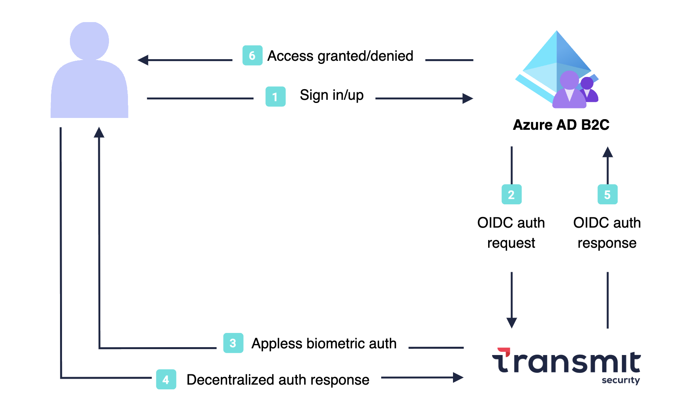

# Configure Transmit Security with Azure Active Directory B2C for passwordless authentication

In this tutorial, learn to integrate Azure Active Directory B2C (Azure AD B2C) authentication with [Transmit Security's hosted passwordless authentication solution](https://transmitsecurity.com/solutions/password-mfa-replacement). Transmit Security uses strong Fast Identity Online (FIDO2) biometric authentication for reliable omni-channel authentication. The solution ensures a smooth sign-in experience for customers across devices and channels, while reducing fraud, phishing, and credential reuse.

## Scenario description

The following architecture diagram illustrates the implementation:

 

1. User opens the Azure AD B2C sign-in page, and signs in or signs up.
2. Azure AD B2C redirects the user to Transmit Security using an OpenID Connect (OIDC) request.
3. Transmit Security authenticates the user using appless FIDO2 biometrics, such as fingerprint.
4. A decentralized authentication response is returned to Transmit Security. 
5. The OIDC response passes to Azure AD B2C.
6. User is granted or denied access to the application, based on verification results.


## Prerequisites

To get started, you need:

::: zone pivot="b2c-user-flow"

* A Microsoft Entra subscription. If you don't have one, get a [free account](https://azure.microsoft.com/free/).
* [An Azure AD B2C tenant](./tutorial-create-tenant.md) linked to the Entra subscription.
* [A registered web application](./tutorial-register-applications.md) in your Azure AD B2C tenant.
* A Transmit Security tenant. Go to [transmitsecurity.com](https://transmitsecurity.com/).

::: zone-end

::: zone pivot="b2c-custom-policy"
* A Microsoft Entra subscription. If you don't have one, get a [free account](https://azure.microsoft.com/free/).
* [An Azure AD B2C tenant](./tutorial-create-tenant.md) linked to the Entra subscription.
* [A registered web application](./tutorial-register-applications.md) in your Azure AD B2C tenant.
* [Azure AD B2C custom policies](./tutorial-create-user-flows.md?pivots=b2c-custom-policy).
* A Transmit Security tenant. Go to [transmitsecurity.com](https://transmitsecurity.com/).

::: zone-end

## Step 1: Create a Transmit app 

Sign in to the [Transmit Admin Portal](https://portal.transmitsecurity.io/) and [create an application](https://developer.transmitsecurity.com/guides/user/create_new_application/):

1. From **Applications**, select **Add application**.
1. Configure the application with the following attributes:

   | Property | Description |
   |:---------|:---------------------|
   | **Application name** | Application name| 
   | **Client name** | Client name| 
   | **Redirect URIs** | `https://<your-B2C-tenant>.b2clogin.com/<your-B2C-tenant>.onmicrosoft.com/oauth2/authresp` where `<your-B2C-tenant>` is your Azure AD B2C tenant domain (or `<your-B2C-tenant>.b2clogin.com` is your custom domain)|

3. Select **Add**.

4. Upon registration, a **Client ID** and **Client Secret** appear. Record the values to use later.

## Step 2: Configure the sign-in experience

From the [Transmit Admin Portal](https://portal.transmitsecurity.io/), configure the user authentication experience:

1. Select **Authentication**, and then select **Experiences Management**.
1. From the drop-down menu, select your application.
1. Configure your application with the following attributes:

   | Property | Description |
   |:---------|:---------------------|
   | **User identifier** | Select **Email**| 
   | **Primary authentication method** | Select **Passkey**| 
   | **Secondary authentication method** | Only enable **WebAuthn QR** and **Email OTP**|
   | **Select user information** | Delete all the default fields|

1. Select **Save**.

::: zone pivot="b2c-user-flow"

## Step 3: Add Transmit as an identity provider


To enable users to sign in with Transmit Security, configure Transmit Security as a new identity provider. In Azure AD B2C follow these steps:

1. Sign in to the [Azure portal](https://portal.azure.com/#home) as Global Administrator. 
1. In the portal toolbar, select **Directories + subscriptions**.
1. On the **Portal settings | Directories + subscriptions** page, in the **Directory name** list, find the Azure AD B2C directory and then select **Switch**.
1. Under **Azure services**, select **Azure AD B2C** (or select **More services** and use the **All services** search box to search for Azure AD B2C).
1. Select **Identity providers**, and then select **New OpenID Connect provider**.
1. Configure the provider as follows:

   | Property | Description |
   |:---------|:---------------------|
   | **Name** | Name, such as Transmit Security| 
   | **Metadata URL** | `https://api.transmitsecurity.io/cis/oidc/.well-known/openid-configuration`| 
   | **Client ID** | Client ID provided by Transmit|
   | **Client secret** | Client secret provided by Transmit|
   | **Scope** | `openid email`|
   | **Response type** | **code**|
   | **Response mode** | **form_post**|
   | **Display name** | `email`|
   | **Email** | `email`|

1. Select **Save**.

## Step 4: Create a user flow

At this point, the Transmit Security identity provider has been set up, but it's not yet available in any of the sign-in pages. To add the Transmit Security identity provider to a user flow:

1. In your Azure AD B2C tenant, under **Policies**, select **User flows**.  
1. Select **New user flow**.
1. Select **Sign up and sign in** user flow type, and then select **Create**.
1. Enter a **Name** for the user flow, such as *signupsignin*.
1. Under **Identity providers**:
    * For **Local Accounts**, select **None**.
    * For **Custom identity providers**, select the Transmit Security provider.  
1. Select **Create** to add the user flow.

## Step 5: Test the user flow

1. In the Azure AD B2C tenant, select **User flows**.
1. Select the created user flow, such as *B2C_1_signupsignin*.
1. Select **Run user flow**:
    * For **Application**, select your registered web application.
    * For **Reply URL**, select `https://jwt.ms`.
1. Select **Run user flow**.
1. The browser is redirected to Transmit's sign-in page.
1. Complete the sign-in flow: enter your account email and authenticate using biometrics (for example, fingerprint).
1. The browser is redirected to `https://jwt.ms` with an Azure AD B2C token.

::: zone-end

::: zone pivot="b2c-custom-policy"

## Step 3: Create a policy key

You need to store the client secret of your Transmit application that you previously recorded in your Azure AD B2C tenant.

1. Sign in to the [Azure portal](https://portal.azure.com/).
1. In the portal toolbar, select **Directories + subscriptions**.
1. On the **Portal settings | Directories + subscriptions** page, in the **Directory name** list, find the Azure AD B2C directory and then select **Switch**.
1. On the Overview page, under **Policies**, select **Identity Experience Framework**.
1. Select **Policy Keys**, and then select **Add**.
1. Configure the policy key as follows:

   | Property | Description |
   |:---------|:---------------------|
   | **Options** | **Manual**| 
   | **Name** | Policy key name, such as *TransmitClientSecret*| 
   | **Secret** | Client secret provided by Transmit|
   | **Key usage** | **Signature**|
   
1. Select **Create** to add the policy key.

## Step 4: Add Transmit as an identity provider

To enable sign in with Transmit Security, define Transmit Security as a claims provider that Azure AD B2C communicates with through an endpoint. The endpoint provides claims used by Azure AD B2C to verify a user authenticated with a digital identity on a device.

You can define the Transmit Security as a claims provider by adding it to the **ClaimsProviders** element in the extension file of your policy.

1. Get the custom policy starter packs from GitHub, then update the XML files in the SocialAndLocalAccounts starter pack with your Azure AD B2C tenant name:

    1. [Download the .zip file](https://github.com/Azure-Samples/active-directory-b2c-custom-policy-starterpack/archive/master.zip) or clone the repository:
        ```
        git clone https://github.com/Azure-Samples/active-directory-b2c-custom-policy-starterpack
       ```
    
    1. In the files in the **LocalAccounts** directory, replace the string `yourtenant` with the Azure AD B2C tenant name. 
1. Open the `LocalAccounts/ TrustFrameworkExtensions.xml`.
1. Find the **ClaimsProviders** element. If it doesn't appear, add it under the root element.
1. Add a new **ClaimsProvider** similar to the following example:
  
    ```xml
     <ClaimsProvider>
         <Domain>api.transmitsecurity.io</Domain>
         <DisplayName>Transmit</DisplayName>
         <TechnicalProfiles>
           <TechnicalProfile Id="TS-OpenIdConnect">
             <DisplayName>Transmit</DisplayName>
             <Protocol Name="OpenIdConnect" />
             <Metadata>
               <Item Key="METADATA">https://api.transmitsecurity.io/cis/oidc/.well-known/openid-configuration</Item>
                <!-- Update the Client ID below to the Transmit Security client ID -->
               <Item Key="client_id">00000000-0000-0000-0000-000000000000</Item>
               <Item Key="response_types">code</Item>
               <Item Key="scope">openid email</Item>
               <Item Key="response_mode">form_post</Item>
               <Item Key="HttpBinding">POST</Item>
               <Item Key="UsePolicyInRedirectUri">false</Item>
               <Item Key="AccessTokenResponseFormat">json</Item>
             </Metadata>
             <CryptographicKeys>
               <Key Id="client_secret" StorageReferenceId="B2C_1A_TransmitClientSecret" />
             </CryptographicKeys>
             <OutputClaims>
               <OutputClaim ClaimTypeReferenceId="issuerUserId" PartnerClaimType="sub" />
               <OutputClaim ClaimTypeReferenceId="email" PartnerClaimType="email" />
               <OutputClaim ClaimTypeReferenceId="identityProvider" PartnerClaimType="iss" />
               <OutputClaim ClaimTypeReferenceId="authenticationSource" DefaultValue="socialIdpAuthentication" AlwaysUseDefaultValue="true" />
             </OutputClaims>
             <OutputClaimsTransformations>
               <OutputClaimsTransformation ReferenceId="CreateRandomUPNUserName" />
               <OutputClaimsTransformation ReferenceId="CreateUserPrincipalName" />
               <OutputClaimsTransformation ReferenceId="CreateAlternativeSecurityId" />
             </OutputClaimsTransformations>
             <UseTechnicalProfileForSessionManagement ReferenceId="SM-SocialLogin" />
           </TechnicalProfile>
         </TechnicalProfiles>
       </ClaimsProvider>    
    ```

1. Set **client_id** with the Transmit Security client ID.
1. Update the **client_secret** section with the name of the policy key you created (for example, *B2C_1A_TransmitClientSecret*):

   ```xml
   <Key Id="client_secret" StorageReferenceId="B2C_1A_TransmitClientSecret" />
   ```
1. Select **Save**.

## Step 5: Add a user journey

At this point, the identity provider is set up, but it's not yet available in any of the sign-in pages. If you have a custom user journey, continue to the [Add Transmit to the user journey](#step-6-add-transmit-to-the-user-journey) step. Otherwise, create a duplicate template user journey:

1. From the starter pack, open the `LocalAccounts/ TrustFrameworkBase.xml` file.
1. Find and copy the contents of the **UserJourney** element that includes `Id=SignUpOrSignIn`.
1. Open the `LocalAccounts/ TrustFrameworkExtensions.xml`.
1. Find the **UserJourneys** element. If there's no element, add one.
1. Paste the UserJourney element as a child of the UserJourneys element.
1. Rename the user journey **ID** (for example, `Id=TransmitSUSI`)

## Step 6: Add Transmit to the user journey

Add the new identity provider to the user journey:

1. Find the orchestration step element that includes `Type=CombinedSignInAndSignUp`, or `Type=ClaimsProviderSelection` in the user journey. It's usually the first orchestration step. The **ClaimsProviderSelections** element has an identity provider list that users sign in with. The order of the elements controls the order of the sign in buttons. 
1. Add a **ClaimsProviderSelection** XML element. 
1. Set the value of **TargetClaimsExchangeId** to a friendly name.
1. Add a **ClaimsExchange** element. 
1. Set the **Id** to the value of the target claims exchange ID.
1. Update the **TechnicalProfileReferenceId** value to the technical profile ID you created.

The following XML demonstrates orchestration user journey with the identity provider:

```xml
    <OrchestrationStep Order="1" Type="CombinedSignInAndSignUp" ContentDefinitionReferenceId="api.signuporsignin">
      <ClaimsProviderSelections>
        ...
        <ClaimsProviderSelection TargetClaimsExchangeId="TSIDExchange" />
      </ClaimsProviderSelections>
      ...
    </OrchestrationStep>
    
    <OrchestrationStep Order="2" Type="ClaimsExchange">
      ...
      <ClaimsExchanges>
        <ClaimsExchange Id="TSIDExchange" TechnicalProfileReferenceId="TS-OpenIdConnect" />
      </ClaimsExchanges>
    </OrchestrationStep>
```

## Step 7: Configure the relying party policy

The relying party policy, for example [SignUpSignIn.xml](https://github.com/Azure-Samples/active-directory-b2c-custom-policy-starterpack/blob/main/LocalAccounts/SignUpOrSignin.xml), specifies the user journey Azure AD B2C executes. Find the **DefaultUserJourney** element within relying party. Update the **ReferenceId** to match the user journey ID, in which you added the identity provider.

In the following example, for the `TransmitSUSI` user journey, the **ReferenceId** is set to `TransmitSUSI`:

```xml
  <RelyingParty>
    <DefaultUserJourney ReferenceId="TransmitSUSI" />
    <TechnicalProfile Id="TS-OpenIdConnect">
      <DisplayName>PolicyProfile</DisplayName>
      <Protocol Name="OpenIdConnect" />
      <OutputClaims>
        <OutputClaim ClaimTypeReferenceId="displayName" />
        <OutputClaim ClaimTypeReferenceId="givenName" />
        <OutputClaim ClaimTypeReferenceId="surname" />
        <OutputClaim ClaimTypeReferenceId="email" />
        <OutputClaim ClaimTypeReferenceId="objectId" PartnerClaimType="sub"/>
        <OutputClaim ClaimTypeReferenceId="identityProvider" />
        <OutputClaim ClaimTypeReferenceId="tenantId" AlwaysUseDefaultValue="true" DefaultValue="{Policy:TenantObjectId}" />
      </OutputClaims>
      <SubjectNamingInfo ClaimType="sub" />
    </TechnicalProfile>
  </RelyingParty>
```

## Step 8: Upload the custom policy

Using the directory with your Azure AD B2C tenant, upload the custom policy:

1. Sign in to the [Azure portal](https://portal.azure.com/).
1. In the portal toolbar, select **Directories + subscriptions**.
1. On the **Portal settings | Directories + subscriptions** page, in the **Directory name** list, find the Azure AD B2C directory and then select **Switch**.
1. Under **Policies**, select **Identity Experience Framework**.
1. Select **Upload Custom Policy**, and then upload the updated files in the following order: 

  * Base policy, for example `TrustFrameworkBase.xml`
  * Localization policy, for example `TrustFrameworkLocalization.xml`
  * Extension policy, for example `TrustFrameworkExtensions.xml`
  * Relying party policy, such as `SignUpOrSignIn.xml`

## Step 9: Test your custom policy

Using the directory with your Azure AD B2C tenant, test your custom policy:

1. In the Azure AD B2C tenant, and under **Policies**, select **Identity Experience Framework**.
1. Under **Custom policies**, select **B2C_1A_signup_signin**.
1. For **Application**, select the web application you registered. The **Reply URL** is `https://jwt.ms`.
1. Select **Run now**. 
1. The browser is redirected to Transmit's sign-in page.
1. Complete the sign-in flow: enter your account email and authenticate using biometrics (for example, fingerprint).
1. The browser is redirected to `https://jwt.ms` with an Azure AD B2C token.

::: zone-end

## Next steps

For additional information, review the following articles:

- [Azure AD B2C custom policy overview](custom-policy-overview.md)
- [Tutorial: Create user flows and custom policies in Azure Active Directory B2C](tutorial-create-user-flows.md?pivots=b2c-custom-policy)
- [Integrate Transmit Security with Azure AD B2C using user flows](https://developer.transmitsecurity.com/guides/user/azure-passwordless-uf/)
- [Integrate Transmit Security with Azure AD B2C using custom policies](https://developer.transmitsecurity.com/guides/user/azure-passwordless-cp/)
