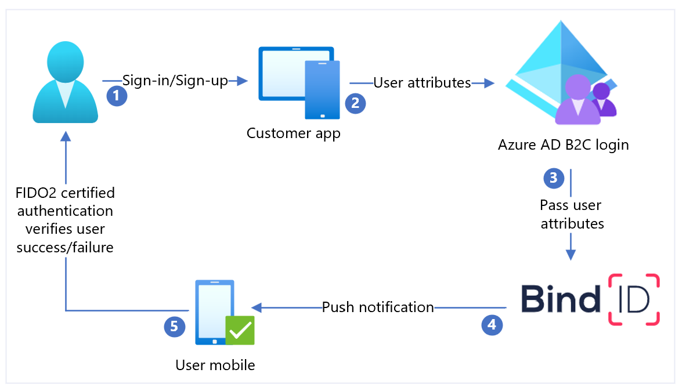

# Configure Transmit Security with Azure Active Directory B2C for passwordless authentication

In this tutorial, learn to integrate Azure Active Directory B2C (Azure AD B2C) authentication with [Transmit Security](https://transmitsecurity.com/solutions/password-mfa-replacement) BindID, a passwordless authentication solution. BindID uses strong Fast Identity Online (FIDO2) biometric authentication for reliable omni-channel authentication. The solution ensures a smooth sign in experience for customers across devices and channels, while reducing fraud, phishing, and credential reuse.

## Scenario description

The following architecture diagram illustrates the implementation.



1. User opens the Azure AD B2C sign in page, and signs in or signs up.
2. Azure AD B2C redirects the user to BindID using an OpenID Connect (OIDC) request.
3. BindID authenticates the user using appless FIDO2 biometrics, such as fingerprint.
4. A decentralized authentication response is returned to BindID. 
5. The OIDC response passes to Azure AD B2C.
6. User is granted or denied access to the application, based on verification results.

## Prerequisites

To get started, you need:

* A Microsoft Entra subscription
  * If you don't have one, get an [Azure free account](https://azure.microsoft.com/free/)
* An Azure AD B2C tenant linked to the Azure subscription
  * See, [Tutorial: Create an Azure Active Directory B2C tenant](./tutorial-create-tenant.md) 
* A BindID tenant
  * Go to transmitsecurity.com to [get started](https://developer.transmitsecurity.com/#try?utm_signup=dev_hub)
* Register a web application in the Azure portal
  * [Tutorial: Register a web application in Azure Active Directory B2C](./tutorial-register-applications.md) 
* Azure AD B2C custom policies
  * If you can't use the policies, see [Tutorial: Create user flows and custom policies in Azure AD B2C](./tutorial-create-user-flows.md?pivots=b2c-custom-policy)

## Register an app in BindID 

To get started:

1. Go to developer.bindid.io to [Configure Your Application](https://developer.bindid.io/docs/guides/quickstart/topics/quickstart_web#step-1-configure-your-application).
2. Add an application in [BindID Admin Portal](https://admin.bindid-sandbox.io/console/). Sign-in is required.

| Property | Description |
|:---------|:---------------------|
| Name | Application name| 
| Domain | Enter `your-B2C-tenant-name.onmicrosoft.com`. Replace `your-B2C-tenant` with your Azure AD B2C tenant.|
| Redirect URIs | [https://jwt.ms/](https://jwt.ms/)
| Redirect URLs | Enter `https://your-B2C-tenant-name.b2clogin.com/your-B2C-tenant-name.onmicrosoft.com/oauth2/authresp`. Replace `your-B2C-tenant` with your Azure AD B2C tenant. For a custom domain, replace `your-B2C-tenant-name.b2clogin.com` with your custom domain.|

3. Upon registration, a **Client ID** and **Client Secret** appear. 
4. Record the values to use later.

## Configure BindID as an identity provider in Azure AD B2C

For the following instructions, use the directory with your Azure AD B2C tenant.

1. Sign in to the [Azure portal](https://portal.azure.com/#home) as Global Administrator. 
2. In the portal toolbar, select **Directories + subscriptions**.
3. On the **Portal settings | Directories + subscriptions** page, in the **Directory name** list, find the Azure AD B2C directory.
4. Select **Switch**.
5. In the top-left corner of the Azure portal, select **All services**.
6. Search for and select **Azure AD B2C**.
7. Select **Identity providers**.
8. Select **New OpenID Connect provider**.
9. Enter a **Name**.
10. For **Metadata URL**, enter `https://signin.bindid-sandbox.io/.well-known/openid-configuration`.
11. For **Client ID**, enter the Client ID you recorded.
12. For **Client secret**, enter the Client Secret you recorded.
13. For the **Scope**, enter the `openid email`.
14. For **Response type**, select **code**.
15. For **Response mode**, select **form_post**.
16. Under **Identity provider claims mapping**, for **User ID**, select `sub`.
17. For **Email**, select `email`.
18. Select **Save**. 

## Create a user flow

1. In your Azure AD B2C tenant, under **Policies**, select **User flows**.  
2. Select **New user flow**.
3. Select **Sign up and sign in** user flow type.
4. Select **Create**.
5. Enter a **Name**.
6. Under **Identity providers**, for **Local Accounts**, select **None**. This action disables email and password-based authentication.
7. For **Custom identity providers**, select the created BindID Identity provider such as **Login with BindID**.  
8. Select **Create**.

## Test the user flow

1. In the Azure AD B2C tenant, select **User flows**.
2. Select the created user flow, such as **B2C_1_signupsignin**.
3. For **Application**, select the web application you registered. The **Reply URL** is `https://jwt.ms`.
4. Select **Run user flow**. 
5. The browser is redirected to the BindID sign in page. 
6. Enter the registered account email. 
7. Authenticates using appless FIDO2 biometrics, such as fingerprint. 
8. The browser is redirect to `https://jwt.ms`. The contents appear for the token returned by Azure AD B2C.

## Create a BindID policy key

Add the BindID application Client Secret as a policy key. For the following instructions, use the directory with your Azure AD B2C tenant.

1. Sign in to the [Azure portal](https://portal.azure.com/).
2. In the portal toolbar, select **Directories + subscriptions**.
3. On the **Portal settings | Directories + subscriptions** page, in the **Directory name** list, locate the Azure AD B2C directory.
4. Select **Switch**.
5. On the Overview page, under **Policies**, select **Identity Experience Framework**.
6. Select **Policy Keys**.
7. Select **Add**.
8. For **Options**, select **Manual**.
9. Enter a **Name**. The prefix `B2C_1A_` appends to the key name.
10. In **Secret**, enter the Client Secret you recorded.
11. For **Key usage**, select **Signature**.
12. Select **Create**.

## Configure BindID as an identity provider

To enable sign in with BindID, define BindID as a claims provider that Azure AD B2C communicates with through an endpoint. The endpoint provides claims used by Azure AD B2C to verify a user authenticated with digital identity on a device.

Add BindID as a claims provider. To get started, obtain the custom policy starter packs from GitHub, then update the XML files in the SocialAndLocalAccounts starter pack with your Azure AD B2C tenant name:
    
1. Open the zip folder [active-directory-b2c-custom-policy-starterpack-main.zip](https://github.com/Azure-Samples/active-directory-b2c-custom-policy-starterpack/archive/master.zip) or clone the repository:
        
   ```
       git clone https://github.com/Azure-Samples/active-directory-b2c-custom-policy-starterpack
   ```
    
2. In the files in the **LocalAccounts** directory, replace the string `yourtenant` with the Azure AD B2C tenant name. 
3. Open the `LocalAccounts/ TrustFrameworkExtensions.xml`.
4. Find the **ClaimsProviders** element. If it doesn't appear, add it under the root element.
5. Add a new **ClaimsProvider** similar to the following example:
  
    ```xml
     <ClaimsProvider>
         <Domain>signin.bindid-sandbox.io</Domain>
         <DisplayName>BindID</DisplayName>
         <TechnicalProfiles>
           <TechnicalProfile Id="BindID-OpenIdConnect">
             <DisplayName>BindID</DisplayName>
             <Protocol Name="OpenIdConnect" />
             <Metadata>
               <Item Key="METADATA">https://signin.bindid-sandbox.io/.well-known/openid-configuration</Item>
                <!-- Update the Client ID below to the BindID Application ID -->
               <Item Key="client_id">00000000-0000-0000-0000-000000000000</Item>
               <Item Key="response_types">code</Item>
               <Item Key="scope">openid email</Item>
               <Item Key="response_mode">form_post</Item>
               <Item Key="HttpBinding">POST</Item>
               <Item Key="UsePolicyInRedirectUri">false</Item>
               <Item Key="AccessTokenResponseFormat">json</Item>
             </Metadata>
             <CryptographicKeys>
               <Key Id="client_secret" StorageReferenceId="B2C_1A_BindIDClientSecret" />
             </CryptographicKeys>
             <OutputClaims>
               <OutputClaim ClaimTypeReferenceId="issuerUserId" PartnerClaimType="sub" />
               <OutputClaim ClaimTypeReferenceId="email" PartnerClaimType="email" />
               <OutputClaim ClaimTypeReferenceId="identityProvider" PartnerClaimType="iss" />
               <OutputClaim ClaimTypeReferenceId="authenticationSource" DefaultValue="socialIdpAuthentication" AlwaysUseDefaultValue="true" />
             </OutputClaims>
             <OutputClaimsTransformations>
               <OutputClaimsTransformation ReferenceId="CreateRandomUPNUserName" />
               <OutputClaimsTransformation ReferenceId="CreateUserPrincipalName" />
               <OutputClaimsTransformation ReferenceId="CreateAlternativeSecurityId" />
             </OutputClaimsTransformations>
             <UseTechnicalProfileForSessionManagement ReferenceId="SM-SocialLogin" />
           </TechnicalProfile>
         </TechnicalProfiles>
       </ClaimsProvider>    
    ```

6. Set **client_id** with the BindID Application ID you recorded.
7. Select **Save**.

## Add a user journey

The identity provider isn't on the sign-in pages. If you have a custom user journey, continue to **Add the identity provider to a user journey**, otherwise, create a duplicate template user journey:

1. From the starter pack, open the `LocalAccounts/ TrustFrameworkBase.xml` file.
2. Find and copy the contents of the **UserJourney** element that includes `Id=SignUpOrSignIn`.
3. Open the `LocalAccounts/ TrustFrameworkExtensions.xml`.
4. Find the **UserJourneys** element. If there's no element, add one.
5. Paste the UserJourney element as a child of the UserJourneys element.
6. Rename the user journey **ID**. 

## Add the identity provider to a user journey

Add the new identity provider to the user journey.

1. Find the orchestration step element that includes `Type=CombinedSignInAndSignUp`, or `Type=ClaimsProviderSelection` in the user journey. It's usually the first orchestration step. The **ClaimsProviderSelections** element has an identity provider list that users sign in with. The order of the elements controls the order of the sign in buttons. 
2. Add a **ClaimsProviderSelection** XML element. 
3. Set the value of **TargetClaimsExchangeId** to a friendly name.
4. Add a **ClaimsExchange** element. 
5. Set the **Id** to the value of the target claims exchange ID. This action links the BindID button to `BindID-SignIn`. 
6. Update the **TechnicalProfileReferenceId** value to the technical profile ID you created.

The following XML demonstrates orchestration user journey with the identity provider.

```xml
    <OrchestrationStep Order="1" Type="CombinedSignInAndSignUp" ContentDefinitionReferenceId="api.signuporsignin">
      <ClaimsProviderSelections>
        ...
        <ClaimsProviderSelection TargetClaimsExchangeId="BindIDExchange" />
      </ClaimsProviderSelections>
      ...
    </OrchestrationStep>
    
    <OrchestrationStep Order="2" Type="ClaimsExchange">
      ...
      <ClaimsExchanges>
        <ClaimsExchange Id="BindIDExchange" TechnicalProfileReferenceId="BindID-OpenIdConnect" />
      </ClaimsExchanges>
    </OrchestrationStep>
```

## Configure the relying party policy

The relying party policy, for example SignUpOrSignIn.xml, specifies the user journey Azure AD B2C executes. You can control claims passed to your application by adjusting the **OutputClaims** element of the **PolicyProfile** TechnicalProfile element.  In this tutorial, the application receives the user attributes such as display name, given name, surname, email, objectId, identity provider, and tenantId.  

See, [Azure-Samples/active-directory-b2c-custom-policy-starterpack](https://github.com/Azure-Samples/active-directory-b2c-custom-policy-starterpack/blob/master/LocalAccounts/SignUpOrSignin.xml)

```xml
  <RelyingParty>
    <DefaultUserJourney ReferenceId="SignUpOrSignInWithBindID" />
    <TechnicalProfile Id="BindID-OpenIdConnect">
      <DisplayName>PolicyProfile</DisplayName>
      <Protocol Name="OpenIdConnect" />
      <OutputClaims>
        <OutputClaim ClaimTypeReferenceId="displayName" />
        <OutputClaim ClaimTypeReferenceId="givenName" />
        <OutputClaim ClaimTypeReferenceId="surname" />
        <OutputClaim ClaimTypeReferenceId="email" />
        <OutputClaim ClaimTypeReferenceId="objectId" PartnerClaimType="sub"/>
        <OutputClaim ClaimTypeReferenceId="identityProvider" />
        <OutputClaim ClaimTypeReferenceId="tenantId" AlwaysUseDefaultValue="true" DefaultValue="{Policy:TenantObjectId}" />
      </OutputClaims>
      <SubjectNamingInfo ClaimType="sub" />
    </TechnicalProfile>
  </RelyingParty>
```

## Upload the custom policy

1. Sign in to the [Azure portal](https://portal.azure.com).
2. In the portal toolbar, select **Directories + subscriptions**.
3. On the **Portal settings | Directories + subscriptions** page, in the **Directory name** list, find the Azure AD B2C directory.
4. Select **Switch**.
5. In the Azure portal, search for and select **Azure AD B2C**.
6. Under **Policies**, select **Identity Experience Framework**.
7. Select **Upload Custom Policy**.
8. Upload the files in the **LocalAccounts** starter pack in the following order: 

  * Base policy, for example `TrustFrameworkBase.xml`
  * Localization policy, for example `TrustFrameworkLocalization.xml`
  * Extension policy, for example `TrustFrameworkExtensions.xml`
  * Relying party policy, such as `SignUpOrSignIn.xml`

## Test your custom policy

For the following instructions, use the directory with your Azure AD B2C tenant.

1. In the Azure AD B2C tenant, and under **Policies**, select **Identity Experience Framework**.
2. Under **Custom policies**, select **B2C_1A_signup_signin**.
3. For **Application**, select the web application you registered. The **Reply URL** is `https://jwt.ms`.
4. Select **Run now**. 
5. The browser is redirected to the BindID sign in page. 
6. Enter the registered account email.
7. Authenticate using appless FIDO2 biometrics, such as fingerprint. 
8. The browser is redirect to `https://jwt.ms`. The token contents, returned by Azure AD B2C, appear.

## Next steps

For additional information, review the following articles:

- [Azure AD B2C custom policy overview](custom-policy-overview.md)
- [Tutorial: Create user flows and custom policies in Azure Active Directory B2C](tutorial-create-user-flows.md?pivots=b2c-custom-policy)
- [`TransmitSecurity/azure-ad-b2c-bindid-integration`](https://github.com/TransmitSecurity/azure-ad-b2c-bindid-integration) See, Azure AD B2C Integration