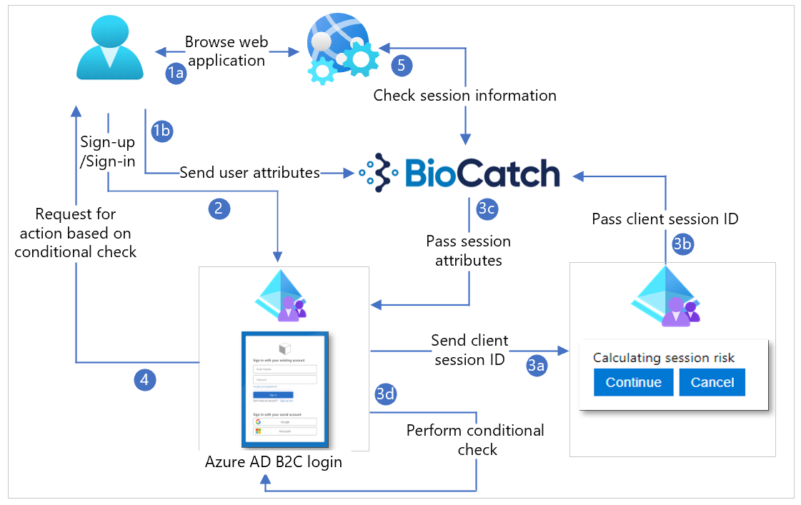

# Tutorial: Configure BioCatch with Azure Active Directory B2C

Learn how to integrate Azure Active Directory B2C (Azure AD B2C) authentication with BioCatch technology to augment your Customer Identity and Access Management (CIAM) security posture. BioCatch products analyze user physical and cognitive digital behaviors for insights that help distinguish legitimate customers.

Go to biocatch.com to learn more [BioCatch](https://www.biocatch.com/)

## Prerequisites

To get started, you need:

* An Azure subscription
  * If you don't have one, get an [Azure free account](https://azure.microsoft.com/free/)
* An Azure AD B2C tenant linked to the Azure subscription
  * See, [Tutorial: Create an Azure Active Directory B2C tenant](tutorial-create-tenant.md)
* Go to the biocatch.com [Contact Us](https://www.biocatch.com/contact-us) page to request an account
  * Mention Azure AD B2C integration

## Scenario description

BioCatch integration includes the following components:

* **A web app or web service** - users browse to this web service that instantiates a unique client session ID that goes to BioCatch 
  * The session ID transmits user behavior characteristics to BioCatch
* **A method** - sends the session ID to Azure AD B2C. In the example, JavaScript inputs the value into a hidden HTML field.
* **An Azure AD B2C customized UI** - hides an HTML field for the session ID input from JavaScript
* **Azure AD B2C custom policy**:
  * Takes the session ID as a claim via a self-asserted technical profile
  * Integrates with BioCatch via a REST API claims provider and passes the session ID to BioCatch
  * Multiple custom claims return from BioCatch for the custom policy logic 
  * A user journey evaluates a returned claim, and executes a conditional action, such as multi-factor authentication

Learn more: 

* [Azure AD B2C custom policy overview](custom-policy-overview.md)
* [Tutorial: Create user flows and custom policies in Azure AD B2C](./tutorial-create-user-flows.md?pivots=b2c-custom-policy&tabs=applications)

The following diagram illustrates user flows with session information. 

   

1. The user browses to the web service, which returns HTML, CSS, or JavaScript values, then loads the BioCatch JavaScript SDK. Client-side JavaScript configures a client session ID for the BioCatch SDK. Alternately, the web service pre-configures client session ID and sends it to the client. You can configure the instantiated BioCatch JavaScript SDK for BioCatch, which sends user behavior to BioCatch from the client device, using the client session ID.
2. User signs-up or signs-in and is redirected to Azure AD B2C. 
3. The user journey includes a self-asserted claims provider, which inputs the client session ID. This field is hidden. Use JavaScript to input the session ID into the field. Select **Next**, to continue sign-up or sign-in. The session ID goes to BioCatch for a risk score. BioCatch returns session information, and recommends allow or block. The user journey has a conditional check, which acts upon the returned claims.
4. Based on the conditional check result, an action is invoked.
5. The web service can use the session ID to query BioCatch API to determine risk and session information.

## Get started with BioCatch

Go to the biocatch.com [Contact Us](https://www.biocatch.com/contact-us) page to initiate an account.

## Configure the custom UI

We recommended you hide the Client Session ID field with CSS, JavaScript, or another method. For testing, unhide the field. For example, JavaScript hides the input field as:

```JavaScript
document.getElementById("clientSessionId").style.display = 'none';
```

## Configure Azure AD B2C Identity Experience Framework policies

1. To get started, See [Tutorial: Create user flows and custom policies in Azure AD B2C](./tutorial-create-user-flows.md?pivots=b2c-custom-policy).
2. Create a new file that inherits from the extensions file.

    ```xml
    <BasePolicy> 

        <TenantId>tenant.onmicrosoft.com</TenantId> 

        <PolicyId>B2C_1A_TrustFrameworkExtensions</PolicyId> 

      </BasePolicy> 
    ```

3. Create a reference to the custom UI to hide the input box, under the BuildingBlocks resource.

    ```xml
    <ContentDefinitions> 

        <ContentDefinition Id="api.selfasserted"> 

            <LoadUri>https://domain.com/path/to/selfAsserted.cshtml</LoadUri> 

            <DataUri>urn:com:microsoft:aad:b2c:elements:contract:selfasserted:2.1.0</DataUri> 

          </ContentDefinition> 

        </ContentDefinitions>
    ```

4. Under the BuildingBlocks resource, add the following claims.

    ```xml
    <ClaimsSchema> 

          <ClaimType Id="riskLevel"> 

            <DisplayName>Session risk level</DisplayName> 

            <DataType>string</DataType>       

          </ClaimType> 

          <ClaimType Id="score"> 

            <DisplayName>Session risk score</DisplayName> 

            <DataType>int</DataType>       

          </ClaimType> 

          <ClaimType Id="clientSessionId"> 

            <DisplayName>The ID of the client session</DisplayName> 

            <DataType>string</DataType> 

            <UserInputType>TextBox</UserInputType> 

          </ClaimType> 

    </ClaimsSchema> 
    ```

5. Configure a self-asserted claims provider for the client session ID field.

    ```xml
    <ClaimsProvider> 

          <DisplayName>Client Session ID Claims Provider</DisplayName> 

          <TechnicalProfiles> 

            <TechnicalProfile Id="login-NonInteractive-clientSessionId"> 

              <DisplayName>Client Session ID TP</DisplayName> 

              <Protocol Name="Proprietary" Handler="Web.TPEngine.Providers.SelfAssertedAttributeProvider, Web.TPEngine, Version=1.0.0.0, Culture=neutral, PublicKeyToken=null" /> 

              <Metadata> 

                <Item Key="ContentDefinitionReferenceId">api.selfasserted</Item> 

              </Metadata> 

              <CryptographicKeys> 

                <Key Id="issuer_secret" StorageReferenceId="B2C_1A_TokenSigningKeyContainer" /> 

              </CryptographicKeys> 

            <!—Claim we created earlier --> 

              <OutputClaims> 

                <OutputClaim ClaimTypeReferenceId="clientSessionId" Required="false" DefaultValue="100"/> 

              </OutputClaims> 

            <UseTechnicalProfileForSessionManagement ReferenceId="SM-AAD" /> 

            </TechnicalProfile> 

          </TechnicalProfiles> 

        </ClaimsProvider> 
    ```

6. Configure a REST API claims provider for BioCatch. 

    ```xml
    <TechnicalProfile Id="BioCatch-API-GETSCORE"> 

          <DisplayName>Technical profile for BioCatch API to return session information</DisplayName> 

          <Protocol Name="Proprietary" Handler="Web.TPEngine.Providers.RestfulProvider, Web.TPEngine, Version=1.0.0.0, Culture=neutral, PublicKeyToken=null" />

          <Metadata> 

            <Item Key="ServiceUrl">https://biocatch-url.com/api/v6/score?customerID=<customerid>&amp;action=getScore&amp;uuid=<uuid>&amp;customerSessionID={clientSessionId}&amp;solution=ATO&amp;activtyType=<activity_type>&amp;brand=<brand></Item>

            <Item Key="SendClaimsIn">Url</Item> 

            <Item Key="IncludeClaimResolvingInClaimsHandling">true</Item> 

            <!-- Set AuthenticationType to Basic or ClientCertificate in production environments --> 

            <Item Key="AuthenticationType">None</Item> 

            <!-- REMOVE the following line in production environments --> 

            <Item Key="AllowInsecureAuthInProduction">true</Item> 

          </Metadata> 

          <InputClaims> 

            <InputClaim ClaimTypeReferenceId="clientsessionId" /> 

          </InputClaims> 

          <OutputClaims> 

            <OutputClaim ClaimTypeReferenceId="riskLevel" /> 

            <OutputClaim ClaimTypeReferenceId="score" /> 

          </OutputClaims> 

          <UseTechnicalProfileForSessionManagement ReferenceId="SM-Noop" /> 

        </TechnicalProfile> 

      </TechnicalProfiles>
    ```

    > [!NOTE]
    > BioCatch provides the URL, customer ID, and unique user ID (UUID). The customer SessionID claim passes through as a query string parameter to BioCatch. You can select the activity type, for example **MAKE_PAYMENT**.

7. Configure the user journey using the following example:

   * Get the clientSessionID as a claim.
   * Call BioCatch API to get the session information.
   * If the returned claim risk is **low**, skip the step for MFA, otherwise enforce user MFA.

    ```xml
    <OrchestrationStep Order="8" Type="ClaimsExchange"> 

          <ClaimsExchanges> 

            <ClaimsExchange Id="clientSessionIdInput" TechnicalProfileReferenceId="login-NonInteractive-clientSessionId" /> 

          </ClaimsExchanges> 

        </OrchestrationStep> 

        <OrchestrationStep Order="9" Type="ClaimsExchange"> 

          <ClaimsExchanges> 

            <ClaimsExchange Id="BcGetScore" TechnicalProfileReferenceId=" BioCatch-API-GETSCORE" /> 

          </ClaimsExchanges> 

        </OrchestrationStep> 

        <OrchestrationStep Order="10" Type="ClaimsExchange"> 

          <Preconditions> 

            <Precondition Type="ClaimEquals" ExecuteActionsIf="true"> 

              <Value>riskLevel</Value> 

              <Value>LOW</Value> 

              <Action>SkipThisOrchestrationStep</Action> 

            </Precondition> 

          </Preconditions> 

          <ClaimsExchanges> 

            <ClaimsExchange Id="PhoneFactor-Verify" TechnicalProfileReferenceId="PhoneFactor-InputOrVerify" /> 

          </ClaimsExchanges>
    ```

8. Configure relying party (optional). You can pass the BioCatch returned information to your application as claims in the token: risklevel and score.

    ```xml
    <RelyingParty> 

    <DefaultUserJourney ReferenceId="SignUpOrSignInMfa" /> 

    <UserJourneyBehaviors> 

      <SingleSignOn Scope="Tenant" KeepAliveInDays="30" /> 

      <SessionExpiryType>Absolute</SessionExpiryType> 

      <SessionExpiryInSeconds>1200</SessionExpiryInSeconds> 

      <ScriptExecution>Allow</ScriptExecution> 

    </UserJourneyBehaviors> 

    <TechnicalProfile Id="PolicyProfile"> 

      <DisplayName>PolicyProfile</DisplayName> 

      <Protocol Name="OpenIdConnect" /> 

      <OutputClaims> 

        <OutputClaim ClaimTypeReferenceId="displayName" /> 

        <OutputClaim ClaimTypeReferenceId="givenName" /> 

        <OutputClaim ClaimTypeReferenceId="surname" /> 

        <OutputClaim ClaimTypeReferenceId="email" /> 

        <OutputClaim ClaimTypeReferenceId="objectId" PartnerClaimType="sub" /> 

        <OutputClaim ClaimTypeReferenceId="identityProvider" />                 

        <OutputClaim ClaimTypeReferenceId="riskLevel" /> 

        <OutputClaim ClaimTypeReferenceId="score" /> 

        <OutputClaim ClaimTypeReferenceId="tenantId" AlwaysUseDefaultValue="true" DefaultValue="{Policy:TenantObjectId}" /> 

      </OutputClaims> 

      <SubjectNamingInfo ClaimType="sub" /> 

    </TechnicalProfile> 

    </RelyingParty>
    ```

## Integrate with Azure AD B2C

Add the policy files to Azure AD B2C. For the following instructions, use the directory with the Azure AD B2C tenant. 

1. Sign in to the [**Azure portal**](https://portal.azure.com/) as the Global Administrator of the Azure AD B2C tenant.
1. In the portal toolbar, select **Directories + subscriptions**.
1. On the **Portal settings, Directories + subscriptions** page, in the **Directory name** list, locate the Azure AD B2C directory.
2. Select **Switch**.
3. In the top-left corner of the Azure portal, select **All services**.
4. Search for and select **Azure AD B2C**.
5. Navigate to **Azure AD B2C** > **Identity Experience Framework**.
6. Upload the policy files to the tenant.

## Test the solution

For the following instructions, see [Tutorial: Register a web application in Azure Active Directory B2C](./tutorial-register-applications.md?tabs=app-reg-ga)

1. Register a dummy application that redirects to JWT.MS. 
2. Under **Identity Experience Framework**, select the policy you created.
3. In the policy window, select the dummy JWT.MS application
4. Select **run now**.
5. Perform a sign-up flow and create an account. 
6. The token returned to JWT.MS has 2x claims for riskLevel and score. 
7. Use the following example.  

    ```JavaScript
    { 

      "typ": "JWT", 

      "alg": "RS256", 

      "kid": "_keyid" 

    }.{ 

      "exp": 1615872580, 

      "nbf": 1615868980, 

      "ver": "1.0", 

      "iss": "https://tenant.b2clogin.com/12345678-1234-1234-1234-123456789012/v2.0/", 

      "sub": "12345678-1234-1234-1234-123456789012", 

      "aud": "12345678-1234-1234-1234-123456789012", 

      "acr": "b2c_1a_signup_signin_biocatch_policy", 

      "nonce": "defaultNonce", 

      "iat": 1615868980, 

      "auth_time": 1615868980, 

      "name": "John Smith", 

      "email": "john.smith@contoso.com", 

      "given_name": "John", 

      "family_name": "Smith", 

      "riskLevel": "LOW", 

      "score": 275, 

      "tid": "12345678-1234-1234-1234-123456789012" 

    }.[Signature]  

    ```

## Additional resources

* [Azure AD B2C custom policy overview](./custom-policy-overview.md)
* [Tutorial: Create user flows and custom policies in Azure AD B2C](./tutorial-create-user-flows.md?pivots=b2c-custom-policy&tabs=applications)
