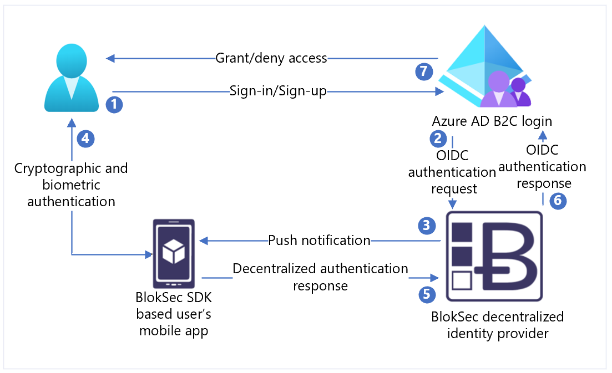

# Tutorial: Configure Azure Active Directory B2C with BlokSec for passwordless authentication

## Before you begin

Azure Active Directory B2C has two methods to define user interactions with applications: predefined user flows or configurable custom policies.  

>[!NOTE]
>In Azure Active Directory B2C, custom policies primarily address complex scenarios. For most scenarios, we recommend built-in user flows.</br> See, [User flows and custom policies overview](./user-flow-overview.md)

## Azure AD B2C and BlokSec

Learn how to integrate Azure Active Directory B2C (Azure AD B2C) authentication with BlokSec Decentralized Identity Router. The BlokSec solution simplifies user sign-in with passwordless authentication and tokenless multi-factor authentication. The solution protects customers from identity-related attacks such as password stuffing, phishing, and man-in-the-middle.

To learn more, go to bloksec.com: [BlokSec Technologies Inc.](https://bloksec.com/)

## Scenario description

BlokSec integration includes the following components:

* **Azure AD B2C** – authorization server and identity provider (IdP) for B2C applications
* **BlokSec Decentralized Identity Router** – gateway for services that apply BlokSec DIaaS to route authentication and authorization requests to user Personal Identity Provider (PIdP) applications
  * It's an OpenID Connect (OIDC) identity provider in Azure AD B2C
* **BlokSec SDK-based mobile app** – user PIdP in the decentralized authentication scenario. 
  * If you're not using the BlokSec SDK, go to Google Play for the free [BlokSec yuID](https://play.google.com/store/apps/details?id=com.bloksec)

The following architecture diagram illustrates the sign-up, sign-in flow in the BlokSec solution implementation.

   

1. User signs in to an Azure AD B2C application and is forwarded to Azure AD B2C sign-in and sign-up policy
2. Azure AD B2C redirects user to the BlokSec decentralized identity router using the OIDC authorization code flow.
3. The BlokSec router sends a push notification to the user mobile app with authentication and authorization request details.
4. User reviews the authentication challenge. An accepted user is prompted for biometry such as fingerprint or facial scan.
5. The response is digitally signed with the user's unique digital key. The authentication response provides proof of possession, presence, and consent. The respond returns to the router.
6. The router verifies the digital signature against the user’s immutable unique public key stored in a distributed ledger. The router replies to Azure AD B2C with the authentication result.
8. User is granted or denied access.

## Enable BlokSec

1. Go to bloksec.com and select **Request a demo** tenant. 
2. In the message field, indicate you want to integrate with Azure AD B2C. 
3. Download and install the free BlokSec yuID mobile app. 
4. After the demo tenant is prepared, an email arrives. 
5. On the mobile device with the BlokSec application, select the link to register your admin account with your yuID app.

## Prerequisites

To get started, you need:

* An Azure AD subscription
  * If you don't have one, get an [Azfree account](https://azure.microsoft.com/free/)
* An [Azure AD B2C tenant](./tutorial-create-tenant.md) linked to the Azure subscription
* A BlokSec [demo](https://bloksec.com/)
* Register a web application
  * [Tutorial: Register a web application in Azure AD B2C](./tutorial-register-applications.md)

See also, [Tutorial: Create user flows and custom policies in Azure AD B2C](./tutorial-create-user-flows.md?pivots=b2c-custom-policy)


### Create an application registration in BlokSec

In the account registration email from BlokSec, find the link to the BlokSec admin console. 

1. Sign in to the BlokSec admin console. 
2. On the main dashboard, select **Add Application > Create Custom**.
3. For **Name**, enter Azure AD B2C or an application name.
4. For **SSO type**, select **OIDC**.
5. For **Logo URI**, enter a link to logo image.
6. For **Redirect URIs**, use `https://your-B2C-tenant-name.b2clogin.com/your-B2C-tenant-name.onmicrosoft.com/oauth2/authresp`. For example,      `https://fabrikam.b2clogin.com/fabrikam.onmicrosoft.com/oauth2/authresp`. For a custom domain, enter `https://your-domain-name/your-tenant-name.onmicrosoft.com/oauth2/authresp`.
7. For **Post log out redirect URIs**, enter `https://your-B2C-tenant-name.b2clogin.com/your-B2C-tenant-name.onmicrosoft.com/{policy}/oauth2/v2.0/logout`.
8. Select the created Azure AD B2C application to open the application configuration.
9. Select **Generate App Secret**.
 
Learn more: [Send a sign out request](./openid-connect.md#send-a-sign-out-request).

>[!NOTE]
>You need application ID and application secret to configure the identity provider (IdP) in Azure AD B2C.

### Add a new identity provider in Azure AD B2C

For the following instructions, use the directory that contains your Azure AD B2C tenant. 

1. Sign in to the [Azure portal](https://portal.azure.com) as Global Administrator of your Azure AD B2C tenant.
2. In the portal toolbar, select **Directories + subscriptions**.
3. On the **Portal settings, Directories + subscriptions** page, in the **Directory name** list, find your Azure AD B2C directory.
4. Select **Switch**.
5. In the top-left corner of the Azure portal, select **All services**.
6. Search for and select **Azure AD B2C**.
7. Navigate to **Dashboard** > **Azure Active Directory B2C** > **Identity providers**.
8. Select **New OpenID Connect Provider**.
9. Select **Add**.

### Configure an identity provider

1. Select **Identity provider type > OpenID Connect**
2. For **Name**, enter **BlokSec yuID Passwordless** or another name.
3. For **Metadata URL**, enter `https://api.bloksec.io/oidc/.well-known/openid-configuration`.
4. For **Client IDV**, enter the application ID from the BlokSec admin UI.
5. For **Client Secret**, enter the application Secret from the BlokSec admin UI.
6. For **Scope**, select **OpenID email profile**.
7. For **Response type**, select **Code**.
8. For **Domain hint**, select **yuID**.
9. Select **OK**.
10. Select **Map this identity provider’s claims**.
11. For **User ID**, select **sub**.
12. For **Display name**, select **name**.
13. For **Given name**, use **given_name**.
14. For **Surname**, use **family_name**.
15. For **Email**, use **email**.
16. Select **Save**. 

### User registration

1. Sign in to the BlokSec admin console with the provided credential.
2. Navigate to the Azure AD B2C application created earlier. 
3. In the top-right, select the **gear** icon.
4. Select **Create Account**.  
5. In **Create Account**, enter user information. Note the Account Name.
6. Select **Submit**.  

The user receives an account registration email at the provided email address. Instruct the user to select the registration link on the mobile device with the BlokSec yuID app.

### Create a user flow policy

For the following instructions, ensure BlokSec is a new OIDC identity provider (IdP).  

1. In your Azure AD B2C tenant, under **Policies**, select **User flows**.  
2. Select **New user flow**.
3. Select **Sign up and sign in** > **Version** > **Create**.
4. Enter a policy **Name**.
5. In the identity providers section, select the created BlokSec identity provider.  
6. For Local Account, select **None**. This action disables email and password-based authentication.
7. Select **Run user flow**
8. In the form, enter the Replying URL, such as `https://jwt.ms`.
9. The browser is redirected to the BlokSec sign-in page. 
10. Enter the account name from user registration. 
11. The user receives a push notification on the mobile device with the BlokSec yuID application.
12. The user opens the notification, and the authentication challenge appears.
13. If authentication is accepted, the browser redirects the user to the replying URL.

>[!NOTE]
>In Azure Active Directory B2C, custom policies primarily address complex scenarios. For most scenarios, we recommend built-in user flows.</br> See, [User flows and custom policies overview](./user-flow-overview.md)

### Create a policy key

Store the client secret you noted in your Azure AD B2C tenant. For the following instructions, use the directory with your Azure AD B2C tenant. 

1. Sign in to the [Azure portal](https://portal.azure.com).
2. In the portal toolbar, select **Directories + subscriptions**.
3. On the **Portal settings, Directories + subscriptions** page, in the **Directory name** list, find your Azure AD B2C directory.
4. Select **Switch**.
5. In the top-left corner of the Azure portal, select **All services**
6. Search for and select **Azure AD B2C**.
7. On the **Overview** page, select **Identity Experience Framework**.
8. Select **Policy Keys**.
9. Select **Add**.
10. For **Options**, choose **Manual**.
11. Enter a policy **Name** for the policy key. For example, `BlokSecAppSecret`. The prefix `B2C_1A_` is added to the key name.
12. In **Secret**, enter the client secret you noted.
13. For **Key usage**, select **Signature**.
14. Select **Create**.

### Configure BlokSec as an identity provider

To enable users to sign in using BlokSec decentralized identity, define BlokSec as a claims provider. This action ensures Azure AD B2C communicates with it through an endpoint. Azure AD B2C uses endpoint claims to verify users authenticate identity by using biometry, such as fingerprint or facial scan.

To define BlokSec as a claims provider, add it to the **ClaimsProvider** element in the policy extension file.

1. Open the `TrustFrameworkExtensions.xml`.
2. Find the **ClaimsProviders** element. If the element doesn't appear, add it under the root element.
3. To add a new **ClaimsProvider**:

    ```xml
    <ClaimsProvider>
      <Domain>bloksec</Domain>
      <DisplayName>BlokSec</DisplayName>
      <TechnicalProfiles>
        <TechnicalProfile Id="BlokSec-OpenIdConnect">
          <DisplayName>BlokSec</DisplayName>
          <Description>Login with your BlokSec decentriled identity</Description>
          <Protocol Name="OpenIdConnect" />
          <Metadata>
            <Item Key="METADATA">https://api.bloksec.io/oidc/.well-known/openid-configuration</Item>
            <!-- Update the Client ID below to the BlokSec Application ID -->
            <Item Key="client_id">00000000-0000-0000-0000-000000000000</Item>
            <Item Key="response_types">code</Item>
            <Item Key="scope">openid profile email</Item>
            <Item Key="response_mode">form_post</Item>
            <Item Key="HttpBinding">POST</Item>
            <Item Key="UsePolicyInRedirectUri">false</Item>
            <Item Key="DiscoverMetadataByTokenIssuer">true</Item>
            <Item Key="ValidTokenIssuerPrefixes">https://api.bloksec.io/oidc</Item>
          </Metadata>
          <CryptographicKeys>
            <Key Id="client_secret" StorageReferenceId="B2C_1A_BlokSecAppSecret" />
          </CryptographicKeys>
          <OutputClaims>
            <OutputClaim ClaimTypeReferenceId="issuerUserId" PartnerClaimType="sub" />
            <OutputClaim ClaimTypeReferenceId="displayName" PartnerClaimType="name" />
            <OutputClaim ClaimTypeReferenceId="givenName" PartnerClaimType="given_name" />
            <OutputClaim ClaimTypeReferenceId="surName" PartnerClaimType="family_name" />
            <OutputClaim ClaimTypeReferenceId="email" PartnerClaimType="email" />
            <OutputClaim ClaimTypeReferenceId="authenticationSource" DefaultValue="socialIdpAuthentication" AlwaysUseDefaultValue="true" />
            <OutputClaim ClaimTypeReferenceId="identityProvider" PartnerClaimType="iss" />
          </OutputClaims>
          <OutputClaimsTransformations>
            <OutputClaimsTransformation ReferenceId="CreateRandomUPNUserName" />
            <OutputClaimsTransformation ReferenceId="CreateUserPrincipalName" />
            <OutputClaimsTransformation ReferenceId="CreateAlternativeSecurityId" />
            <OutputClaimsTransformation ReferenceId="CreateSubjectClaimFromAlternativeSecurityId" />
          </OutputClaimsTransformations>
          <UseTechnicalProfileForSessionManagement ReferenceId="SM-SocialLogin" />
        </TechnicalProfile>
      </TechnicalProfiles>
    </ClaimsProvider>
    ```

4. Set **client_id** to the application ID from the application registration.
5. Select **Save**.

### Add a user journey

Use the following instructions if the identity provider is set up, but not in any sign-in page. If you don't have a custom user journey, copy a template user journey.  
1. From the starter pack, open the `TrustFrameworkBase.xml` file.
2. Find and copy the contents of the **UserJourneys** element that includes ID=`SignUpOrSignIn`.
3. Open the `TrustFrameworkExtensions.xml`.
4. Find the **UserJourneys** element. If the element doesn't appear, add one.
5. Paste the contents of the **UserJourney** element you copied as a child of the **UserJourneys** element.
6. Rename the user journey ID. For example, ID=`CustomSignUpSignIn`.  

### Add the identity provider to a user journey

If you have a user journey, add the new identity provider to it. First add a sign-in button, then link it to an action, which is the technical profile you created.  

1. In the user journey, locate the orchestration step element that includes Type=`CombinedSignInAndSignUp`, or Type=`ClaimsProviderSelection`. It's usually the first orchestration step. The **ClaimsProviderSelections** element contains a list of identity providers for user sign-in. The order of the elements controls the order of the sign-in buttons the user sees. 
2. Add a **ClaimsProviderSelection** XML element. 
3. Set the value of **TargetClaimsExchangeId** to a friendly name.
4. In the next orchestration step, add a **ClaimsExchange** element. 
5. Set the **Id** to the value of the target claims exchange ID. 
6. Update the value of **TechnicalProfileReferenceId** to the ID of the technical profile you created.

The following XML demonstrates the first two user-journey orchestration steps with the identity provider:

```xml
<OrchestrationStep Order="1" Type="CombinedSignInAndSignUp" ContentDefinitionReferenceId="api.signuporsignin">
  <ClaimsProviderSelections>
    ...
    <ClaimsProviderSelection TargetClaimsExchangeId="BlokSecExchange" />
  </ClaimsProviderSelections>
  ...
</OrchestrationStep>

<OrchestrationStep Order="2" Type="ClaimsExchange">
  ...
  <ClaimsExchanges>
    <ClaimsExchange Id="BlokSecExchange" TechnicalProfileReferenceId="BlokSec-OpenIdConnect" />
  </ClaimsExchanges>
</OrchestrationStep>
```

### Configure the relying party policy

The relying party policy, for example [SignUpSignIn.xml](https://github.com/Azure-Samples/active-directory-b2c-custom-policy-starterpack/blob/master/SocialAndLocalAccounts/SignUpOrSignin.xml), specifies the user journey Azure AD B2C executes. 

1. Find the **DefaultUserJourney** element in relying party. 
2. Update the **ReferenceId** to match the user journey ID, in which you added the identity provider.

In the following example, for the `CustomSignUpOrSignIn` user journey, the ReferenceId is set to `CustomSignUpOrSignIn`.

```xml
<RelyingParty>
  <DefaultUserJourney ReferenceId="CustomSignUpSignIn" />
  ...
</RelyingParty>
```
### Upload the custom policy

For the following instructions, use the directory with your Azure AD B2C tenant. 

1. Sign in to the [Azure portal](https://portal.azure.com).
2. In the portal toolbar, select the **Directories + subscriptions**.
3. On the **Portal settings, Directories + subscriptions** page, in the **Directory name** list, find your Azure AD B2C directory
4. Select **Switch**.
5. In the Azure portal, search for and select **Azure AD B2C**.
6. Under **Policies**, select **Identity Experience Framework**.
7. Select **Upload Custom Policy**.
8. Upload the two policy files you changed in the following order: 

  * Extension policy, for example `TrustFrameworkExtensions.xml`
  * Relying party policy, such as `SignUpSignIn.xml`

### Test the custom policy

1. Select your relying party policy, for example `B2C_1A_signup_signin`.
1. For **Application**, select a web application you registered. 
2. The **Reply URL** appears as `https://jwt.ms`.
3. Select **Run now**.
4. From the sign-up or sign-in page, select **Google** to sign in with Google account.
5. The browser is redirected to `https://jwt.ms`. See the token contents returned by Azure AD B2C.

Learn more: [Tutorial: Register a web application in Azure Active Directory B2C](./tutorial-register-applications.md)

## Next steps

* [Azure AD B2C custom policy overview](./custom-policy-overview.md)
* [Tutorial: Create user flows and custom policies in Azure AD B2C](./tutorial-create-user-flows.md?pivots=b2c-custom-policy)
