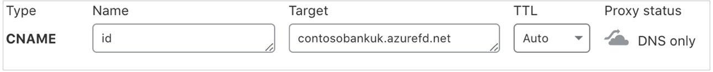
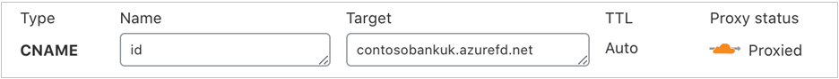
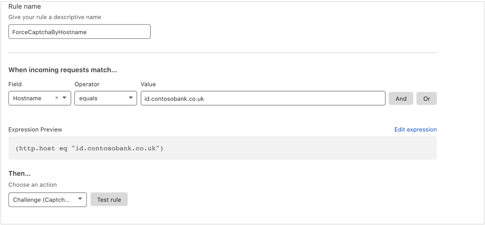
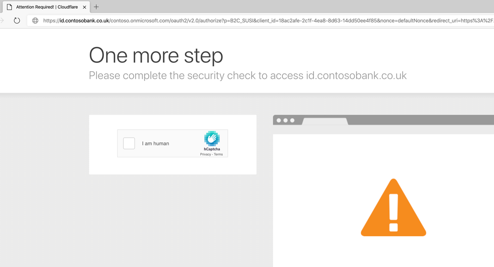
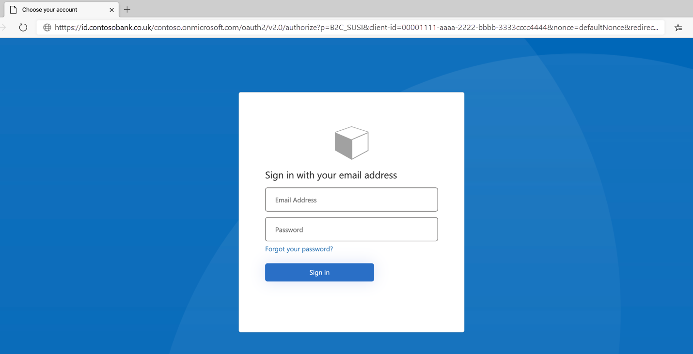

# Tutorial: Configure Clouldflare with Azure Active Directory B2C

In this sample tutorial, learn how to enable [Cloudflare Web Application Firewall (WAF)](https://www.cloudflare.com/waf/) solution for Azure Active Directory (AD) B2C tenant with custom domain. Clouldflare WAF helps organization protect against malicious attacks that aim to exploit vulnerabilities such as SQLi, and XSS.

## Prerequisites

To get started, you'll need:

- An Azure subscription. If you don't have a subscription, you can get a [free account](https://azure.microsoft.com/free/).

- [An Azure AD B2C tenant](tutorial-create-tenant.md) that is linked to your Azure subscription.

- A [Cloudflare](https://dash.cloudflare.com/sign-up) account.

## Scenario description

Cloudflare WAF integration includes the following components:

- **Azure AD B2C Tenant** – The authorization server, responsible for verifying the user’s credentials using the custom policies defined in the tenant.  It's also known as the identity provider.

- [**Azure Front Door**](https://docs.microsoft.com/azure/frontdoor/front-door-overview) – Responsible for enabling custom domains for Azure B2C tenant. All traffic from Cloudflare WAF will be routed to Azure Front Door before arriving at Azure AD B2C tenant.

- **Cloudflare** – The web application firewall, which manages all traffic that is sent to the authorization server.

## Integrate with Azure AD B2C

To use custom domains in Azure AD B2C, it's required to use custom domain feature provided by Azure Front Door. Learn how to [enable Azure AD B2C custom domains](https://docs.microsoft.com/azure/active-directory-b2c/custom-domain?pivots=b2c-user-flow).  

After custom domain for Azure AD B2C is successfully configured using Azure Front Door, [test the custom domain](https://docs.microsoft.com/azure/active-directory-b2c/custom-domain?pivots=b2c-custom-policy#test-your-custom-domain) before proceeding further.  

## Onboard with Cloudflare

[Sign-up](https://dash.cloudflare.com/sign-up) and create a Cloudflare account. To enable WAF, a minimum of [Pro SKU](https://www.cloudflare.com/plans/) is required.

### Configure DNS

1. To enable WAF for a domain, you must **turn-on the proxy setting** from the DNS console for the CNAME entry as shown in the example for domain id.contosobank.co.uk.

   

1. Toggle the **Proxy status** option available under the DNS pane.

1. After you switch it to **Proxied**, it would turn orange. The final setting should look like:

   

### Configure WAF

[Configure WAF](https://www.cloudflare.com/waf/) in your Cloudflare settings.

### Configure firewall rule

Add, update, or remove firewall rules using the firewall option available in the top pane of the console. For example, following firewall setting enables CAPTCHA for all incoming requests to *contosobank.co.uk* domain before the request is sent to Azure Front Door. Learn more about [setting firewall rules](https://support.cloudflare.com/hc/articles/360016473712-Cloudflare-Firewall-Rules).

### Test the settings

1. After saving the rule, it's required to complete CAPTCHA every time access to custom domain is requested.

   

   > [!NOTE]
   > Cloudflare also provides various [**other options**](https://support.cloudflare.com/hc/en-us/articles/200172706-Configuring-Custom-Pages-Error-and-Challenge-) to create customized  block pages.  

2. User is taken to Azure AD B2C policy after successfully completing CAPTCHA.

   

## Additional resources

- [Troubleshoot Cloudflare custom page issues](https://support.cloudflare.com/hc/en-us/articles/200172706-Configuring-Custom-Pages-Error-and-Challenge-#5QWV2KVjLnaAQ8L4tjiguw)

- [Get started with custom policies in Azure AD B2C](https://docs.microsoft.com/azure/active-directory-b2c/custom-policy-get-started?tabs=applications)

## Next steps 
 
- [Configure a custom domain in Azure AD B2C](https://docs.microsoft.com/azure/active-directory-b2c/custom-domain?pivots=b2c-user-flow)
   
