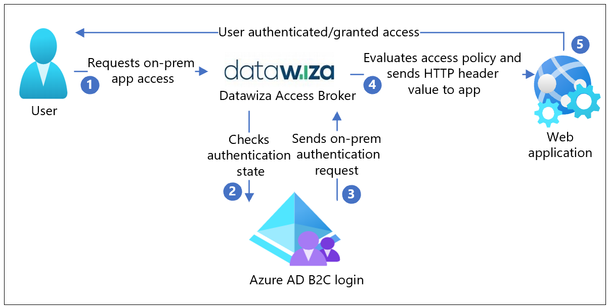
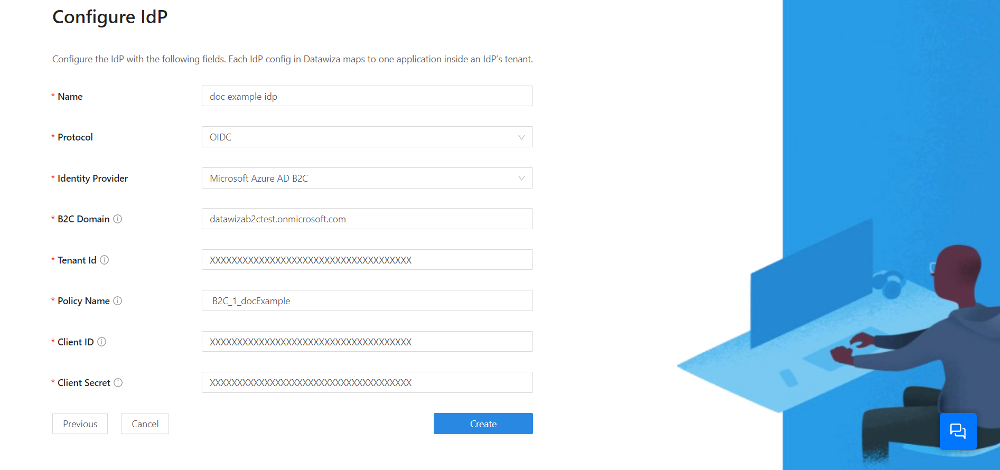
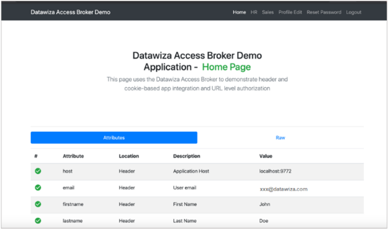

# Tutorial: Configure Azure Active Directory B2C with Datawiza to provide secure hybrid access

In this tutorial, learn how to integrate Azure Active Directory B2C (Azure AD B2C) with [Datawiza Access Proxy (DAP)](https://www.datawiza.com/), which enables single sign-on (SSO) and granular access control, helping Azure AD B2C protect on-premises legacy applications. With this solution, enterprises can transition from legacy to Azure AD B2C without rewriting applications.

## Prerequisites

To get started, you'll need:

- A Microsoft Entra subscription
  - If you don't have one, you can get an [Azure free account](https://azure.microsoft.com/free/)
- An [Azure AD B2C tenant](./tutorial-create-tenant.md) linked to your Azure subscription
- [Docker](https://docs.docker.com/get-docker/), an open platform for developing, shipping, and running applications, is required to run DAB
  - Your applications can run on platforms such as virtual machine and bare metal
- An on-premises application to transition from a legacy identity system, to Azure AD B2C
  - In this tutorial, DAB is deployed on the same server as the application
  - The application runs on localhost: 3001 and DAP proxies traffic to applications via localhost: 9772
  - The application traffic reaches DAB first and then is proxied to the application

## Scenario description

Datawiza integration includes the following components:

- **Azure AD B2C**: The authorization server to verify user credentials
  - Authenticated users access on-premises applications using a local account stored in the Azure AD B2C directory
- **Datawiza Access Proxy (DAP)**: The service that passes identity to applications through HTTP headers
- **Datawiza Cloud Management Console (DCMC)**: A management console for DAB. DCMC UI and RESTful APIs help manage DAB configurations and access control policies

The following architecture diagram shows the implementation.

   

1. The user requests access to an on-premises application. DAB proxies the request to the application.
2. DAP checks user authentication state. With no session token, or an invalid token, the user goes to Azure AD B2C for authentication.
3. Azure AD B2C sends the user request to the endpoint specified during DAP registration in the Azure AD B2C tenant.
4. The DAP evaluates access policies and calculates attribute values in HTTP headers forwarded to the application. The DAP might call to the identity provider (IdP) to retrieve information to set the header values. The DAP sets the header values and sends the request to the application.
5. The user is authenticated with access to the application.

## Onboard with Datawiza

To integrate your legacy on-premises app with Azure AD B2C, contact [Datawiza](https://login.datawiza.com/df3f213b-68db-4966-bee4-c826eea4a310/b2c_1a_linkage/oauth2/v2.0/authorize?response_type=id_token&scope=openid%20profile&client_id=4f011d0f-44d4-4c42-ad4c-88c7bbcd1ac8&redirect_uri=https%3A%2F%2Fconsole.datawiza.com%2Fhome&state=eyJpZCI6Ijk3ZjI5Y2VhLWQ3YzUtNGM5YS1hOWU2LTg1MDNjMmUzYWVlZCIsInRzIjoxNjIxMjg5ODc4LCJtZXRob2QiOiJyZWRpcmVjdEludGVyYWN0aW9uIn0%3D&nonce=08e1b701-6e42-427b-894b-c5d655a9a6b0&client_info=1&x-client-SKU=MSAL.JS&x-client-Ver=1.3.3&client-request-id=3ac285ba-2d4d-4ae5-8dc2-9295ff6047c6&response_mode=fragment).

## Configure your Azure AD B2C tenant

Go to docs.datawiza.com to: 

1. Learn how to register your web application in an Azure AD B2C tenant, and configure a sign up-and sign-in user flow. For more info, see [Azure AD B2C](https://docs.datawiza.com/idp/azureb2c.html#microsoft-azure-ad-b2c-configuration).

2. [Configure a user flow](https://docs.datawiza.com/idp/azureb2c.html#configure-a-user-flow) in the Azure portal.

>[!NOTE]
>When you set up DAB in the DCM, you need the tenant name, user flow name, client ID, and client secret.

## Create an application in DCMC

1. In DCMC, create an application and generate a key pair of `PROVISIONING_KEY` and `PROVISIONING_SECRET` for this application. See, [Datawiza Cloud Management Console](https://docs.datawiza.com/step-by-step/step2.html).
2. Configure IdP with Azure AD B2C. See, [Part I: Azure AD B2C Configuration](https://docs.datawiza.com/tutorial/web-app-azure-b2c.html#part-i-azure-ad-b2c-configuration).

    

## Run DAB with a header-based application

You can use Docker or Kubernetes to run DAP. Use the Docker image for users to create a sample header-based application. 

Learn more: To configure DAP and SSO integration, see [Deploy Datawiza Access Proxy With Your App](https://docs.datawiza.com/step-by-step/step3.html) 

A sample docker image `docker-compose.yml file` is provided. Sign in to the container registry to download DAP images and the header-based application. 

1. [Deploy Datawiza Access Proxy With Your App](https://docs.datawiza.com/step-by-step/step3.html#important-step).

    ```yaml
    version: '3'

    services:
    datawiza-access-broker:
    image: registry.gitlab.com/datawiza/access-broker
    container_name: datawiza-access-broker
    restart: always
    ports:
      - "9772:9772"
    environment:
      PROVISIONING_KEY: #############################
      PROVISIONING_SECRET: #############################

    header-based-app:
    image: registry.gitlab.com/datawiza/header-based-app
    container_name: ab-demo-header-app
    restart: always
    environment:
      CONNECTOR: B2C
    ports:
      - "3001:3001"
    ```

2. The header-based application has SSO enabled with Azure AD B2C. 
3. Open a browser and enter `http://localhost:9772/`.
4. An Azure AD B2C sign-in page appears.

## Pass user attributes to the header-based application

DAB gets user attributes from IdP and passes them to the application with header or cookie. After you configure user attributes, the green check sign appears for user attributes.

   
 
Learn more: [Pass User Attributes](https://docs.datawiza.com/step-by-step/step4.html) such as email address, firstname, and lastname to the header-based application. 

## Test the flow

1. Navigate to the on-premises application URL.
2. The DAP redirects to the page you configured in your user flow.
3. From the list, select the IdP.
4. At the prompt, enter your credentials. If necessary, include a Microsoft Entra multifactor authentication token.
5. You're redirected to Azure AD B2C, which forwards the application request to the DAP redirect URI.
6. The DAB evaluates policies, calculates headers, and sends the user to the upstream application. 
7. The requested application appears.

## Next steps

- [Custom policies in Azure AD B2C](./custom-policy-overview.md)
- [Get started with custom policies in Azure AD B2C](./tutorial-create-user-flows.md?pivots=b2c-custom-policy&tabs=applications)
