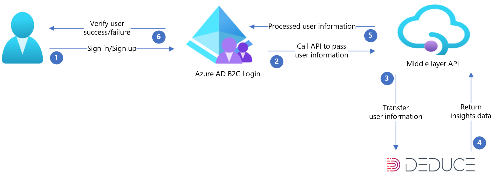

# Configure Azure Active Directory B2C with Deduce to combat identity fraud and create a trusted user experience

In this sample article, we provide guidance on how to integrate Azure Active Directory B2C (Azure AD B2C) authentication with [Deduce](https://www.deduce.com/). Deduce is focused on stopping account takeover and registration fraud—the fastest-growing fraud on the internet. The Deduce Identity Network is powered by a coalition of over 150,000 websites and apps who share logins, registrations, and checkouts with Deduce over 1.4 billion times per day.

The resulting identity intelligence stops attacks before they become a financial problem and a corporate liability. It uses historical behavioral analysis as a predictor of trust so organizations can deliver a frictionless user experience for their best customers. A comprehensive range of risk and trust signals can inform every authentication decision with the Azure AD B2C instance.
With this integration, organizations can extend their Azure AD B2C capabilities during the sign-up or sign in process to get additional insights about the user from the Deduce Insights API. Some of the attributes ingested by the Deduce API are:

- Email
- IP Address
- User agent

## Prerequisites

To get started, you'll need:

- An Azure subscription. If you don't have one, get a [free account](https://azure.microsoft.com/free).

- An [Azure AD B2C tenant](tutorial-create-tenant.md) that is linked to your Azure subscription.

- [Register an application](./tutorial-register-applications.md)

- [Contact Deduce](mailto:support@deduce.com) to configure a test or production environment.

- Ability to use Azure AD B2C custom policies. If you can't, complete the steps in [Get started with custom policies in Azure AD B2C](custom-policy-overview.md) to learn how to use custom policies.


## Scenario description

The integration includes the following components:

- **Azure AD B2C** – The authorization server, responsible for verifying the user's credentials, also known as the identity provider.
- **Deduce** – The Deduce service takes inputs provided by the user and provides digital activity insights on the user's identity.
- **Custom rest API** – This API implements the integration between Azure AD B2C and the Deduce Insights API.

The following architecture diagram shows the implementation:



| Steps | Description |
|:-----------|:---------------|
| 1.    | User opens Azure AD B2C's sign-in page, and then signs in or signs up by entering their username.|
| 2.    | Azure AD B2C calls the middle layer API and passes on the user attributes.|
| 3.    | Middle layer API collects user attributes and transforms it into a format that the Deduce API can consume and then sends it to Deduce.|
| 4.    | Deduce consumes the information and processes it to validate user identification based on the risk analysis. Then, it returns the result to the middle layer API.|
| 5.    | Middle layer API processes the information and sends back risk, trust and info signals in the correct JSON format to Azure AD B2C.|
| 6.    | Azure AD B2C receives information back from the middle layer API. <br> If it shows a failure response, an error message is displayed to the user. <br> If it shows a success response, the user is authenticated and written into the directory. |

## Onboard with Deduce

To create a Deduce account, contact [Deduce support](mailto:support@deduce.com). Once an account is created, you'll receive a **Site ID**, and **API key** that you'll need for the API configuration.

The following sections describe the integration process.

### Step 1: Configure the Azure AD B2C policy

Follow the instructions in [Get the starter pack](tutorial-create-user-flows.md?pivots=b2c-custom-policy#get-the-starter-pack) to learn how to set up your Azure AD B2C tenant and configure policies. This samples article is based on the Local Accounts starter pack.


### Step 2: Customize the Azure AD B2C user interface

In order to collect the user_agent from client-side, create your own `**ContentDefinition**` with an arbitrary ID to include the related JavaScript. Determine the end-user browser's user_agent string and store it as a claim in Azure AD B2C.

1. Download the api.selfasserted, [selfAsserted.cshtml](https://login.microsoftonline.com/static/tenant/templates/AzureBlue/selfAsserted.cshtml), locally.

1. Edit the selfAsserted.cshtml to include the following JavaScript before the closure of `</head>` defines an additional Style element to hide the panel-default.

   ``` html
   <style>
    .panel-default   {
    margin: 0 auto;
    width: 60%;
    height: 0px;
    background-color: #296ec6;
    opacity: 1;
    border-radius: .5rem;
    border: none;
    color: #fff;
    font-size: 1em;
    box-shadow: 0 0 30px 0 #dae1f7;
    visibility: hidden;
   } 
    
   </style>
   ```

1. Add the following JavaScript code before the closure of the `</body>`. This code reads the user_agent from the user's browser and the ContentDefinition is used in combination with the self-asserted technical profile to return user_agent as an output claim to the next orchestration step.

   ``` html
   <script>
        $("#user_agent").hide().val(window.navigator.userAgent);
        var img = new Image();
        img.onload = function() {
        document.getElementById("continue").click();
     };
        img.src = "https://login.microsoftonline.com/static/tenant/templates/images/logo.svg";
   </script>
   ```

### Step 3: Configure your storage location

1. Set up a [blob storage container in your storage account](../storage/blobs/storage-quickstart-blobs-portal.md#create-a-container) and upload the previously edited `**selfAsserted.cshtml**` file to your blob container.

1. Allow CORS access to storage container you created by following these instructions:

   1. Go to **Settings** >**Allowed Origin**, enter `https://your_tenant_name.b2clogin.com`. Replace `your-tenant- name` with the name of your Azure AD B2C tenant such as `fabrikam`. Use all lowercase letters when entering your tenant name.

   1. For **Allowed Methods**, select `GET` and `PUT`.

   1. Select **Save**.

### Step 4: Configure Content Definition

To customize the user interface, you specify a URL in the `ContentDefinition` element with customized HTML content. In the self-asserted technical profile or orchestration step, you point to that ContentDefinition identifier.


1. Open the `TrustFrameworksExtension.xml` and define a new **ContentDefinition** to customize the [self-asserted technical profile](./self-asserted-technical-profile.md).

1. Find the `BuildingBlocks` element and add the `**api.selfassertedDeduce**` ContentDefinition:

   ```xml
    <BuildingBlocks>
    ...
    <ContentDefinitions>
      <ContentDefinition Id="api.selfassertedDeduce">
        <LoadUri>https://<STORAGE-ACCOUNT-NAME>.blob.core.windows.net/<CONTAINER>/selfAsserted.cshtml</LoadUri>
        <RecoveryUri>~/common/default_page_error.html</RecoveryUri>
        <DataUri>urn:com:microsoft:aad:b2c:elements:contract:selfasserted:2.1.7</DataUri>
        <Metadata>
          <Item Key="DisplayName">Signin and Signup Deduce</Item>
        </Metadata>
      </ContentDefinition>
    </ContentDefinitions>
      ...
   </BuildingBlocks>
   ```

Replace LoadUri with the url pointing to the `selfAsserted.cshtml` file created in [step 1](#step-1-configure-the-azure-ad-b2c-policy).

### Step 5: Add Deduce additional ClaimType

The **ClaimsSchema** element defines the claim types that can be referenced as part of the policy. There are additional claims that Deduce supports and can be added.

1. Open the `TrustFrameworksExtension.xml`

1. In the `**BuildingBlocks**` element additional identity claims that Deduce supports can be added.

   ```xml
     <BuildingBlocks>
   ...
    <ClaimsSchema>
     <!-- Claims for Deduce API request body -->
      <ClaimType Id="site">
        <DisplayName>Site ID</DisplayName>
        <DataType>string</DataType>
        <AdminHelpText>Deduce Insight API site id</AdminHelpText>
      </ClaimType>

      <ClaimType Id="ip">
        <DisplayName>IP Address</DisplayName>
        <DataType>string</DataType>
        <AdminHelpText>Add help text here</AdminHelpText>
      </ClaimType>

      <ClaimType Id="apikey">
        <DisplayName>API Key</DisplayName>
        <DataType>string</DataType>
        <AdminHelpText>Add help text here</AdminHelpText>
      </ClaimType>

      <ClaimType Id="action">
        <DisplayName>Contextual action</DisplayName>
        <DataType>string</DataType>
        <AdminHelpText>Add help text here</AdminHelpText>
      </ClaimType>

      <!-- End of Claims for Deduce API request body -->

      <!-- Rest API call request body to deduce insight API -->
      <ClaimType Id="deduce_requestbody">
        <DisplayName>Request body for insight api</DisplayName>
        <DataType>string</DataType>
        <AdminHelpText>Request body for insight api</AdminHelpText>
      </ClaimType>

      <ClaimType Id="deduce_trust_response">
        <DisplayName>Response body for insight api</DisplayName>
        <DataType>string</DataType>
        <AdminHelpText>Response body for insight api</AdminHelpText>
      </ClaimType>
      <!-- End of Rest API call request body to deduce insight API -->

      <!-- Response claims from Deduce Insight  API -->

      <ClaimType Id="data.signals.trust">
        <DisplayName>Trust collection</DisplayName>
        <DataType>stringCollection</DataType>
        <AdminHelpText>List of asserted trust</AdminHelpText>
      </ClaimType>

      <ClaimType Id="data.signals.info">
        <DisplayName>Trust collection</DisplayName>
        <DataType>stringCollection</DataType>
        <AdminHelpText>List of asserted info</AdminHelpText>
      </ClaimType>

      <ClaimType Id="data.signals.risk">
        <DisplayName>Trust collection</DisplayName>
        <DataType>stringCollection</DataType>
        <AdminHelpText>List of asserted risk</AdminHelpText>
      </ClaimType>

      <ClaimType Id="data.network.company_name">
        <DisplayName>data.network.company_name</DisplayName>
        <DataType>string</DataType>
        <AdminHelpText>List of asserted risk</AdminHelpText>
      </ClaimType>
      <ClaimType Id="data.network.crawler_name">
        <DisplayName>data.network.crawler_name</DisplayName>
        <DataType>string</DataType>
        <AdminHelpText>List of asserted risk</AdminHelpText>
      </ClaimType>
      <ClaimType Id="data.network.is_corporate">
        <DisplayName>data.network.is_corporate</DisplayName>
        <DataType>boolean</DataType>
        <AdminHelpText>List of asserted risk</AdminHelpText>
      </ClaimType>
      <ClaimType Id="data.network.is_education">
        <DisplayName>data.network.is_education</DisplayName>
        <DataType>boolean</DataType>
        <AdminHelpText>List of asserted risk</AdminHelpText>
      </ClaimType>
      <ClaimType Id="data.network.is_hosting">
        <DisplayName>data.network.is_hosting</DisplayName>
        <DataType>boolean</DataType>
        <AdminHelpText>List of asserted risk</AdminHelpText>
      </ClaimType>
      <ClaimType Id="data.network.is_mobile">
        <DisplayName>data.network.is_mobile</DisplayName>
        <DataType>boolean</DataType>
        <AdminHelpText>List of asserted risk</AdminHelpText>
      </ClaimType>
      <ClaimType Id="data.network.is_proxy">
        <DisplayName>data.network.is_proxy"</DisplayName>
        <DataType>boolean</DataType>
        <AdminHelpText>List of asserted risk</AdminHelpText>
      </ClaimType>
      <ClaimType Id="data.network.is_tor">
        <DisplayName>data.network.is_tor</DisplayName>
        <DataType>boolean</DataType>
        <AdminHelpText>List of asserted risk</AdminHelpText>
      </ClaimType>
      <ClaimType Id="data.network.is_vpn_capable">
        <DisplayName>data.network.is_vpn_capable</DisplayName>
        <DataType>boolean</DataType>
        <AdminHelpText>List of asserted risk</AdminHelpText>
      </ClaimType>
      <ClaimType Id="data.network.is_vpn_confirmed">
        <DisplayName>data.network.is_vpn_confirmed</DisplayName>
        <DataType>boolean</DataType>
        <AdminHelpText>List of asserted risk</AdminHelpText>
      </ClaimType>
      <ClaimType Id="data.network.is_vpn_suspect">
        <DisplayName>data.network.is_vpn_suspect</DisplayName>
        <DataType>boolean</DataType>
        <AdminHelpText>List of asserted risk</AdminHelpText>
      </ClaimType>
      <ClaimType Id="data.network.isp_name">
        <DisplayName>data.network.isp_name</DisplayName>
        <DataType>string</DataType>
        <AdminHelpText>List of asserted risk</AdminHelpText>
      </ClaimType>
      <ClaimType Id="data.network.vpn_name">
        <DisplayName>data.network.vpn_name</DisplayName>
        <DataType>string</DataType>
        <AdminHelpText>List of asserted risk</AdminHelpText>
      </ClaimType>
      <ClaimType Id="data.geo.city">
        <DisplayName>data.geo.city</DisplayName>
        <DataType>string</DataType>
        <AdminHelpText>List of asserted risk</AdminHelpText>
      </ClaimType>
      <ClaimType Id="data.geo.country">
        <DisplayName>data.geo.country</DisplayName>
        <DataType>string</DataType>
        <AdminHelpText>List of asserted risk</AdminHelpText>
      </ClaimType>
      <ClaimType Id="data.geo.lat">
        <DisplayName>data.geo.lat</DisplayName>
        <DataType>string</DataType>
        <AdminHelpText>List of asserted risk</AdminHelpText>
      </ClaimType>
      <ClaimType Id="data.geo.long">
        <DisplayName>data.geo.long</DisplayName>
        <DataType>string</DataType>
        <AdminHelpText>List of asserted risk</AdminHelpText>
      </ClaimType>
      <ClaimType Id="data.geo.state">
        <DisplayName>data.geo.state</DisplayName>
        <DataType>string</DataType>
        <AdminHelpText>List of asserted risk</AdminHelpText>
      </ClaimType>
      <ClaimType Id="data.device.ua_brand">
        <DisplayName>data.device.ua_brand</DisplayName>
        <DataType>string</DataType>
        <AdminHelpText>List of asserted risk</AdminHelpText>
      </ClaimType>
      <ClaimType Id="data.device.ua_browser">
        <DisplayName>data.device.ua_browser</DisplayName>
        <DataType>string</DataType>
        <AdminHelpText>List of asserted risk</AdminHelpText>
      </ClaimType>
      <ClaimType Id="data.device.ua_device_type">
        <DisplayName>data.device.ua_device_type</DisplayName>
        <DataType>string</DataType>
        <AdminHelpText>List of asserted risk</AdminHelpText>
      </ClaimType>
      <ClaimType Id="data.device.ua_name">
        <DisplayName>data.device.ua_name</DisplayName>
        <DataType>string</DataType>
        <AdminHelpText>List of asserted risk</AdminHelpText>
      </ClaimType>
      <ClaimType Id="data.device.ua_os">
        <DisplayName>data.device.ua_os</DisplayName>
        <DataType>string</DataType>
        <AdminHelpText>List of asserted risk</AdminHelpText>
      </ClaimType>
      <ClaimType Id="data.device.ua_type">
        <DisplayName>data.device.ua_type</DisplayName>
        <DataType>string</DataType>
        <AdminHelpText>List of asserted risk</AdminHelpText>
      </ClaimType>
      <ClaimType Id="data.device.ua_version">
        <DisplayName>data.device.ua_version</DisplayName>
        <DataType>string</DataType>
        <AdminHelpText>List of asserted risk</AdminHelpText>
      </ClaimType>
      <ClaimType Id="data.activity.email.ip_count">
        <DisplayName>data.activity.email.ip_count</DisplayName>
        <DataType>int</DataType>
        <AdminHelpText>Add help text here</AdminHelpText>
      </ClaimType>
      <ClaimType Id="data.activity.email.lastseen">
        <DisplayName>data.activity.email.lastseen</DisplayName>
        <DataType>string</DataType>
        <AdminHelpText>Add help text here</AdminHelpText>
      </ClaimType>
      <ClaimType Id="data.activity.email.frequency">
        <DisplayName>data.activity.email.frequency</DisplayName>
        <DataType>int</DataType>
        <AdminHelpText>Add help text here</AdminHelpText>
      </ClaimType>
      <ClaimType Id="data.activity.emailip.frequency">
        <DisplayName>data.activity.emailip.frequency</DisplayName>
        <DataType>int</DataType>
        <AdminHelpText>Add help text here</AdminHelpText>
      </ClaimType>
      <ClaimType Id="data.activity.emailip.lastseen">
        <DisplayName>data.activity.emailip.lastseen</DisplayName>
        <DataType>string</DataType>
        <AdminHelpText>Add help text here</AdminHelpText>
      </ClaimType>
      <ClaimType Id="data.activity.emailip.match">
        <DisplayName>data.activity.emailip.match</DisplayName>
        <DataType>boolean</DataType>
        <AdminHelpText>Add help text here</AdminHelpText>
      </ClaimType>
      <ClaimType Id="data.activity.emailip.rank_email">
        <DisplayName>data.activity.emailip.rank_email</DisplayName>
        <DataType>int</DataType>
        <AdminHelpText>Add help text here</AdminHelpText>
      </ClaimType>
      <ClaimType Id="data.activity.emailip.rank_ip">
        <DisplayName>data.activity.emailip.rank_ip</DisplayName>
        <DataType>int</DataType>
        <AdminHelpText>Add help text here</AdminHelpText>
      </ClaimType>
      <ClaimType Id="data.activity.ip.email_count">
        <DisplayName>data.activity.ip.email_count</DisplayName>
        <DataType>int</DataType>
        <AdminHelpText>Add help text here</AdminHelpText>
      </ClaimType>
      <ClaimType Id="data.activity.ip.lastseen">
        <DisplayName>data.activity.ip.lastseen</DisplayName>
        <DataType>string</DataType>
        <AdminHelpText>Add help text here</AdminHelpText>
      </ClaimType>

      <ClaimType Id="data.activity.ip.frequency">
        <DisplayName>data.activity.ip.frequency</DisplayName>
        <DataType>int</DataType>
        <AdminHelpText>Add help text here</AdminHelpText>
      </ClaimType>

      <ClaimType Id="data.sent_timestamp">
        <DisplayName>datasent_timestamp</DisplayName>
        <DataType>long</DataType>
        <AdminHelpText>Add help text here</AdminHelpText>
      </ClaimType>

      <ClaimType Id="user_agent">
        <DisplayName>User Agent</DisplayName>
        <DataType>string</DataType>
        <UserHelpText>Add help text here</UserHelpText>
        <UserInputType>TextBox</UserInputType>
      </ClaimType>

      <ClaimType Id="correlationId">
        <DisplayName>correlation ID</DisplayName>
        <DataType>string</DataType>
      </ClaimType>
    <!-- End Response claims from Deduce Insight API -->
    ...
    </ClaimsSchema>
    ...
    </BuildingBlocks>

   ```

### Step 6: Add Deduce ClaimsProvider

A **claims provider** is an interface to communicate with different types of parties via its [technical profiles](./technicalprofiles.md).

- `SelfAsserted-UserAgent` self-asserted technical profile is used to collect user_agent from client-side.

- `deduce_insight_api` technical profile sends data to the Deduce RESTful service in an input claims collection and receives data back in an output claims collection. For more information, see [integrate REST API claims exchanges in your Azure AD B2C custom policy](./api-connectors-overview.md?pivots=b2c-custom-policy)

You can define Deduce as a claims provider by adding it to the **ClaimsProvider** element in the extension file of your policy.

1. Open the `TrustFrameworkExtensions.xml`.

1. Find the **ClaimsProvider** element. If it doesn't exist, add a new **ClaimsProvider** as follows:

   ```xml
    <ClaimsProvider>
      <DisplayName>Deduce REST API</DisplayName>
      <TechnicalProfiles>
        <TechnicalProfile Id="SelfAsserted-UserAgent">
          <DisplayName>Pre-login</DisplayName>
          <Protocol Name="Proprietary" Handler="Web.TPEngine.Providers.SelfAssertedAttributeProvider, Web.TPEngine, Version=1.0.0.0, Culture=neutral,         PublicKeyToken=null" />
          <Metadata>
            <Item Key="ContentDefinitionReferenceId">api.selfassertedDeduce</Item>
            <Item Key="setting.showCancelButton">false</Item>
            <Item Key="language.button_continue">Continue</Item>
          </Metadata>
          <OutputClaims>
            <OutputClaim ClaimTypeReferenceId="user_agent" />
          </OutputClaims>
        </TechnicalProfile>
        <TechnicalProfile Id="deduce_insight_api">
          <DisplayName>Get customer insight data from deduce api</DisplayName>
          <Protocol Name="Proprietary" Handler="Web.TPEngine.Providers.RestfulProvider, Web.TPEngine, Version=1.0.0.0, Culture=neutral, PublicKeyToken=null" />
          <Metadata>
            <Item Key="ServiceUrl">https://deduceproxyapi.azurewebsites.net/api/Deduce/DeduceInsights</Item>
            <Item Key="AuthenticationType">None</Item>
            <Item Key="SendClaimsIn">Body</Item>
            <Item Key="ResolveJsonPathsInJsonTokens">true</Item>
            <Item Key="AllowInsecureAuthInProduction">true</Item>
            <Item Key="DebugMode">true</Item>
            <Item Key="IncludeClaimResolvingInClaimsHandling">true</Item>
          </Metadata>
          <InputClaims>
            <InputClaim ClaimTypeReferenceId="user_agent" />
            <InputClaim ClaimTypeReferenceId="signInNames.emailAddress" PartnerClaimType="email" />
            <InputClaim ClaimTypeReferenceId="ip" DefaultValue="{Context:IPAddress}" AlwaysUseDefaultValue="true" />
            <InputClaim ClaimTypeReferenceId="apikey" DefaultValue="<DEDUCE API KEY>" />
            <InputClaim ClaimTypeReferenceId="action" DefaultValue="auth.success.password" />
            <InputClaim ClaimTypeReferenceId="site" DefaultValue="<SITE>" />
          </InputClaims>
          <OutputClaims>
            <OutputClaim ClaimTypeReferenceId="data.sent_timestamp" PartnerClaimType="data.sent_timestamp" />
            <OutputClaim ClaimTypeReferenceId="data.activity.ip.frequency" PartnerClaimType="data.activity.ip.frequency" />
            <OutputClaim ClaimTypeReferenceId="data.activity.ip.lastseen" PartnerClaimType="data.activity.ip.lastseen" />
            <OutputClaim ClaimTypeReferenceId="data.activity.ip.email_count" PartnerClaimType="data.activity.ip.email_count" />
            <OutputClaim ClaimTypeReferenceId="data.activity.email.ip_count" PartnerClaimType="data.activity.email.ip_count" />
            <OutputClaim ClaimTypeReferenceId="data.activity.email.lastseen" PartnerClaimType="data.activity.email.lastseen" />
            <OutputClaim ClaimTypeReferenceId="data.activity.email.frequency" PartnerClaimType="data.activity.email.frequency" />
            <OutputClaim ClaimTypeReferenceId="data.activity.emailip.frequency" PartnerClaimType="data.activity.emailip.frequency" />
            <OutputClaim ClaimTypeReferenceId="data.activity.emailip.lastseen" PartnerClaimType="data.activity.emailip.lastseen" />
            <OutputClaim ClaimTypeReferenceId="data.activity.emailip.match" PartnerClaimType="data.activity.emailip.match" />
            <OutputClaim ClaimTypeReferenceId="data.activity.emailip.rank_email" PartnerClaimType="data.activity.emailip.rank_email" />
            <OutputClaim ClaimTypeReferenceId="data.activity.emailip.rank_ip" PartnerClaimType="data.activity.emailip.rank_ip" />
            <OutputClaim ClaimTypeReferenceId="data.signals.trust" PartnerClaimType="data.signals.trust" />
            <OutputClaim ClaimTypeReferenceId="data.signals.info" PartnerClaimType="data.signals.info" />
            <OutputClaim ClaimTypeReferenceId="data.signals.risk" PartnerClaimType="data.signals.risk" />
            <OutputClaim ClaimTypeReferenceId="data.network.company_name" PartnerClaimType="data.network.company_name" />
            <OutputClaim ClaimTypeReferenceId="data.network.crawler_name" PartnerClaimType="data.network.crawler_name" />
            <OutputClaim ClaimTypeReferenceId="data.network.is_corporate" PartnerClaimType="data.network.is_corporate" />
            <OutputClaim ClaimTypeReferenceId="data.network.is_education" PartnerClaimType="data.network.is_education" />
            <OutputClaim ClaimTypeReferenceId="data.network.is_hosting" PartnerClaimType="data.network.is_hosting" />
            <OutputClaim ClaimTypeReferenceId="data.network.is_mobile" PartnerClaimType="data.network.is_mobile" />
            <OutputClaim ClaimTypeReferenceId="data.network.is_proxy" PartnerClaimType="data.network.is_proxy" />
            <OutputClaim ClaimTypeReferenceId="data.network.is_tor" PartnerClaimType="data.network.is_tor" />
            <OutputClaim ClaimTypeReferenceId="data.network.is_vpn_capable" PartnerClaimType="data.network.is_vpn_capable" />
            <OutputClaim ClaimTypeReferenceId="data.network.is_vpn_confirmed" PartnerClaimType="data.network.is_vpn_confirmed" />
            <OutputClaim ClaimTypeReferenceId="data.network.is_vpn_suspect" PartnerClaimType="data.network.is_vpn_suspect" />
            <OutputClaim ClaimTypeReferenceId="data.network.isp_name" PartnerClaimType="data.network.isp_name" />
            <OutputClaim ClaimTypeReferenceId="data.network.vpn_name" PartnerClaimType="data.network.vpn_name" />
            <OutputClaim ClaimTypeReferenceId="data.geo.city" PartnerClaimType="data.geo.city" />
            <OutputClaim ClaimTypeReferenceId="data.geo.country" PartnerClaimType="data.geo.country" />
            <OutputClaim ClaimTypeReferenceId="data.geo.lat" PartnerClaimType="data.geo.lat" />
            <OutputClaim ClaimTypeReferenceId="data.geo.long" PartnerClaimType="data.geo.long" />
            <OutputClaim ClaimTypeReferenceId="data.geo.state" PartnerClaimType="data.geo.state" />
            <OutputClaim ClaimTypeReferenceId="data.device.ua_brand" PartnerClaimType="data.device.ua_brand" />
            <OutputClaim ClaimTypeReferenceId="data.device.ua_browser" PartnerClaimType="data.device.ua_browser" />
            <OutputClaim ClaimTypeReferenceId="data.device.ua_device_type" PartnerClaimType="data.device.ua_device_type" />
            <OutputClaim ClaimTypeReferenceId="data.device.ua_name" PartnerClaimType="data.device.ua_name" />
            <OutputClaim ClaimTypeReferenceId="data.device.ua_os" PartnerClaimType="data.device.ua_os" />
            <OutputClaim ClaimTypeReferenceId="data.device.ua_type" PartnerClaimType="data.device.ua_type" />
            <OutputClaim ClaimTypeReferenceId="data.device.ua_version" PartnerClaimType="data.device.ua_version" />
          </OutputClaims>
        </TechnicalProfile>
      </TechnicalProfiles>
    </ClaimsProvider>

   ```

Replace `apikey` and `site` with the information provided by Deduce at the time of initial onboarding. 

### Step 7: Add a user journey

At this point, the **Deduce RESTfull API** has been set up, but it's not yet available in any of the sign-up or sign-in pages. If you don't have your own custom user journey, create a duplicate of an existing template user journey, otherwise continue to the next step.

1. Open the `TrustFrameworkBase.xml` file from the starter pack.

1. Find and copy the entire contents of the **UserJourneys** element that includes `Id=SignUpOrSignIn`.

1. Open the `TrustFrameworkExtensions.xml` and find the **UserJourneys** element. If the element doesn't exist, add one.

1. Paste the entire content of the **UserJourney** element that you copied as a child of the **UserJourneys** element.

1. Rename the `Id` of the user journey. For example,  `Id=CustomSignUpSignIn`

### Step 8: Add Deduce API to a user journey

Now that you've a user journey, add the orchestrations steps to call Deduce.

1. Find the orchestration step element that includes `Type=CombinedSignInAndSignUp`, or `Type=ClaimsProviderSelection` in the user journey. It's usually the first orchestration step.

1. Add a new orchestration step to invoke  `SelfAsserted-UserAgent` technical profile.

1. Add a new orchestration step to invoke `**deduce_insight_api**` technical profile.

   The below example of UserJourney is based on local accounts starter pack:

   ```xml
    <UserJourneys>
     <UserJourney Id="CustomSignUpOrSignIn">
      <OrchestrationSteps>
        <OrchestrationStep Order="1" Type="ClaimsExchange">
          <ClaimsExchanges>
            <ClaimsExchange Id="Browser-UserAgent" TechnicalProfileReferenceId="SelfAsserted-UserAgent" />
          </ClaimsExchanges>
        </OrchestrationStep>
        <OrchestrationStep Order="2" Type="CombinedSignInAndSignUp" ContentDefinitionReferenceId="api.signuporsignin">
          <ClaimsProviderSelections>
            <ClaimsProviderSelection ValidationClaimsExchangeId="LocalAccountSigninEmailExchange" />
          </ClaimsProviderSelections>
          <ClaimsExchanges>
            <ClaimsExchange Id="LocalAccountSigninEmailExchange" TechnicalProfileReferenceId="SelfAsserted-LocalAccountSignin-Email" />
          </ClaimsExchanges>
        </OrchestrationStep>

        <OrchestrationStep Order="3" Type="ClaimsExchange">
          <Preconditions>
            <Precondition Type="ClaimsExist" ExecuteActionsIf="true">
              <Value>objectId</Value>
              <Action>SkipThisOrchestrationStep</Action>
            </Precondition>
          </Preconditions>
          <ClaimsExchanges>
            <ClaimsExchange Id="SignUpWithLogonEmailExchange" TechnicalProfileReferenceId="LocalAccountSignUpWithLogonEmail" />
          </ClaimsExchanges>
        </OrchestrationStep>

        <!-- This step reads any user attributes that we may not have received when in the token. -->
        <OrchestrationStep Order="4" Type="ClaimsExchange">
          <ClaimsExchanges>
            <ClaimsExchange Id="AADUserReadWithObjectId" TechnicalProfileReferenceId="AAD-UserReadUsingObjectId" />
          </ClaimsExchanges>
        </OrchestrationStep>
        <OrchestrationStep Order="5" Type="ClaimsExchange">
          <ClaimsExchanges>
            <ClaimsExchange Id="DecideInsights" TechnicalProfileReferenceId="deduce_insight_api" />
          </ClaimsExchanges>
        </OrchestrationStep>
        <OrchestrationStep Order="6" Type="SendClaims" CpimIssuerTechnicalProfileReferenceId="JwtIssuer" />

      </OrchestrationSteps>
      <ClientDefinition ReferenceId="DefaultWeb" />
    </UserJourney>
   </UserJourneys>
   ```

### Step 9: Configure the relying party policy

The relying party policy specifies the user journey which Azure AD B2C will execute. You can also control what claims are passed to your application by adjusting the **OutputClaims** element of the **SignUpOrSignIn_WithDeduce** TechnicalProfile element. In this sample, the application will receive information back from the middle layer API:

```xml
    <RelyingParty>
        <DefaultUserJourney ReferenceId="CustomSignUpOrSignIn" />
        <UserJourneyBehaviors>
            <ScriptExecution>Allow</ScriptExecution>
        </UserJourneyBehaviors>
        <TechnicalProfile Id="PolicyProfile">
            <DisplayName>PolicyProfile</DisplayName>
            <Protocol Name="OpenIdConnect" />
            <OutputClaims>
                <!-- <OutputClaim ClaimTypeReferenceId="user_agent"   /> -->
                <OutputClaim ClaimTypeReferenceId="displayName" />
                <OutputClaim ClaimTypeReferenceId="givenName" />
                <OutputClaim ClaimTypeReferenceId="surname" />
                <OutputClaim ClaimTypeReferenceId="email" />
                <OutputClaim ClaimTypeReferenceId="correlationId" DefaultValue="{Context:CorrelationId}" />
                <OutputClaim ClaimTypeReferenceId="data.sent_timestamp" PartnerClaimType="data.sent_timestamp" />
                <OutputClaim ClaimTypeReferenceId="data.activity.ip.frequency" PartnerClaimType="data.activity.ip.frequency" />
                <OutputClaim ClaimTypeReferenceId="data.activity.ip.lastseen" PartnerClaimType="data.activity.ip.lastseen" />
                <OutputClaim ClaimTypeReferenceId="data.activity.ip.email_count" PartnerClaimType="data.activity.ip.email_count" />
                <OutputClaim ClaimTypeReferenceId="data.activity.email.ip_count" PartnerClaimType="data.activity.email.ip_count" />
                <OutputClaim ClaimTypeReferenceId="data.activity.email.lastseen" PartnerClaimType="data.activity.email.lastseen" />
                <OutputClaim ClaimTypeReferenceId="data.activity.email.frequency" PartnerClaimType="data.activity.email.frequency" />
                <OutputClaim ClaimTypeReferenceId="data.activity.emailip.frequency" PartnerClaimType="data.activity.emailip.frequency" />
                <OutputClaim ClaimTypeReferenceId="data.activity.emailip.lastseen" PartnerClaimType="data.activity.emailip.lastseen" />
                <OutputClaim ClaimTypeReferenceId="data.activity.emailip.match" PartnerClaimType="data.activity.emailip.match" />
                <OutputClaim ClaimTypeReferenceId="data.activity.emailip.rank_email" PartnerClaimType="data.activity.emailip.rank_email" />
                <OutputClaim ClaimTypeReferenceId="data.activity.emailip.rank_ip" PartnerClaimType="data.activity.emailip.rank_ip" />
                <OutputClaim ClaimTypeReferenceId="data.signals.trust" PartnerClaimType="data.signals.trust" />
                <OutputClaim ClaimTypeReferenceId="data.signals.info" PartnerClaimType="data.signals.info" />
                <OutputClaim ClaimTypeReferenceId="data.signals.risk" PartnerClaimType="data.signals.risk" />
                <OutputClaim ClaimTypeReferenceId="data.network.company_name" PartnerClaimType="data.network.company_name" />
                <OutputClaim ClaimTypeReferenceId="data.network.crawler_name" PartnerClaimType="data.network.crawler_name" />
                <OutputClaim ClaimTypeReferenceId="data.network.is_corporate" PartnerClaimType="data.network.is_corporate" />
                <OutputClaim ClaimTypeReferenceId="data.network.is_education" PartnerClaimType="data.network.is_education" />
                <OutputClaim ClaimTypeReferenceId="data.network.is_hosting" PartnerClaimType="data.network.is_hosting" />
                <OutputClaim ClaimTypeReferenceId="data.network.is_mobile" PartnerClaimType="data.network.is_mobile" />
                <OutputClaim ClaimTypeReferenceId="data.network.is_proxy" PartnerClaimType="data.network.is_proxy" />
                <OutputClaim ClaimTypeReferenceId="data.network.is_tor" PartnerClaimType="data.network.is_tor" />
                <OutputClaim ClaimTypeReferenceId="data.network.is_vpn_capable" PartnerClaimType="data.network.is_vpn_capable" />
                <OutputClaim ClaimTypeReferenceId="data.network.is_vpn_confirmed" PartnerClaimType="data.network.is_vpn_confirmed" />
                <OutputClaim ClaimTypeReferenceId="data.network.is_vpn_suspect" PartnerClaimType="data.network.is_vpn_suspect" />
                <OutputClaim ClaimTypeReferenceId="data.network.isp_name" PartnerClaimType="data.network.isp_name" />
                <OutputClaim ClaimTypeReferenceId="data.network.vpn_name" PartnerClaimType="data.network.vpn_name" />
                <OutputClaim ClaimTypeReferenceId="data.geo.city" PartnerClaimType="data.geo.city" />
                <OutputClaim ClaimTypeReferenceId="data.geo.country" PartnerClaimType="data.geo.country" />
                <OutputClaim ClaimTypeReferenceId="data.geo.lat" PartnerClaimType="data.geo.lat" />
                <OutputClaim ClaimTypeReferenceId="data.geo.long" PartnerClaimType="data.geo.long" />
                <OutputClaim ClaimTypeReferenceId="data.geo.state" PartnerClaimType="data.geo.state" />
                <OutputClaim ClaimTypeReferenceId="data.device.ua_brand" PartnerClaimType="data.device.ua_brand" />
                <OutputClaim ClaimTypeReferenceId="data.device.ua_browser" PartnerClaimType="data.device.ua_browser" />
                <OutputClaim ClaimTypeReferenceId="data.device.ua_device_type" PartnerClaimType="data.device.ua_device_type" />
                <OutputClaim ClaimTypeReferenceId="data.device.ua_name" PartnerClaimType="data.device.ua_name" />
                <OutputClaim ClaimTypeReferenceId="data.device.ua_os" PartnerClaimType="data.device.ua_os" />
                <OutputClaim ClaimTypeReferenceId="data.device.ua_type" PartnerClaimType="data.device.ua_type" />
                <OutputClaim ClaimTypeReferenceId="data.device.ua_version" PartnerClaimType="data.device.ua_version" />
                <OutputClaim ClaimTypeReferenceId="tenantId" AlwaysUseDefaultValue="true" DefaultValue="{Policy:TenantObjectId}" />
                <OutputClaim ClaimTypeReferenceId="objectId" PartnerClaimType="sub" />
            </OutputClaims>
            <SubjectNamingInfo ClaimType="sub" />
        </TechnicalProfile>
    </RelyingParty>
```

### Step 10: Upload the custom policy

1. Sign in to the [Azure portal](https://portal.azure.com/#home).

1. Make sure you're using the directory that contains your Azure AD B2C tenant:

   a. Select the **Directories + subscriptions** icon in the portal toolbar.

   b. On the **Portal settings | Directories + subscriptions** page, find your Azure AD B2C directory in the **Directory name** list, and then select **Switch** button next to it.

1. In the [Azure portal](https://portal.azure.com/#home), search for and select **Azure AD B2C**.

1. Under Policies, select **Identity Experience Framework**.

1. Select **Upload Custom Policy**, and then upload the two policy files that you changed, in the following order: the extension policy, for example `TrustFrameworkBase.xml`, then the relying party policy, such as `B2C_1A_signup`.

### Step 11: Test your custom policy

1. Select your relying party policy, for example `B2C_1A_signup`.

1. For **Application**, select a web application that you [previously registered](./tutorial-register-applications.md). The **Reply URL** should show `https://jwt.ms`.

1. Select the **Run now** button.

1. The sign-up policy should invoke Deduce immediately.  If sign-in is used, then select Deduce to sign in with Deduce.

If the sign-in process is successful, your browser is redirected to `https://jwt.ms`, which displays the contents of the token returned by Azure AD B2C.

## Next steps

For additional information, review the following articles:

- [Custom policies in Azure AD B2C](./custom-policy-overview.md)

- [Get started with custom policies in Azure AD B2C](./tutorial-create-user-flows.md?pivots=b2c-custom-policy&tabs=applications)