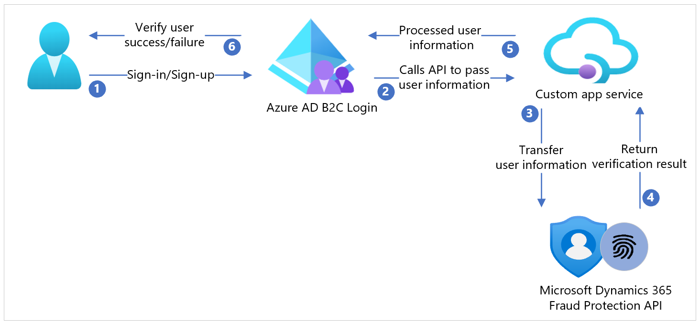

# Tutorial: Configure Microsoft Dynamics 365 Fraud Protection with Azure Active Directory B2C

In this sample tutorial, learn how to integrate [Microsoft Dynamics 365 Fraud Protection](/dynamics365/fraud-protection/ap-overview) (DFP) with Azure Active Directory (AD) B2C.

Microsoft DFP provides organizations with the capability to assess the risk of attempts to create fraudulent accounts and  log-ins. Microsoft DFP assessment can be used by the customer to block or challenge suspicious attempts to create new fake accounts or to compromise existing accounts.

This sample demonstrates how to incorporate the Microsoft DFP device fingerprinting and account creation and sign-in assessment API endpoints into an Azure AD B2C custom policy.

## Prerequisites

To get started, you'll need:

- An Azure subscription. If you don't have a subscription, you can get a [free account](https://azure.microsoft.com/free/).

- An [Azure AD B2C tenant](./tutorial-create-tenant.md). Tenant is linked to your Azure subscription.

- Get a Microsoft DFP [subscription](https://dynamics.microsoft.com/pricing/#Sales). You can set up a [trial client version](https://dynamics.microsoft.com/ai/fraud-protection/signin/?RU=https%3A%2F%2Fdfp.microsoft.com%2Fsignin) as well.

## Scenario description

Microsoft DFP integration includes the following components:

- **Azure AD B2C tenant**: Authenticates the user and acts as a client of Microsoft DFP. Hosts a fingerprinting script collecting identification and diagnostic data of every user that executes a target policy. Later blocks or challenges sign-in or sign-up attempts based on the rule evaluation result returned by Microsoft DFP.

- **Custom UI templates**: Used to customize the HTML content of the pages rendered by Azure AD B2C. These pages include the JavaScript snippet required for Microsoft DFP fingerprinting

- **Microsoft DFP fingerprinting service**: Dynamically embedded script, which logs device telemetry and self-asserted user details to create a uniquely identifiable fingerprint for the user to be used later in the decision-making process.

- **Microsoft DFP API endpoints**: Provides the decision result and accepts a final status reflecting the operation undertaken by the client application. Azure AD B2C communicates directly with the Microsoft DFP endpoints using REST API connectors. API authentication occurs via a client_credentials grant to the Azure AD tenant in which Microsoft DFP is licensed and installed to obtain a bearer token.

The following architecture diagram shows the implementation.

|Step | Description |
|:-----| :-----------|
| 1. | The user arrives at a login page. Users select sign-up to create a new account and enter information into the page. Azure AD B2C collects user attributes.
| 2. | Azure AD B2C calls the Microsoft DFP API and passes on the user attributes.
| 3. | After Microsoft DFP API consumes the information and processes it, it returns the result to Azure AD B2C.
| 4. | Azure AD B2C receives information back from the Microsoft DFP API. If it shows a Failure response, an error message is displayed to the user. If it shows a Success response, the user is authenticated and written into the directory.

## Set up the solution

1. [Create a Facebook application](./identity-provider-facebook.md#create-a-facebook-application) configured to allow federation to Azure AD B2C.
2. [Add the Facebook secret](./tutorial-create-user-flows.md?pivots=b2c-custom-policy#create-the-facebook-key) you created as an Identity Experience Framework policy key.

## Configure your application under Microsoft DFP

[Set up your Azure AD tenant](/dynamics365/fraud-protection/integrate-real-time-api) to use Microsoft DFP.

## Set up your custom domain

In a production environment, you must use a [custom domain for Azure AD B2C](./custom-domain.md?pivots=b2c-custom-policy) and for the [Microsoft DFP fingerprinting service](/dynamics365/fraud-protection/device-fingerprinting#set-up-dns). The domain for both services should be in the same root DNS zone to prevent browser privacy settings from blocking cross-domain cookies, isn't necessary in a non-production environment.

Following is an example:

| Environment | Service | Domain |
|:------------|:---------------|:---------------|
| Development | Azure AD B2C | `contoso-dev.b2clogin.com` |
| Development | Microsoft DFP Fingerprinting | `fpt.dfp.microsoft-int.com` |
| UAT | Azure AD B2C | `contoso-uat.b2clogin.com` |
| UAT | Microsoft DFP Fingerprinting | `fpt.dfp.microsoft.com` |
| Production | Azure AD B2C | `login.contoso.com` |
| Production | Microsoft DFP Fingerprinting | `fpt.login.contoso.com` |

## Deploy the UI templates

1. Deploy the provided [Azure AD B2C UI templates](https://github.com/azure-ad-b2c/partner-integrations/tree/master/samples/Dynamics-Fraud-Protection/ui-templates) to a public facing internet hosting service such as Azure Blob Storage.

2. Replace the value `https://<YOUR-UI-BASE-URL>/` with the root URL for your deployment location.

  >[!NOTE]
  >You'll later need the base URL to configure the Azure AD B2C policies.

3. In the `ui-templates/js/dfp.js` file, replace `<YOUR-DFP-INSTANCE-ID>` with your Microsoft DFP instance ID.

4. Ensure CORS is enabled for your Azure AD B2C domain name `https://{your_tenant_name}.b2clogin.com` or `your custom domain`.

See [UI customization documentation](./customize-ui-with-html.md?pivots=b2c-custom-policy) to learn more.

## Azure AD B2C configuration

### Add policy keys for your Microsoft DFP client app ID and secret

1. In the Azure AD tenant where Microsoft DFP is set up, create an [Azure AD application and grant admin consent](/dynamics365/fraud-protection/integrate-real-time-api#create-azure-active-directory-applications).
2. Create a secret value for this application registration and note the application's client ID and client secret value.
3. Save the client ID and client secret values as [policy keys in your Azure AD B2C tenant](./policy-keys-overview.md).

 >[!NOTE]
 >You'll later need the policy keys to configure your Azure AD B2C policies.

### Replace the configuration values

In the provided [custom policies](https://github.com/azure-ad-b2c/partner-integrations/tree/master/samples/Dynamics-Fraud-Protection/policies), find the following placeholders and replace them with the corresponding values from your instance.

| Placeholder | Replace with | Notes |
| :-------- | :------------| :-----------|
|{Settings:Production} | Whether to deploy the policies in production mode | `true` or `false`  |
|{Settings:Tenant} | Your tenant short name |  `your-tenant` - from your-tenant.onmicrosoft.com  |
| {Settings:DeploymentMode}    |  Application Insights deployment mode to use   |  `Production` or `Development`  |
|  {Settings:DeveloperMode}    | Whether to deploy the policies in Application Insights developer mode      |   `true` or `false`    |
|  {Settings:AppInsightsInstrumentationKey}  |  Instrumentation key of your Application Insights instance*   |  `01234567-89ab-cdef-0123-456789abcdef` |
|  {Settings:IdentityExperienceFrameworkAppId}  | App ID of the IdentityExperienceFramework app configured in your Azure AD B2C tenant  | `01234567-89ab-cdef-0123-456789abcdef`|
|  {Settings:ProxyIdentityExperienceFrameworkAppId}  |   App ID of the ProxyIdentityExperienceFramework app configured in your Azure AD B2C tenant |   `01234567-89ab-cdef-0123-456789abcdef`|
| {Settings:FacebookClientId}  | App ID of the Facebook app you configured for federation with B2C    | `000000000000000`   |
|   {Settings:FacebookClientSecretKeyContainer}  | Name of the policy key-in which you saved Facebook's app secret    |  `B2C_1A_FacebookAppSecret` |
|   {Settings:ContentDefinitionBaseUri} |  Endpoint in where you deployed the UI files   | `https://<my-storage-account>.blob.core.windows.net/<my-storage-container>`   |
|  {Settings:DfpApiBaseUrl}   |  The base path for your DFP API instance - found in the DFP portal   | `https://tenantname-01234567-89ab-cdef-0123-456789abcdef.api.dfp.dynamics.com/v1.0/`   |
| {Settings:DfpApiAuthScope} | The client_credentials scope for the DFP API service | `https://api.dfp.dynamics-int.com/.default or https://api.dfp.dynamics.com/.default` |
| {Settings:DfpTenantId} | The ID of the Azure AD tenant (not B2C) where DFP is licensed and installed | `01234567-89ab-cdef-0123-456789abcdef` or `consoto.onmicrosoft.com` |
| {Settings:DfpAppClientIdKeyContainer} | Name of the policy key-in which you save the DFP client ID | `B2C_1A_DFPClientId` |
| {Settings:DfpAppClientSecretKeyContainer} | Name of the policy key-in which you save the DFP client secret | `B2C_1A_DFPClientSecret` |

*Application insights can be set up in any Azure AD tenant/subscription. This value is optional but [recommended to assist with debugging](./troubleshoot-with-application-insights.md).

>[!NOTE]
>Add consent notification to the attribute collection page. Notify that the users' telemetry and user identity information will be recorded for account protection purposes.

## Configure the Azure AD B2C policy

1. Go to the [Azure AD B2C policy](https://github.com/azure-ad-b2c/partner-integrations/tree/master/samples/Dynamics-Fraud-Protection/policies) in the Policies folder.

2. Follow this [document](./tutorial-create-user-flows.md?pivots=b2c-custom-policy?tabs=applications#custom-policy-starter-pack) to download [LocalAccounts starter pack](https://github.com/Azure-Samples/active-directory-b2c-custom-policy-starterpack/tree/master/LocalAccounts)

3. Configure the policy for the Azure AD B2C tenant.

>[!NOTE]
>Update the policies provided to relate to your specific tenant.

## Test the user flow

1. Open the Azure AD B2C tenant and under Policies select **Identity Experience Framework**.

2. Select your previously created **SignUpSignIn**.

3. Select **Run user flow** and select the settings:

   a. **Application**: select the registered app (sample is JWT)

   b. **Reply URL**: select the **redirect URL**

   c. Select **Run user flow**.

4. Go through sign-up flow and create an account

5. Microsoft DFP service will be called during the flow, after user attribute is created. If the flow is incomplete, check that the user isn't saved in the directory.

>[!NOTE]
>Update rules directly in Microsoft DFP Portal if using [Microsoft DFP rule engine](/dynamics365/fraud-protection/rules).

## Next steps

For additional information, review the following articles:

- [Microsoft DFP samples](https://github.com/azure-ad-b2c/partner-integrations/tree/master/samples/Dynamics-Fraud-Protection)

- [Custom policies in Azure AD B2C](./custom-policy-overview.md)

- [Get started with custom policies in Azure AD B2C](./tutorial-create-user-flows.md?pivots=b2c-custom-policy)
