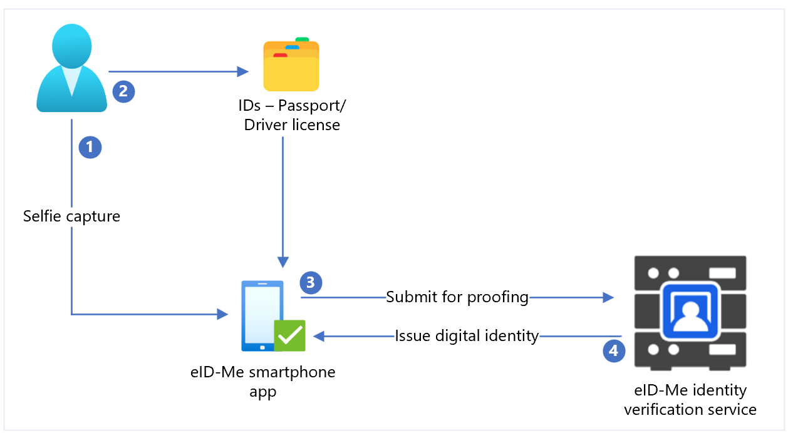
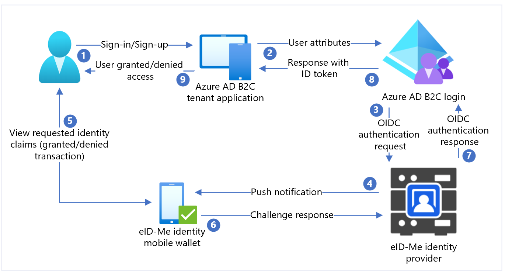

# Configure Azure Active Directory B2C with Bluink eID-Me for identity verification

## Before you begin

Azure Active Directory B2C (Azure AD B2C) has two methods to define users interaction with applications: predefined user flows, or configurable custom policies. 
Custom policies address complex scenarios. For most scenarios, we recommend user flows. See, [User flows and custom policies overview](./user-flow-overview.md)

##  Integrate Azure AD B2C authentication with eID-Me

Learn to integrate Azure AD B2C authentication with Bluink eID-Me, an identity verification and decentralized digital identity solution for Canadian citizens. With eID-Me, Azure AD B2C tenants verify user identity, obtain verified sign-up and sign-in identity claims. Integration supports multi-factor authentication and passwordless sign-in with a secure digital identity. Organizations can meet Identity Assurance Level (IAL) 2 and Know Your Customer (KYC) requirements. 

To learn more, go to bluink.ca: [Bluink Ltd](https://bluink.ca)

## Prerequisites

To get started, you need:

* A Relying Party account with eID-Me
  * Go to bluink.ca to [learn more](https://bluink.ca/eid-me/solutions/id-verification#contact-form) and request a demo
* An Azure subscription
  * If you don't have one, get an [Azure free account](https://azure.microsoft.com/free)
* An Azure AD B2C tenant linked to the Azure subscription
  * See, [Tutorial: Create an Azure AD B2C tenant](tutorial-create-tenant.md)
* A trial or production version of the eID-Me Digital ID App
  * Go to bluink.ca to [Download the eID-Me Digital ID App](https://bluink.ca/eid-me/download) 

See also, [Tutorial: Create user flows and custom policies in Azure AD B2C](./tutorial-create-user-flows.md?pivots=b2c-custom-policy).

## Scenario description

eID-Me integrates with Azure AD B2C as an OpenID Connect (OIDC) identity provider. The following components comprise the eID-Me solution with Azure AD B2C:

* **Azure AD B2C tenant** - configured as a relying party in eID-Me enables eID-Me to trust an Azure AD B2C tenant for sign-up and sign-in
* **Azure AD B2C tenant application** - the assumption is tenants need an Azure AD B2C tenant application
  * The application receives identity claims received by Azure AD B2C during transaction
* **eID-Me smartphone apps** - Azure AD B2C tenant users need the app for iOS or Android
* **Issued eID-Me digital identities** - from eID-Me identity proofing 
  * Users are issued a digital identity to the digital wallet in the app. Valid identity documents are required.

The eID-Me apps authenticate users during transactions. The X509 public key authentication provides passwordless MFA, using a private signing key in the eID-Me digital identity.

The following diagram illustrates eID-Me identity proofing, which occurs outside Azure AD B2C flows.

   


1. User uploads a selfie to the eID-Me smartphone application.
2. User scans and uploads a government issued identification document, such as passport or driver license, to the eID-Me smartphone application.
3. eID-Me submits data to the identity service for verification.
4. User is issued a digital identity, which is saved in the application.

The following diagram illustrates Azure AD B2C integration with eID-Me.

   


1. User opens the Azure AD B2C sign-in page and signs in or signs up with a username.
2. User forwarded to Azure AD B2C sign-in and sign-up policy.
3. Azure AD B2C redirects the user to the eID-Me identity router using the OIDC authorization code flow.
4. The router sends push notification to the user mobile app with authentication and authorization request details.
5. The user authentication challenge appears, then a prompt for identity claims appears.
6. The challenge response goes to the router.
7. The router replies to Azure AD B2C with an authentication result.
8. Azure AD B2C ID token response goes to the application.
9. User is granted or denied access.

## Get started with eID-Me

Go to the bluink.ca [Contact Us](https://bluink.ca/contact) page to request a demo with the goal of configuring a test or production environment to set up Azure AD B2C tenants as a relying party. Tenants determine identity claims needed from consumers that sign up with eID-Me.

## Configure an application in eID-Me

To configure your tenant application as an eID-ME relying party in eID-Me, supply the following information:

| Property | Description|
| ---- | --- |
| Name | Azure AD B2C, or another application name |
| Domain| name.onmicrosoft.com|
| Redirect URIs| https://jwt.ms|
| Redirect URLs| `https://your-B2C-tenant-name.b2clogin.com/your-B2C-tenant-name.onmicrosoft.com/oauth2/authresp`<br>For Example: `https://fabrikam.b2clogin.com/fabrikam.onmicrosoft.com/oauth2/authresp`<br>For a custom domain, enter https://your-domain-name/your-tenant-name.onmicrosoft.com/oauth2/authresp.|
| Application home page URL| Appears to the end user|
| Application privacy policy URL| Appears to the end user|

>[!NOTE]
>When the relying party is configurede, ID-Me provides a Client ID and a Client Secret. Note the Client ID and Client Secret to configure the identity provider (IdP) in Azure AD B2C.

## Add a new Identity provider in Azure AD B2C

For the following instructions, use the directory with the Azure AD B2C tenant.

1. Sign in to the [Azure portal](https://portal.azure.com/#home) as Global Administrator of the Azure AD B2C tenant.
2. In the top menu, select **Directory + subscription**.
3. Select the directory with the tenant.
4. In the top-left corner of the Azure portal, select **All services**.
5. Search for and select **Azure AD B2C**.
6. Navigate to **Dashboard** > **Azure Active Directory B2C** > **Identity providers**.
7. Select **New OpenID Connect Provider**.
8. Select **Add**.

## Configure an identity provider

To configure an identity provider:

1. Select **Identity provider type** > **OpenID Connect**.
2. In the identity provider form, for **Name**, enter **eID-Me Passwordless** or another name.
3. For **Client ID**, enter the Client ID from eID-Me.
4. For **Client Secret**, enter the Client Secret from eID-Me.
5. For **Scope**, select **openid email profile**.
6. For **Response type**, select **code**.
7. For **Response mode**, select **form post**.
8. Select **OK**.
9. Select **Map this identity provider’s claims**.
10. For **User ID**, use **sub**.
11. For **Display name**, use **name**.
12. For **Given name**, use **given_name**.
13. For **Surname**, use **family_name**.
14. For **Email**, use **email**.
15. Select **Save**.

## Configure multi-factor authentication

eID-Me is a multi-factor authenticator, therefore user-flow multi-factor authentication configuration isn't needed. 

## Create a user flow policy

For the following instructions, eID-Me appears as a new OIDC identity provider in B2C identity providers.  

1. In the Azure AD B2C tenant, under **Policies**, select **User flows**.  
2. Select **New user flow**.
3. Select **Sign up and sign in** > **Version** > **Create**.
4. Enter a policy **Name**.
5. In **Identity providers**, select the created eID-Me identity provider.  
6. For **Local Accounts**, select **None**. The selection disables email and password authentication.
7. Select **Run user flow**.
8. Enter a **Replying URL**, such as `https://jwt.ms`.
9. The browser  redirects to the eID-Me sign-in page. 
10. Enter the account name from user registration. 
11. The user receives push notification on the mobile device with eID-Me.
12. An authentication challenge appears.
13. The challenge is accepted and the browser redirects to the replying URL.

>[!NOTE]
>Azure Active Directory B2C (Azure AD B2C) has two methods to define users interaction with applications: predefined user flows, or configurable custom policies. 
Custom policies address complex scenarios. For most scenarios, we recommend user flows. See, [User flows and custom policies overview](./user-flow-overview.md)

## Create a policy key

Store the Client Secret you recorded in your Azure AD B2C tenant. For the following instructions, use the directory with the Azure AD B2C tenant. 

1. Sign in to the [Azure portal](https://portal.azure.com/).
2. In the portal toolbar, select the **Directories + subscriptions**.
3. On the **Portal settings, Directories + subscriptions** page, in the **Directory name** list, locate your Azure AD B2C directory.
4. Select **Switch**.
5. In the top-left corner of the Azure portal, select **All services**.
6. Search for and select **Azure AD B2C**.
7. On the Overview page, select **Identity Experience Framework**.
8. Select **Policy Keys**.
9. Select **Add**.
10. For **Options**, choose **Manual**.
11. Enter a **Name** for the policy key. For example, `eIDMeClientSecret`. The prefix `B2C_1A_` is added to the key name.
12. In **Secret**, enter the Client Secret you noted.
13. For **Key usage**, select **Signature**.
14. Select **Create**.

## Configure eID-Me as an Identity provider

Define eID-Me as a claims provider to enable users to sign in with eID-Me. Azure AD B2C communicates with it, through an endpoint. The endpoint provides claims used by Azure AD B2C to verify user authentication with a digital ID on their device.

To define eID-Me as a claims provider, add it to the **ClaimsProvider** element in the policy extension file.

1. Open the `TrustFrameworkExtensions.xml`.
2. Find the **ClaimsProviders** element. If it doesn't appear, add it under the root element.
3. Add a new **ClaimsProvider**:

   ```xml
      <ClaimsProvider>
      <Domain>eID-Me</Domain>
      <DisplayName>eID-Me</DisplayName>
      <TechnicalProfiles>
        <TechnicalProfile Id="eID-Me-OIDC">
          <!-- The text in the following DisplayName element is shown to the user on the claims provider 
   selection screen. -->
          <DisplayName>eID-Me for Sign In</DisplayName>
          <Protocol Name="OpenIdConnect" />
          <Metadata>
            <Item Key="ProviderName">https://eid-me.bluink.ca</Item>
            <Item Key="METADATA">https://demoeid.bluink.ca/.well-known/openid-configuration</Item>
            <Item Key="response_types">code</Item>
            <Item Key="scope">openid email profile</Item>
            <Item Key="response_mode">form_post</Item>
            <Item Key="HttpBinding">POST</Item>
            <Item Key="token_endpoint_auth_method">client_secret_post</Item>
            <Item Key="client_id">eid_me_rp_client_id</Item>
            <Item Key="UsePolicyInRedirectUri">false</Item>
          </Metadata>
          <CryptographicKeys>
            <Key Id="client_secret" StorageReferenceId="B2C_1A_eIDMeClientSecret" />
          </CryptographicKeys>
          <InputClaims />
          <OutputClaims>
            <OutputClaim ClaimTypeReferenceId="issuerUserId" PartnerClaimType="sub" />
            <OutputClaim ClaimTypeReferenceId="tenantId" PartnerClaimType="tid" />
            <OutputClaim ClaimTypeReferenceId="givenName" PartnerClaimType="given_name" />
            <OutputClaim ClaimTypeReferenceId="surName" PartnerClaimType="family_name" />
            <OutputClaim ClaimTypeReferenceId="displayName" PartnerClaimType="name" />
            <OutputClaim ClaimTypeReferenceId="email" PartnerClaimType="email" />
            <OutputClaim ClaimTypeReferenceId="IAL" PartnerClaimType="identity_assurance_level_achieved" DefaultValue="unknown IAL" />
            <OutputClaim ClaimTypeReferenceId="authenticationSource" DefaultValue="socialIdpAuthentication" AlwaysUseDefaultValue="true" />
            <OutputClaim ClaimTypeReferenceId="identityProvider" PartnerClaimType="iss" />
            <OutputClaim ClaimTypeReferenceId="locality" PartnerClaimType="locality" DefaultValue="unknown locality" />
            <OutputClaim ClaimTypeReferenceId="region" PartnerClaimType="region" DefaultValue="unknown region" />
          </OutputClaims>
          <OutputClaimsTransformations>
            <OutputClaimsTransformation ReferenceId="CreateRandomUPNUserName" />
            <OutputClaimsTransformation ReferenceId="CreateUserPrincipalName" />
            <OutputClaimsTransformation ReferenceId="CreateAlternativeSecurityId" />
            <OutputClaimsTransformation ReferenceId="CreateSubjectClaimFromAlternativeSecurityId" />
          </OutputClaimsTransformations>
          <UseTechnicalProfileForSessionManagement ReferenceId="SM-SocialLogin" />
        </TechnicalProfile>
      </TechnicalProfiles>
    </ClaimsProvider>
   ```

4. For **eid_me_rp_client_id** enter the eID-Me relying-party Client ID.
5. Select **Save**.

### Supported identity claims

You can add more identity claims that eID-Me supports. 

1. Open the `TrustFrameworksExtension.xml`.
2. Find the `BuildingBlocks` element. 

> [!NOTE]
> Find supported eID-Me identity claims lists on [OID repository](http://www.oid-info.com/get/1.3.6.1.4.1.50715) with OIDC identifiers on [well-known/openid-configuration](https://eid-me.bluink.ca/.well-known/openid-configuration).

   ```xml
   <BuildingBlocks>
   <ClaimsSchema>
    <ClaimType Id="IAL">
        <DisplayName>Identity Assurance Level</DisplayName>
        <DataType>string</DataType>
        <DefaultPartnerClaimTypes>
          <Protocol Name="OpenIdConnect" PartnerClaimType="identity_assurance_level_achieved" />
        </DefaultPartnerClaimTypes>
        <AdminHelpText>The Identity Assurance Level Achieved during proofing of the digital identity.</AdminHelpText>
        <UserHelpText>The Identity Assurance Level Achieved during proofing of the digital identity.</UserHelpText>
        <UserInputType>Readonly</UserInputType>
      </ClaimType>
 
   <ClaimType Id="picture">
        <DisplayName>Portrait Photo</DisplayName>
        <DataType>string</DataType>
        <DefaultPartnerClaimTypes>
          <Protocol Name="OpenIdConnect" PartnerClaimType="thumbnail_portrait" />
        </DefaultPartnerClaimTypes>
        <AdminHelpText>The portrait photo of the user.</AdminHelpText>
        <UserHelpText>Your portrait photo.</UserHelpText>
        <UserInputType>Readonly</UserInputType>
      </ClaimType>
 
    <ClaimType Id="middle_name">
        <DisplayName>Portrait Photo</DisplayName>
        <DataType>string</DataType>
        <DefaultPartnerClaimTypes>
          <Protocol Name="OpenIdConnect" PartnerClaimType="middle_name" />
        </DefaultPartnerClaimTypes>
        <UserHelpText>Your middle name.</UserHelpText>
        <UserInputType>TextBox</UserInputType>
      </ClaimType>
 
   <ClaimType Id="birthdate">
        <DisplayName>Date of Birth</DisplayName>
        <DataType>string</DataType>
        <DefaultPartnerClaimTypes>
          <Protocol Name="OpenIdConnect" PartnerClaimType="birthdate" />
        </DefaultPartnerClaimTypes>
        <AdminHelpText>The user's date of birth.</AdminHelpText>
        <UserHelpText>Your date of birth.</UserHelpText>
        <UserInputType>TextBox</UserInputType>
      </ClaimType>
 
    <ClaimType Id="gender">
        <DisplayName>Gender</DisplayName>
        <DataType>string</DataType>
        <DefaultPartnerClaimTypes>
          <Protocol Name="OpenIdConnect" PartnerClaimType="gender" />
        </DefaultPartnerClaimTypes>
        <AdminHelpText>The user's gender.</AdminHelpText>
        <UserHelpText>Your gender.</UserHelpText>
        <UserInputType>TextBox</UserInputType>
      </ClaimType>
    
    <ClaimType Id="street_address">
        <DisplayName>Locality/City</DisplayName>
        <DataType>string</DataType>
        <DefaultPartnerClaimTypes>
          <Protocol Name="OpenIdConnect" PartnerClaimType="street_address" />
        </DefaultPartnerClaimTypes>
        <AdminHelpText>The user's full street address, which MAY include house number, street name, post office box.</AdminHelpText>
        <UserHelpText>Your street address of residence.</UserHelpText>
        <UserInputType>TextBox</UserInputType>
      </ClaimType>
 
   <ClaimType Id="locality">
        <DisplayName>Locality/City</DisplayName>
        <DataType>string</DataType>
        <DefaultPartnerClaimTypes>
          <Protocol Name="OpenIdConnect" PartnerClaimType="locality" />
        </DefaultPartnerClaimTypes>
        <AdminHelpText>The user's current city or locality of residence.</AdminHelpText>
        <UserHelpText>Your current city or locality of residence.</UserHelpText>
        <UserInputType>TextBox</UserInputType>
      </ClaimType>

      <ClaimType Id="region">
        <DisplayName>Province or Territory</DisplayName>
        <DataType>string</DataType>
        <DefaultPartnerClaimTypes>
          <Protocol Name="OpenIdConnect" PartnerClaimType="region" />
        </DefaultPartnerClaimTypes>
        <AdminHelpText>The user's current province or territory of residence.</AdminHelpText>
        <UserHelpText>Your current province or territory of residence.</UserHelpText>
        <UserInputType>TextBox</UserInputType>
      </ClaimType>

      <ClaimType Id="country">
        <DisplayName>Country</DisplayName>
        <DataType>string</DataType>
        <DefaultPartnerClaimTypes>
          <Protocol Name="OpenIdConnect" PartnerClaimType="country" />
        </DefaultPartnerClaimTypes>
        <AdminHelpText>The user's current country of residence.</AdminHelpText>
        <UserHelpText>Your current country of residence.</UserHelpText>
        <UserInputType>TextBox</UserInputType>
      </ClaimType>

      <ClaimType Id="dl_number">
        <DisplayName>Driver's Licence Number</DisplayName>
        <DataType>string</DataType>
        <DefaultPartnerClaimTypes>
          <Protocol Name="OpenIdConnect" PartnerClaimType="dl_number" />
        </DefaultPartnerClaimTypes>
        <AdminHelpText>The user's driver's licence number.</AdminHelpText>
        <UserHelpText>Your driver's licence number.</UserHelpText>
        <UserInputType>TextBox</UserInputType>
      </ClaimType>

      <ClaimType Id="dl_class">
        <DisplayName>Driver's Licence Class</DisplayName>
        <DataType>string</DataType>
        <DefaultPartnerClaimTypes>
          <Protocol Name="OpenIdConnect" PartnerClaimType="dl_class" />
        </DefaultPartnerClaimTypes>
        <AdminHelpText>The user's driver's licence class.</AdminHelpText>
        <UserHelpText>Your driver's licence class.</UserHelpText>
        <UserInputType>TextBox</UserInputType>
      </ClaimType>
    </ClaimsSchema>

   ```

## Add a user journey

For the following instructions, the identity provider is set up, but not in any sign-in pages. If you don't have a custom user journey, copy a template user journey.  

1. From the starter pack, open the `TrustFrameworkBase.xml` file.
2. Locate and copy the contents of the **UserJourneys** element that includes ID=`SignUpOrSignIn`.
3. Open the `TrustFrameworkExtensions.xml`.
4. Locate the **UserJourneys** element. If the element doesn't appear, add one.
5. Paste the contents of the **UserJourney** element as a child of the **UserJourneys** element.
6. Rename the user journey ID, for example, ID=`CustomSignUpSignIn`.

## Add the identity provider to a user journey

Add the new identity provider to the user journey. 

1. In the user journey, locate the orchestration step element with Type=`CombinedSignInAndSignUp`, or Type=`ClaimsProviderSelection`. It's usually the first orchestration step. The **ClaimsProviderSelections** element has a list of identity providers users sign in with. The order of the elements controls the order of the sign-in buttons the user sees. 
2. Add a **ClaimsProviderSelection** XML element. 
3. Set the **TargetClaimsExchangeId** value to a friendly name.
4. In the next orchestration step, add a **ClaimsExchange** element. 
5. Set the **Id** to the target claims exchange ID value. 
6. Update the v**TechnicalProfileReferenceId** value to the technical profile ID you created.

The following XML demonstrates seven user journey orchestration steps with the identity provider:

   ```xml
    <UserJourney Id="eIDME-SignUpOrSignIn">
      <OrchestrationSteps>
        <OrchestrationStep Order="1" Type="CombinedSignInAndSignUp" ContentDefinitionReferenceId="api.signuporsignin">
          <ClaimsProviderSelections>
            <ClaimsProviderSelection TargetClaimsExchangeId="eIDMeExchange" />
           </ClaimsProviderSelections>
      </OrchestrationStep>
        <!-- Check if the user has selected to sign in using one of the social providers -->
        <OrchestrationStep Order="2" Type="ClaimsExchange">
          <Preconditions>
            <Precondition Type="ClaimsExist" ExecuteActionsIf="true">
              <Value>objectId</Value>
              <Action>SkipThisOrchestrationStep</Action>
            </Precondition>
          </Preconditions>
          <ClaimsExchanges>
            <ClaimsExchange Id="eIDMeExchange" TechnicalProfileReferenceId="eID-Me-OIDC" />
          </ClaimsExchanges>
        </OrchestrationStep>
        <!-- For social IDP authentication, attempt to find the user account in the directory. -->
        <OrchestrationStep Order="3" Type="ClaimsExchange">
          <Preconditions>
            <Precondition Type="ClaimEquals" ExecuteActionsIf="true">
              <Value>authenticationSource</Value>
              <Value>localAccountAuthentication</Value>
              <Action>SkipThisOrchestrationStep</Action>
            </Precondition>
          </Preconditions>
          <ClaimsExchanges>
            <ClaimsExchange Id="AADUserReadUsingAlternativeSecurityId" TechnicalProfileReferenceId="AAD-UserReadUsingAlternativeSecurityId-NoError" />
          </ClaimsExchanges>
        </OrchestrationStep>
        <!-- Show self-asserted page only if the directory does not have the user account already (i.e. we do not have an objectId).  -->
        <OrchestrationStep Order="4" Type="ClaimsExchange">
          <Preconditions>
            <Precondition Type="ClaimsExist" ExecuteActionsIf="true">
              <Value>objectId</Value>
              <Action>SkipThisOrchestrationStep</Action>
            </Precondition>
          </Preconditions>
          <ClaimsExchanges>
            <ClaimsExchange Id="SelfAsserted-Social" TechnicalProfileReferenceId="SelfAsserted-Social" />
          </ClaimsExchanges>
        </OrchestrationStep>
        <!-- This step reads any user attributes that we may not have received when authenticating using ESTS so they can be sent in the token. -->
        <OrchestrationStep Order="5" Type="ClaimsExchange">
          <Preconditions>
            <Precondition Type="ClaimEquals" ExecuteActionsIf="true">
              <Value>authenticationSource</Value>
              <Value>socialIdpAuthentication</Value>
              <Action>SkipThisOrchestrationStep</Action>
            </Precondition>
          </Preconditions>
          <ClaimsExchanges>
            <ClaimsExchange Id="AADUserReadWithObjectId" TechnicalProfileReferenceId="AAD-UserReadUsingObjectId" />
          </ClaimsExchanges>
        </OrchestrationStep>
        <!-- The previous step (SelfAsserted-Social) could have been skipped if there were no attributes to collect 
             from the user. So, in that case, create the user in the directory if one does not already exist 
             (verified using objectId which would be set from the last step if account was created in the directory. -->
        <OrchestrationStep Order="6" Type="ClaimsExchange">
          <Preconditions>
            <Precondition Type="ClaimsExist" ExecuteActionsIf="true">
              <Value>objectId</Value>
              <Action>SkipThisOrchestrationStep</Action>
            </Precondition>
          </Preconditions>
          <ClaimsExchanges>
            <ClaimsExchange Id="AADUserWrite" TechnicalProfileReferenceId="AAD-UserWriteUsingAlternativeSecurityId" />
          </ClaimsExchanges>
        </OrchestrationStep>
        <OrchestrationStep Order="7" Type="SendClaims" CpimIssuerTechnicalProfileReferenceId="JwtIssuer" />
      </OrchestrationSteps>
      <ClientDefinition ReferenceId="DefaultWeb" />
    </UserJourney>

   ```

## Configure the relying party policy

The relying party policy specifies the user journey Azure AD B2C executes. You can control claims passed to your application. Adjust the **OutputClaims** element of the **eID-Me-OIDC-Signup** TechnicalProfile element. In the following sample, the application receives user postal code, locality, region, IAL, portrait, middle name, and birth date. It receives the boolean **signupConditionsSatisfied** claim, which indicates whether an account was created.

   ```xml
    <RelyingParty>
        <DefaultUserJourney ReferenceId="eIDMe-SignUpOrSignIn" />
        <TechnicalProfile Id="PolicyProfile">
          <DisplayName>PolicyProfile</DisplayName>
          <Protocol Name="OpenIdConnect" />
          <OutputClaims>
            <OutputClaim ClaimTypeReferenceId="displayName" />
            <OutputClaim ClaimTypeReferenceId="givenName" />
            <OutputClaim ClaimTypeReferenceId="surname" />
            <OutputClaim ClaimTypeReferenceId="email" />
            <OutputClaim ClaimTypeReferenceId="objectId" PartnerClaimType="sub"/>
            <OutputClaim ClaimTypeReferenceId="identityProvider" />
            <OutputClaim ClaimTypeReferenceId="tenantId" AlwaysUseDefaultValue="true" DefaultValue="{Policy:TenantObjectId}" />
            <OutputClaim ClaimTypeReferenceId="postalCode" PartnerClaimType="postal_code" DefaultValue="unknown postal_code" />
            <OutputClaim ClaimTypeReferenceId="locality" PartnerClaimType="locality" DefaultValue="unknown locality" />
            <OutputClaim ClaimTypeReferenceId="region" PartnerClaimType="region" DefaultValue="unknown region" />
            <OutputClaim ClaimTypeReferenceId="IAL" PartnerClaimType="identity_assurance_level_achieved" DefaultValue="unknown IAL" />
            <OutputClaim ClaimTypeReferenceId="picture" PartnerClaimType="thumbnail_portrait" DefaultValue="unknown portrait" />
            <OutputClaim ClaimTypeReferenceId="middle_name" PartnerClaimType="middle_name" DefaultValue="unknown middle name" />
            <OutputClaim ClaimTypeReferenceId="birthdate" PartnerClaimType="birthdate" DefaultValue="unknown DOB" />
            <OutputClaim ClaimTypeReferenceId="newUser" PartnerClaimType="signupConditionsSatisfied" DefaultValue="false" />
          </OutputClaims>
          <SubjectNamingInfo ClaimType="sub" />
        </TechnicalProfile>
      </RelyingParty>

   ```

## Upload the custom policy

For the following instructions, use the directory with the Azure AD B2C tenant. 

1. Sign in to the [Azure portal](https://portal.azure.com/#home).
2. In the portal toolbar, select the **Directories + subscriptions**.
3. On the **Portal settings, Directories + subscriptions** page, in the **Directory name** list, locate the Azure AD B2C directory.
4. Select **Switch**.
5. In the Azure portal, search for and select **Azure AD B2C**.
6. Under **Policies**, select **Identity Experience Framework**.
7. Select **Upload Custom Policy**. 
8. Upload the two policy files you changed in the following order: 

  * The extension policy, for example `TrustFrameworkBase.xml`
  * The relying party policy, for example `SignUp.xml`

## Test the custom policy

1. Select the relying party policy, for example `B2C_1A_signup`.
2. For **Application**, select a web application you registered. 
3. The **Reply URL** is `https://jwt.ms`.
4. Select **Run now**.
5. The sign-up policy invokes eID-Me.
6. For sign-in, select **eID-Me**.
7. The browser redirects to `https://jwt.ms`. 
8. The token contents returned by Azure AD B2C appear.

Learn more: [Tutorial: Register a web application in Azure AD B2C](./tutorial-register-applications.md)

## Next steps

* [Azure AD B2C custom policy overview](./custom-policy-overview.md)
* [Tutorial: Create user flows and custom policies in Azure Active Directory B2C](./tutorial-create-user-flows.md?pivots=b2c-custom-policy)
* [A Custom Policy Template and Sample ASP.NET Core Web app for integrating eID-Me with Azure AD B2C](https://github.com/bluink-stephen/eID-Me_Azure_AD_B2C)
* Go to bluink.ca for the [Azure AD B2C ID Verification Integration Guide | eID-Me](https://bluink.ca/eid-me/azure-b2c-integration-guide)

