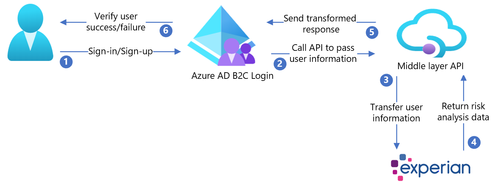

# Tutorial: Configure Experian with Azure Active Directory B2C

In this tutorial, learn how to integrate Azure Active Directory B2C (Azure AD B2C) with Experian CrossCore, a service that verifies user identification. It does risk analysis based on information provided by the user during sign-up. CrossCore permits users to sign in, or not.

Learn more about [Experian](https://www.experian.com/business/products/crosscore) solutions, services, etc. 

In this tutorial, you can use the following attributes in CrossCore risk analysis:

- Email
- IP Address
- Given Name
- Middle Name
- Surname
- Street Address
- City
- State or Province
- Postal Code
- Country or Region
- Phone Number

## Prerequisites

To get started, you'll need:

- A Microsoft Entra subscription
  - If you don't have one, you can get an [Azure free account](https://azure.microsoft.com/free/)
- [An Azure AD B2C tenant](./tutorial-create-tenant.md) linked to your Azure subscription

## Scenario description

The Experian integration includes the following components:

- **Azure AD B2C**: The authorization server that verifies user credentials, also known as the identity provider (IdP)
- **Experian CrossCore**: The service takes inputs from the user and verifies their identity
- **Custom REST API**: This implements the integration between Azure AD B2C and CrossCore

The following architecture diagram shows the implementation.

   

1. User arrives at sign-in page, creates a new account, and enters information. Azure AD B2C collects user attributes.
2. Azure AD B2C calls the middle-layer API and passes the user attributes.
3. Middle-layer API collects user attributes and transforms it into an Experian CrossCore-ready format. Then, sends it to Experian CrossCore.
4. Experian consumes the information validates user identification based on risk analysis. Then, it returns the result to the middle-layer API.
5. Middle-layer API processes the information and sends relevant information in a JSON format to Azure AD B2C.
6. Azure AD B2C receives information from middle-layer API. With a failure, an error message appears. With success, the user is authenticated and written into the directory.

## Onboard with Experian

1. Create an Experian account. To get started, go to [Experian](https://www.experian.com/business/products/crosscore) and scroll to the bottom for the contact form.
2. When an account is created, you receive information for API configuration. The following sections continue the process.

## Configure Azure AD B2C with Experian

### Deploy the API

1. Deploy the partner-integration to an Azure service: Go to [/CrossCoreIntegrationApi.sln](https://github.com/azure-ad-b2c/partner-integrations/blob/master/samples/Experian/CrossCoreIntegrationApi/CrossCoreIntegrationApi.sln). 
2. Publish the code from Visual Studio. 

>[!NOTE]
>Use the deployed service URL to configure Microsoft Entra ID with the required settings.

### Deploy the client certificate

The Experian API call is protected by a client certificate, provided by Experian. 

1. Follow the instructions in [Private client certificate](../app-service/environment/certificates.md#private-client-certificate). 
2. Upload the certificate to the Azure App service. 

The sample policy has two steps:

1. Upload the certificate.
2. Set the `WEBSITE_LOAD_ROOT_CERTIFICATES` key with the thumbprint of the certificate.

### Configure the API

Application settings can be [configured in the App service in Azure](../app-service/configure-common.md#configure-app-settings). Use this method to configure settings without checking them into a repository. 

Provide the following application settings to the REST API:

| Application settings | Source | Notes |
| --- | ---| ---|
|CrossCoreConfig:TenantId | Experian account configuration |N/A|
|CrossCoreConfig:OrgCode | Experian account configuration |N/A|
|CrossCore:ApiEndpoint |Experian account configuration|N/A|
|CrossCore:ClientReference | Experian account configuration |N/A|
|CrossCore:ModelCode |Experian account configuration|N/A|
|CrossCore:OrgCode | Experian account configuration |N/A|
|CrossCore:SignatureKey  | Experian account configuration |N/A|
|CrossCore:TenantId  | Experian account configuration |N/A|
|CrossCore:CertificateThumbprint | Experian certificate |N/A|
|BasicAuth:ApiUsername | Define a username for the API | Used in the ExtId configuration |
|BasicAuth:ApiPassword | Define a password for the API | Used in the ExtId configuration|

### Create API policy keys

Refer to [Custom policy starter pack](./secure-rest-api.md#add-rest-api-username-and-password-policy-keys) to create two policy keys, one each for:

* API username
* API password you defined for HTTP basic authentication

>[!NOTE]
>Later, you will need the keys for configuring the policies.

### Replace the configuration values

In the partner-integration [custom policies](https://github.com/azure-ad-b2c/partner-integrations/tree/master/samples/Experian/policy), find the following placeholders and replace with the corresponding values from your instance

|Placeholder|Replace with value|Example |
| --- | --- | --- |
| {your_tenant_name} | Your tenant short name | "yourtenant" from yourtenant.onmicrosoft.com |
| {your_trustframeworkbase_policy} | Azure AD B2C name of your TrustFrameworkBase policy| B2C_1A_experian_TrustFrameworkBase|
| {your_tenant_IdentityExperienceFramework_appid} |App ID of the IdentityExperienceFramework app configured in your Azure AD B2C tenant| 01234567-89ab-cdef-0123-456789abcdef|
| {your_tenant_ ProxyIdentityExperienceFramework_appid}| App ID of the ProxyIdentityExperienceFramework app configured in your Azure AD B2C tenant | 01234567-89ab-cdef-0123-456789abcdef|
| {your_tenant_extensions_appid} | App ID of your tenant storage application| 01234567-89ab-cdef-0123-456789abcdef|
| {your_tenant_extensions_app_objectid}| Object ID of your tenant storage application| 01234567-89ab-cdef-0123-456789abcdef|
| {your_api_username_key_name}| Username key name, made in **Create API policy keys**| B2C\_1A\_RestApiUsername|
| {your_api_password_key_name}| Password key name, made in **Create API policy keys**| B2C\_1A\_RestApiPassword|
| {your_app_service_URL}| App service URL you set up| `https://yourapp.azurewebsites.net`|

### Configure the Azure AD B2C policy

Refer to [Custom policy starter pack](./tutorial-create-user-flows.md?pivots=b2c-custom-policy#custom-policy-starter-pack) for instructions to set up your Azure AD B2C tenant and configure policies.

>[!NOTE]
>This sample policy is based on [Active Directory B2C custom policy starterpack/LocalAccounts](https://github.com/Azure-Samples/active-directory-b2c-custom-policy-starterpack/tree/master/LocalAccounts).

>[!TIP]
> We recommend that customers add consent notification in the attribute collection page. Notify users that information goes to third-party services for identity verification.

## Test the user flow

1. Open the Azure AD B2C tenant and under **Policies** select **User flows**.
2. Select your previously created **User Flow**.
3. Select **Run user flow**.
4. **Application**: the registered app (example is JWT).
5. **Reply URL**: **redirect URL**.
6. Select **Run user flow**.
7. Complete sign-up flow and create an account.
8. Sign out.
9. Complete sign-in flow. 
10. Select **continue**
11. CrossCore puzzle appears. 

## Next steps

- [Custom policies in Azure AD B2C](./custom-policy-overview.md)
- [Get started with custom policies in Azure AD B2C](tutorial-create-user-flows.md?pivots=b2c-custom-policy)
