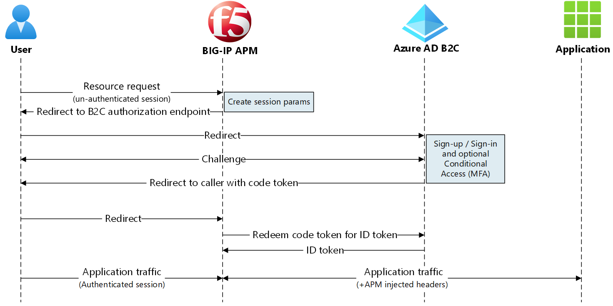
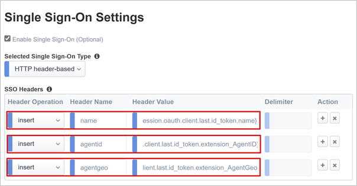
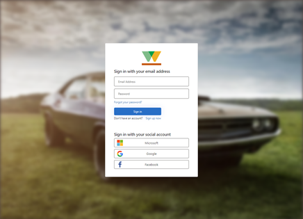
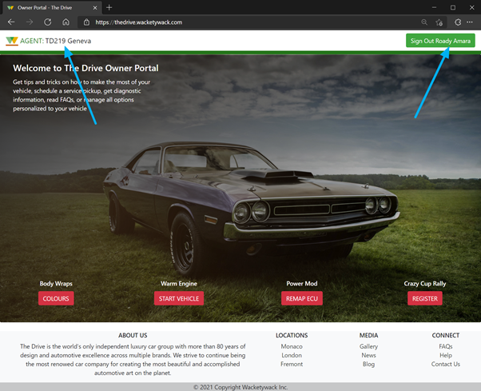
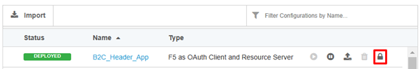
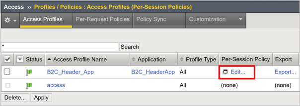
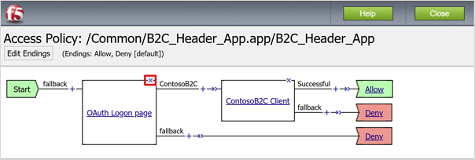
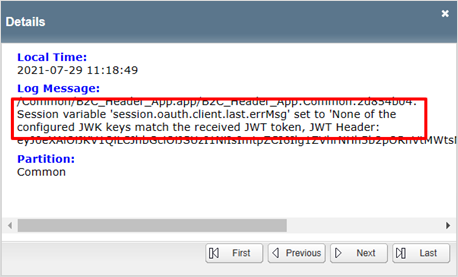

# Tutorial: Enable secure hybrid access for applications with Azure Active Directory B2C and F5 BIG-IP 

Learn to integrate Azure Active Directory B2C (Azure AD B2C) with F5 BIG-IP Access Policy Manager (APM). You can expose legacy applications securely to the internet through BIG-IP security, with Azure AD B2C preauthentication, Conditional Access (CA), and single sign-on (SSO). F5 Inc. focuses on delivery, security, performance, and availability of connected services, including computing, storage, and network resources. It provides hardware, modularized software, and cloud-ready virtual appliance solutions.

Deploy F5 BIG-IP Application Delivery Controller (ADC) as a secure gateway between private networks and the internet. There are features for application-level inspection and customizable access controls. If deployed as a reverse proxy, use the BIG-IP to enable secure hybrid access to business applications, with a federated identity access layer managed by APM.

Go to f5.com resources and white papers for: [Easily Configure Secure Access to All Your Applications via Microsoft Entra ID](https://www.f5.com/resources/white-papers/easily-configure-secure-access-to-all-your-applications-via-azure-active-directory)

## Prerequisites

To get started, you need:

* An Azure subscription
  * If you don't have one, get an [Azure free account](https://azure.microsoft.com/free/)
* An Azure AD B2C tenant linked to the Azure subscription
  * See, [Tutorial: Create an Azure Active Directory B2C tenant](tutorial-create-tenant.md)
* A BIG-IP or a deployed trial BIG-IP Virtual Environment (VE) on Azure
  * See, [Deploy F5 BIG-IP Virtual Edition VM in Azure](../active-directory/manage-apps/f5-bigip-deployment-guide.md)
* Any of the following F5 BIG-IP licenses:
  * F5 BIG-IP® Best bundle
  * F5 BIG-IP Access Policy Manager™  standalone license
  * F5 BIG-IP Access Policy Manager™ add-on license on a BIG-IP F5 BIG-IP® Local Traffic Manager™ (LTM)
  * 90-day BIG-IP full feature [trial license](https://www.f5.com/trials)
* A header-based web application or an IIS app for testing
  * See, [Set up an IIS app](/previous-versions/iis/6.0-sdk/ms525396(v=vs.90))
* SSL certificate to publish services over HTTPS, or use default while testing
  * See, [SSL profile](../active-directory/manage-apps/f5-bigip-deployment-guide.md#ssl-profile)

## Scenario description

The following scenario is header-based, but you can use these methods to achieve Kerberos SSO.

For this scenario, access for an internal application relies on receiving HTTP authorization headers from a legacy broker system. Sales agents can be directed to respective areas of content. The service needs to be expanded to a broader consumer base. The application gets upgraded for consumer authentication options, or gets replaced.

Ideally, an application upgrade supports direct management and governance with a modern control plane. However, time and effort to modernize introduces costs and potential downtime. Instead, deploy a BIG-IP Virtual Edition (VE) between the public internet and the internal Azure virtual network (VNet) to gate access with Azure AD B2C. BIG-IP in front of the application enables overlay of the service with Azure AD B2C preauthentication and header-based SSO, improving the app security posture.

The secure hybrid access solution has of the following components:

* **Application** - back-end service protected by Azure AD B2C and BIG-IP secure hybrid access
* **Azure AD B2C** - identity provider (IdP) and OpenID Connect (OIDC) authorization server that verifies user credentials, multifactor authentication, and SSO to the BIG-IP APM
* **BIG-IP** - reverse proxy for the application. The BIG-IP APM is the OIDC client, delegating authentication to the OIDC authorization server, before header-based SSO to the back-end service.

The following diagram illustrates the service provider (SP) initiated flow for this scenario.

1. User connects to the application endpoint. BIG-IP is service provider.
2. BIG-IP APM OIDC client redirects user to Azure AD B2C tenant endpoint, the OIDC authorization server
3. Azure AD B2C tenant pre-authenticates user and applies Conditional Access policies
4. Azure AD B2C redirects user back to the SP with authorization code
5. OIDC client asks the authorization server to exchange authorization code for an ID token
6. BIG-IP APM grants user access and injects the HTTP headers in the client request forwarded on to the application

## Azure AD B2C configuration

To enable a BIG-IP with Azure AD B2C authentication, use an Azure AD B2C tenant with a user flow or custom policy. 

See, [Tutorial: Create user flows and custom policies in Azure AD B2C](tutorial-create-user-flows.md)

### Create custom attributes

Obtain custom attributes from Azure AD B2C user objects, federated IdPs, API connectors, or user sign-up. Include attributes in the token that goes to the application.

Legacy applications expect specific attributes, so include them in your user flow. You can replace them with attributes your application requires. Or if you're setting up a test app using the instructions, then user any headers.

1. Sign in to the [Azure portal](https://portal.azure.com/) as Global Administrator.
2. In the left-hand pane, select **User attributes**.
3. Select **Add** to create two custom attributes.
4. For Agent ID, select String **Data Type**.
5. For Agent Geo, select String **Data Type**.

### Add attributes to user flow

1. In the left-hand menu, navigate go to **Policies** > **User flows**.
2. Select your policy, for example, **B2C_1_SignupSignin**.
3. Select **User attributes**.
4. Add both custom attributes. 
5. Add the **Display Name** attribute. These attributes are collected during user sign-up.
6. Select **Application claims**.
7. Add both custom attributes.
8. Add the **Display Name**. These attributes go to the BIG-IP.
9. Select **Run user flow**.
10. In the user flow menu, on the left navigation bar, verify the prompts for defined attributes.

Learn more: [Tutorial: Create user flows and custom policies in Azure AD B2C](tutorial-create-user-flows.md)

### Azure AD B2C federation

Federate BIG-IP and Azure AD B2C for mutual trust. Register the BIG-IP in the Azure AD B2C tenant as an OIDC application.

1. In the portal, select **App registrations** >  **New registration**.
2. Enter an app **Name**, for example, **HeaderApp1**.
3. Under **Supported account types**, select **Accounts in any identity provider or organizational directory (for authenticating users with user flows)**.
4. Under **Redirect URI**, select **Web**.
5. Enter protected service public FQDN. 
6. Enter the path.
7. Leave the remaining selections. 
8. Select **Register**.
9. Navigate to **Certificates & secrets** > **+ New client secret**.
10. Enter a descriptive name
11. Enter a TTL for the secret used by the BIG-IP.
12. Note the Client Secret for BIG-IP configuration.

The redirect URI is the BIG-IP endpoint. After authentication, the authorization server (Azure AD B2C) sends users to the endpoint. 

Learn more: [Tutorial: Register a web application in Azure AD B2C](tutorial-register-applications.md) for Azure AD B2C.

## BIG-IP configuration

For BIG-IP configuration use Guided Configuration v.7/8. The workflow framework is tailored to access topologies and it accomplishes rapid web service publishing.

### Guided Configuration version

1. To confirm version, sign in to the BIG-IP web config with an administrator account.
2. Go to **Access** > **Guided Configuration**. 
3. The version appears in the top right-hand corner. 

To upgrade the Guided Configuration, go to my.f5.com for [K85454683: Upgrade F5 BIG-IP Guided Configuration on the BIG-IP system](https://my.f5.com/manage/s/article/K85454683).

### SSL profiles

Use BIG-IP configured with a client SSL profile to secure client-side traffic over TLS. Import a certificate that matches the domain name, used by the public-facing URL for your app. We recommend you use a public certificate authority, but you can use BIG-IP self-signed certificates for testing.

To add and manage certificates in the BIG-IP VE, go to techdocs.f5.com for [BIG-IP System: SSL Administration](https://techdocs.f5.com/kb/en-us/products/big-ip_ltm/manuals/product/bigip-ssl-administration-13-0-0.html).

## Guided Configuration

1. To launch the deployment wizard, in the web config, go to **Access** > **Guided Configuration**.
2. Select **Federation** > **F5 as OAuth Client and Resource Server**.
3. Observe the flow summary for this scenario.
4. Select **Next**.
5. The wizard starts.

### OAuth properties

In the following sections, define properties to enable federation between the BIG-IP APM and the OAuth authorization server, the Azure AD B2C tenant. OAuth is referred to throughout BIG-IP configuration. The solution uses OIDC, an identity layer on the OAuth 2.0 protocol. OIDC clients verify user identity and obtain other profile information.

#### Configuration name

A configuration display name helps distinguish between deployment configurations in the Guided Configuration. You can't change the name, and it appears only in the Guided Configuration view.

#### Mode

The BIG-IP APM is an OIDC client, therefore select the Client option.

#### DNS resolver

The specified target must resolve the public IP addresses of the Azure AD B2C endpoints. Select a public DNS resolver, or create a new one.

#### Provider settings

Configure Azure AD B2C as the OAuth2 IdP. The Guided Configuration has Azure AD B2C templates, but not certain scopes. 

Add a new provider and configure it:

**OAuth general properties**

  | Properties | Description |
  |:-------|:---------|
  |OAuth provider type | Custom |
  | Choose OAuth provider | Create new, or use an OAuth provider |
  | Name | A display name for the B2C IdP. This name appears to users as a provider option at sign-in|
  | Token type | JSON web token |

**OAuth policy settings**

  | Properties | Description |
  |:-----------|:----------------|
  | Scope | Leave blank. The OpenID scope for user sign-in is added automatically |
  | Grant type | Authorization code |
  | Enable OpenID Connect | Select the option to put the APM OAuth client in OIDC mode |
  | Flow type | Authorization code |

**OAuth provider settings**

The following OpenID URI refers to the metadata endpoint used by OIDC clients to discover IdP information such as signing certificate rollover. 

1. Locate the metadata endpoint for your Azure AD B2C tenant.Navigating to **App registrations** > **Endpoints**.
2. Copy the Azure AD B2C OpenID Connect metadata document URI. For example, `https://wacketywackb2c .b2clogin.com/<tenantname>.onmicrosoft.com/<policyname>/v2.0/.well-known/openid-configuration`.
3. Update the URI with your properties, `https://<tenantname>.b2clogin.com/WacketywackB2C.onmicrosoft.com/B2C_1_SignUpIn/v2.0/.well-known/openid-configuration`.
4. Paste the URI into the browser.
5. View the OIDC metadata for your Azure AD B2C tenant.

| Property | Description |
|---|---|
| Audience | The application client ID representing the BIG-IP in the Azure AD B2C tenant |
| Authentication URI | The authorization endpoint in your B2C OIDC metadata |
| Token URI | The token endpoint in your Azure AD B2C metadata |
| Userinfo request URI | Leave empty. Azure AD B2C doesn't support this feature |
|OpenID URI | The OpenID URI metadata endpoint you created |
| Ignore expired certificate validation | Leave unchecked |
| Allow self-signed JWK config certificate | Check |
| Trusted CA bundle | Select ca-bundle.crt to use the default F5 trusted authorities |
| Discovery interval | Provide an interval for the BIG-IP to query your Azure AD B2C tenant for updates. The minimum interval in AGC version 16.1 0.0.19, is 5 minutes.|

**OAuth server settings**

For the OIDC authorization server, being your Azure AD B2C tenant.

|Property | Descriptions|
|---|---|
| Client ID | The application Client ID representing the BIG-IP in the Azure AD B2C tenant|
| Client Secret | The application Client Secret |
|Client-server SSL profile | Set an SSL profile to ensure APM communicates with the Azure AD B2C IdP over TLS. Select the default **serverssl**. |

**OAuth request settings**

The BIG-IP has required Azure AD B2C requests in its preconfigured request set. However, the requests were malformed, and missing important parameters. So, we created them manually.

**Token request: Enabled**

| Property | Description |
|---|---|
| Choose OAuth request | Create new |
| HTTP method | POST |
| Enable headers| Unchecked |
| Enable parameters | Checked |

| Parameter | Parameter name | Parameter value|
|----|---|---|
| client_id | client_id |N/A |
| nonce | nonce| N/A|
| redirect_uri | redirect_uri | N/A|
| scope | scope | N/A|
| response_type | response_type | N/A|
| client_secret | client_secret |N/A |
| custom | grant_type | authorization_code |

**Auth redirect request: Enabled**

| Property | Description |
|----|----|
| Choose OAuth request | Create new |
| HTTP method | GET |
| Prompt type | None |
| Enable headers | Unchecked |
| Enable parameters | Checked |

| Parameter | Parameter name | Parameter value|
|---|---|----|
| client_id | client_id | N/A|
| redirect_uri | redirect_uri |N/A |
| response_type |response_type |N/A |
| scope | scope | N/A|
| nonce | nonce | N/A|

**Token refresh request**: **Disabled** You can enable and configure as needed.

**OpenID UserInfo request**: **Disabled** Not supported in global Azure AD B2C tenants.

**Virtual server properties**

Create a BIG-IP virtual server to intercept external client requests for the back-end service protected by secure hybrid access. Assign the virtual server an IP mapped to the public DNS record for the BIG-IP service endpoint representing the application. Use a virtual server if available, otherwise provide the following properties.

| Property | Description |
|----|----|
| Destination address | Private or public IP that becomes the BIG-IP service endpoint for the back-end application |
| Service port | HTTPS |
| Enable redirect port | Select so users are auto redirected from http to https |
| Redirect port | HTTP |
| Client SSL profile | Swap the predefined `clientssl` profile with the one that has your SSL certificate. You can test with the default profile. but it likely causes a browser alert. |

**Pool properties**

Back-end services appear in the BIG-IP as a pool, with one or more application servers to which virtual servers direct inbound traffic. Select a pool, otherwise create a new one.

| Property | Description |
|---|---|
| Load-balancing method | Select Round Robin |
|Pool server | Internal IP of the back-end application |
| Port | Service port of the back-end application |
  
   >[!NOTE]
   >Ensure the BIG-IP has line of sight to the pool server address.

**SSO settings**

A BIG-IP supports SSO options, but in OAuth client mode the Guided Configuration is limited to Kerberos or HTTP Headers. Enable SSO and use the following information for the APM to map defined inbound attributes to outbound headers.

| Property | Description |
|---|---|
| Header Operation |Insert|
| Header Name | name|
| Header Value | `%{session.oauth.client.last.id_token.name}`|
| Header Operation |Insert|
|Header Name|agentid|
|Header Value | `%{session.oauth.client.last.id_token.extension_AgentGeo}`|
 
  >[!Note]
  > APM session variables in curly brackets are case-sensitive. Entering agentid, when the Azure AD B2C attribute name is sent as AgentID, causes an attribute mapping failure. Define attributes in lowercase. In Azure AD B2C, the user flow prompts the user for more attributes, using the attribute name in the portal. Therefore, use sentence case instead of lowercase.

   

**Customization properties**

Customize the language and appearance of screens users see in the APM access policy flow. Edit screen messages and prompts, change screen layouts, colors, images, and localize captions, descriptions, and messages.

In the **Form Header** text field, replace the `F5 Networks` string with a name that you want. 

**Session management properties**

Use the BIG-IP session management settings to define conditions that terminate sessions or allow them to continue. Set limits for users and IP addresses, and error pages. We recommend implementing single log out (SLO), which terminates sessions securely, reducing risks of unauthorized access.

## Deploy settings

Select **Deploy** to commit settings and create BIG-IP and APM objects fir secure hybrid access to the application. The application appears as a target resource in Conditional Access. For increased security, block direct access to the application, thereby enforcing a path through the BIG-IP.

Learn more: [Identity Protection and Conditional Access for Azure AD B2C](conditional-access-identity-protection-overview.md)

### Test the sign-in sign-up flow

1. As a user, go to the application external URL. 
2. The BIG-IP’s OAuth client sign-in page appears.
3. Sign in using the authorization code grant. To remove this step, see the **Supplemental configurations** section.
4. Sign up and authenticate against your Azure AD B2C tenant.

The following images are the user sign in dialog and the sign-in welcome page.  

   

   

For increased security, block direct access to the application, thereby enforcing a path through the BIG-IP.

### Supplemental configurations

**Single log-out (SLO)**

Azure AD B2C supports identity provider (IdP) and application sign-out. See, [Single sign out](session-behavior.md?pivots=b2c-custom-policy#single-sign-out).

To achieve SLO, enable your application sign out function to call the Azure AD B2C sign-out endpoint. Then, Azure AD B2C issues a final redirect to the BIG-IP. This action ensures the user-application APM session terminates.

An alternative SLO process is to enable the BIG-IP to listen for the request, when selecting the applications **Sign out** button. Upon detecting the request, it calls to the Azure AD B2C sign out endpoint. This approach precludes making changes to the application. 

To learn more BIG-IP iRules, go to support.f5.com for [K42052145: Configuring automatic session termination (logout) based on a URI-referenced file name](https://my.f5.com/manage/s/article/K42052145).

> [!NOTE]
> Regardless of approach, ensure the Azure AD B2C tenant knows the APM sign-out endpoint. 

1. In the portal, navigate to **Manage** > **Manifest**.
2. Locate the `logoutUrl` property. It reads null.
3. Add the APM post log-out URI: `https://<mysite.com>/my.logout.php3`

> [!NOTE]
> `<mysite.com>` is the BIG-IP FQDN for your header-based application.

**Optimized login flow**

To improve the user sign-in experience, suppress the OAuth user sign-in prompt that appears before Microsoft Entra preauthentication. 

1. Navigate to **Access** > **Guided Configuration**.
2. On the far right of the row, select the **padlock** icon.
3. The header-based application unlocks the strict configuration.

   

Unlocking the strict configuration prevents changes with the wizard UI. BIG-IP objects are associated with the published instance of the application, and are open for direct management.

4. Navigate to **Access** > **Profiles/ Policies** > **Access Profiles (Per-session Policies)**. 
5. For the application policy object, in the **Per-Session Policy** column, select **Edit**.

   

6. To delete the **OAuth Logon Page** policy object, select **X**.
7. At the prompt, connect to the previous node.

   

8. In the top left corner, select **Apply Access Policy**.
9. Close the visual editor tab.

When you attempt to connect to the application, the Azure AD B2C sign-in page appears.

>[!Note]
>If you re-enable strict mode and deploy a configuration, settings performed outside the Guided Configuration UI are overwritten. Implement this scenario by manually creating configuration objects for production services.

### Troubleshooting

Use the following troubleshooting guidance if access to the protected application is prevented.

#### Log verbosity

BIG-IP logs have information to isolate authentication and SSO issues. Increase the log verbosity level.

  1. Go to **Access Policy** > **Overview** > **Event Logs** > **Settings**.
  2. Select the row for your published application then **Edit** > **Access System Logs**.
  3. From the SSO list, select **Debug**.
  4. Select **OK**. 
  5. Before reviewing logs, reproduce your issue.
  
When complete, revert the previous settings. 
  
#### BIG-IP error message

If you see a BIG-IP error message after Azure AD B2C authentication, the issue might relate to SSO from Microsoft Entra ID to the BIG-IP.

  1. Navigate to **Access** > **Overview** > **Access reports**.
  2. Run the report for the last hour
  3. Review logs for clues. 
  4. Select the **View session variables** link.
  5. Determine if the APM receives the expected Microsoft Entra claims.

#### No BIG-IP error message

If no BIG-IP error message appears, the issue might be related to the back-end request, or SSO from the BIG-IP to the application.

  1. Go to **Access Policy** > **Overview** > **Active Sessions**.
  2. Select the link for your active session.
  3. Select the **View Variables** link.
  4. Review to determine root cause, particularly if the BIG-IP APM obtains inaccurate session attributes.
  5. Use the application logs to help understand if it received the attributes as headers.

#### Guided Configuration v8 known issue

If using Guided Configuration v8, a known issue generates the following error after successful Azure AD B2C authentication. The issue might be the AGC not enabling the Auto JWT setting during deployment. The APM can't obtain the current token signing keys. F5 engineering is investigating root cause.

  

The same access log provides detail.

  

**Manually enable the setting**

  1. Navigate to **Access** > **Guided Configuration**.
  2. On the far-right of the row for your header-based application, select the **padlock**.
  3. Navigate to **Access** > **Federation** > **OAuth Client/Resource Server** > **Providers**.
  4. Select the provider for your Azure AD B2C configuration.
  5. Check the **Use Auto JWT** box.
  6. Select **Discover**.
  7. Select **Save**.
  8. The **Key** (JWT) field has the token signing certificate key ID (KID) from OpenID URI metadata.
  9. In the top-left corner, select **Apply Access Policy**. 
  10. Select **Apply**.

For more information, go to techdocs.f5.com for [OAuth client and resource server troubleshooting tips](https://techdocs.f5.com/kb/en-us/products/big-ip_apm/manuals/product/apm-authentication-sso-13-0-0/37.html#GUID-774384BC-CF63-469D-A589-1595D0DDFBA2)
