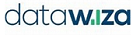

# Azure Active Directory B2C ISV partners

Our ISV partner network extends our solution capabilities to help you build seamless end-user experiences. With Azure AD B2C, you can integrate with ISV partners to enable multifactor authentication (MFA) methods, do role-based access control, enable identity verification and proofing, improve security with bot detection and fraud protection, and meet Payment Services Directive 2 (PSD2) Secure Customer Authentication (SCA) requirements. Use our detailed sample walkthroughs to learn how to integrate apps with the ISV partners. 

To be considered into this sample documentation, submit your application request in the [Microsoft Application Network portal](https://microsoft.sharepoint.com/teams/apponboarding/Apps/SitePages/Default.aspx). For any additional questions, send an email to [SaaSApplicationIntegrations@service.microsoft.com](mailto:SaaSApplicationIntegrations@service.microsoft.com).

>[!NOTE]
>The [Azure Active Directory B2C community site on GitHub](https://github.com/azure-ad-b2c/partner-integrations) also provides sample custom policies from the community.

## Identity verification and proofing

Microsoft partners with the following ISVs for identity verification and proofing.

| ISV partner | Description and integration walkthroughs |
|:-------------------------|:--------------|
|  | [Deduce](./partner-deduce.md) is an identity verification and proofing provider focused on stopping account takeover and registration fraud. It helps combat identity fraud and creates a trusted user experience. |
|  | [eID-Me](./partner-eid-me.md) is an identity verification and decentralized digital identity solution for Canadian citizens. It enables organizations to meet Identity Assurance Level (IAL) 2 and Know Your Customer (KYC) requirements. |
|  | [Experian](./partner-experian.md) is an identity verification and proofing provider that performs risk assessments based on user attributes to prevent fraud. |
|  | [IDology](./partner-idology.md) is an identity verification and proofing provider with ID verification solutions, fraud prevention solutions, compliance solutions, and others.|
|  | [Jumio](./partner-jumio.md) is an ID verification service, which enables real-time automated ID verification, safeguarding customer data. |
|  | [LexisNexis](./partner-lexisnexis.md) is a profiling and identity validation provider that verifies user identification and provides comprehensive risk assessment based on user’s device. |
|  | [Onfido](./partner-onfido.md) is a document ID and facial biometrics verification solution that allows companies to meet *Know Your Customer* and identity requirements in real time.  |

## MFA and Passwordless authentication

Microsoft partners with the following ISVs for MFA and Passwordless authentication.

| ISV partner | Description and integration walkthroughs |
|:-------------------------|:--------------|
|  | [Asignio](./partner-asignio.md) is a passwordless, soft biometric, and MFA solution. Asignio uses a combination of the patented Asignio Signature and live facial verification for user authentication. The changeable biometric signature eliminates passwords, fraud, phishing, and credential reuse through omni-channel authentication. |
|  | [BlokSec](./partner-bloksec.md) is a passwordless authentication and tokenless MFA solution, which provides real-time consent-based services and protects customers against identity-centric cyber-attacks such as password stuffing, phishing, and man-in-the-middle attacks. |
|  | [Grit biometric authentication](./partner-grit-authentication.md) provides users the option to sign in using finger print, face ID or [Windows Hello](https://support.microsoft.com/windows/learn-about-windows-hello-and-set-it-up-dae28983-8242-bb2a-d3d1-87c9d265a5f0) for enhanced security. 
|  | [Haventec](./partner-haventec.md) is a passwordless authentication provider, which provides decentralized identity platform that eliminates passwords, shared secrets, and friction. |
|  | [Hypr](./partner-hypr.md) is a passwordless authentication provider, which replaces passwords with public key encryptions eliminating fraud, phishing, and credential reuse. |
|  | [IDEMIA](./partner-idemia.md) is a passwordless authentication provider, which provides real-time consent-based services with biometric authentication like faceID and fingerprinting eliminating fraud and credential reuse. |
|  | [itsme](./partner-itsme.md) is an Electronic Identification, Authentication and Trust Services (eiDAS) compliant digital ID solution to allow users to sign in securely without card readers, passwords, two-factor authentication, and multiple PIN codes. |
| | [Keyless](./partner-keyless.md) is a passwordless authentication provider that provides authentication in the form of a facial biometric scan and eliminates fraud, phishing, and credential reuse.
|  | [Nevis](./partner-nevis.md) enables passwordless authentication and provides a mobile-first, fully branded end-user experience with Nevis Access app for strong customer authentication and to comply with PSD2 transaction requirements. |
|  | [Nok Nok](./partner-nok-nok.md) provides passwordless authentication and enables FIDO certified multifactor authentication such as FIDO UAF, FIDO U2F, WebAuthn, and FIDO2 for mobile and web applications. Using Nok Nok customers can improve their security posture while balancing user experience.
| | [Transmit Security's](./partner-bindid.md) solution BindID is a passwordless authentication service that uses strong FIDO2 biometric authentication for a reliable omni-channel authentication experience, which ensures a smooth login experience for customers across every device and channel eliminating fraud, phishing, and credential reuse. |
|  | [Trusona Authentication Cloud](./partner-trusona.md) integration helps you sign in securely and enables a tap-and-go passwordless authentication.  |
|  | [Twilio Verify app](./partner-twilio.md) provides multiple solutions to enable MFA through SMS one-time password (OTP), time-based one-time password (TOTP), and push notifications, and to comply with SCA requirements for PSD2. |
|  | [TypingDNA](./partner-typingdna.md) enables strong customer authentication by analyzing a user’s typing pattern. It helps companies enable a silent MFA and comply with SCA requirements for PSD2. |
|  | [WhoIAM](./partner-whoiam.md) is a Branded Identity Management System (BRIMS) application that enables organizations to verify their user base by voice, SMS, and email. |
|  | [xID](./partner-xID.md) is a digital ID solution that provides users with passwordless, secure, multifactor authentication. xID-authenticated users obtain their identities verified by a My Number Card, the digital ID card issued by the Japanese government. Organizations can get users verified personal information through the xID API. |

## Role-based access control 
 
Microsoft partners with the following ISVs for role-based access control.

| ISV partner | Description and integration walkthroughs |
|:-------------------------|:--------------|
|  | [Grit IAM B2B2C](./partner-grit-iam.md) provides authentication, authorization, profile and role management, and delegated B2B SaaS application administration. It also enables role-based access control (RBAC) for end-users of Azure AD B2C.|
|  | [N8Identity](./partner-n8identity.md) is an Identity-as-a-Service governance platform that provides solution to address customer accounts migration and Customer Service Requests (CSR) administration running on Microsoft Azure. |
|  | [Saviynt](./partner-Saviynt.md) cloud-native platform promotes better security, compliance, and governance through intelligent analytics and cross application integration for streamlining IT modernization. |
|  | [WhoIAM Rampart](./partner-whoiam-rampart.md) provides a fully integrated helpdesk and invitation-gated user registration experience. It allows support specialists to efficiently perform tasks like resetting passwords and multi-factor authentication without using Azure. It also enables apps and role-based access control (RBAC) for end-users of Azure AD B2C. |

## Secure hybrid access to on-premises application

Microsoft partners with the following ISVs to provide secure hybrid access to on-premises application. 

| ISV partner | Description and integration walkthroughs |
|:-------------------------|:--------------|
|  | [Akamai](./partner-akamai-secure-hybrid-access.md) provides a Zero Trust Network Access (ZTNA) solution that enables secure remote access to modern and legacy applications that reside in private datacenters.  |
|  | [Datawiza](./partner-datawiza.md) enables SSO and granular access control for your applications and extends Azure AD B2C to protect on-premises legacy applications.  |
|  | [F5](./partner-f5.md) enables legacy applications to securely expose to the internet through BIG-IP security combined with Azure AD B2C pre-authentication, Conditional Access (CA) and SSO.  |
|  | [Grit's app proxy](./partner-grit-app-proxy.md) enables migrating a legacy application using header-based authentication to Azure AD B2C with no application code change. |
|  | [Ping Identity](./partner-ping-identity.md) enables secure hybrid access to on-premises legacy applications across multiple clouds. |
|  | [Strata](./partner-strata.md) provides secure hybrid access to on-premises applications by enforcing consistent access policies, keeping identities in sync, and making it simple to transition applications from legacy identity systems to standards-based authentication and access control provided by Azure AD B2C. |
|  | [Zscaler](./partner-zscaler.md) delivers policy-based, secure access to private applications and assets without the cost, hassle, or security risks of a VPN. |

## Fraud protection

Microsoft partners with the following ISVs for fraud detection and prevention. 

| ISV partner | Description and integration walkthroughs |
|:-------------------------|:--------------|
|  | [Arkose Labs](./partner-arkose-labs.md) is a fraud prevention solution provider that helps organizations protect against bot attacks, account takeover attacks, and fraudulent account openings. |
|  | [BioCatch](./partner-biocatch.md) is a fraud prevention solution provider that analyzes a user's physical and cognitive digital behaviors to generate insights that distinguish between legitimate customers and cyber-criminals. |
|  | [Microsoft Dynamics 365 Fraud Protection](./partner-dynamics-365-fraud-protection.md) is a solution that helps organizations protect against fraudulent account openings through device fingerprinting. |

## Web Application Firewall 

Microsoft partners with the following ISVs for Web Application Firewall (WAF). 

| ISV partner | Description and integration walkthroughs |
|:-------------------------|:--------------|
|   | [Akamai WAF](./partner-akamai.md) allows fine grained manipulation of traffic to protect and secure your identity infrastructure against malicious attacks.  |
|   | [Azure WAF](./partner-web-application-firewall.md) provides centralized protection of your web applications from common exploits and vulnerabilities.  |
 | [Cloudflare](./partner-cloudflare.md) is a WAF provider that helps organizations protect against malicious attacks that aim to exploit vulnerabilities such as SQLi, and XSS. |

## Developer tools 

Microsoft partners with the following ISVs for tools that can help with implementation of your authentication solution.

| ISV partner | Description and integration walkthroughs |
|:-------------------------|:--------------|
|  | [Grit Visual Identity Experience Framework Editor](./partner-grit-editor.md) provides a low code/no code experience for developers to create sophisticated authentication user journeys. The tool comes with integrated debugger and templates for the most used scenarios.|

## Additional information

- [Custom policies in Azure AD B2C](./custom-policy-overview.md)

- [Get started with custom policies in Azure AD B2C](tutorial-create-user-flows.md?pivots=b2c-custom-policy)

## Next steps

Select a partner in the tables mentioned to learn how to integrate their solution with Azure AD B2C.
