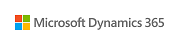
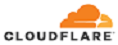

# Azure Active Directory B2C ISV partners

Our ISV partner network extends our solution capabilities to help you build seamless end-user experiences. With Azure AD B2C, you can integrate with ISV partners to enable Multi-Factor authentication (MFA) methods, do role-based access control, enable identity verification and proofing, improve security with bot detection and fraud protection, and meet Payment Services Directive 2 (PSD2) Secure Customer Authentication (SCA) requirements. Use our detailed sample walkthroughs to learn how to integrate apps with the ISV partners.

>[!NOTE]
>The [Azure Active Directory B2C community site on GitHub](https://azure-ad-b2c.github.io/azureadb2ccommunity.io/) also provides sample custom policies from the community.

## Identity verification and proofing

Microsoft partners with the following ISVs for identity verification and proofing.

| ISV partner | Description and integration walkthroughs |
|:-------------------------|:--------------|
| | [Experian](./partner-experian.md) is an identity verification and proofing provider that performs risk assessments based on user attributes to prevent fraud. |
| | [IDology](./partner-idology.md) is an identity verification and proofing provider with ID verification solutions, fraud prevention solutions, compliance solutions, and others.|
| | [Jumio](./partner-jumio.md) is an ID verification service, which enables real-time automated ID verification, safeguarding customer data. |
|  | [LexisNexis](./partner-lexisnexis.md) is a profiling and identity validation provider that verifies user identification and provides comprehensive risk assessment based on user’s device. |
|  | [Onfido](./partner-onfido.md) is a document ID and facial biometrics verification solution that allows companies to meet *Know Your Customer* and identity requirements in real time.  |

## MFA and Passwordless authentication

Microsoft partners with the following ISVs for MFA and Passwordless authentication.

| ISV partner | Description and integration walkthroughs |
|:-------------------------|:--------------|
|  | [Hypr](./partner-hypr.md) is a passwordless authentication provider, which replaces passwords with public key encryptions eliminating fraud, phishing, and credential reuse. |
|  | [itsme](./partner-itsme.md) is an Electronic Identification, Authentication and Trust Services (eiDAS) compliant digital ID solution to allow users to sign in securely without card readers, passwords, two-factor authentication, and multiple PIN codes. |
| | [Keyless](./partner-keyless.md) is a passwordless authentication provider that provides authentication in the form of a facial biometric scan and eliminates fraud, phishing, and credential reuse.
|  | [Nevis](./partner-nevis.md) enables passwordless authentication and provides a mobile-first, fully branded end-user experience with Nevis Access app for strong customer authentication and to comply with PSD2 transaction requirements. |
|  | [Trusona](./partner-trusona.md) integration helps you sign in securely and enables passwordless authentication, MFA, and digital license scanning. |
|  | [Twilio Verify app](./partner-twilio.md) provides multiple solutions to enable MFA through SMS one-time password (OTP), time-based one-time password (TOTP), and push notifications, and to comply with SCA requirements for PSD2. |
|  | [TypingDNA](./partner-typingdna.md) enables strong customer authentication by analyzing a user’s typing pattern. It helps companies enable a silent MFA and comply with SCA requirements for PSD2. |
|  | [WhoIAM](./partner-whoiam.md) is a Branded Identity Management System (BRIMS) application that enables organizations to verify their user base by voice, SMS, and email. |

## Role-based access control 
 
Microsoft partners with the following ISVs for role-based access control.

| ISV partner | Description and integration walkthroughs |
|:-------------------------|:--------------|
|  | [N8Identity](./partner-n8identity.md) is an Identity-as-a-Service governance platform that provides solution to address customer accounts migration and Customer Service Requests (CSR) administration running on Microsoft Azure. |
|  | [Saviynt](./partner-Saviynt.md) cloud-native platform promotes better security, compliance, and governance through intelligent analytics and cross application integration for streamlining IT modernization. |

## Secure hybrid access to on-premises application

Microsoft partners with the following ISVs to provide secure hybrid access to on-premises application. 

| ISV partner | Description and integration walkthroughs |
|:-------------------------|:--------------|
|  | [Ping Identity](./partner-ping-identity.md) enables secure hybrid access to on-premises legacy applications across multiple clouds. |
|  | [Strata](./partner-strata.md) provides secure hybrid access to on-premises applications by enforcing consistent access policies, keeping identities in sync, and making it simple to transition applications from legacy identity systems to standards-based authentication and access control provided by Azure AD B2C. |
|  | [Zscaler](./partner-zscaler.md) delivers policy-based, secure access to private applications and assets without the cost, hassle, or security risks of a VPN. |

## Fraud protection

Microsoft partners with the following ISVs for fraud detection and prevention. 

| ISV partner | Description and integration walkthroughs |
|:-------------------------|:--------------|
|  | [Arkose Labs](./partner-arkose-labs.md) is a fraud prevention solution provider that helps organizations protect against bot attacks, account takeover attacks, and fraudulent account openings. |
|  | [BioCatch](./partner-biocatch.md) is a fraud prevention solution provider that analyzes a user's physical and cognitive digital behaviors to generate insights that distinguish between legitimate customers and cyber-criminals. |
|  | [Microsoft Dynamics 365 Fraud Protection](./partner-dynamics-365-fraud-protection.md) is a solution that helps organizations protect against fraudulent account openings through device fingerprinting. |

## Web Application Firewall 

Microsoft partners with the following ISVs for Web Application Firewall (WAF). 

| ISV partner | Description and integration walkthroughs |
|:-------------------------|:--------------|
|  | [Cloudflare](./partner-cloudflare.md) is a WAF provider that helps organizations protect against malicious attacks that aim to exploit vulnerabilities such as SQLi, and XSS. |

## Additional information

- [Custom policies in Azure AD B2C](./custom-policy-overview.md)

- [Get started with custom policies in Azure AD B2C](tutorial-create-user-flows.md?pivots=b2c-custom-policy)

## Next steps

Select a partner in the tables mentioned to learn how to integrate their solution with Azure AD B2C.
