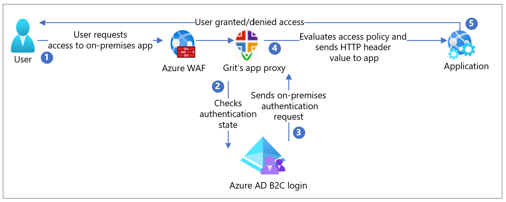

# Migrate applications using header-based authentication to Azure Active Directory B2C with Grit's app proxy

In this sample tutorial, learn how to migrate a legacy application using header-based authentication to Azure Active Directory B2C (Azure AD B2C) with [Grit's app proxy](https://www.gritiam.com/appProxy.html).

Benefits of using Grit's app proxy are as follows:

- No application code change and easy deployment resulting in faster ROI

- Enables users to use modern authentication experiences such as multifactor authentication, biometrics, and password-less resulting in enhanced security.

- Significant savings on the license cost of the legacy authentication solution

## Prerequisites

To get started, you'll need:

- License to Grit’s app proxy. Contact [Grit support](mailto:info@gritsoftwaresystems.com) for license details. For this tutorial, you don't need a license.

- An Azure subscription. If you don't have one, get a [free account](https://azure.microsoft.com/free/).

- An [Azure AD B2C tenant](tutorial-create-tenant.md) that is linked to your Azure subscription.

## Scenario description

Grit integration includes the following components:

- **Azure AD B2C**: The authorization server to verify user credentials - Authenticated users access on-premises applications using a local account stored in the Azure AD B2C directory.

- **Grit app proxy**: The service that passes identity to applications through HTTP headers.

- **Web application**: The legacy application to which user requests access.

The following architecture diagram shows the implementation.

   

1. The user requests access to an on-premises application.

2. Grit app proxy receives the request through [Azure Web Application Firewall (WAF)](https://azure.microsoft.com/products/web-application-firewall/) and sends it to the application.

3. Grit app proxy checks user authentication state. With no session token, or an invalid token, the user goes to Azure AD B2C for authentication.

4. Azure AD B2C sends the user request to the endpoint specified during Grit app proxy registration in the Azure AD B2C tenant.

4. Grit app proxy evaluates access policies and calculates attribute values in HTTP headers forwarded to the application. Grit app proxy sets the header values and sends the request to the application.

5. The user is authenticated with access granted/denied to the application.

## Onboard with Grit app proxy

Contact [Grit support](mailto:info@gritsoftwaresystems.com) for details to get onboarded.

### Configure Grit's app proxy solution with Azure AD B2C

For this tutorial, Grit already has a backend application and an Azure AD B2C policy. This tutorial will be about configuring the proxy to access the backend application.

You can use the UX to configure each page of the backend application for security. You can configure the type of auth required by each page and the header values needed.

If the users need to be denied permission to certain pages based on group membership or some other criteria, it's handled by the auth user journey.

1. Navigate to https://proxyeditor.z13.web.core.windows.net/.

2. Once the dropdown appears, select the dropdown, and select **Create New**.

3. Enter a name for the page that contains only letters and numbers.

4. Enter **B2C_1A_SIGNUP_SIGNIN** into the B2C Policy box.

5. Select **GET** at the HTTP method.

6. Enter 'https://anj-grit-legacy-backend.azurewebsites.net/Home/Page' into the endpoint field and that would be the endpoint to your legacy application.

   >[!NOTE]
   >This demo is publicly available, values you enter will be visible to public. Don't configure a secure application with this demo.

   

7. Select **ADD HEADER**.

8. Enter **x-iss** in the destination header field to configure the valid HTTP header that must be sent to the application.

9. Enter **given_name** into the Value field that is the name of a claim in the B2C policy. The value of the claim will be passed into the header.

10. Select **Token** as the source.

11. Select **SAVE SETTINGS**.

12. Select the link in the popup. It will take you to a sign-in page. Select the sign-up link and enter the required information. Once you complete the sign-up process, you'll be redirected to the legacy application. The application displays the name you provided in the **Given name** field during sign-up.

## Test the flow

1. Navigate to the on-premises application URL.

2. The Grit app proxy redirects to the page you configured in your user flow.
From the list, select the IdP.

3. At the prompt, enter your credentials. If necessary, include a Microsoft Entra multifactor authentication token.

4. You're redirected to Azure AD B2C, which forwards the application request to the Grit's app proxy redirect URI.

5. The Grit's app proxy evaluates policies, calculates headers, and sends the user to the upstream application.

6. The requested application appears.

## Additional resources

- [Grit app proxy documentation](https://www.gritiam.com/appProxy.html)

- [Configure the Grit IAM B2B2C solution with Azure AD B2C](partner-grit-iam.md)

- [Edit Azure AD B2C Identity Experience Framework (IEF) XML with Grit Visual IEF Editor](partner-grit-editor.md)

- [Configure Grit biometric authentication with Azure AD B2C](partner-grit-authentication.md)
