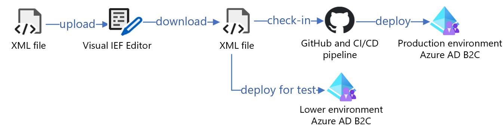

# Edit Azure Active Directory B2C Identity Experience Framework (IEF) XML with Grit Visual IEF Editor

[Grit Software Systems Visual Identity Experience Framework (IEF) Editor](https://www.gritiam.com/iefeditor.html), is a tool that saves time during Azure Active Directory B2C (Azure AD B2C) authentication deployment. It supports multiple languages without the need to write code. It also has a no code debugger for user journeys.

Use the Visual IEF Editor to:

- Create Azure AD B2C IEF XML, HTML/CSS/JS, and .NET API to deploy Azure AD B2C.
- Load your Azure AD B2C IEF XML.
- Visualize and modify your current code, check it in, and run it through a continuous integration/continuous delivery (CI/CD) pipeline.

## Prerequisites

To get started with the IEF Editor, ensure the following prerequisites are met:

- A Microsoft Entra subscription. If you don't have one, you can get an [Azure free account](https://azure.microsoft.com/free/).
- An Azure AD B2C tenant linked to the Azure subscription. Learn more at [Tutorial: Create an Azure Active Directory B2C tenant](tutorial-create-tenant.md).
- [Visual IEF Editor](https://www.gritiefedit.com) is free and works only with Google Chrome browser.
- Review and download policies from [Azure AD B2C customer policies starter pack](https://github.com/Azure-Samples/active-directory-b2c-custom-policy-starterpack)
- Install Google Chrome browser

## Sample code development workflow

The following illustration shows a sample code-development workflow from XML files to production.

| Step | Description |
|:-----|:------|
| 1. | Go to https://www.gritiefedit.com and upload the policies from [Azure AD B2C customer policies starter pack](https://github.com/Azure-Samples/active-directory-b2c-custom-policy-starterpack) using the upload policy button in the user interface.|
| 2. | Using the Visual IEF editor tool, select and edit any user journey and self asserted profile that needs update/modification.|
|3. | Once the files are updated, select the download button. All the policies will be downloaded to the local machine.|
|4. | Check in the files in GitHub or CI/CD pipeline. |
|5. | Use the files in the lower environment for testing the Azure AD B2C policies.|
|6. | Deploy the policies in Azure AD B2C production environment. |

Learn more about [IEF Editor](https://app.archbee.com/doc/uwPRnuvZNjyEaJ8odNOEC/WmcXf6fTZjAHpx7-rAlac). 

## Scenario descriptions

The following sections describe two Visual IEF Editor scenarios for *Contoso* and *Fabrikam* to consider when you plan your Azure AD B2C deployment using this tool. 

### Case 1 - Contoso: IEF logic, make changes, and enable features

The *Contoso* enterprise uses Azure AD B2C, and has an extensive IEF deployment. Current challenges for *Contoso* are:

- Teaching IEF logic to new-hire developers.
- Making changes to IEF.
- Enabling features such as, fraud protection, identity protection, and biometrics.

When IEF files are loaded into Visual IEF Editor, a list of user journeys appears with a flow chart for each journey. The user journey elements contain useful data and functionalities. Search eases the process of tracing through IEF logic, and enables needed features. The modified files can be:

- Downloaded to a local machine.
- Uploaded to GitHub.
- Run through CI/CD.
- Deployed to a lower environment for testing.

### Case 2 - Fabrikam: Fast implementation

*Fabrikam* is a large enterprise, which has decided to use Azure AD B2C. Their goals are:

- Implement Azure AD B2C quickly
- Discover functionalities without learning IEF

>[!NOTE]
>This scenario is in private preview. For access, or questions, contact [Grit IAM Solutions support](https://www.gritiam.com/).

Fabrikam has a set of pre-built templates with intuitive charts that show user flows. Use Visual IEF Editor to modify templates and then deploy them into a lower environment, or upload them to GitHub for CI/CD.

After the IEF is modified, download, and upload the files to Azure AD B2C to see them in action.

## Next steps

For additional information, review the following articles:

- [Tutorial: Create user flows and custom policies in Azure Active Directory B2C](./tutorial-create-user-flows.md?pivots=b2c-custom-policy&tabs=applications)

- [IEF Editor](https://app.archbee.com/doc/uwPRnuvZNjyEaJ8odNOEC/WmcXf6fTZjAHpx7-rAlac) documentation

- [Grit IAM B2B2C](partner-grit-iam.md)
