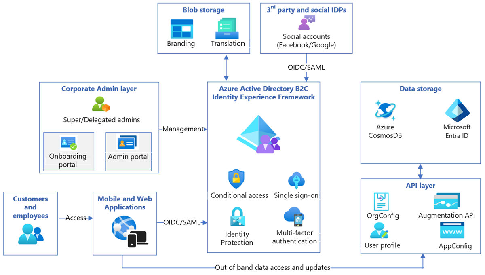

# Tutorial: Configure the Grit IAM B2B2C solution with Azure Active Directory B2C

In this tutorial, you learn how to integrate Azure Active Directory B2C (Azure AD B2C) authentication with a [Grit IAM B2B2C](https://www.gritiam.com/b2b2c) solution. You can use the solution to provide secure, reliable, self-serviceable, and user-friendly identity and access management to your customers. Shared profile data such as first name, last name, home address, and email used in web and mobile applications are stored in a centralized manner with consideration to compliance and regulatory needs.

Use Grit's B2BB2C solution for:

- Authentication, authorization, profile and role management, and delegated B2B SaaS application administration.
- Role-based access control for Azure AD B2C applications.

## Prerequisites

To get started, ensure the following prerequisites are met:

- A Grit IAM account. You can go to [Grit IAM B2B2C solution](https://www.gritiam.com/b2b2c) to get a demo.
- A Microsoft Entra subscription. If you don't have one, you can create a [free Azure account](https://azure.microsoft.com/free/).
- An Azure AD B2C tenant linked to the Azure subscription. You can learn more at [Tutorial: Create an Azure Active Directory B2C tenant](tutorial-create-tenant.md). 
- Configure your application in the Azure portal. 

## Scenario description

Contoso does business with end customers and large enterprises, like Fabrikam_big1 and Fabrikam_big2. There're small enterprise customers like Fabrikam_small1 and Fabrikam_small2 and direct business is done with end customers like Smith1 and Smith2.

*Contoso* has web and mobile applications and develops new applications. The applications rely on user shared profile data such as, first name, last name, address, and email. They want to centralize the profile data, so applications aren't collecting and storing the data. They want to store the profile information in accordance with certain compliance and regulations.

This integration is composed of the following components:

- **Azure AD B2C Identity Experience Framework (IEF)**: An engine that executes user journeys, which can include validating credentials, performing MFA, checking user access. It's aided by the Microsoft Entra database and the API layer, which's configured using XML.

- **Grit API layer**: This layer exposes user profile data and metadata about organizations and applications. The data is stored in Microsoft Entra ID and Cosmos DB.

- **Grit Onboarding portal**: Used by admins to onboard applications and organizations.

- **Grit Admin portal**: Used by the *Contoso* admin and by admins of *fabrikam_big1*, and *fabirkam_small1*. Delegated admins can manage users and their access. Super admins of the organizations manage all users.

- **Grit Visual IEF editor**: A low code/no code editor that customizes the user journey and is provided by Grit. It produces the XML used by IEF. *Contoso* developers use it to customize user journeys.

- **Applications**: Developed by *Contoso* or third parties. Applications use Open ID or SAML to connect to the customer identity and access management (CIAM) system. The tokens they receive contain user-profile information, but can make API calls, with the token as the auth mechanism, to do user-profile data create, read, update and delete (CRUD) operations.

> [!NOTE]
> Components developed by Grit, except the visual IEF editor, will be deployed in the Contoso Azure environment.

## Configure Grit B2B2C with Azure AD B2C

Use the guidance provided in the following sections to get started with configuration.

### Step 1 - Setup infrastructure 

To get started with setup:

- Contact [Grit support](mailto:info@gritsoftwaresystems.com) to obtain access.
- For evaluation, the Grit support team will deploy the infrastructure in the Grit Azure subscription and they'll give you admin rights.
- After you purchase the solution, Grit engineers will install the production version in your Azure subscription.
- The infrastructure integrates with your virtual network (VNet) setup, supports APIM (third-party API management) and the firewall.
- Grit implementation engineers can provide custom recommendations based on your infrastructure.

### Step 2 - Create admins in the Admin Portal

Use the Grit Admin portal to assign administrators access to the portal where they can perform the following tasks -

- Add other admins such as super, organization, application admin in the hierarchy depending on their permission level.

- View/accept/reject all the user's requests for the application registration.

- Search users.

To learn how to assign admin roles, check the [tutorial.](https://app.archbee.com/doc/j1VX2J3B3xJ-zMqnmlDA5/9IW3PgI2yn1cCpPGm1vVN) 

### Step 3 - Onboard organizations

Use the Onboarding portal for one or more of your customers and their identity provider (IdP) that supports OpenID Connect (OIDC) and SAML. Onboard customers without an IdP, for local account authentication. For B2C applications, enable social authentications.

In the Grit Onboarding portal, create a super admin for the tenant. The Onboarding portal defines the claims per application and per organization. Thereafter, the portal creates an endpoint URL for the sign-in and sign-up user flow.

To learn how to onboard an organization, check this [tutorial](https://app.archbee.com/doc/G_YZFq_VwvgMlmX-_efmX/8m90WVb2M6Yi0gCe7yor2).

### Step 4 - Integrate applications using OIDC or SAML

After you onboard the customer, the Grit Onboarding portal provides URLs to onboard the applications.

Learn [how your customers can sign up, sign in, and manage their profiles](add-sign-up-and-sign-in-policy.md?pivots=b2c-custom-policy). 

## Test the scenarios

Check the authentication [scenarios](#scenario-description) in your applications. Use the Grit Admin portal to change roles and user properties. Provide delegated access to Admin portal by inviting users.

## Next steps

- [Azure AD B2C custom policy overview](custom-policy-overview.md)

- [Tutorial: Create user flows and custom policies in Azure Active Directory B2C](./tutorial-create-user-flows.md?pivots=b2c-custom-policy&tabs=applications)

- [SAAS Platform - Organization Application Onboarding Portal](https://app.archbee.com/doc/G_YZFq_VwvgMlmX-_efmX/8m90WVb2M6Yi0gCe7yor2)

- [SAAS Platform - Admin Portal](https://app.archbee.com/doc/j1VX2J3B3xJ-zMqnmlDA5/9IW3PgI2yn1cCpPGm1vVN)
