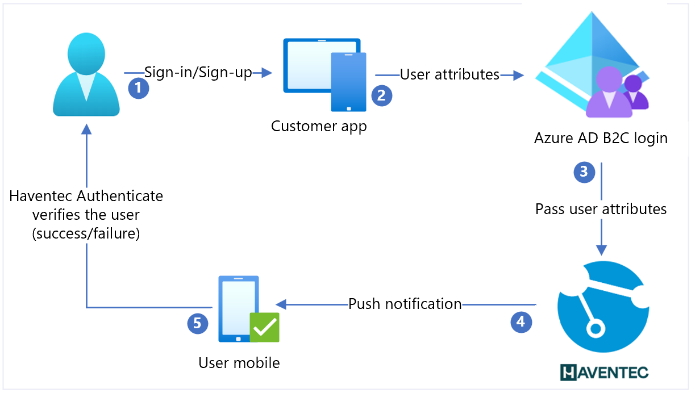

# Tutorial: Configure Haventec Authenticate with Azure Active Directory B2C for single-step, multi-factor passwordless authentication

Learn to integrate Azure Active Directory B2C (Azure AD B2C) with Haventec Authenticate, a passwordless technology that eliminates passwords, shared secrets, and friction.

To learn more, go to haventec.com: [Haventec](https://www.haventec.com/)

## Scenario description

The Authenticate integration includes the following components:

* **Azure AD B2C** - authorization server that verifies user credentials
  * Also known as the identity provider (IdP)
* **Web and mobile applications** - OpenID Connect (OIDC) mobile or web applications protected by Authenticate and Azure AD B2C
* **Haventec Authenticate service** - external IdP for the Azure AD B2C tenant

The following diagram illustrates sign-up and sign-in user flows in the Haventec Authenticate integration.

   

1. User selects sign-in or sign-up and enters a username.
2. The application sends user attributes to Azure AD B2C for identity verification.
3. Azure AD B2C collects user attributes and sends them to Haventec Authenticate.
4. For new users, Authenticate sends push notification to the user mobile device. It can send email with a one-time password (OTP) for device registration.
5. User responds and is granted or denied access. New cryptographic keys are pushed to the user device for a future session.

## Get started with Authenticate

Go to the haventec.com [Get a demo of Haventec Authenticate](https://www.haventec.com/products/get-started) page. In the personalized demo request form, indicate your interest in Azure AD B2C integration. An email arrives when the demo environment is ready.  

## Integrate Authenticate with Azure AD B2C

Use the following instructions to prepare for and integrate Azure AD B2C with Authenticate. 

### Prerequisites

To get started, you need:

* An Azure subscription

  * If you don't have one, get an [Azure free account](https://azure.microsoft.com/free/)
* An Azure AD B2C tenant linked to the Azure subscription
  * see, [Tutorial: Create an Azure Active Directory B2C tenant](tutorial-create-tenant.md)
* A Haventec Authenticate demo environment
  * See, [Get a demo of Haventec Authenticate](https://www.haventec.com/products/get-started)

### Create a web application registration

Before applications can interact with Azure AD B2C, register them in a tenant you manage. 

See, [Tutorial: Register a web application in Azure Active Directory B2C](tutorial-register-applications.md)

### Add a new identity provider in Azure AD B2C

For the following instructions, use the directory with the Azure AD B2C tenant.

1. Sign in to the [Azure portal](https://portal.azure.com/#home) as the Global Administrator of your Azure AD B2C tenant.
2. In the top menu, select **Directory + subscription**.
3. Select the directory with the tenant.
4. In the top-left corner of the Azure portal, select **All services**.
5. Search for and select **Azure AD B2C**.
6. Navigate to **Dashboard** > **Azure Active Directory B2C** > **Identity providers**.
7. Select **New OpenID Connect Provider**.
8. Select **Add**.

### Configure an identity provider

To configure an identity provider:

1. Select **Identity provider type** > **OpenID Connect**.
2. For **Name**, enter **Haventec**, or another name.
3. For **Metadata URL**, use `https://iam.demo.haventec.com/auth/realms/*your\_realm\_name*/.well-known/openid-configuration`.
4. For **Client ID**, enter the application ID recorded from the Haventec admin UI.
5. For **Client Secret**, enter the application Secret recorded from the Haventec admin UI.
6. For **Scope**, select **OpenID email profile**.
7. For **Response type**, select **Code**.
8. For **Response mode**, select **forms_post**.
9. For **Domain hint**, leave blank. 
10. Select **OK**.
11. Select **Map this identity provider's claims**.
12. For **User ID**, select **From subscription**.
13. For **Display** name, select **From subscription**.
14. For **Given name**, use **given_name**.
15. For **Surname**, use **family_name**.
16. For **Email**, use **Email**.
17. Select **Save**.

## Create a user flow policy

For the following instructions, Haventec is a new OIDC identity provider in the B2C identity providers list.

1. In the Azure AD B2C tenant, under **Policies**, select **User flows**.
2. Select **New user flow**.
3. Select **Sign up and sign in** > **version** > **Create**.
4. Enter a **Name** for the policy.
5. In **Identity providers**, select the created Haventec identity provider.
6. For **Local Accounts**, select **None**. This selection disables email and password authentication.
7. Select **Run user flow**.
8. In the form, enter the replying URL, for example, `https://jwt.ms`.
9. The browser redirects to the Haventec sign-in page.
10. User is prompted to register, or enter a PIN.
11. The authentication challenge is performed.
12. The browser redirects to the replying URL.

## Test the user flow

1. In the Azure AD B2C tenant, under **Policies**, select **User flows**.
2. Select the created **User Flow**.
3. Select **Run user flow**.
4. For **Application**, select the registered app. The example is JWT.
5. For **Reply URL**, select the redirect URL.
6. Select **Run user flow**.
7. Perform a sign-up flow and create an account.
8. Haventec Authenticate is called.

## Next steps

* Go to docs.haventec.com for [Haventec Documentation](https://docs.haventec.com/)
* [Azure AD B2C custom policy overview](custom-policy-overview.md)
