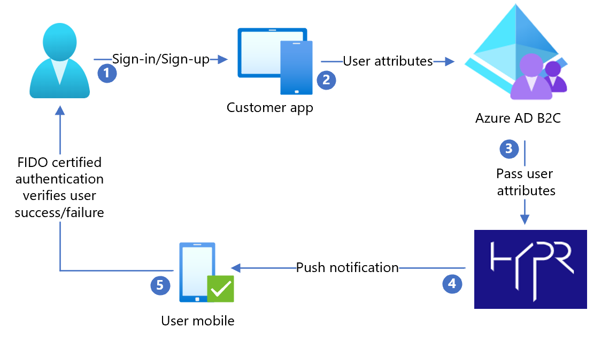

# Tutorial for configuring HYPR with Azure Active Directory B2C

In this tutorial, learn to configure Azure Active Directory B2C (Azure AD B2C) with [HYPR](https://www.hypr.com/). When Azure AD B2C is the identity provider (IdP), you can integrate HYPR with customer applications for passwordless authentication. HYPR replaces passwords with public key encryptions that help prevent fraud, phishing, and credential reuse.

## Prerequisites

To get started, you'll need:

* An Azure subscription

  - If you don't have one, you can get an [Azure free account](https://azure.microsoft.com/free/)
- An [Azure AD B2C tenant](./tutorial-create-tenant.md) linked to your Azure subscription
- A HYPR cloud tenant
  - Request a HYPR [custom demo](https://get.hypr.com/get-a-demo)
- A user mobile device registered using the HYPR REST APIs, or the HYPR Device Manager in your HYPR tenant
  - For example, see [HYPR SDK for Java Web](https://docs.hypr.com/integratinghypr/docs/sdk-java-web) 

## Scenario description

The HYPR integration has the following components:

- **Azure AD B2C** – The authorization server to verify user credentials, or the identity provider (IdP)
- **Web and mobile applications** - For mobile or web applications protected by HYPR and Azure AD B2C
  - HYPR has mobile SDK and a mobile app for iOS and Android
- **HYPR mobile app** - Use it for this tutorial, if you're not using the mobile SDKs in your mobile applications
- **HYPR REST APIs** - User device registration and authentication
  - Go to apidocs.hypr.com for [HYPR Passwordless APIs](https://apidocs.hypr.com)

The following architecture diagram shows the implementation.

   

1. User arrives at a sign-in page and selects sign-in or sign-up. User enters username.
2. The application sends the user attributes to Azure AD B2C for identify verification.
3. Azure AD B2C sends user attributes to HYPR to authenticate the user through the HYPR mobile app.
4. HYPR sends a push notification to the registered user mobile device for a Fast Identity Online (FIDO) certified authentication. It can be a user fingerprint, biometric, or decentralized PIN. 
5. After user acknowledges the push notification, user is granted or denied access to the customer application.

## Configure the Azure AD B2C policy

1. Go to [`Azure-AD-B2C-HYPR-Sample/policy/`](https://github.com/HYPR-Corp-Public/Azure-AD-B2C-HYPR-Sample/tree/master/policy).

2. Follow the instructions in [Custom policy starter pack](tutorial-create-user-flows.md?pivots=b2c-custom-policy#custom-policy-starter-pack) to download [Active-directory-b2c-custom-policy-starterpack/LocalAccounts/](https://github.com/Azure-Samples/active-directory-b2c-custom-policy-starterpack/tree/master/LocalAccounts)
3. Configure the policy for the Azure AD B2C tenant.

>[!NOTE]
>Update policies to relate to your tenant.

## Test the user flow

1. Open the Azure AD B2C tenant.
2. Under **Policies**, select **Identity Experience Framework**.
3. Select the **SignUpSignIn** you created.
4. Select **Run user flow**.
5. For **Application**, select the registered app (sample is JWT).
6. For **Reply URL**, select the **redirect URL**.
7. Select **Run user flow**.
8. Complete the sign-up flow to create an account.
9. After the user attribute is created, HYPR is called. 

>[!TIP]
>If the flow is incomplete, confirm the user is saved in the directory.

## Next steps

- [Custom policies in Azure AD B2C](./custom-policy-overview.md)
- [Get started with custom policies in Azure AD B2C](tutorial-create-user-flows.md?pivots=b2c-custom-policy)
