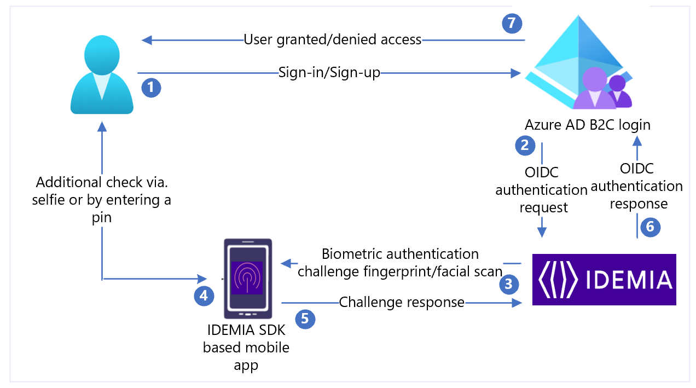

# Tutorial: Configure IDEMIA with Azure Active Directory B2C for relying party to consume IDEMIA or US State issued mobile identity credentials (Preview)
[!INCLUDE [active-directory-b2c-choose-user-flow-or-custom-policy](../../includes/active-directory-b2c-choose-user-flow-or-custom-policy.md)]

::: zone pivot="b2c-user-flow"

This feature is available only for custom policies. For setup steps, select **Custom policy** in the preceding selector.

::: zone-end

::: zone pivot="b2c-custom-policy"

In this sample tutorial, learn how to integrate Azure Active Directory (Azure AD) B2C with [IDEMIA](https://www.idemia.com/). IDEMIA is a passwordless authentication provider, which provides real-time consent-based services with biometric authentication like face ID and fingerprinting eliminating fraud and credential reuse. IDEMIA’s Mobile ID allows citizens to benefit from a government-issued trusted digital ID, as a complement to their physical ID. This application is used to verify identity by using a self-selected PIN or touch ID/face ID. Mobile ID allows citizens to control their identities by allowing them to share only the information needed for a transaction and enables fraud protection.


## Scenario description

IDEMIA integration includes the following components:

- **Azure AD B2C** – The authorization server, responsible for verifying the user’s credentials, also known as the Identity Provider (IdP).

- **IDEMIA mID** - OpenID Connect (OIDC) provider configured as [Azure AD B2C external provider](add-identity-provider.md)

- **[IDEMIA mID application](https://idemia-mobile-id.com/)** - A trusted, government-issued digital identity. Mobile ID is a digital version of your driver’s license or state-issued ID that lives in an app on your phone. [IDEMIA](https://idemia-mobile-id.com/).

IDEMIA provides mID for many US State departments of motor vehicles (DMVs).

The mID is a digitizing of an identification document into a strong mobile identity token that is highly portable for verification and that serves as an index for authorization **mID Services**. The mID Service allows the DMVs to proof identities of individuals by using credential document authentication using their issued drivers licenses and biometric **selfie**-to-credential facial recognition matching services.  

Once created, the mID is stored on the end user's mobile phone as a digitally signed **identity on the edge**. The end users are now able to use that signed credential for access to other identity sensitive services such as proof of age, financial know your customer, account access’s where security is paramount.

The offer to Microsoft is the support of these services as the Relying party (RP) that will use a State issued mID to provide services using the attributes sent by the owner of the mID.

The following diagram shows the implementation for web or on-premises scenarios:



| Step | Description |
|:--------|:--------|
| 1. | User visits the Azure AD B2C login page, which is the replying party in this case on their device to conduct a transaction and logs in via their mID app. |
| 2. | Azure AD B2C requires an ID check and for that redirects the user to the IDEMIA router using the OIDC authorization code flow|
| 3. | The IDEMIA router sends a biometric challenge to the user’s mobile app including all context details of the authentication and authorization request.|
| 4. | Depending on the level of security needed, the user may require to provide additional details, input their PIN, take a live selfie, or both.|
| 5. | Final authentication response provides proof of possession, presence, and consent. The response is returned to the IDEMIA router.|
| 6. | IDEMIA router verifies the information provided by the user and replies to Azure AD B2C with the authentication result.|
|7. | Based on the authentication result user is granted/denied access. |

## Onboard with IDEMIA

Get in touch with [IDEMIA](https://www.idemia.com/get-touch/) to request a demo. While filling out the request form, in the message field indicate that you want to onboard with Azure AD B2C.

## Integrate IDEMIA with Azure AD B2C

## Prerequisites

To get started, you'll need:

- Access to end users that have an IDEMIA - US state issued Mobile ID credential (mID) or during the test phase, the mID demo application provided by [IDEMIA](https://www.idemia.com/).

- An Azure AD subscription. If you don't have one, get a [free account](https://azure.microsoft.com/free/).

- An [Azure AD B2C tenant](tutorial-create-tenant.md) that is linked to your Azure subscription.

- Your business web application registered in Azure AD B2C tenant. For testing purposes you can configure https://jwt.ms, a Microsoft-owned web application that displays the decoded contents of a token.

>[!NOTE]
>The contents of the token never leave your browser.


### Part 1 - Submit a Relying Party application on-boarding for mID

As part of your integration with IDEMIA, you'll be provided with the following information:

| Property | Description |
|:---------|:----------|
| Application Name | Azure AD B2C or your desired application name |
| Client_ID | This is the unique identifier provided by the IdP |
| Client Secret | Password the relying party application will use to authenticate with the IDEMIA IdP |
| Metadata endpoint | A URL that points to a token issuer configuration document, which is also known as an OpenID well-known configuration endpoint. |
|Redirect URIs | `https://your-B2C-tenant-name.b2clogin.com/your-B2C-tenant-name.onmicrosoft.com/oauth2/authresp`<br>For  example, `https://fabrikam.b2clogin.com/fabrikam.onmicrosoft.com/oauth2/authresp`<br><br>If you use a custom domain, enter `https://your-domain-name/your-tenant-name.onmicrosoft.com/oauth2/authresp`.<br>Replace your-domain-name with your custom domain, and your-tenant-name with the name of your tenant. |
|Post log out redirect URIs | `https://your-B2C-tenant-name.b2clogin.com/your-B2C-tenant-name.onmicrosoft.com/{policy}/oauth2/v2.0/logout`<br>Send a sign-out request. |

>[!NOTE]
>You'll need IDEMIA client ID and client secret later to configure the IdP in Azure AD B2C.

### Part 2 - Create a policy key

Store the IDEMIA client secret that you previously recorded in your Azure AD B2C tenant.

1. Sign in to the [Azure portal](https://portal.azure.com/).

2. Make sure you're using the directory that contains your Azure AD B2C tenant. Select the **Directories + subscriptions** icon in the portal toolbar.

3. On the **Portal settings | Directories + subscriptions** page, find your Azure AD B2C directory in the **Directory name** list, and then select **Switch**.

4. Choose **All services** in the top-left corner of the Azure portal, and then search for and select **Azure AD B2C**.

5. On the **Overview** page, select **Identity Experience Framework**.

6. Select **Policy Keys** and then select **Add**.

7. For **Options**, choose **Manual**.

8. Enter a **Name** for the policy key. For example, IdemiaAppSecret. The prefix B2C_1A_ is added automatically to the name of your key.

9. In **Secret**, enter your client secret that you previously recorded.

10. For **Key** usage, select **Signature**.

11. Select **Create**.

### Part 3 - Configure IDEMIA as an External IdP

To enable users to sign in using IDEMIA mobile ID passwordless identity, you need to define IDEMIA as a claims provider that Azure AD B2C can communicate with through an endpoint. The endpoint provides a set of claims that are used by Azure AD B2C to verify a specific user has authenticated using biometry such as fingerprint or facial scan as available on their device, proving the user’s identity.
You can define IDEMIA as a claims provider by adding it to the **ClaimsProvider** element in the extension file of your policy.

```PowerShell
     <TechnicalProfile Id="Idemia-Oauth2">
          <DisplayName>IDEMIA</DisplayName>
          <Description>Login with your IDEMIA identity</Description>
          <Protocol Name="OAuth2" />
          <Metadata>
            <Item Key="METADATA">https://idp.XXXX.net/oxauth/.well-known/openid-configuration</Item>
            <!-- Update the Client ID below to the Application ID -->
            <Item Key="client_id">00000000-0000-0000-0000-000000000000</Item>
            <Item Key="response_types">code</Item>
            <Item Key="scope">openid id_basic mt_scope</Item>
            <Item Key="response_mode">form_post</Item>
            <Item Key="HttpBinding">POST</Item>
            <Item Key="UsePolicyInRedirectUri">false</Item>
            <Item Key="token_endpoint_auth_method">client_secret_basic</Item>
            <Item Key="ClaimsEndpoint">https://idp.XXXX.net/oxauth/restv1/userinfo</Item>
            <Item Key="ValidTokenIssuerPrefixes">https://login.microsoftonline.com/</Item>
          </Metadata>
          <CryptographicKeys>
            <Key Id="client_secret" StorageReferenceId="B2C_1A_IdemiaAppSecret" />
</CryptographicKeys>
          <InputClaims>
            <InputClaim ClaimTypeReferenceId="acr" PartnerClaimType="acr_values" DefaultValue="loa-2" />
          </InputClaims>
          <OutputClaims>
            <OutputClaim ClaimTypeReferenceId="issuerUserId" PartnerClaimType="sub" />
            <OutputClaim ClaimTypeReferenceId="tenantId" PartnerClaimType="tid" />
            <OutputClaim ClaimTypeReferenceId="givenName" PartnerClaimType="firstName1" />
            <OutputClaim ClaimTypeReferenceId="surName" PartnerClaimType="lastName1" />
            <OutputClaim ClaimTypeReferenceId="authenticationSource" DefaultValue="socialIdpAuthentication" AlwaysUseDefaultValue="true" />
            <OutputClaim ClaimTypeReferenceId="identityProvider" DefaultValue="idemia" />
            <OutputClaim ClaimTypeReferenceId="documentId" />
            <OutputClaim ClaimTypeReferenceId="address1" />
          </OutputClaims>
          <OutputClaimsTransformations>
            <OutputClaimsTransformation ReferenceId="CreateRandomUPNUserName" />
            <OutputClaimsTransformation ReferenceId="CreateUserPrincipalName" />
            <OutputClaimsTransformation ReferenceId="CreateAlternativeSecurityId" />
            <OutputClaimsTransformation ReferenceId="CreateSubjectClaimFromAlternativeSecurityId" />
          </OutputClaimsTransformations>
          <UseTechnicalProfileForSessionManagement ReferenceId="SM-SocialLogin" />
        </TechnicalProfile>
           
```

Set client_id to the application ID from the application registration.

|Property | Description|
|:------|:-------|
|Scope| For OpenID Connect (OIDC) the minimum requirement is that the scope parameter be set to **openid**. Additional scopes may be appended as a space-delimited list.|
|redirect_uri | This defines where the user agent sends the authorization code back to Azure AD B2C.|
|response_type| For the authorization code flow, this is set to **code**|
|acr_values| This parameter controls the authentication methods that the user is required to perform during the authentication process. |

One of the following values must be selected:

|Parameter value| Effect on user authentication process |
|:------|:-------|
|`loa-2`| Crypto-based Azure AD Multi-Factor Authentication only|
|`loa-3`| Crypto-based Azure AD Multi-Factor Authentication plus one additional factor|
|`loa-4`| Crypto-based Azure AD Multi-Factor Authentication with the requirement that the user must also perform pin-based and biometric authentication |

The **/userinfo** endpoint provides the claims for the scope(s) requested in the authorization request. For the **<mt_scope>** this includes such claims as First Name, Last Name, and Driver's License Number, among other items.
The claims set for any given scope are published in the **scope_to_claims_mapping** section of the discovery API.
Azure AD B2C requests claims from the claims endpoint and returns those claims in the OutputClaims element. You may need to map the name of the claim defined in your policy to the name defined in the IdP making sure to define the claim type in the [ClaimSchema element](claimsschema.md):

```PowerShell
<ClaimType Id="documentId">
     <DisplayName>documentId</DisplayName>
     <DataType>string</DataType>
</ClaimType>
<ClaimType Id="address1">
     <DisplayName>address</DisplayName>
     <DataType>string</DataType>
</ClaimType>
```

### Part 4 - Add a user journey

At this point, the IdP has been set up, but it's not yet available in any of the sign-in pages. If you don't have your own custom user journey, create a duplicate of an existing template user journey, otherwise continue to the next step.

1. Open the `TrustFrameworkBase.xml` file from the starter pack.

2. Find and copy the entire contents of the **UserJourneys** element that includes `ID=SignUpOrSignIn`.

3. Open the `TrustFrameworkExtensions.xml` and find the **UserJourneys** element. If the element doesn't exist, add one.

4. Paste the entire content of the **UserJourney** element that you copied as a child of the UserJourneys element.

5. Rename the ID of the user journey. For example, `ID=CustomSignUpSignIn`.

### Part 5 - Add the IdP to a user journey

Now that you have a user journey, add the new IdP to the user journey. First add a sign-in button, then link the button to an action. The action is the technical profile you created earlier.

1. Find the orchestration step element that includes Type=`CombinedSignInAndSignUp`, or Type=`ClaimsProviderSelection` in the user journey. It's usually the first orchestration step. The **ClaimsProviderSelections** element contains a list of IdPs that a user can sign in with. The order of the elements controls the order of the sign-in buttons presented to the user. Add a **ClaimsProviderSelection** XML element. Set the value of **TargetClaimsExchangeId** to a friendly name.

2. In the next orchestration step, add a **ClaimsExchange** element. Set the **Id** to the value of the target claims exchange ID. Update the value of **TechnicalProfileReferenceId** to the ID of the technical profile you created earlier.

The following XML demonstrates the first two orchestration steps of a user journey with the IdP:

```xml
<OrchestrationStep Order="1" Type="CombinedSignInAndSignUp" ContentDefinitionReferenceId="api.signuporsignin">
  <ClaimsProviderSelections>
    ...
    <ClaimsProviderSelection TargetClaimsExchangeId="IdemiaExchange" />
  </ClaimsProviderSelections>
  ...
</OrchestrationStep>

<OrchestrationStep Order="2" Type="ClaimsExchange">
  ...
  <ClaimsExchanges>
    <ClaimsExchange Id="IdemiaExchange" TechnicalProfileReferenceId="Idemia-Oauth2" />
  </ClaimsExchanges>
</OrchestrationStep>
```

### Part 6 - Configure the relying party policy

The relying party policy, for example [SignUpSignIn.xml](https://github.com/Azure-Samples/active-directory-b2c-custom-policy-starterpack/blob/master/SocialAndLocalAccounts/SignUpOrSignin.xml), specifies the user journey which Azure AD B2C will execute. Find the **DefaultUserJourney** element within relying party. Update the **ReferenceId** to match the user journey ID, in which you added the IdP.

In the following example, for the `CustomSignUpOrSignIn` user journey, the **ReferenceId** is set to `CustomSignUpOrSignIn`.
 
```xml
<RelyingParty>
  <DefaultUserJourney ReferenceId="CustomSignUpSignIn" />
  ...
</RelyingParty>
```

### Part 7 - Upload the custom policy

1. Sign in to the [Azure portal](https://portal.azure.com/#home).

2. Make sure you're using the directory that contains your Azure AD B2C tenant. Select the **Directories + subscriptions** icon in the portal toolbar.

3. On the **Portal settings | Directories + subscriptions** page, find your Azure AD B2C directory in the **Directory name** list, and then select **Switch**.

4. In the [Azure portal](https://portal.azure.com/#home), search for and select **Azure AD B2C**.

5. Under Policies, select **Identity Experience Framework**.

Select **Upload Custom Policy**, and then upload the two policy files that you changed, in the following order: the extension policy, for example `TrustFrameworkExtensions.xml`, then the relying party policy, such as `SignUpSignIn.xml`.

### Part 8 - Test your custom policy

1. Select your relying party policy, for example `B2C_1A_signup_signin`.

2. For **Application**, select a web application that you [previously registered](./tutorial-register-applications.md). The **Reply URL** should show `https://jwt.ms`.

3. Select the **Run now** button.

4. From the sign-up or sign-in page, select **IDEMIA** to sign in with an IDEMIA - US State issued mID (Mobile ID Credential).

If the sign-in process is successful, your browser is redirected to `https://jwt.ms`, which displays the contents of the token returned by Azure AD B2C.


## Next steps

For additional information, review the following articles:

- [Custom policies in Azure AD B2C](custom-policy-overview.md)

- [Get started with custom policies in Azure AD B2C](tutorial-create-user-flows.md?pivots=b2c-custom-policy)

- [Learn more about IDEMIA mID](https://www.idemia.com/mobile-id)

::: zone-end
