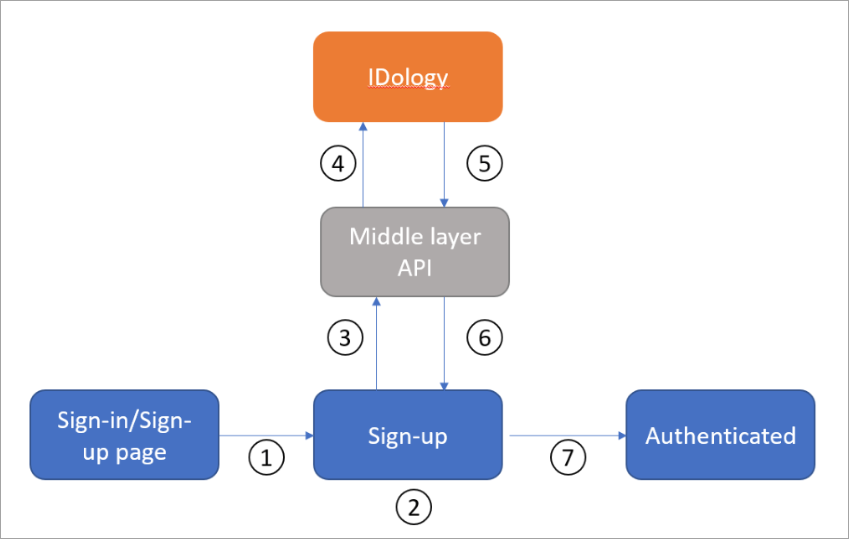

# Tutorial for configuring IDology with Azure Active Directory B2C 

In this sample tutorial, we provide guidance on how to integrate Azure AD B2C with [IDology](https://www.idology.com/solutions/). IDology is an identity verification and proofing provider with multiple solutions. In this sample, we will cover ExpectID solution by IDology.

## Prerequisites

To get started, you'll need:

* An Azure subscription. If you don't have a subscription, you can get a [free account](https://azure.microsoft.com/free/).
* [An Azure AD B2C tenant](tutorial-create-tenant.md) that is linked to your Azure subscription.

## Scenario description

The IDology integration includes the following components:

- Azure AD B2C – The authorization server responsible for verifying the user’s credentials. It's also known as the identity provider.
- IDology – The IDology service takes input provided by the user and verifies the user’s identity.
- Custom REST API – This API implements the integration between Microsoft Entra ID and the IDology service.

The following architecture diagram shows the implementation.

| Step | Description |
|------|------|
|1     | A user arrives at the sign-in page. |
|2     | The user selects the sign-up option to create a new account and enter information into the page. Azure AD B2C collects the user attributes. |
|3     | Azure AD B2C calls the middle layer API and passes on the user attributes. |
|4     | The middle layer API collects user attributes and transforms them into a format that IDOlogy API can consume. Then it sends the information to IDology. |
|5     | IDology consumes the information and processes it, and then returns the result to the middle layer API. |
|6     | The middle layer API processes the information and sends the relevant information back to Azure AD B2C. |
|7     | Azure AD B2C receives information back from middle layer API. If it shows a **Failure** response, an error message is displayed to user. If it shows a **Success** response, the user is authenticated and written into the directory. |
|      |      |

> [!NOTE]
> Azure AD B2C can also ask the customer to perform step-up authentication, but this scenario is out of scope of this tutorial.

## Onboard with IDology

1. IDology provides a variety of solutions, which you can find [here](https://www.idology.com/solutions/). For this sample, we use ExpectID.

2. To create an IDology account, contact [IDology](https://www.idology.com/talk-to-a-trust-expert/).

3. Once an account is created, you'll receive the information you need for API configuration. The following sections describe the process.

## Integrate with Azure AD B2C

### Part 1 - Deploy the API

Deploy the provided [API code](https://github.com/azure-ad-b2c/partner-integrations/tree/master/samples/IDology/Api) to an Azure service. The code can be published from Visual Studio, following these [instructions](/visualstudio/deployment/quickstart-deploy-aspnet-web-app).

You'll need the URL of the deployed service to configure Microsoft Entra ID with the required settings.

### Part 2 - Configure the API 

Application settings can be [configured in App Service in Azure](../app-service/configure-common.md#configure-app-settings). With this method, settings can be securely configured without checking them into a repository. You'll need to provide the following settings to the REST API:

| Application settings | Source | Notes |
| :-------- | :------------| :-----------|
|IdologySettings:ApiUsername | IDology account configuration |     |
|IdologySettings:ApiPassword | IDology account configuration |     |
|WebApiSettings:ApiUsername |Define a username for the API| Used in the ExtId configuration |
|WebApiSettings:ApiPassword | Define a password for the API | Used in the ExtId configuration

### Part 3 - Create API Policy Keys

Follow this [document](secure-rest-api.md#add-rest-api-username-and-password-policy-keys) to create two policy keys: one for the API username, and one for the API password that you defined above.

The sample policy uses these key names:

* B2C_1A_RestApiUsername
* B2C_1A_RestApiPassword

### Part 4 - Configure the Azure AD B2C Policy

1. Follow this [document](tutorial-create-user-flows.md?pivots=b2c-custom-policy#custom-policy-starter-pack) to download the [LocalAccounts starter pack](https://github.com/Azure-Samples/active-directory-b2c-custom-policy-starterpack/tree/master/LocalAccounts) and configure the policy for the Azure AD B2C tenant. Follow the instructions until you complete the **Test the Custom Policy** section.

2. Download the two sample policies [here](https://github.com/azure-ad-b2c/partner-integrations/tree/master/samples/IDology/policy).

3. Update the two sample policies:

   1. Open both policies:

      1. In the section `Idology-ExpectId-API`, update the `ServiceUrl` metadata item with the location of the API deployed above.

      1. Replace `yourtenant` with the name of your Azure AD B2C tenant.
      For example, if the name of your Azure AD B2C tenant is `contosotenant`, replace all instances of `yourtenant.onmicrosoft.com` with `contosotenant.onmicrosoft.com`.

   1. Open the file TrustFrameworkExtensions.xml:

      1. Find the element `<TechnicalProfile Id="login-NonInteractive">`. Replace both instances of `IdentityExperienceFrameworkAppId` with the application ID of the IdentityExperienceFramework application that you created earlier.

      1. Replace both instances of `ProxyIdentityExperienceFrameworkAppId` with the application ID of the ProxyIdentityExperienceFramework application that you created earlier.

4. Replace the SignInorSignUp.xml and TrustFrameworkExtensions.xml previously uploaded to Azure AD B2C in step 1 with the two updated sample policies.

> [!NOTE]
> As a best practice, we recommend that customers add consent notification in the attribute collection page. Notify users that information will be sent to third-party services for Identity Verification.

## Test the user flow

1. Open the Azure AD B2C tenant, and under **Policies**, select **User flows**.

2. Select your previously created **User Flow**.

3. Select **Run user flow** and select the settings:

   1. **Application** - select the registered app (sample is JWT).

   1. **Reply URL** - select the **Redirect URL**.

   1. Select **Run user flow**.

4. Go through the sign-up flow and create an account.

5. Sign out.

6. Go through the sign-in flow.

7. The IDology puzzle will appear after you enter **continue**.

## Next steps

For additional information, review the following articles:

- [Custom policies in Azure AD B2C](custom-policy-overview.md)

- [Get started with custom policies in Azure AD B2C](tutorial-create-user-flows.md?pivots=b2c-custom-policy)
