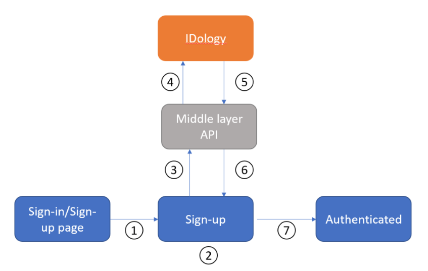

# Tutorial for configuring IDology with Azure Active Directory B2C 

In this sample tutorial, we provide guidance on how to integrate Azure AD B2C with [IDology](https://www.idology.com/solutions/). IDology is an identity verification and proofing provider with multiple solutions. In this sample, we will cover ExpectID solution by IDology.

## Scenario description

The IDology integration includes the following components:

- Azure AD B2C – The authorization server responsible for verifying the user’s credentials. It is also known as the identity provider.
- IDology – The IDology service takes input provided by the user and verifies the user’s identity
- Custom Rest API – This API implements the integration between Azure AD and the IDology service.

Below architecture diagram shows the implementation. 

|      |      |
|------|------|
|1     | User arrives at a login page. |
|2     | Users select sign-up to create a new account and enter information into the page. Azure AD B2C collects the user attributes. |
|3     | Azure AD B2C calls the middle layer API and passes on the user attributes. |
|4     | Middle layer API collects user attributes and transforms it into a format that IDOlogy API could consume. Then after sends it to IDology. |
|5     | After IDology consumes the information and processes it, it returns result to middle layer API. |
|6     | Middle layer API processes the information and sends back relevant information to Azure AD B2C. |
|7     | Azure AD B2C receives information back from middle layer API and if it shows: Failure response, then an error message will be generated to user. Success, then a user is authenticated and written into the directory. |
|      |      |

[!NOTE] Azure AD B2C can ask customer to do a step-up authentication, however it is out of scope of this tutorial.

## Onboard with IDology

1. IDology provides a variety of solutions, you can find them [here](https://www.idology.com/solutions/). For this sample, we use ExpectID. 

2. To create an IDology account, contact [IDology](https://www.idology.com/request-a-demo/microsoft-integration-signup/)

3. Once an account is created, information is used in the API configuration. The following sections describe the process. 

## Integrate IDology with Azure AD B2C

### Part 1- Deploy the API

Deploy the provided API code to an Azure service. The code can be published from Visual Studio, following these [instructions](https://docs.microsoft.com/visualstudio/deployment/quickstart-deploy-to-azure?view=vs-2019).

The URL of the deployed service will be needed to configure Azure AD with the required settings.

### Part 2- Configure the API 

Application settings can be [configured in the App service in Azure](https://docs.microsoft.com/azure/app-service/configure-common#configure-app-settings).  It allows for settings to be securely configured without checking them into a repository. The Rest API needs the following settings provided: 

| Application settings | Source | Notes |
| :-------- | :------------| :-----------|
|IdologySettings:ApiUsername | IDology account configuration |     |
|IdologySettings:ApiPassword | IDology account configuration |     |
|WebApiSettings:ApiUsername |Define a username for the API| Used in the ExtId configuration |
|WebApiSettings:ApiPassword | Define a password for the API | Used in the ExtId configuration

### Part 3- Create API Policy Keys
Follow this [document](https://docs.microsoft.com/azure/active-directory-b2c/secure-rest-api#add-rest-api-username-and-password-policy-keys) and create two policy keys – one for the API username, and one for the API password that you defined above.

The sample policy uses these key names:

- B2C_1A_RestApiUsername

- B2C_1A_RestApiPassword

### Part 4- Configure the B2C Policy

1. Follow this [document](https://docs.microsoft.com/azure/active-directory-b2c/custom-policy-get-started?tabs=applications#custom-policy-starter-pack) to download [LocalAccounts starter pack](https://github.com/Azure-Samples/active-directory-b2c-custom-policy-starterpack/tree/master/LocalAccounts) and configure the policy for the B2C tenant. Follow instructions until you complete **Test the Custom Policy** section.

2. Download the two sample policies [here](https://github.com/azure-ad-b2c/partner-integrations/tree/master/samples/IDology/policy) 

3. Update the two sample policies:

   a. Open both policies:

      i. In the section **Idology-ExpectId-API**, update the ServiceUrl metadata item with the location of the API deployed above. 

      ii. Replace **yourtenant** with  place the string yourtenant with the name of your Azure AD B2C tenant.
      For example, if the name of your B2C tenant is contosotenant, all instances of yourtenant.onmicrosoft.com becomes contosotenant.onmicrosoft.com.

   b. Open the file TrustFrameworkExtensions.xml: 

     i. Find the element <TechnicalProfile Id="login-NonInteractive">. Replace both instances of IdentityExperienceFrameworkAppId with the application ID of the IdentityExperienceFramework application that you created earlier.

     ii. Replace both instances of ProxyIdentityExperienceFrameworkAppId with the application ID of the ProxyIdentityExperienceFramework application that you created earlier.
4. Replace the SignInorSignUp.xml and TrustFrameworkExtensions.xml previously uploaded on IEF (step 1) with the two updated sample policies. 

[!Note]
As a best practice, we recommend customers to add consent notification in the attribute collection page. Notify users that information will be sent to third-party services for Identity Verification.

## Test the user flow

1. Open the B2C tenant and under Policies select **User flows**.

2. Select your previously created **User Flow**.

3. Select **Run user flow**

   a. Application: select the registered app (sample is JWT)

   b. Reply URL: select the **redirect URL**

   c. Select **Run user flow**.

4. Go through sign-up flow and create an account 

5. Log-out 

6. Go through sign-in flow  

7. IDology puzzle will pop up after you enter **continue**.

## Next steps

- [Custom policies in Azure AD B2C](https://docs.microsoft.com/azure/active-directory-b2c/custom-policy-overview)

- [Get started with custom policies in Azure AD B2C](https://docs.microsoft.com/azure/active-directory-b2c/custom-policy-get-started?tabs=applications) 

