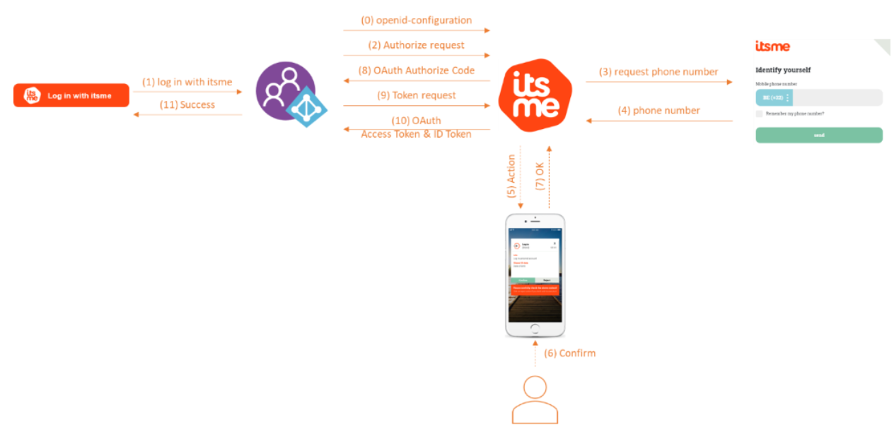

# Configure itsme OpenID Connect (OIDC) with Azure Active Directory B2C

The itsme digital ID app allows you to sign in securely without card-readers, passwords, two-factor authentication, or multiple PIN codes. The itsme app provides strong customer authentication with a verified identity. In this article, learn how to integrate Azure AD B2C authentication with itsme OpenID Connect (OIDC) using a client secret user flow policy.

## Prerequisites

To get started, you'll need:

* An Azure subscription. If you don't have a subscription, you can get a [free account](https://azure.microsoft.com/free/).
* [An Azure AD B2C tenant](tutorial-create-tenant.md) that is linked to your Azure subscription.
* Your Client ID, also known as Partner code, provided by itsme.
* Your Service code provided by itsme.
* Your client secret for your itsme account.

## Scenario description

<!--
Please clarify step 1 in the description below - we don't have steps in this tutorial for "adapting in the Azure AD B2C Custom Policy- User Journeys" - should this be added somewhere?
-->

| Step | Description |
|------|------|
|1     | On your website or application, include the **Log in with itsme** button by adapting in the Azure AD B2C user flow. The interaction flow starts when the user clicks on this button.  |
|2     | Azure AD B2C starts the OpenID connect flow by sending an Authorize request to the itsme client secret API. A well-known/OpenID-configuration endpoint is available containing information about the endpoints.  |
|3     | The itsme environment redirects the user to the itsme identify yourself page, allowing the user to fill in their phone number.  |
|4     | The itsme environment receives the phone number from the user and validates the correctness.  |
|5     | If the phone number belongs to an active itsme user, an Action is created for the itsme app.  |
|6     | The user opens the itsme app, checks the request, and confirms the action.  |
|7     |  The app informs the itsme environment the action has been confirmed. |
|8     |  The itsme environment returns the OAuth authorize code to Azure AD B2C. |
|9     |  Using the authorize code, the Azure AD B2C does a token request. |
| 10 | The itsme environment checks the token request, and if still valid, returns the OAuth access token and the ID token containing the requested user information. |
| 11 | Finally, the user is redirected to the redirect URL as an authenticated user.  |
|   |   |

## Onboard with itsme

1. To create an account with itsme, visit itsme at the [Azure Marketplace](https://azuremarketplace.microsoft.com/marketplace).

1. Activate your itsme account by sending an email to onboarding@itsme.be. You'll receive a **Partner code** and **Service code** that will be needed for your B2C setup.

1. After activation of your itsme partner account, you'll receive an email with a one-time link to the **client secret**.

1. Follow the instructions at [itsme](https://www.itsme-id.com/en-BE/business) to complete the configuration.

## Integrate with Azure AD B2C

### Set up a new Identity Provider in Azure AD B2C

> [!NOTE]
> If you don't have one already, [create an Azure AD B2C tenant](tutorial-create-tenant.md) that is linked to your Azure subscription.

1. If you have access to multiple tenants, select the **Settings** icon in the top menu to switch to your Azure AD B2C tenant from the **Directories + subscriptions** menu.
1. Under **Azure services**, select **Azure AD B2C** (or select **More services** and use the **All services** search box to search for *Azure AD B2C*).
1. Select **Identity providers**, and then select **New OpenID Connect provider**.
1. Fill in the form with the following information:

   |Property | Value |
   |------------ |------- |
   | Name | itsme |
   | Metadata URL | `https://oidc.<environment>.itsme.services/clientsecret-oidc/csapi/v0.1/.well-known/openid-configuration`  where `<environment>` is either `e2e` (test environment) or `prd` (production)  |
   | ClientID     | Your **Client ID**, also known as **Partner code**  |
   | Client Secret | Your **client_secret** |
   | Scope  | openid service:YOURSERVICECODE profile email [phone] [address]  |
   |Response Type | code |
   |Response Mode | query |
   |Domain Hint | *You can leave this empty* |
   |UserID | sub |
   |Display Name | name |
   |Given name | given_name |
   |Surname | family_name |
   |Email | email|

1. Select **Save**.

### Configure a User Flow

1. In your Azure AD B2C tenant, under **Policies**, select **User flows**.

1. Select **New user flow**.

1. Select **Sign up and sign in**, select a version, and then select **Create**.

1. Enter a **Name**.

1. In the **Identity providers** section, select **itsme**.

1. Select **Create**.

1. Open the newly created user flow by selecting the user flow name.

1. Select **Properties** and adjust the following values:

   * Change **Access & ID token lifetimes (minutes)** to **5**.
   * Change **Refresh token sliding window lifetime** to **No expiry**.

### Register an application

1. In your B2C tenant, under **Manage**, select **App registrations** > **New registration**.

1. Provide a **Name** for the application and enter your **Redirect URI**. For testing purposes, enter `https://jwt.ms`.

1. Make sure multi-factor authentication is **Disabled**.

1. Select **Register**.

   a. For testing purposes, select **Authentication**, and under **Implicit Grant**, select the **Access Tokens** and **ID Tokens** check boxes.  

   b. Select **Save**.

## Test the user flow

1. In your B2C tenant, under **Policies** select **User flows**.

1. Select your previously created user flow.

1. Select **Run user flow**.

   a. **Application**: *select the registered app*

   b. **Reply URL**: *select the redirect URL*

1. The itsme **Identify yourself** page appears.  

1. Enter your mobile phone number and select **send**.

1. Confirm the action in the itsme app.

## Next steps

For additional information, review the following articles:

* [Custom policies in Azure AD B2C](custom-policy-overview.md)

* [Get started with custom policies in Azure AD B2C](tutorial-create-user-flows.md?pivots=b2c-custom-policy)
