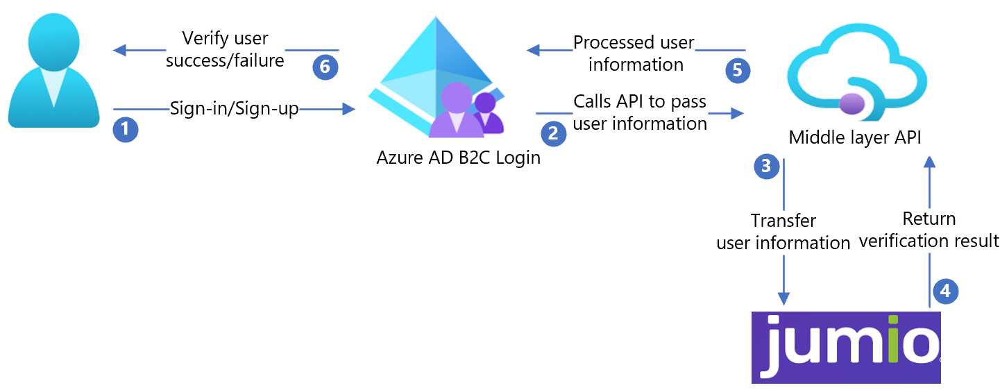

# Tutorial for configuring Jumio with Azure Active Directory B2C

In this tutorial, learn to integrate Azure Active Directory B2C (Azure AD B2C) with [Jumio](https://www.jumio.com/), an ID verification service that enables real-time automated ID verification to help protect customer data.

## Prerequisites

To get started, you'll need:

* An Azure subscription

  - If you don't have one, you can get an [Azure free account](https://azure.microsoft.com/free/)
- An [Azure AD B2C tenant](./tutorial-create-tenant.md) linked to your Azure subscription 

## Scenario description

The Jumio integration includes the following components:

- **Azure AD B2C** - The authorization server that verifies user credentials, also known as the identity provider (IdP)
- **Jumio** - Verifies user ID details
- **Intermediate REST API** - Use it to implement Azure AD B2C and Jumio integration
- **Azure Blob storage** - Use it to obtain custom UI files for the Azure AD B2C policies

The following architecture diagram shows the implementation.

   

1. The user signs in, or signs up, and creates an account. Azure AD B2C collects user attributes.
2. Azure AD B2C calls the middle-layer API and passes the user attributes.
3. The middle-layer API converts user attributes into a Jumio API format and sends the attributes to Jumio.
4. Jumio processes the attributes, and returns results to the middle-layer API.
5. The middle-layer API processes the results and sends relevant information to Azure AD B2C.
6. Azure AD B2C receives the information. If the response fails, an error message appears. If the response succeeds, the user is authenticated and written into the directory.

## Create a Jumio account

To create a Jumio account, go to the jumio.com [Contact](https://www.jumio.com/contact/) page.

## Configure Azure AD B2C with Jumio

After you create a Jumio account, use it to configure Azure AD B2C. 

### Deploy the API

From [samples/Jumio/API/Jumio.Api/](https://github.com/azure-ad-b2c/partner-integrations/tree/master/samples/Jumio/API/Jumio.Api), deploy the code to an Azure service. You can publish the code from Visual Studio.

>[!NOTE]
>To configure Microsoft Entra ID, you'll need the deployed service URL.

### Deploy the client certificate

A client certificate helps protect the Jumio API call. 

1. Create a self-signed certificate by using the following PowerShell sample code:

   ``` PowerShell
   $cert = New-SelfSignedCertificate -Type Custom -Subject "CN=Demo-SigningCertificate" -TextExtension @("2.5.29.37={text}1.3.6.1.5.5.7.3.3") -KeyUsage DigitalSignature -KeyAlgorithm RSA -KeyLength 2048 -NotAfter (Get-Date).AddYears(2) -CertStoreLocation "Cert:\CurrentUser\My"
   $cert.Thumbprint
   $pwdText = "Your password"
   $pwd = ConvertTo-SecureString -String $pwdText -Force -AsPlainText
   Export-PfxCertificate -Cert $Cert -FilePath "{your-local-path}\Demo-SigningCertificate.pfx" -Password $pwd.

   ```

2. The certificate is exported to the location specified for ``{your-local-path}``.
3. To import the certificate to Azure App Service, see [Upload a private certificate](../app-service/configure-ssl-certificate.md#upload-a-private-certificate).

### Create a signing/encryption key

1. Create a random string with a length greater than 64 characters (letters and numbers only).

   For example: ``C9CB44D98642A7062A0D39B94B6CDC1E54276F2E7CFFBF44288CEE73C08A8A65``

2. Use the following PowerShell script to create the string:

```PowerShell
-join ((0x30..0x39) + ( 0x41..0x5A) + ( 0x61..0x7A) + ( 65..90 ) | Get-Random -Count 64  | % {[char]$_})

```

### Configure the API

You can [configure application settings in Azure App Service](../app-service/configure-common.md#configure-app-settings) without checking them into a repository. You'll need to provide the following settings to the REST API:

| Application settings | Source | Notes |
| --- | ---| ---|
|JumioSettings:AuthUsername | Jumio account configuration |  N/A   |
|JumioSettings:AuthPassword | Jumio account configuration |  N/A   |
|AppSettings:SigningCertThumbprint|The created self-signed certificate thumbprint| N/A |
|AppSettings:IdTokenSigningKey| Signing key created using PowerShell |N/A |
|AppSettings:IdTokenEncryptionKey |Encryption key created using PowerShell|N/A|
|AppSettings:IdTokenIssuer | Issuer for the JWT token (a GUID value is preferred) |N/A|
|AppSettings:IdTokenAudience  | Audience for the JWT token (a GUID value is preferred) |N/A|
|AppSettings:BaseRedirectUrl | Azure AD B2C policy base URL | https://{your-tenant-name}.b2clogin.com/{your-application-id}|
|WEBSITE_LOAD_CERTIFICATES| The created self-signed certificate thumbprint |N/A|

### Deploy the UI

1. Set up a [blob storage container in your storage account](../storage/blobs/storage-quickstart-blobs-portal.md#create-a-container).
2. Store the UI files from the [/samples/Jumio/UI/](https://github.com/azure-ad-b2c/partner-integrations/tree/master/samples/Jumio/UI) in your blob container.

#### Update UI files

1. In the UI files, go to [/samples/Jumio/UI/ocean_blue/](https://github.com/azure-ad-b2c/partner-integrations/tree/master/samples/Jumio/UI/ocean_blue).
2. Open each HTML file.
3. Find and replace `{your-ui-blob-container-url}` with your blob container URL.
4. Find and replace `{your-intermediate-api-url}` with the intermediate API app service URL.

>[!NOTE]
> We recommend you add consent notification on the attribute collection page. Notify users the information goes to third-party services for identity verification.

### Configure the Azure AD B2C policy

1. Go to the Azure AD B2C policy in [/samples/Jumio/Policies/](https://github.com/azure-ad-b2c/partner-integrations/tree/master/samples/Jumio/Policies).
2. Use the instructions in [Custom policy starter pack](tutorial-create-user-flows.md?pivots=b2c-custom-policy#custom-policy-starter-pack) to download the [LocalAccounts](https://github.com/Azure-Samples/active-directory-b2c-custom-policy-starterpack/tree/master/LocalAccounts) starter pack.
3. Configure the policy for the Azure AD B2C tenant.

>[!NOTE]
>Update policies to relate to your tenant.

## Test the user flow

1. Open the Azure AD B2C tenant. 
2. Under **Policies**, select **Identity Experience Framework**.
3. Select your created **SignUpSignIn**.
4. Select **Run user flow**.
5. For **Application**, select the registered app (example is JWT).
6. For **Reply URL**, select the **redirect URL**.
7. Select **Run user flow**.
8. Complete the sign-up flow.
9. Create an account.
10. After the user attribute is created, Jumio is called.

>[!TIP]
>If the flow is incomplete, confirm the user is, or isn't, saved in the directory.

## Next steps

- [Custom policies in Azure AD B2C](./custom-policy-overview.md)
- [Get started with custom policies in Azure AD B2C](tutorial-create-user-flows.md?pivots=b2c-custom-policy)
