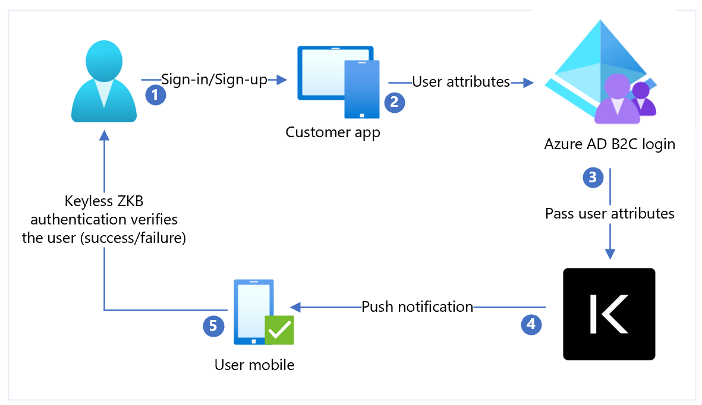

# Tutorial: Configure Keyless with Azure Active Directory B2C

Learn to configure Azure Active Directory B2C (Azure AD B2C) with the Sift Keyless passwordless solution. With Azure AD B2C as an identity provider (IdP), integrate Keyless with customer applications to provide passwordless authentication. The Keyless Zero-Knowledge Biometric (ZKB) is passwordless multi-factor authentication that helps eliminate fraud, phishing, and credential reuse, while enhancing the customer experience and protecting privacy.

Go to keyless.io to learn about: 

* [Sift Keyless](https://keyless.io/)
* [How Keyless uses zero-knowledge proofs to protect your biometric data](https://keyless.io/blog/post/how-keyless-uses-zero-knowledge-proofs-to-protect-your-biometric-data)

## Prerequisites

To get started, you'll need:

* An Azure subscription 
  * If you don't have one, get an [Azure free account](https://azure.microsoft.com/free/)
* An [Azure AD B2C tenant](./tutorial-create-tenant.md) linked to the Azure subscription
* A Keyless cloud tenant
  * Go to keyless.io to [Request a demo](https://keyless.io/demo-request)
* The Keyless Authenticator app installed on a user device

## Scenario description

The Keyless integration includes the following components:

* **Azure AD B2C** – authorization server that verifies user credentials. Also known as the IdP.
* **Web and mobile applications** – mobile or web applications to protect with Keyless and Azure AD B2C
* **The Keyless Authenticator mobile app** – Sift mobile app for authentication to the Azure AD B2C enabled applications

The following architecture diagram illustrates an implementation.

   

1. User arrives at a sign-in page. User selects sign-in/sign-up and enters the username.
2. The application sends user attributes to Azure AD B2C for identity verification.
3. Azure AD B2C sends user attributes to Keyless for authentication.
4. Keyless sends a push notification to the users' registered mobile device for authentication, a facial biometric scan.
5. The user responds to the push notification and is granted or denied access.

## Add an IdP, configure the IdP, and create a user flow policy

Use the following sections to add an IdP, configure the IdP, and create a user flow policy.

### Add a new Identity provider

To add a new Identity provider:

1. Sign in to the [Azure portal](https://portal.azure.com/#home) as Global Administrator of the Azure AD B2C tenant. 
2. Select **Directories + subscriptions**.
3. On the **Portal settings, Directories + subscriptions** page, in the **Directory name** list, find your Azure AD B2C directory.
4. Select **Switch**.
5. In the top-left corner of the Azure portal, select **All services**.
6. Search for and select **Azure AD B2C**.
7. Navigate to **Dashboard** > **Azure Active Directory B2C** > **Identity providers**.
8. Select **Identity providers**.
9. Select **Add**.

### Configure an identity provider

To configure an IdP:

1. Select **Identity provider type** > **OpenID Connect (Preview)**.
2. For **Name**, select **Keyless**.
3. For **Metadata URL**, insert the hosted Keyless Authentication app URI, followed by the path, such as `https://keyless.auth/.well-known/openid-configuration`.
4. For **Client Secret**, select the secret associated with the Keyless Authentication instance. The secret is used later in Keyless Container configuration.
5. For **Client ID**, select the client ID. The Client ID is used later in Keyless Container configuration.
6. For **Scope**, select **openid**.
7. For **Response type**, select **id_token**.
8. For **Response mode**, select **form_post**.
9. Select **OK**.
10. Select **Map this identity provider’s claims**.
11. For **UserID**, select **From subscription**.
12. For **Display name**, select **From subscription**.
13. For **Response mode**, select **From subscription**.
14. Select **Save**.

### Create a user flow policy

Keyless appears as a new OpenID Connect (OIDC) IdP with B2C identity providers.

1. Open the Azure AD B2C tenant.
2. Under **Policies**, select **User flows**.
3. Select **New** user flow.
4. Select **Sign up and sign in**.
5. Select a **version**.
6. Select **Create**.
7. Enter a **Name** for your policy.
8. In the Identity providers section, select the created Keyless Identity Provider.
9. Enter a name.
10. Select the IdP you created.
11. Add an email address. Azure won’t redirect the sign-in to Keyless; a screen appears with a user option.
12. Leave the **Multi-factor Authentication** field.
13. Select **Enforce conditional access policies**.
14. Under **User attributes and token claims**, in the **Collect attribute** option, select **Email Address**. 
15. Add user attributes Microsoft Entra ID collects with claims Azure AD B2C returns to the client application.
16. Select **Create**.
17. Select the new **User flow**.
18. On the left panel, select **Application Claims**. 
19. Under options, select the **email** checkbox.
20. Select **Save**.

## Test the user flow

1. Open the Azure AD B2C tenant.
2. Under **Policies** select **Identity Experience Framework**.
3. Select the created SignUpSignIn.
4. Select **Run user flow**.
5. For **Application**, select the registered app (the example is JWT).
6. For **Reply URL**, select the redirect URL.
7. Select **Run user flow**.
8. Complete the sign-up flow and create an account.
9. After the user attribute is created, Keyless is called during the flow. 

If the flow is incomplete, confirm user is or isn't saved in the directory.

## Next steps

* [Azure AD B2C custom policy overview](./custom-policy-overview.md)
* [Tutorial: Create user flows and custom policies in Azure AD B2C](tutorial-create-user-flows.md?pivots=b2c-custom-policy)
