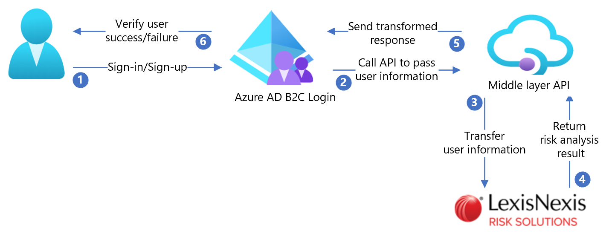

# Tutorial for configuring LexisNexis with Azure Active Directory B2C

In this tutorial, learn how to integrate Azure Active Directory B2C (Azure AD B2C) with [LexisNexis ThreatMetrix](https://risk.lexisnexis.com/products/threatmetrix/?utm_source=bingads&utm_medium=ppc&utm_campaign=SEM%7CLNRS%7CUS%7CEN%7CTMX%7CBR%7CBing&utm_term=threat%20metrix&utm_network=o&utm_device=c&msclkid=1e85e32ec18c1ae9bbc1bc2998e026bd). Learn more about LexisNexis contact methods and [ThreatMetix](https://risk.lexisnexis.com/products/threatmetrix/?utm_source=bingads&utm_medium=ppc&utm_campaign=SEM%7CLNRS%7CUS%7CEN%7CTMX%7CBR%7CBing&utm_term=threat%20metrix&utm_network=o&utm_device=c&msclkid=1e85e32ec18c1ae9bbc1bc2998e026bd), the profiling and identity-validation service that also provides comprehensive risk assessments based on user devices.

This integration's profiling is based on user information provided during the sign-up flow. ThreatMetrix permits the user to sign in, or not. 

ThreatMetrix risk analysis attributes:

- Email
- Phone number
- Profiling information collected from the user device

## Prerequisites

To get started, you'll need:

* An Azure subscription

  - If you don't have one, you can get an [Azure free account](https://azure.microsoft.com/free/)
- [An Azure AD B2C tenant](./tutorial-create-tenant.md) linked to your Azure subscription

## Scenario description

The ThreatMetrix integration includes the following components:

- **Azure AD B2C** – The authorization server that verifies user credentials, also known as the identity provider (IdP)
- **ThreatMetrix** – Combines user input with profiling information from the user device to verify the interaction's security
- **Custom REST API** – Use to implement the Azure AD B2C and ThreatMetrix integration

The following architecture diagram shows the implementation.

   

1. User selects sign-up to create a new account and enters attributes. Azure AD B2C collects the attributes.
2. Azure AD B2C calls the middle layer API and passes the user attributes.
3. Middle layer API transforms attributes into a consumable API format and sends it to LexisNexis.
4. LexisNexis validates user identification based on risk analysis and returns the results to the middle layer API.
5. Middle layer API processes the results and sends relevant information to Azure AD B2C.
6. Azure AD B2C receives information from middle layer API. If the response fails, an error message appears. If the response succeeds, the user is authenticated and granted access.

## Create a LexisNexis account and policy

1. To create a LexisNexis account, go to lexisnexis.com and select [Contact Us](https://risk.lexisnexis.com/products/threatmetrix/?utm_source=bingads&utm_medium=ppc&utm_campaign=SEM%7CLNRS%7CUS%7CEN%7CTMX%7CBR%7CBing&utm_term=threat%20metrix&utm_network=o&utm_device=c&msclkid=1e85e32ec18c1ae9bbc1bc2998e026bd).
2. Create a policy using [LexisNexis documentation](https://risk.lexisnexis.com/products/threatmetrix/?utm_source=bingads&utm_medium=ppc&utm_campaign=SEM%7CLNRS%7CUS%7CEN%7CTMX%7CBR%7CBing&utm_term=threat%20metrix&utm_network=o&utm_device=c&msclkid=1e85e32ec18c1ae9bbc1bc2998e026bd).
3. After account creation, you'll receive API configuration information. Use the following sections to complete the process. 

>[!NOTE]
>You'll use the policy name later.

## Configure Azure AD B2C with LexisNexis

### Deploy the API

To deploy the API code to an Azure service, go to [/samples/ThreatMetrix/Api](https://github.com/azure-ad-b2c/partner-integrations/tree/master/samples/ThreatMetrix/Api). You can publish the code from Visual Studio.

>[!NOTE]
>You'll need deployed service URL to configure Microsoft Entra ID.

### Configure the API

You can [configure app settings](../app-service/configure-common.md#configure-app-settings) in the Azure App service, without checking them into a repository. You'll provide the following settings to the REST API:

| Application settings | Source | Notes |
| --- | ---| ---|
|ThreatMetrix:Url | ThreatMetrix account configuration |N/A|
|ThreatMetrix:OrgId | ThreatMetrix account configuration |N/A|
|ThreatMetrix:ApiKey |ThreatMetrix account configuration|N/A|
|ThreatMetrix:Policy | Policy name created in ThreatMetrix |N/A|
| BasicAuth:ApiUsername |Enter an API username| Username is used in the Azure AD B2C configuration|
| BasicAuth:ApiPassword | Enter an API password | Password is used in the Azure AD B2C configuration|

### Deploy the UI

This solution uses custom UI templates loaded by Azure AD B2C. These templates do the profiling that goes to ThreatMetrix.

Use the instructions in [custom page content walkthrough](./customize-ui-with-html.md#custom-page-content-walkthrough) to deploy the UI files in [/samples/ThreatMetrix/ui-template](https://github.com/azure-ad-b2c/partner-integrations/tree/master/samples/ThreatMetrix/ui-template) to a blob storage account. The instructions include setting up a blob storage account, configuring cross-origin resource sharing (CORS), and enabling public access.

The UI is based on the ocean blue template in [/samples/ThreatMetrix/ui-template/ocean_blue](https://github.com/azure-ad-b2c/partner-integrations/tree/master/samples/ThreatMetrix/ui-template/ocean_blue). Update UI links to refer to the deployed location. In the UI folder, find and replace `https://yourblobstorage/blobcontainer` with the deployed location.

### Create API policy keys

To create two policy keys, follow the instructions in [add REST API username and password policy keys](./secure-rest-api.md#add-rest-api-username-and-password-policy-keys). One policy is for the API username, the other is for the API password, you created.

Example policy key names:

- B2C_1A_RestApiUsername
- B2C_1A_RestApiPassword

### Update the API URL

In [samples/ThreatMetrix/policy/TrustFrameworkExtensions.xml](https://github.com/azure-ad-b2c/partner-integrations/blob/master/samples/ThreatMetrix/policy/TrustFrameworkExtensions.xml), find the `Rest-LexisNexus-SessionQuery` technical profile, and update the `ServiceUrl` metadata item with the deployed API location.

### Update the UI URL

In [/samples/ThreatMetrix/policy/TrustFrameworkExtensions.xml](https://github.com/azure-ad-b2c/partner-integrations/blob/master/samples/ThreatMetrix/policy/TrustFrameworkExtensions.xml), search for and replace `https://yourblobstorage/blobcontainer/` with the UI-file location.

>[!NOTE]
>We recommend you add consent notification on the attribute collection page. Notify users that information goes to third-party services for identity verification.

### Configure the Azure AD B2C policy

Go to the [custom policy starter pack](tutorial-create-user-flows.md?pivots=b2c-custom-policy#custom-policy-starter-pack) to download [LocalAccounts](https://github.com/Azure-Samples/active-directory-b2c-custom-policy-starterpack/tree/master/LocalAccounts). Configure the policy in [samples/ThreatMetrix/policy/](https://github.com/azure-ad-b2c/partner-integrations/tree/master/samples/ThreatMetrix/policy) for the Azure AD B2C tenant.

>[!NOTE]
>Update the policies to relate to your tenant.

## Test the user flow

1. Open the Azure AD B2C tenant.
2. Under **Policies**, select **User flows**.
3. Select the created **User Flow**.
4. Select **Run user flow**.
5. For **Application**, select the registered app (example is JWT).
6. For **Reply URL**, select the **redirect URL**.
7. Select **Run user flow**.
8. Complete the sign-up flow.
9. Create an account.
10. Sign out.
11. Complete the sign-in flow.
12. Select **Continue**.
13. The ThreatMetrix puzzle appears.

## Next steps

- [Custom policies in Azure AD B2C](./custom-policy-overview.md)
- [Get started with custom policies in Azure AD B2C](tutorial-create-user-flows.md?pivots=b2c-custom-policy)
